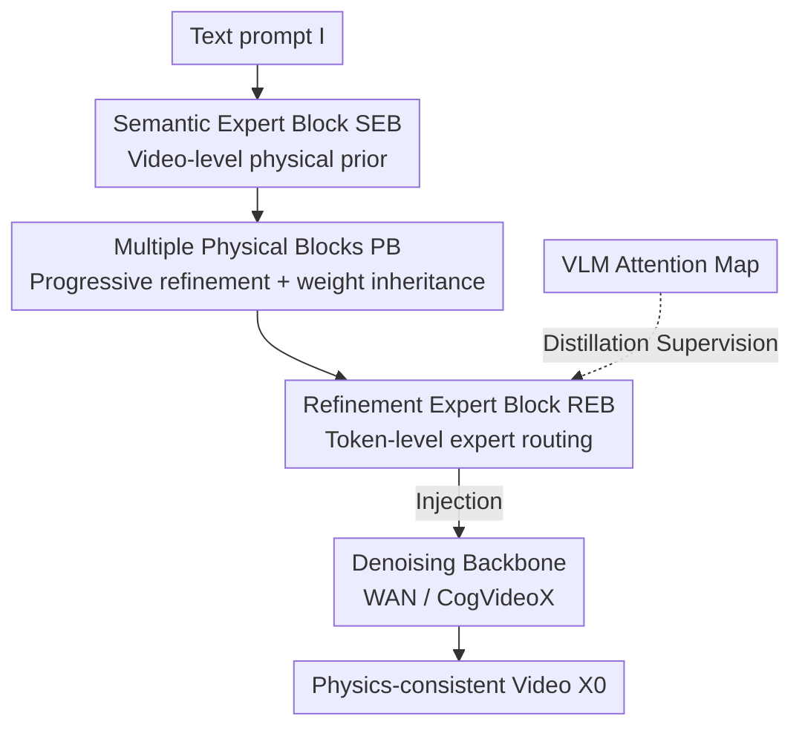

# ProPhy: Progressive Physical Alignment for Dynamic World Simulation

**Conference**: CVPR 2026  
**Paper**: [CVF Open Access](https://openaccess.thecvf.com/content/CVPR2026/html/Wang_ProPhy_Progressive_Physical_Alignment_for_Dynamic_World_Simulation_CVPR_2026_paper.html)  
**Code**: None (Project Page: https://zijunwa.github.io/prophy/ )  
**Area**: Video Generation / World Models  
**Keywords**: Physics-aware video generation, World simulator, Mixture of Physical Experts, Token-level alignment, VLM distillation

## TL;DR
ProPhy attaches a "physical branch" to video diffusion models, utilizing a two-stage Mixture of Physical Experts (video-level semantic experts + token-level refinement experts) to progressively inject physical priors from text into specific spatial regions. By distilling fine-grained alignment targets from VLM attention maps, it ensures generated videos adhere better to physical laws in complex dynamic scenes such as combustion, collision, and fluids.

## Background & Motivation
**Background**: Video generation models (e.g., Sora, WAN, CogVideoX based on Diffusion/DiT) can produce visually realistic videos and are expected to serve as "world simulators." To function as a world simulator, visual quality alone is insufficient; models must also obey physical laws.

**Limitations of Prior Work**: Current models frequently violate physical common sense in large-scale or complex dynamics—balls clipping through objects, momentum not being conserved, or liquid levels rising abnormally during boiling. Existing physics-enhancement methods have various drawbacks: VideoREPA relies on distilling implicit physical knowledge from foundation models; PhysMaster/PISA use reinforcement learning and reward modeling; PhysHPO employs hierarchical preference alignment. However, these methods **internalize physical priors during training, lacking explicit physical guidance during inference**, leading to failures in complex scenarios. While WISA explicitly identifies physical categories from prompts and uses a Mixture of Physical Experts (MoPE) for conditioning, its guidance is **global/video-level**, failing to capture fine-grained processes when multiple physical phenomena coexist or occur in local regions.

**Key Challenge**: Physical guidance is either implicit (uncontrollable during inference) or explicit but only provides an "isotropic" response for the entire video. In real-world scenes, different physical phenomena appear at **different spatial locations**, requiring an anisotropic, fine-grained alignment of "which region responds to which physical cue."

**Goal**: To make generation satisfy two requirements: (a) explicit physical guidance to make representations of different physical laws more discriminative; (b) fine-grained physical alignment to allow different spatial regions in the video to accurately respond to local physical cues.

**Key Insight**: The authors observed a critical phenomenon—**the spatial localization capability of VLMs for physical dynamics is significantly stronger than that of the generative models themselves** (Figure 4: attention in Qwen2.5-VL can accurately circle the location of "combustion," while the cross-attention maps of diffusion models are blurred). Thus, the fine-grained physical localization of VLMs can be distilled into the generation process.

**Core Idea**: Replace single-layer global physical priors with "two-stage progressive physical alignment"—first extracting semantic physical priors at the video level, then progressively refining them into token-level priors injected into corresponding spatial regions, while supervising this token-level routing using VLM attention maps.

## Method

### Overall Architecture
ProPhy is built upon standard latent video diffusion backbones (WAN2.1, CogVideoX), taking a text prompt $I$ as input and outputting the denoised video $X_0$. It does not modify the backbone but attaches an additional **Physical Branch**, consisting of three parts: a **Semantic Expert Block (SEB)**, several **Physical Blocks (PBs)**, and a **Refinement Expert Block (REB)** connected to the final PB. The entire pipeline runs end-to-end during inference: the SEB activates relevant semantic experts based on physical cues implied in the prompt to produce **video-level** physical priors; these priors are progressively refined by multiple PBs; finally, the REB processes them into **token-level** fine-grained priors, which are injected back into the video representation of the backbone. This allows different spatial regions to generate anisotropic responses to physical phenomena. Each PB is isomorphic to its corresponding transformer block and initialized with its weights to preserve the semantic understanding and rendering capabilities of the pre-trained backbone; the PB outputs are injected into the latent variables sequentially, allowing physical information to accumulate "progressively."

### Key Designs

**1. Semantic Expert Block (SEB): Video-level Physical Prior + Continuous Weighting to Prevent Expert Collapse**

To address the need for "explicit physical guidance," the SEB operates at the video level. It maintains $E_s$ **learnable physical basis maps** $B_e \in \mathbb{R}^{N\times C}$, each representing a category of physical knowledge (combustion, reflection, etc.), with a shape identical to the backbone's visual latent $X_t$ ($N$ is the number of latent tokens $=(F/r_f)\times(H/r_s)\times(W/r_s)$). A **semantic router** reads normalized weights $\rho_p$ for each basis from the text embedding $y$ and superimposes the physical priors onto the latent variable:

$$\tilde{X} = X + \sum_{e=1}^{E_s} \rho_e^p B_e.$$

A key engineering point is that small training batches make standard top-k MoE prone to **mode collapse**—where only a few experts are repeatedly activated. Instead of hard top-k, the authors use the **continuous weighting** form shown above (all experts contribute based on soft weights), fundamentally avoiding collapse. The resulting $\tilde{X}$ serves as the global physical prior for subsequent refinement.

**2. Refinement Expert Block (REB): Refining Global Priors to the Token Level**

To achieve "fine-grained alignment," the REB operates at the **token level**. It also contains a set of experts (each being a linear layer) and a **refinement router**: for each token $\tilde{x}\in \mathbb{R}^C$ in the physics-enhanced latent, the router outputs a probability distribution $\rho_r \in \mathbb{R}^{E_r}$ representing the token's association with various physical laws, selecting top-k experts for weighting:

$$\tilde{x}' = \sum_{i\in \arg\text{top}k\,\rho_r} \rho_r^i\, e_\theta^i(\tilde{x}),$$

where $e_\theta^i$ is the forward pass of the $i$-th expert. Unlike the SEB, the large number of tokens here combined with the fine-grained alignment constraints significantly reduces the risk of collapse, making it **safe to use standard top-k MoE**. While the SEB determines "which physics should be in the entire video," the REB determines "which specific token should respond to which physics."

**3. Dual Physical Alignment Objectives: Semantic Relative Alignment + VLM Fine-grained Distillation**

Structural experts alone are insufficient; both routers require supervision signals to ensure specialized learning. The authors design two alignment objectives and one load-balancing loss:

- **Semantic Alignment (for SEB)**: The physical category vector $q_s$ per video from WISA-80K is used as the label. Rather than regressing absolute categories directly, a **cosine similarity pair matrix** $P_s^{i,j}=\frac{\rho_s^{(i)}\cdot\rho_s^{(j)}}{\|\rho_s^{(i)}\|\|\rho_s^{(j)}\|}$ is constructed within the batch. A label matrix $Q_s$ is calculated similarly, and the two are aligned: $\mathcal{L}_{\text{coarse}}=\sum_{i<j}\|P_s^{i,j}-Q_s^{i,j}\|^2$. This "relative" form ensures routing weights for similar samples are close while diverging for dissimilar ones, which is more effective than direct BCE absolute supervision.

- **Fine-grained Alignment (for REB)**: This is the core mechanism leveraging VLM. The process (Figure 3) involves feeding the video and a question "describing a certain physical phenomenon" to a VLM. Relevant video tokens are taken as keys and text tokens as queries from the generated text, and the **attention scores between them** are extracted as the initial localization of the phenomenon. A background attention map is obtained using a generic prompt, and **subtraction** yields denoised token-level alignment targets $Q_r\in \mathbb{R}^{N\times E_{\text{attn}}}$. A mask $M$ is constructed: physical categories potentially present in the video are labeled (set to 1), and $M = M \wedge \text{sign}(Q_r)$ is used to discard regions where $Q_r$ is negative (insignificant phenomenon). The alignment loss is only active in high-significance regions: $\mathcal{L}_{\text{fine-align}}=\sum_{M^{i,e}=1}\|P_r'^{i,e}-Q_r^{i,e}\|^2$, where $P_r'$ is the output of the refinement router passed through an MLP (expanding dimensions from $E_r$ to $E_{\text{attn}}$). This MLP not only aligns dimensions but also mitigates training conflicts caused by direct alignment signals.

### Loss & Training
The final objective combines three physical losses with the standard diffusion loss:

$$\mathcal{L}=\mathcal{L}_{\text{diffusion}}+\lambda_1\mathcal{L}_{\text{coarse}}+\lambda_2\mathcal{L}_{\text{fine-align}}+\lambda_3\mathcal{L}_{\text{fine-balance}},$$

where $\mathcal{L}_{\text{fine-balance}}$ is the standard load-balancing auxiliary loss on the REB router to encourage specialization. Fixed coefficients $\lambda_1=0.1, \lambda_2=0.02, \lambda_3=0.01$ are used across both WAN2.1-1.3B and CogVideoX-5B backbones without additional tuning. Training data consists of 20K videos randomly sampled from WISA-80K, with token-level physical labels generated by Qwen2.5-VL-32B.

## Key Experimental Results

### Main Results
Evaluated on the VideoPhy2 benchmark, using Physical Common Sense (PC), Semantic Adherence (SA), and the Joint pass rate (Main metric, requires PC/SA scores $\ge 4$). ALL denotes all 600 prompts, HARD denotes a subset of 180 more difficult prompts.

| Method | ALL-PC | ALL-SA | ALL-Joint | HARD-Joint |
|------|--------|--------|-----------|------------|
| Wan2.1-1.3B | 57.8 | 30.0 | 24.8 | 5.6 |
| Wan2.1-1.3B + ProPhy | 65.0 | 32.0 | **26.5** | **7.2** |
| CogVideoX-5B | 67.2 | 29.0 | 22.3 | 5.0 |
| CogVideoX-5B + WISA | 69.1 | 31.5 | 25.8 | 5.0 |
| CogVideoX-5B + VideoREPA | 72.5 | 24.2 | 22.0 | 5.6 |
| CogVideoX-5B + ProPhy | **72.5** | **32.2** | **26.7** | 6.1 |

On the Wan2.1 flow-matching backbone, the Joint metric improved by +19.7% relatively. On CogVideoX, ProPhy achieved the best or second-best results across all metrics. Notably, while VideoREPA achieved high PC (72.5), its SA was only 24.2—it sacrificed semantic adherence, whereas ProPhy balances both.

On VBench quality evaluation (same 600 prompts), ProPhy did not sacrifice image quality. The most prominent improvement was in the **Dynamic Degree** dimension (CogVideoX-5B from 46.8 $\to$ 72.0, Wan2.1 from 71.3 $\to$ 78.8), suggesting that physical alignment actually enhances the model's ability to capture high-dynamic behaviors. The overall Quality Score also increased (CogVideoX 76.8 $\to$ 81.0).

### Ablation Study
Using Wan2.1-1.3B as the baseline to validate components progressively (VideoPhy2).

| Config | PC | SA | Joint | Description |
|------|----|----|-------|------|
| Baseline | 57.8 | 30.0 | 24.8 | Original backbone |
| LoRA (No physical branch) | 58.2 | 30.8 | 24.8 | Pure LoRA with same steps, almost no gain |
| LoRA + REB | 62.7 | 31.2 | 25.5 | Token-level experts only |
| LoRA + SEB | 62.2 | 30.8 | 25.2 | Video-level experts only |
| PB + SEB + REB (Full) | **65.0** | 32.0 | **26.5** | Complete ProPhy |

| Config | PC | SA | Joint | Description |
|------|----|----|-------|------|
| Baseline | 57.8 | 30.0 | 24.8 | — |
| SEB using BCE instead of relative loss | 64.3 | **32.0** | 26.3 | SA rises but PC/Joint weaker than relative loss |
| REB using absolute alignment loss only | 58.3 | 26.5 | 21.6 | Significant degradation, lower than baseline |

### Key Findings
- **Physical Branch > Pure LoRA**: With identical training steps, pure LoRA fine-tuning almost yields no gains (Joint 24.8 $\to$ 24.8), indicating that improvements stem from the physical branch structure rather than more training.
- **SEB and REB are Complementary**: Both video-level and token-level experts are useful individually, but their combination performs best—confirming the "progressive (first global, then local)" design motivation.
- **Relative Alignment > Absolute Alignment**: Replacing the relative distance loss in SEB with BCE absolute supervision drops PC/Joint. In REB, using only absolute alignment loss results in performance lower than the baseline (21.6), showing fine-grained alignment must be paired with masking and load balancing.
- **Expert Specialization**: On SEB routing logits, Pearson correlation is high between physically related categories (e.g., combustion and explosion) and low for unrelated ones (e.g., explosion vs. refraction). REB high-activation regions reliably correspond to the spatial locations of physical events.

## Highlights & Insights
- **Leveraging VLM as a "Physics Localization Teacher" is Clever**: Instead of training a dedicated physics annotator, the authors utilize the existing spatial localization capabilities of VLMs, which are stronger than those of generative models. Using "phenomenon attention map - background attention map" to extract clean token-level supervision distills a discriminative model's strengths into a generative model—a strategy transferable to any task where generative models lack spatial precision.
- **Two-level Expert Division Corresponds to Two Granularities**: SEB solves "what physics are present," and REB solves "where the physics are." Progressive accumulation rather than a single-step approach is a direct fine-grained upgrade to WISA's "global MoPE."
- **Pragmatic Handling of Collapse for Small Batches**: Using continuous weighting for SEB and top-k only for REB demonstrates a clear understanding of when to use hard vs. soft routing, rather than blindly applying MoE.
- **Dynamic Degree Boost is a Pleasant Surprise**: While the intent of physical alignment is to correct violations, it unintentionally encourages the model to generate high-dynamic content, suggesting that many "physical inconsistencies" arise from conservative or degraded model behavior in dynamic scenes.

## Limitations & Future Work
- **Dependency on VLM Label Quality**: Fine-grained alignment targets rely entirely on VLM attention maps, which the authors admit contain "minor imperfections." If VLM localization is inaccurate for a specific physical category (e.g., fluids, optics), the distillation signal will be noisy.
- **Physical Categories Limited by WISA-80K Taxonomy**: Semantic alignment uses WISA’s discrete physical category vectors, making it difficult to cover new physical phenomena outside the labeled categories. ⚠️ The paper does not discuss open-category generalization.
- **Absolute Improvement Still Limited**: The primary Joint metric remains in the 25-27 range, with the HARD subset even lower (6-7). This is still far from a "reliable world simulator"; physical consistency is improved but not solved.
- **PB Quantity Constraints**: The number of physical blocks must be adapted based on the backbone depth and GPU VRAM, limiting scalability under certain engineering conditions.

## Related Work & Insights
- **vs WISA**: Both use Mixture of Physical Experts (MoPE), but WISA employs a single-layer global guidance that cannot capture local details when multiple phenomena coexist. ProPhy upgrades this to a two-stage (video-level SEB + token-level REB) progressive refinement, achieving spatial anisotropy.
- **vs VideoREPA**: VideoREPA distills implicit physics from inter-frame visual feature relationships and lacks explicit guidance during inference, often sacrificing semantic adherence (SA only 24.2). ProPhy explicitly injects physical priors, balancing both PC and SA.
- **vs PhysGen / PhysMotion (Simulation-based)**: Simulation methods predict dynamics using rigid body dynamics/MPM before rendering, requiring pre-defined physical parameters and rules, which limits generalization. ProPhy adaptively extracts physical priors from text without explicit rules, making it applicable to more open scenarios.
- **vs PhysMaster / PISA / PhysHPO (Alignment/RL-based)**: These methods internalize physics during training via RL or preference alignment but lack explicit guidance at inference. ProPhy’s physical branch provides explicit, spatially localized guidance end-to-end.

## Rating
- Novelty: ⭐⭐⭐⭐ Two-stage progressive physical routing + VLM attention distillation as fine-grained supervision is a clear and insightful upgrade to the MoPE approach.
- Experimental Thoroughness: ⭐⭐⭐⭐ Validated on two backbones, including main results, multiple ablations, and expert interpretability analysis, though absolute gains are limited and lacks evaluation on larger-scale backbones.
- Writing Quality: ⭐⭐⭐⭐ Clear mapping between motivation, challenge, and method. Figures 1/3/4 intuitively explain "global vs. fine-grained" and the advantages of VLM localization.
- Value: ⭐⭐⭐⭐ A practical solution for physics-aware video generation; the idea of "borrowing spatial supervision from discriminative models" is highly transferable.

<!-- RELATED:START -->

## Related Papers

- [\[CVPR 2026\] Physical Object Understanding with a Physically Controllable World Model](physical_object_understanding_with_a_physically_controllable_world_model.md)
- [\[CVPR 2026\] Inference-time Physics Alignment of Video Generative Models with Latent World Models](inference-time_physics_alignment_of_video_generative_models_with_latent_world_mo.md)
- [\[CVPR 2026\] VerseCrafter: Dynamic Realistic Video World Model with 4D Geometric Control](versecrafter_dynamic_realistic_video_world_model_with_4d_geometric_control.md)
- [\[CVPR 2026\] Physical Simulator In-the-Loop Video Generation](physical_simulator_in-the-loop_video_generation.md)
- [\[CVPR 2026\] HVG-3D: Bridging Real and Simulation Domains for 3D-Conditional Hand-Object Interaction Video Synthesis](hvg-3d_bridging_real_and_simulation_domains_for_3d-conditional_hand-object_inter.md)

<!-- RELATED:END -->
