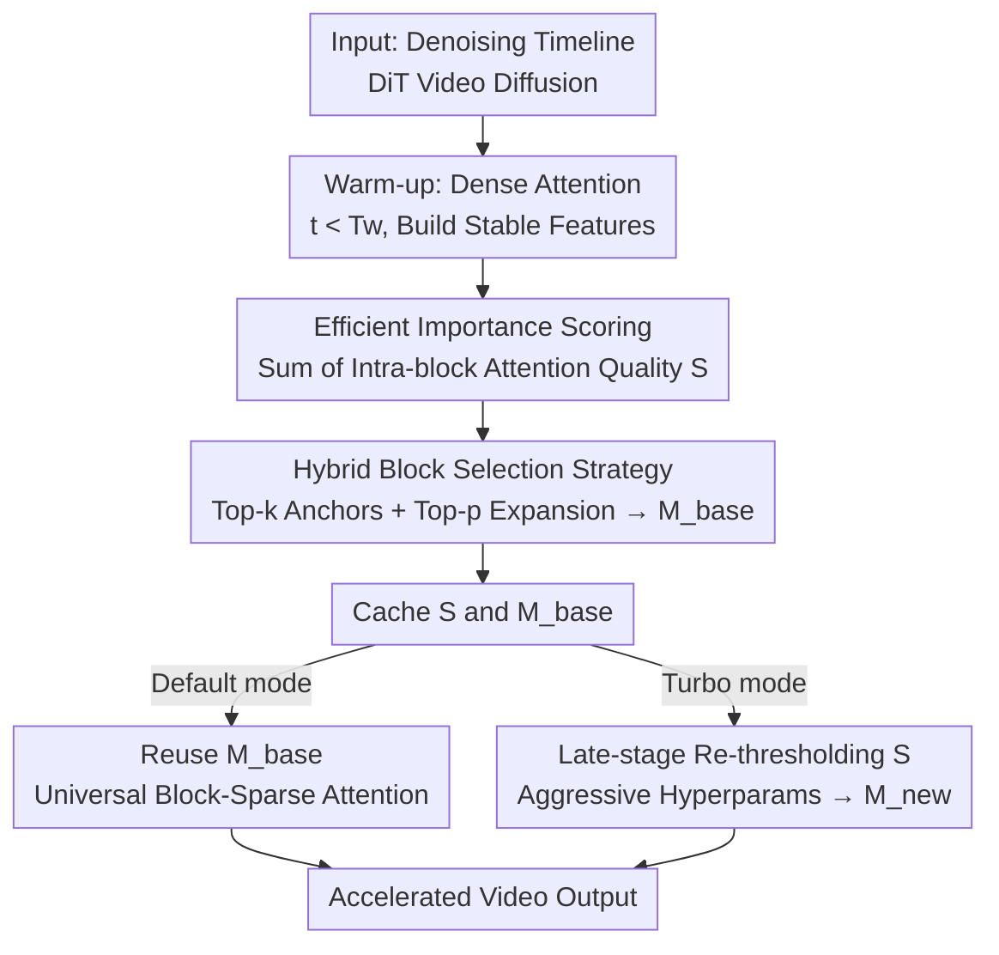

# RAPID: Reusing Attention Sparsity with Inter-step Adaptation for Efficient Video Diffusion

**Conference**: CVPR 2026  
**Paper**: [CVF Open Access](https://openaccess.thecvf.com/content/CVPR2026/html/Lin_RAPID_Reusing_Attention_Sparsity_with_Inter-step_Adaptation_for_Efficient_Video_CVPR_2026_paper.html)  
**Code**: None  
**Area**: Video Generation / Diffusion Model Acceleration  
**Keywords**: Sparse Attention, Video Diffusion, Inference Acceleration, One-time Estimation, Mask Reuse

## TL;DR
RAPID observes two empirical laws in video diffusion: "temporal stability" and "gradual density decay" of attention sparsity patterns. It eliminates the overhead of recomputing sparse masks at every step by performing high-fidelity importance scoring only once during the early denoising stage, caching the masks and scores for subsequent reuse. By re-thresholding cached scores in later stages for more aggressive pruning, RAPID surpasses the strongest baseline by +3.2 PSNR at equivalent density on Wan2.1-14B, while pushing speedup to 1.79× (2.01× for HunyuanVideo) in Turbo mode.

## Background & Motivation

**Background**: Video Diffusion Transformers (DiTs, such as Wan2.1, HunyuanVideo, CogVideoX) utilize 3D self-attention to model spatio-temporal tokens. However, the attention complexity grows as $O(N^2)$ with the sequence length, making attention the inference bottleneck for video sequences with hundreds of frames. The mainstream acceleration method is sparse attention—calculating scores for only a subset of token pairs and using a binary mask $M$ to block the rest.

**Limitations of Prior Work**: Existing sparse attention methods fall into two categories, each with inherent flaws. **Static methods** (SVG, Radial Attention) use predefined fixed patterns; they are efficient but content-agnostic, potentially missing critical dynamic interactions. **Dynamic methods** (X-Attention, Draft Attention) recompute masks on-the-fly at each denoising step and head; while adaptive, they suffer from the "per-step recomputation" overhead throughout the inference process.

**Key Challenge**: Dynamic methods rely on an unchallenged assumption—that attention patterns are "volatile" and must be re-evaluated at every step. This study refutes this assumption via two observations: ① **Temporal Stability**: After a warm-up phase, high-importance attention patterns remain largely unchanged; ② **Gradual Density Decay**: The density required to maintain a 95% attention recall decreases monotonically as denoising progresses, allowing for more aggressive pruning in later stages. This implies that constant recomputation is redundant and fails to exploit late-stage acceleration potential.

**Goal**: Eliminate the overhead of "per-step mask recomputation" while retaining content adaptivity, further pushing acceleration to its limit by exploiting late-stage density decay.

**Core Idea**: **Decouple** importance scoring from the step-wise inference loop—performing scoring only once at a critical early step, caching $M_{base}$ and scores for reuse (Default mode). For faster inference, directly re-threshold the cached scores to generate sparser masks (Turbo mode) without any recomputation.

## Method

### Overall Architecture

RAPID is a sparse attention framework implementing the "compute once, reuse always" strategy. It divides the denoising timeline into three phases: ① **Warm-up phase** ($t < T_w$) uses dense attention to allow the model to establish stable features without sparsity; ② **One-time scoring and caching phase** ($t = T_w$) calculates block-level importance scores $S$ during the dense step, generates a high-fidelity $M_{base}$, and stores both in a persistent cache; ③ **Cache reuse phase** ($t > T_w$) skips expensive scoring and retrieves masks from the cache for block-sparse kernels. The reuse phase has two modes: Default mode reuses $M_{base}$ throughout; Turbo mode re-thresholds the cached scores $S$ at a later step $t_a$ with aggressive hyperparameters to generate a sparser $M_{new}$, fully exploiting density decay.

### Key Designs

**1. One-time Efficient Importance Scoring: Attention Quality as importance proxy**

Per-step recomputation is expensive because it estimates token-pair importance at every step. RAPID uses the attention weights themselves—$\mathrm{softmax}(QK^\top/\sqrt{d})$—as the direct proxy for importance, calculated only at the dense step $t = T_w$. Specifically (Algorithm 1): the attention map $A \in \mathbb{R}^{N \times N}$ is partitioned into $B_s \times B_s$ blocks. For each block $A_{ij}$, the importance score $S_{ij} = \sum_{u,v}(A_{ij})_{uv}$ quantifies the total attention quality allocated from query block $i$ to key block $j$. Since the dense step is already required, scoring is nearly free; its validity is supported by the finding that "Mask Recall" remains high across all subsequent steps.

**2. Hybrid Block Selection Strategy: Top-k Anchors + Top-p Expansion**

Translating scores into a mask $M$ via pure Top-p (cumulative quality truncation) or pure Top-k (fixed selection) is suboptimal: Top-p is unstable if a few outliers drain the budget early, and Top-K is not content-adaptive. RAPID uses a two-pronged approach (Algorithm 2): first, select $k_{min}$ highest-scoring key blocks as **Top-k Anchors** for baseline connectivity; then, add blocks until the cumulative quality exceeds $\tau$ (Top-p Expansion), ensuring $s_{cum}/s_{total} \ge \tau$. Top-k provides a robust lower bound, while Top-p provides content adaptivity.

**3. RAPID-Turbo Multi-stage Adaptive Pruning: Zero-recomputation aggression**

Late-stage tolerance for sparsity is exploited in Turbo mode. By caching the raw block scores $S$ alongside the masks, transition to a sparser mask requires no new scoring—only re-thresholding $S$ with aggressive hyperparameters $(k'_{min}, \tau')$. The schedule switches from a conservative mask ($\tau = 0.9$) in early stages to an aggressive one ($\tau = 0.5$) at step $t_a$ (e.g., 25% of total steps), maximizing speedup via the density decay phenomenon.

### Loss & Training
Ours is a **completely training-free** inference framework. It requires no weight modification or fine-tuning and is applied directly to off-the-shelf DiT models. Tunable parameters include warm-up ratio $T_w$, anchor count $k_{min}$, threshold $\tau$, and Turbo switch step $t_a$. Main config: Default $T_w=25\%, k_{min}=10\%, \tau=0.6$; Turbo $T_w=10\%, \tau=0.9$ (10-25% window) then $\tau=0.5$.

## Key Experimental Results

Evaluation used Wan2.1-14B and HunyuanVideo. Baselines include dense Flash Attention, X-Attention (dynamic), SVG, and Radial Attention (static). Quality metrics used PSNR/SSIM/LPIPS; speed measured via end-to-end latency on an A100 GPU. Benchmark: VBench-2.0.

### Main Results (VBench-2.0)

| Model | Method | PSNR↑ | SSIM↑ | LPIPS↓ | Density | Gain |
|------|------|-------|-------|--------|------|------|
| Wan2.1-14B | X-Attn | 21.37 | 0.767 | 0.226 | 42.78% | 1.34× |
| Wan2.1-14B | SVG | 21.80 | 0.786 | 0.199 | 42.24% | 1.40× |
| Wan2.1-14B | Radial Attn | 22.92 | 0.795 | 0.197 | 42.32% | 1.56× |
| Wan2.1-14B | **Ours** | **26.11** | **0.871** | **0.096** | 41.88% | 1.53× |
| Wan2.1-14B | Ours-Turbo | 22.61 | 0.785 | 0.189 | 27.20% | **1.79×** |
| HunyuanVideo | Radial Attn | 27.50 | 0.896 | 0.086 | 44.06% | 1.79× |
| HunyuanVideo | **Ours** | **31.49** | **0.948** | **0.073** | 43.24% | 1.73× |
| HunyuanVideo | Ours-Turbo | 26.79 | 0.902 | 0.095 | 31.48% | **2.01×** |

Ours achieves a significantly higher PSNR (+3.2 over strongest baseline Radial Attn on Wan2.1) at **equivalent densities**. Turbo mode achieves 1.79×/2.01× acceleration while maintaining quality comparable to strong baselines.

### Ablation Study (Wan2.1-14B)

| Density | Method | PSNR↑ | SSIM↑ | LPIPS↓ |
|------|------|-------|-------|--------|
| 39.2% | Top-p | 18.92 | 0.632 | 0.354 |
| 39.2% | Top-K | 25.49 | 0.859 | 0.113 |
| 39.2% | Top-K + Top-p | **25.90** | **0.864** | **0.105** |

The hybrid strategy outperforms individual methods; pure Top-p is unstable (PSNR ~18-22), whereas the hybrid version consistently achieves superior fidelity.

### Key Findings
- **Mask Recall justifies reuse**: Recall of early step masks remains high for subsequent steps, confirming they cover most important future blocks.
- **Warm-up inflection point**: Increasing $T_w$ beyond 25% yields diminishing returns; 25% is the cost-efficiency sweet spot.
- **$\tau$ Trade-off**: High $\tau$ increases quality and density, butmarginal gains decrease in the high-density region.

## Highlights & Insights
- **Questioning per-step recomputation**: Identifying the temporal stability of attention patterns allows structural removal of dynamic recomputation overhead.
- **Dual caching (Mask + Score)**: Caching raw scores enables zero-recomputation adaptive pruning in Turbo mode, pushing speedup further.
- **Orthogonality**: Since RAPID targets only the attention module, it can be stacked with other acceleration methods like quantization or step reduction.

## Limitations & Future Work
- Empirical laws were primarily observed on Wan2.1 and HunyuanVideo; generalizability to other architectures or higher resolutions requires further study. ⚠️
- Parameters like $T_w$ and $t_a$ are currently manually set; future work could explore automated dynamic scheduling of thresholds.
- Metrics are based on dense-output alignment (PSNR/SSIM) rather than absolute perceptual video quality.

## Related Work & Insights
- **vs. Static Sparsity**: Content-aware masks provide higher quality at the same computational cost.
- **vs. Dynamic Sparsity**: One-time estimation removes the inherent overhead of per-step mask generation.

## Rating
- Novelty: ⭐⭐⭐⭐⭐ Decoupling importance estimation from inference steps is a novel approach.
- Experimental Thoroughness: ⭐⭐⭐⭐ Extensive ablation across two major models, though limited to A100 testing.
- Writing Quality: ⭐⭐⭐⭐⭐ Clear progression from motivation to design and validation.
- Value: ⭐⭐⭐⭐⭐ Practical, training-free, and stackable with other acceleration methods.

<!-- RELATED:START -->

<!-- RELATED:END -->

## Related Papers

- [\[CVPR 2026\] FrameDiT: Diffusion Transformer with Matrix Attention for Efficient Video Generation](framedit_diffusion_transformer_with_matrix_attention_for_efficient_video_generat.md)
- [\[CVPR 2026\] VMonarch: Efficient Video Diffusion Transformers with Structured Attention](vmonarch_efficient_video_diffusion_transformers_with_structured_attention.md)
- [\[ICML 2026\] Attention Sparsity is Input-Stable: Training-Free Sparse Attention for Video Generation via Offline Sparsity Profiling and Online QK Co-Clustering](../../ICML2026/video_generation/attention_sparsity_is_input-stable_training-free_sparse_attention_for_video_gene.md)
- [\[CVPR 2026\] Less is More: Data-Efficient Adaptation for Controllable Text-to-Video Generation](less_is_more_data-efficient_adaptation_for_controllable_text-to-video_generation.md)
- [\[CVPR 2026\] Attention Surgery: An Efficient Recipe to Linearize Your Video Diffusion Transformer](attention_surgery_an_efficient_recipe_to_linearize_your_video_diffusion_transfor.md)

<!-- RELATED:END -->
