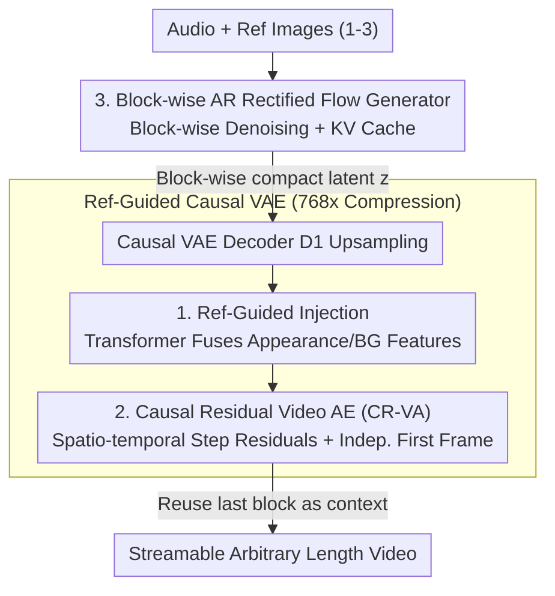

# Real-Time Generation of Streamable Talking Portrait Video with Reference-Guided Deep Compression VAEs

**Conference**: CVPR 2026  
**arXiv**: [2606.01620](https://arxiv.org/abs/2606.01620)  
**Code**: None  
**Area**: Video Generation  
**Keywords**: Talking Portrait Video, Streamable Generation, Deep Compression VAE, Autoregressive Rectified Flow, Real-Time Generation

## TL;DR
The Microsoft team proposes a **real-time and streamable** audio-driven talking portrait video generation framework: using a "Reference-Guided + Causal Residual" Deep Compression VAE to compress video into a 768× compact latent space, then employing a block-wise autoregressive Rectified Flow Transformer to generate latents block by block. This achieves 42 FPS (over 25× faster than existing diffusion methods) with image quality comparable to or better than large models.

## Background & Motivation
**Background**: Audio-driven talking portrait generation has long been dominated by two routes. One is the traditional "head/face-specific" approach, which decouples motion from appearance into sparse keypoints, 3DMM parameters, or learned latents; this is controllable but struggles to model non-rigid dynamics beyond the head, such as the torso and hair. The other consists of recent methods based on large video diffusion foundation models (Stable Video Diffusion, CogVideoX, Wan2.1, etc.), which can generate realistic dynamics beyond the head with extremely high quality.

**Limitations of Prior Work**: Large diffusion models are computationally expensive—generating a 5-second video takes several minutes on modern GPUs, enabling only offline production. This cannot support **real-time, streamable** interactive applications like social companionship, interactive teaching, or psychological support. Existing video diffusion accelerations (distillation, step reduction) are mostly oriented toward static images or offline videos and do not simultaneously satisfy "low latency + temporal coherence + arbitrary-length streamable generation."

**Key Challenge**: It is difficult to balance efficiency and quality. Real-time requirements necessitate reduced computation, which often leads to drops in image quality, synchronization, and torso dynamics. Furthermore, covering the large torso region beyond the head increases the generation burden.

**Goal**: To simultaneously achieve three objectives: ① Real-time, streamable generation for interaction; ② High image quality and vividness (precise lip-sync, vivid expressions/postures, realistic lighting dynamics); ③ Coverage of large torso areas beyond the head.

**Key Insight**: The authors observe a key difference between talking portrait videos and general video generation—**there is a fixed subject in the frame**. The reference image provided by the user shares massive information with the video to be generated (appearance and background remain nearly unchanged). Since the appearance is known, the network should not labor to "reconstruct the appearance," but should instead focus its capacity on "extracting dynamics."

**Core Idea**: Feed the reference image as guidance into the VAE decoder, allowing the VAE to focus on compressing dynamic information for extreme compression (768×). This is paired with a natively autoregressive Rectified Flow generator (supporting KV cache and block-wise streaming) to achieve real-time generation without distillation.

## Method

### Overall Architecture
The task is formalized as conditional probability modeling $\mathbf{y}\sim p(\mathbf{y}\mid\mathbf{r},\mathbf{a})$: given a set of reference images $\mathbf{r}$ (1–3 images) and any speech audio $\mathbf{a}$, generate the portrait video $\mathbf{y}$. Following the modern video generation paradigm, the process is split into two sub-tasks: ① generating a compact latent representation $\mathbf{z}$ conditioned on audio; ② decoding $\mathbf{z}$ back to video $\mathbf{y}$.

Accordingly, the framework consists of two models. The **generation end** is a block-wise autoregressive Rectified Flow Transformer $G$, conditioned on audio and reference latents, predicting video latents **block by block**—sending each generated block to the decoder to achieve low-latency streaming output via KV caching. The **decoding end** is a **causal** video VAE. Its causality ensures smooth decoding for latents of any length without temporal discontinuities. Its two core modifications (Reference-Guided Injection and Causal Residual Auto-encoding CR-VA) push the compression ratio to 768× (about 10–15 times that of mainstream 48× video generation VAEs), significantly shortening the token sequence for the generator, which is the key prerequisite for real-time performance.

The VAE uses a two-level symmetric structure: encoder $E_1$ (spatio-temporal downsampling) + $E_2$ (further spatial compression), and decoder $D_1$ (spatial upsampling) + $D_2$ (spatio-temporal joint upsampling), all using causal convolutions + RMSNorm to maintain temporal causality. The main pipeline "Audio/Reference → Autoregressive Latent Generation → Reference-Guided Causal Decoding → Streaming Video" is shown below:

### Key Designs

**1. Reference-Guided Injection: Focusing VAE Capacity on Dynamics**

General video VAEs must encode both appearance and motion; at high compression ratios, appearance details are the first to degrade. The authors' insight: the subject's appearance/background in a talking portrait is almost static, and since the **user has already provided reference images**, appearance information is redundant. They insert a Transformer-based fusion network $D_{\text{ref}}$ between decoders $D_1$ and $D_2$. Specifically, reference images $\mathbf{r}$ are processed frame-by-frame using encoder $E_1$ to obtain mid-level features $\mathbf{f}_c$ containing appearance and background cues. Meanwhile, $D_1$ upsamples latent $\mathbf{z}$ to $\mathbf{f}_z$, which has the same spatial dimensions as $\mathbf{f}_c$. Inside $D_{\text{ref}}$, **frame-wise self-attention** is first applied to $\mathbf{f}_z$ (maintaining causality), followed by **cross-attention** to inject fine-grained appearance information from $\mathbf{f}_c$. The fused features are then sent to $D_2$ for reconstruction.

This allows the network to "ignore appearance and capture dynamics," improving both compression efficiency and reconstruction fidelity. During training, varying numbers of reference images are sampled, enabling the model to flexibly accept 1–3 reference images during inference—the more reference images, the more anchor points, and the higher the reconstruction quality (as shown by PSNR increasing monotonically with the number of references in ablation studies).

**2. Causal Residual Video Auto-encoder (CR-VA): Bringing DC-AE to Causal Video VAE**

Reconstruction quality is prone to failure at high compression ratios. The authors extend the residual auto-encoding paradigm from the image-domain DC-AE to **causal video** VAEs. The challenge lies in the temporal dimension, as causality requires that the current frame cannot see future frames. CR-VA splits the residual encoding into **temporal and spatial steps** during each resolution change: ① Temporal residual (if temporal resolution changes) uses channel-to-time / time-to-channel shifts and channel averaging/copying for dimension matching, with the **first frame excluded** to preserve causality; ② Spatial residual then applies channel-to-space / space-to-channel to all frames, using matching techniques after temporal processing. The main branch performs identical spatio-temporal operations but uses convolutional layers to match feature dimensions.

This "residual shortcut" provides an identity-approximate path for high-compression VAEs, capturing reconstruction errors. Ablation shows it **synergizes** with reference guidance: on HDTF, the PSNR gain from $M{=}0$ to $M{=}3$ reaches 6.696 dB with CR-VA, significantly higher than the 4.843 dB without it.

**3. Block-wise Autoregressive Rectified Flow Generator: Native Streaming without Distillation**

The generation side uses the Rectified Flow framework (modeling generation as an ODE transport field from noise to data distribution), with a 24-layer Transformer network $G$ autoregressively approximating the conditional velocity field. Inputs: reference images are encoded frame-by-frame into reference latents $\mathbf{z}_r$ as visual conditions; audio features are extracted via a pretrained encoder and compressed 4× by a trainable temporal embedder to align with video latent timestamps, then spatially broadcast and channel-concatenated with noise latent $\mathbf{z}^t$ to form $\mathbf{a}'$. The denoising timestep $t$ is injected via AdaLN.

To support streaming and reduce latency, $G$ splits the latent sequence into non-overlapping blocks of size $k$ and uses **block-causal attention**: full self-attention within blocks, but attending only to **previous** blocks. This preserves temporal causality while significantly saving memory and computation. Training uses teacher-forcing: previous ground-truth latents serve as clean temporal context, with Gaussian noise injected to prevent drift and close the train-inference gap. The loss is conditional flow-matching (see below). During inference, the model predicts block-by-block, streaming to the decoder. Historical KV caches are reused within windows, and the last block of the previous window serves as the context for the next, enabling seamless long video generation. Because it is **natively autoregressive** rather than distilled post-hoc, it achieves true real-time performance at 512×512.

### Loss & Training
**VAE Reconstruction Objective** (L1 + Perceptual + KL Regularization):
$$\mathbb{E}_{\hat{\mathbf{y}}}\left[\lambda_1\|\hat{\mathbf{y}}-\mathbf{y}\|_1+\lambda_2\,\text{LPIPS}(\hat{\mathbf{y}},\mathbf{y})\right]$$
KL regularization is added to the latent $\mathbf{z}$ to obtain a well-structured latent space. The VAE is first trained on 256² with 5-frame clips, gradually increasing length to suppress temporal drift and enhance consistency, then fine-tuned at 512². Spatial downsampling is 64×, temporal is 4×, and latent channels are 64, totaling a 768 compression ratio.

**Generator Objective** (Conditional Flow-Matching):
$$\mathbb{E}_{t,\mathbf{z}^0,\boldsymbol{\epsilon},\mathbf{z}_r,\mathbf{a}'}\,\|G(\mathbf{z}^t,\mathbf{z}_r,\mathbf{a}',t)-(\boldsymbol{\epsilon}^t-\mathbf{z}^0)\|_2^2$$
where $\mathbf{z}^0$ is the clean video latent. During training, $\mathbf{z}_r$ and $\mathbf{a}'$ are randomly replaced with learnable null embeddings to support CFG; $\mathbf{z}_r$ is randomly masked to support flexible reference counts. The first frame is not temporally compressed; if a sample includes the first frame, a learnable mask is added. A generation window contains 32 latent frames (corresponding to 128 video frames; the first window contains 125). Block size $k{=}4$. Inference uses 12 denoising steps, timestep shift 5, and CFG scale 2. Data includes filtered VoxCeleb2 (50h) + proprietary 280h portrait videos, ~10k identities.

## Key Experimental Results

Metric descriptions: $S_C$ for SyncNet confidence (↑), $S_D$ for SyncNet distance (↓), $\text{CAPP}$ for head pose-audio alignment (↑), $\text{FVD}_{25}$ for Fréchet Video Distance over 25 frames (↓). FPS is measured on a single H100 (reporting the lower bound at maximum KV cache length). $M$ denotes the number of reference images.

### Main Results
On HDTF (66 unseen identities) and PortraitOneMin (16 unseen identities, 1-min lecture clips) at 512×512 resolution:

| Method | HDTF $S_C$↑ | HDTF $S_D$↓ | HDTF CAPP↑ | HDTF FVD↓ | PortraitOneMin FVD↓ | FPS↑ |
|------|------|------|------|------|------|------|
| EchoMIMIC | 5.291 | 9.557 | 0.341 | 143.6 | 177.1 | 1.4 |
| EchoMIMIC-Distilled | 5.513 | 9.350 | 0.348 | 174.1 | 201.9 | 13.3 |
| Hallo3 (CogVideoX) | 7.256 | 8.596 | 0.337 | 76.4 | 175.3 | 0.27 |
| Sonic (SVD) | 8.799 | 6.602 | 0.689 | 43.92 | 95.05 | 1.7 |
| FantasyTalking (Wan2.1) | 4.167 | 11.144 | 0.407 | 89.7 | — | 0.36 |
| **Ours M=1** | **8.943** | **6.286** | **0.699** | 62.30 | 91.96 | **42.3** |
| **Ours M=2** | 9.056 | 6.175 | 0.739 | 49.40 | 81.52 | 42.3 |
| **Ours M=3** | 8.998 | 6.226 | 0.739 | **43.27** | **73.69** | 42.3 |

With a single reference, Ours achieves state-of-the-art lip-sync ($S_C$/$S_D$) and head-audio alignment (CAPP), with FVD comparable to or better than large foundation models. FVD improves significantly as reference count increases (HDTF 62.3→43.27). Most crucially, at **42.3 FPS**, it is over 3× faster than the fastest diffusion baseline (EchoMIMIC-Distilled) and over 25× faster than Sonic/Hallo, none of which support real-time online generation.

### Ablation Study
Impact of Reference Guidance and CR-VA on VAE reconstruction quality (VoxCeleb2 / HDTF, PSNR↑):

| Configuration | VoxCeleb2 PSNR | ΔPSNR | HDTF PSNR | ΔPSNR |
|------|------|------|------|------|
| w/o CR-VA, M=0 (No Ref) | 29.071 | – | 28.306 | – |
| w/o CR-VA, M=1 | 31.676 | +2.605 | 32.068 | +3.762 |
| w/o CR-VA, M=3 | 32.766 | +3.695 | 33.149 | +4.843 |
| **w. CR-VA, M=0 (No Ref)** | 29.604 | – | 28.678 | – |
| **w. CR-VA, M=1** | 32.354 | +2.750 | 33.469 | +4.791 |
| **w. CR-VA (Ours), M=3** | **33.979** | **+4.375** | **35.374** | **+6.696** |

### Key Findings
- **Reference guidance is the primary contributor**: Adding just one reference image increases PSNR from 29.071→31.676 (+2.605 dB) on VoxCeleb2 and 28.306→32.068 (+3.762 dB) on HDTF, proving that "focusing on dynamics when appearance is known" significantly enhances fidelity under high compression.
- **CR-VA and Reference Guidance are synergistic**: Without references, CR-VA provides minor gains; however, as references increase, CR-VA's benefits are amplified—on HDTF, the $M{=}0\to M{=}3$ gain increases from 4.843 dB (without CR-VA) to 6.696 dB (with CR-VA). Their relationship is multiplicative.
- **Multiple references aid both generation and decoding**: Increasing references not only simplifies the distribution modeling by providing more anchor points for the generator but also directly boosts VAE decoding fidelity. Consequently, FVD improves monotonically with reference count.

## Highlights & Insights
- **Clever use of the "appearance is known" domain prior**: Unlike general video generation, talking portraits naturally have user reference images. Injecting these into the **VAE decoder** (rather than just the generator) allows the VAE to save capacity by not "duplicating appearance," focusing entirely on "encoding dynamics." This is transferable to any "fixed subject" video task (virtual anchors, product demos, surveillance).
- **Native Autoregression > Post-hoc Distillation**: While others use distillation to reduce steps for speed, Ours uses block-wise autoregresion + KV caching for native streaming. It achieves real-time performance without distillation losses and natively supports arbitrary lengths.
- **Extending image-domain DC-AE to causal video**: By implementing "spatio-temporal step residuals + independent first frame processing," the authors solve temporal causal constraints, providing a clean engineering solution for high-compression video VAEs.
- **"Last block as context for the next window"**: This small design allows seamless window transitions, serving as the essential "glue" for arbitrary-length streamable generation.

## Limitations & Future Work
- **Reliance on reference images and fixed subjects**: The method relies on the prior of a fixed subject. It may not hold for scenes with multiple people, frequent subject switching, or large-scale movement.
- **Head-torso focus, no full-body verification**: Training data consists of cropped head-shoulder talking videos; generalization to full-body movements or complex scene interactions has not been evaluated.
- **Evaluation Caveats**: Results are largely quantitative + subjective video clips. It lacks large-scale user studies, and comparisons with large models should consider differences in training data and compute scale.
- **No Open Source Code**: The barrier to reproduction is high, and some CR-VA dimension matching details are only in the supplementary materials.
- **Future Directions**: Extending to multi-subject/dynamic backgrounds, introducing identity-preserving constraints to prevent long-term drift, and generalizing reference guidance to general "fixed subject" video generation.

## Related Work & Insights
- **vs. Sonic / Hallo / FantasyTalking**: These rely on SVD/CogVideoX/Wan2.1 for high quality but take minutes for 5s of video. Ours uses "Deep Compression VAE + Native Autoregression" to reach 42 FPS with comparable or better quality—choosing "High Compression + Streaming" over "Large Model + Distillation."
- **vs. DC-AE (Deep Compression Auto-encoder)**: DC-AE uses residual auto-encoding for high compression in images; Ours extends this to **causal video** VAEs (CR-VA), handling the temporal dimension and ensuring causality by processing the first frame independently.
- **vs. Traditional head-specific methods (Keypoints/3DMM/Latent decoupling)**: Traditional methods struggle with non-rigid dynamics; Ours generates end-to-end in pixel-level latent space, covering the torso and capturing subtle dynamics.
- **vs. MAGI-1 and other AR video generation**: While some use KV caching for long videos, Ours focuses on talking portraits and uses reference guidance to compress tokens to the extreme, achieving real-time performance on a single card through efficiency rather than raw parameter scale.

## Rating
- Novelty: ⭐⭐⭐⭐⭐ "Reference-guided VAE decoder" + CR-VA causal residuals + native block-autoregression for 768× compression and real-time performance is a novel and self-consistent combination.
- Experimental Thoroughness: ⭐⭐⭐⭐ Dual benchmarks, comprehensive metrics, and ablation of reference counts/CR-VA. Lacks human studies and full-body testing.
- Writing Quality: ⭐⭐⭐⭐ Clear motivation and methodology, though some technical details are deferred to supplements.
- Value: ⭐⭐⭐⭐⭐ Reducing talking portrait video from "minutes offline" to "42 FPS real-time streaming" has direct industrial value for interactive digital humans.

<!-- RELATED:START -->

## Related Papers

- [\[CVPR 2026\] U-Mind: A Unified Framework for Real-Time Multimodal Interaction with Audiovisual Generation](u-mind_a_unified_framework_for_real-time_multimodal_interaction_with_audiovisual.md)
- [\[CVPR 2026\] Endless World: Real-Time 3D-Aware Long Video Generation](endless_world_real-time_3d-aware_long_video_generation.md)
- [\[CVPR 2026\] EditCtrl: Disentangled Local and Global Control for Real-Time Generative Video Editing](editctrl_disentangled_local_and_global_control_for_real-time_generative_video_ed.md)
- [\[CVPR 2026\] EgoEdit: Dataset, Real-Time Streaming Model, and Benchmark for Egocentric Video Editing](egoedit_dataset_real-time_streaming_model_and_benchmark_for_egocentric_video_edi.md)
- [\[ICLR 2026\] Real-Time Motion-Controllable Autoregressive Video Diffusion](../../ICLR2026/video_generation/real-time_motion-controllable_autoregressive_video_diffusion.md)

<!-- RELATED:END -->
