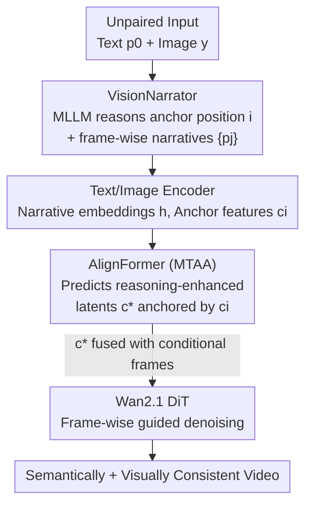

# Reasoning Diffusion for Unpaired Test Time Out-of-distribution Text-Image to Video Generation

**Conference**: CVPR 2026  
**Paper**: [CVF Open Access](https://openaccess.thecvf.com/content/CVPR2026/html/Pan_Reasoning_Diffusion_for_Unpaired_Test_Time_Out-of-distribution_Text-Image_to_Video_CVPR_2026_paper.html)  
**Code**: None  
**Area**: Video Generation / Diffusion Models / Multi-modal Reasoning  
**Keywords**: Text-to-Image-to-Video, Unpaired Conditions, OOD Generation, MLLM Reasoning, Diffusion Transformer

## TL;DR
Addressing common real-world unpaired inputs where text and image semantics are misaligned and the image is not necessarily the first frame, this paper utilizes an MLLM (VisionNarrator) to reason seemingly unrelated conditions into a frame-by-frame script. An AlignFormer then converts the reasoning results into frame-wise latents injected into the Wan2.1 diffusion model to generate videos that are both visually and semantically consistent.

## Background & Motivation
**Background**: Text-to-Image-to-Video (TI2V) generation is currently a mainstream task. Models like Dynamicrafter, CogVideoX, Wan2.1, and LTX-Video use DiT/U-Net backbones to synthesize high-quality videos based on a single image and a text prompt.

**Limitations of Prior Work**: These models almost exclusively assume that input text and images are **perfectly paired and temporally aligned**: both modalities describe the same event, and the conditional image serves as the first frame. When encountering unpaired real-world scenarios, these models fail. The paper provides an intuitive example: the text is "a cat playing in the room," while the image is "a broken vase." Surface-level relevance is low, but the latent causal link is "the cat broke the vase," and the broken vase should logically appear near the end rather than the beginning. Existing methods either allow the image to dominate, losing key text elements (Dynamicrafter), awkwardly blend elements from both modalities (CogVideoX), or simply juxtapose elements statically without causality (Wan2.1).

**Key Challenge**: Unpaired inputs require the model to perform **cross-modal reasoning** to infer the internal connection and temporal order between the two conditions, and then inject this high-level reasoning into the frame-by-frame generation—capabilities that current generative models lack, alongside the absence of mechanisms to align reasoning results with specific frames.

**Goal**: To formalize the "unpaired text-image-to-video generation" problem and solve two sub-problems: (i) how to reason a plausible, temporally aligned scene script from seemingly unrelated text and images; and (ii) how to precisely inject this high-level script into the generation process of each frame.

**Key Insight**: The authors note that MLLMs possess strong reasoning capabilities and can act as a "director" to imagine a coherent story from text and images. The difficulty lies in the chasm between the textual script and the diffusion model's latent space, requiring a dedicated bridge module.

**Core Idea**: Utilize an MLLM to reason the "conditional image anchor position + frame-wise narratives," followed by an image-anchored Transformer (AlignFormer) to translate these narratives into frame-wise reasoning-enhanced latents, serving as structured guidance throughout the denoising process.

## Method

### Overall Architecture
The backbone of ReasonDiff is a "Reasoning Guided Generative Model" based on Wan2.1, preceded by two new modules forming an "MLLM Driven Multi-frame Reasoner": **VisionNarrator** is responsible for reasoning unpaired text and images into a frame-wise script, while **AlignFormer** translates the script into frame-wise latents injectable into the diffusion model. The pipeline is: unpaired text $p_0$ + conditional image $y$ are fed into a frozen MLLM, which outputs the estimated frame position of the conditional image (index $i$) and $f$ frame-wise descriptions $\{p_j\}$. These descriptions are encoded into narrative embeddings $h=\{h_j\}$, and the conditional image is encoded into anchor features $c_i$. AlignFormer, anchored by $c_i$, utilizes Multi-stage Temporal Anchor Attention to transform $h$ into reasoning-enhanced latents $c^*=\{c^*_j\}$. Finally, $c^*$ is fused with conditional frames as frame-wise guidance for the DiT blocks to iteratively denoise and generate the video at timestep $t$.

### Key Designs

**1. VisionNarrator: Enabling MLLM to Imagine Temporally Aligned Frame-wise Scripts**

This step addresses the pain point where modalities seem unrelated and cannot be aligned. The authors use a frozen Multi-modal Large Language Model (MLLM) for cross-modal reasoning instead of merely using it as a "prompt expansion tool" like LayoutGPT or VideoDirectorGPT. Specifically, a carefully designed instruction directs the MLLM to perform two tasks: first, **estimate which position the conditional image most likely occupies within the $f$ video frames** (output `position: j`); second, **generate a per-frame rich description**, forming a self-consistent script (output `descriptions: [...]`). For example, with "broken vase + cat playing," the MLLM reasons a script: "intact vase → cat enters and breaks vase → broken vase and cat escapes," naturally placing the broken vase image at the final frame (position=81). In-context learning is used to stabilize output formats. The value of this step lies in transforming the difficult "unpaired" semantic gap into a commonsense reasoning problem that MLLMs excel at, producing structured **anchor positions + frame-wise narratives**.

**2. AlignFormer and Multi-stage Temporal Anchor Attention (MTAA): Translating Scripts to Frame-wise Latents**

VisionNarrator provides text, while the diffusion model consumes latents; AlignFormer bridges this gap. It receives three inputs: anchor features $c_i$ extracted from the conditional frame, the reasoned position $i$, and frame-wise narrative embeddings $h=\{h_j\}$, outputting reasoning-enhanced latents $c^*=\{c^*_j\}$ for each frame. The core is **MTAA (Multi-stage Temporal Anchor Attention)**: using **anchor features as Query and frame-wise narrative embeddings as Key/Value** to perform two-stage cascaded cross-attention. The first stage captures coarse temporal dependencies, while the second performs finer contextual alignment. Temporally, position encodings are added to both: $\tilde{c}_i = \phi_{\text{proj}}(\text{Flatten}(c_i)) + \text{pe}_i^{(\text{time})}$ and $\tilde{h}_j = h_j + \text{pe}_j^{(\text{time})}$, followed by:

$$c_j^{*}=\text{Attn}(Q_i, K_j, V_j)=\text{Softmax}\!\left(Q_i K_j^{T}/\sqrt{d}\right)V_j$$

where $Q_i=W_Q\tilde{c}_i$, $K_j=W_K\tilde{h}_j$, and $V_j=W_V\tilde{h}_j$, with $j\neq i$ being the index of the target frame to be predicted. Repeatedly attending to narratives using the conditional frame as an anchor effectively treats the "known frame" as a reference frame to "transport" high-level reasoning signals into the latent space frame-by-frame. Ablations show that generation quality and temporal coherence are significantly better with this module than by feeding multi-frame prompts directly.

**3. Two-stage Training + Unpaired Data Construction: Learning Reasoning-based Generation without Datasets**

A major engineering challenge is the lack of existing training data for unpaired text-image inputs. The authors bypass this by **reformulating the task as conditional video reconstruction**: freezing VisionNarrator, **randomly selecting one frame from a video as the conditional frame**, and using its frame-wise narrative embeddings to let the model reconstruct the entire video. Consequently, only the base generative model and AlignFormer require training. To simulate OOD unpaired scenarios, they **deliberately widen the temporal interval between selected frames** (sampling WebVid at 0.2s intervals and generating captions for each frame using LLaMA-3.2-11B-Vision-Instruct), weakening the correlation between the conditional frame and surrounding content. Training is split into two stages: the first stage jointly trains the base model and AlignFormer using standard denoising loss for initial alignment; the second stage freezes the base model and fine-tunes AlignFormer alone, adding an auxiliary reconstruction loss to pull the predicted latents toward the ground-truth latents:

$$\mathcal{L}=\mathbb{E}_{x_1,x_0,h,t,c}\left[\,\lVert u_\theta(x_t,h,c^{*})-v(x_t)\rVert_2^2+\beta\cdot\lVert c^{*}-c\rVert_2^2\,\right]$$

with $\beta=0.2$. This auxiliary loss is only enabled during the second stage fine-tuning as it deviates from the base model's original denoising objective.

### Loss & Training
- First Stage: Standard flow-matching denoising loss $\mathcal{L}=\mathbb{E}[\lVert u_\theta(x_t,y,t)-v(x_t)\rVert_2^2]$ with velocity field target $v(x_t)=x_1-x_0$, jointly training the base model + AlignFormer.
- Second Stage: Denoising loss + $\beta$-weighted latent reconstruction loss (as above), freezing the base model and tuning only AlignFormer, $\beta=0.2$.
- Data: WebVid sampled at 0.2s intervals, LLaMA-3.2-11B-Vision-Instruct used for frame-wise captions; random frame selection with large intervals to simulate unpaired conditions.

## Key Experimental Results

### Main Results
Evaluation was conducted on a self-constructed ActivityNet unpaired dataset (500 clips, 16 frames/clip, using first/last frames as conditions and MLLM to generate captions for the other end) and the public paired dataset MSR-VTT. Metrics include VBench Imaging Quality, Motion Smooth, Dynamic Degree, CLIP Score (Text/Image), and User Rank (lower is better). CLIP Score (Text) and User Rank are key metrics for evaluating unpaired reasoning.

| Dataset | Metric | ReasonDiff | Strongest Baseline (Wan2.1) | Gain |
|--------|------|-----------|-----------------|------|
| ActivityNet (Unpaired) | CLIP Score (Text)↑ | 0.261 | 0.224 | +16.5% |
| ActivityNet (Unpaired) | User Rank↓ | 1.743 | 2.692 | Lead by 0.949 |
| ActivityNet (Unpaired) | Dynamic Degree↑ | 0.936 | 0.810 | Significant Lead |
| ActivityNet (Unpaired) | Imaging Quality↑ | 0.528 | 0.512 | Best |
| ActivityNet (Unpaired) | Motion Smooth↑ | 0.986 | 0.980 | Best |
| MSR-VTT (Paired) | Imaging Quality↑ | 0.571 | 0.560 | Exceeds Base |
| MSR-VTT (Paired) | User Rank↓ | 1.769 | 2.743 | Best |

On the unpaired ActivityNet, ReasonDiff ranks first in all metrics except CLIP Score (Image); all methods scored near 0.5 for CLIP Score (Image) with low discriminability (as baselines cling to the image when facing unpaired scenarios). However, looking at the image score alone is misleading—the combined Text/Image scores reveal the baselines' lack of reasoning capability. Notably, ReasonDiff also outperformed its base model Wan2.1 on the **paired** MSR-VTT, suggesting that cross-modal reasoning contributes positively to general video quality.

### Ablation Study
The metrics for four variants are reported as "relative ratios to the full model" (source Figure 5(a)).

| Configuration | Most Significantly Affected Metric | Explanation |
|------|----------------|------|
| Full model | — | Optimal across all metrics |
| w/o Aux. loss | Motion Smooth | Removing stage 2 auxiliary loss causes overall decline, especially in smoothness, indicating it stabilizes predicted latents |
| w/o Multi. prompt | Dynamic Degree | Using a single user prompt without frame-wise narratives significantly drops dynamics, proving the importance of fine-grained temporal guidance |
| w/o Enhanced latents | Imaging Quality | Relying only on narrative guidance without enhanced latents leads to severe quality drops, showing narratives alone cannot maintain visual consistency |
| Rewrite prompt | CLIP Score (Text) | Using MLLM to rewrite the prompt for the original base model shows acceptable CLIP-Image but a crash in CLIP-Text, indicating base models cannot decompose text info across frames |

### Key Findings
- Enhanced latents (AlignFormer output) contribute most to **image quality**, while frame-wise narratives contribute most to **dynamic degree**; they are complementary.
- The auxiliary reconstruction loss primarily provides **stability** (motion smoothness) and is critical for stage 2 fine-tuning.
- "Naive solutions" (rewriting prompts + manually specifying anchor indices) cannot handle unpaired tasks: results are often superficial mixtures of elements or chaotic, highlighting the necessity of the proposed method.

## Highlights & Insights
- **Translating "unpaired" challenges into MLLM commonsense reasoning + latent alignment**: VisionNarrator imagines causal scripts and locates the conditional frame index, providing a reliable reference frame for subsequent modules.
- **MTAA with conditional frame as Query anchor**: Using the "known frame" to attend to frame-wise narratives effectively uses fixed visual info to generate unknown frame latents, a transferable approach for any "single-frame condition + multi-frame text" controllable generation.
- **Training without data**: Reformulating unpaired generation as conditional reconstruction with "random frame selection + widened intervals" is a clever self-supervised construction that avoids the lack of ground-truth.
- Cross-modal reasoning benefits both unpaired and paired scenarios, suggesting "reasoning-then-generation" might be a universal strategy for improving video quality.

## Limitations & Future Work
- VisionNarrator is **frozen**, making its quality entirely dependent on the selected MLLM; causal reasoning errors (e.g., position bias) will propagate through AlignFormer.
- Evaluation was limited to low-resolution/low-frame-count clips (16 frames); extension to long, high-resolution videos is unverified.
- ⚠️ The ablation study provided relative ratios rather than absolute values; the exact magnitude of performance drops remains unquantified.
- CLIP Score (Image) lacks discriminability in unpaired scenarios; a metric more suitable for measuring image-semantic alignment in unpaired settings is needed.
- AlignFormer's alignment priors are influenced by the quality and bias of LLaMA's automatic captions on WebVid.

## Related Work & Insights
- **vs Dynamicrafter / CogVideoX / Wan2.1**: These assume paired inputs and first-frame priority; they lose text elements or create static juxtapositions when faced with unpaired inputs. ReasonDiff explicitly reasons causality and temporal order, leading to better semantic coherence.
- **vs LayoutGPT / VideoDirectorGPT**: While they use LLMs, they only **expand prompts or generate layouts** without addressing multi-modal causal links for unpaired inputs. VisionNarrator performs cross-modal reasoning and temporal alignment.
- **vs Rewrite-prompt naive solution**: Simply rewriting prompts for base models fails because the models cannot decompose text into frames, regressing into image-dependency and resulting in a crash in CLIP-Text.

## Rating
- Novelty: ⭐⭐⭐⭐⭐ First to systematically define and solve unpaired TI2V; the combination of MLLM reasoning + anchor latent alignment is highly innovative.
- Experimental Thoroughness: ⭐⭐⭐⭐ Main experiments + 4-variant ablation + naive comparisons are comprehensive, though missing absolute ablation values and long video validation.
- Writing Quality: ⭐⭐⭐⭐ Clear motivation and illustrations; logical method pipeline.
- Value: ⭐⭐⭐⭐ Directly addresses the pain point of modality misalignment; the "reasoning-then-generation" approach has high transfer value.

<!-- RELATED:START -->

## Related Papers

- [\[CVPR 2026\] VISTA: A Test-Time Self-Improving Video Generation Agent](vista_a_test-time_self-improving_video_generation_agent.md)
- [\[CVPR 2026\] EffectMaker: Unifying Reasoning and Generation for Customized Visual Effect Creation](effectmaker_unifying_reasoning_and_generation_for_customized_visual_effect_creat.md)
- [\[CVPR 2025\] One-Minute Video Generation with Test-Time Training](../../CVPR2025/video_generation/one-minute_video_generation_with_test-time_training.md)
- [\[CVPR 2026\] MoReGen: Multi-Agent Motion-Reasoning Engine for Code-based Text-to-Video Synthesis](moregen_multi-agent_motion-reasoning_engine_for_code-based_text-to-video_synthes.md)
- [\[ICLR 2026\] TTOM: Test-Time Optimization and Memorization for Compositional Video Generation](../../ICLR2026/video_generation/ttom_test-time_optimization_and_memorization_for_compositional_video_generation.md)

<!-- RELATED:END -->
