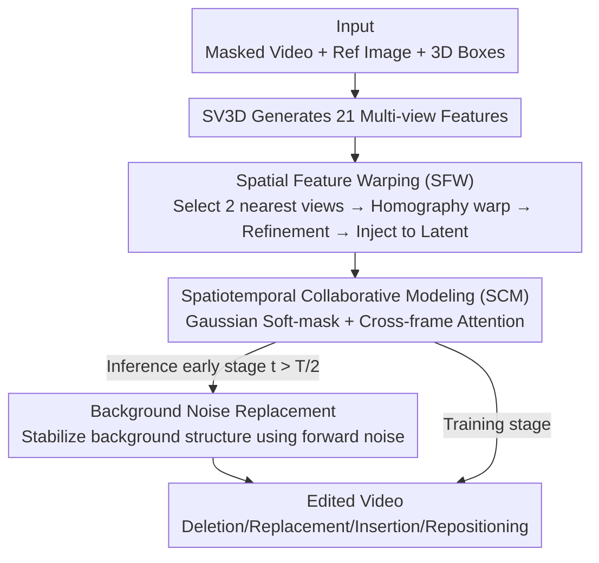

# RecEdit-Drive: 3D Reconstruction-Guided Spatiotemporal Video Editing for Autonomous Driving Scenes

**Conference**: CVPR 2026  
**Paper**: [CVF Open Access](https://openaccess.thecvf.com/content/CVPR2026/html/Wu_RecEdit-Drive_3D_Reconstruction-Guided_Spatiotemporal_Video_Editing_for_Autonomous_Driving_Scenes_CVPR_2026_paper.html)  
**Code**: https://github.com/TJU-IDVLab/RecEdit-Drive  
**Area**: Video Editing / Autonomous Driving / Diffusion Models  
**Keywords**: Video Editing, Autonomous Driving, 3D Reconstruction Prior, Spatiotemporal Consistency, Diffusion Models

## TL;DR
RecEdit-Drive integrates a 3D reconstruction model (SV3D multi-view synthesis) into a video diffusion editing pipeline. It utilizes "Spatial Feature Warping" to construct foreground object views from multiple relevant novel perspectives and "Spatiotemporal Collaborative Modeling" with Gaussian cross-frame attention to blend edited foregrounds into backgrounds. Coupled with an inference-time background noise replacement strategy, it achieves SOTA results on the nuScenes dataset for four types of editing: deletion, replacement, insertion, and repositioning, while effectively serving as data augmentation for downstream 3D detection.

## Background & Motivation
**Background**: Real-world video collection for autonomous driving is costly. The industry increasingly relies on "generation + editing" to expand training data—deleting, replacing, inserting, or repositioning foreground vehicles—to create challenging samples for downstream 3D detection and BEV segmentation. Common practices based on Latent Diffusion Models (LDM / Stable Video Diffusion) use text prompts or 2D structural priors (depth maps, sketches, optical flow) to constrain editing.

**Limitations of Prior Work**: Pure text prompts only handle static objects or style transfers, lacking inter-frame consistency for **dynamic foreground objects**. While 2D structural priors improve consistency, they fail to capture the 3D spatial structure and motion of dynamic objects, leading to geometric instability and structural drift. "Generation + Reconstruction" fusion methods utilize 3D priors but either under-model spatiotemporal consistency for dynamic scenes or **rely on a single fixed perspective** from a sequence to guide each frame, causing geometric distortion and temporal inconsistency as the viewpoint changes.

**Key Challenge**: Accurate and controllable editing of dynamic 3D foregrounds requires both **precise 3D structural priors under arbitrary target viewpoints** (which single-view approaches cannot provide) and **spatiotemporal collaboration** to naturally blend the edited foreground with the background without boundary artifacts. Existing methods only partially address these requirements.

**Goal**: To achieve four types of editing (deletion, replacement, insertion, repositioning) using only "one video sequence + one reference foreground image + 3D bounding boxes per frame," while ensuring consistency in geometric structure, texture, and time.

**Core Idea**: Construct foreground priors by warping features from **multiple relevant viewpoints** generated by a pre-trained reconstruction model (SV3D) via homography. Use Gaussian soft-masked cross-frame attention for spatiotemporal collaboration and employ an inference-time background noise replacement strategy to stabilize background structures. This replaces "single-view 2D/3D priors" with "multi-view 3D reconstruction priors" to resolve consistency issues in dynamic foreground editing.

## Method

### Overall Architecture
RecEdit-Drive is built upon Stable Video Diffusion (SVD). The input consists of an $N$-frame masked video $V_m$, a mask sequence $M_B$ (identifying edit regions), a reference foreground image $I$, and 3D bounding boxes $B=\{b_n\}$ for each frame. The workflow involves three synergistic components: **Spatial Feature Warping (SFW)** warps foreground features from multi-view outputs of a reconstruction model into the target viewpoint; **Spatiotemporal Collaborative Modeling (SCM)** uses Gaussian cross-frame attention to propagate context and smoothly blend foregrounds; and **Background Noise Replacement** during inference replaces predicted background latent features with forward-diffused noise to maintain structural integrity.

The reference image $I$ is encoded by a VAE and fed into SV3D for intermediate representations. Depth maps (derived from 3D boxes) and reference image tokens are injected into the ResBlocks and attention modules of the diffusion U-Net. SFW and SCM are trainable modules inserted across U-Net layers, while SV3D, VAE, and the image encoder remain frozen.

### Key Designs

**1. Spatial Feature Warping (SFW): Multi-view 3D Priors for Arbitrary Target Viewpoints**

This design addresses the inability of single-view priors to provide accurate 3D structures for arbitrary viewpoints. Pre-trained SV3D generates 21 multi-view features $\tilde{Z}=\{\tilde{z}_i\}_{i=1}^{21}$ from reference image $I$. For a target viewpoint with azimuth $a_n$, the **two nearest viewpoints** $\tilde{a}_p, \tilde{a}_q$ are selected based on the angular difference $\Delta a_i$.

Instead of simple projection, homography transformations are applied based on the **visible faces** of the 3D box. Visibility is determined by the dot product of the face normal and the vector from the face center to the camera. The visible face vertices are used to calculate homography matrices $H_i$, and the warped features are aggregated: $\tilde{z}'_n=\sum_{i\in\{p,q\}}W(H_i,\tilde{z}_i)$. These are refined using cross-view attention:

$$z'_n=\tilde{z}'_n+\sum_{i\in\{p,q\}}w_i\times\mathrm{CA}(\tilde{z}'_n,\tilde{z}_i),\quad w_i=\frac{1/|\Delta a_i|}{1/|\Delta a_p|+1/|\Delta a_q|}$$

The features are injected into the video latent via zero-convolution $Z$ and box-aligned transformation $T_b$: $\vec{z}_n=z_{m,n}+M^F_n\times Z(T_b(z'_n))$.

**2. Spatiotemporal Collaborative Modeling (SCM): Gaussian Soft-mask & Cross-frame Attention**

To prevent sharp discontinuities at editing boundaries, SCM replaces binary masks with Gaussian-smoothed masks: $M^{F,G}=M^F * G_\sigma$. These soft masks are converted into attention guidance masks $M_{i,j}=C(1-M^{F,G}_i\odot M^{F,G}_j)$ (where $C \ll 0$) to suppress artifacts. Spatiotemporal coordination is achieved via Gaussian cross-frame attention:

$$z_n=\vec{z}_n+\frac{1}{|N(n)|}\sum_{i\in N(n)}\mathrm{Softmax}\Big(\frac{Q_nK_i^T}{\sqrt{d}}+M_{n,i}\Big)V_i$$

where $N(n)$ denotes adjacent frames. This propagates context, ensuring temporal consistency and natural foreground-background transitions.

**3. Background Noise Replacement (Inference Strategy)**

During early denoising stages ($t > \frac{T}{2}$), the predicted background latent is replaced by the background noise sampled at the same position from the forward diffusion process:

$$z_{n,t}=\begin{cases}\bar{z}^B_{n,t}+z^F_{n,t}, & t>\frac{T}{2}\\ z_{n,t}, & t\le\frac{T}{2}\end{cases}$$

This forces the background to follow the "correct original structure," providing a reliable reference for foreground editing before allowing seamless integration in later stages.

### Loss & Training
The model uses the Denoising Score Matching (DSM) objective: $\mathbb{E}\big[\lambda_\sigma\|D_\theta(z_0+n;\sigma,y,c)-z_0\|_2^2\big]$. Training data is constructed using nuScenes by masking foreground objects and background regions. The dataset includes 12,000 video clips (10 frames, $576 \times 1024$), with a specific subset for inpainting.

## Key Experimental Results

### Main Results
Evaluation on nuScenes across four editing tasks shows RecEdit-Drive achieving superior FID (single-frame quality) and FVD (temporal consistency):

| Task | Method | FVD ↓ | FID ↓ |
|------|------|-------|-------|
| Deletion | ProPainter | 334.79 | 34.14 |
| Deletion | DriveEditor | 208.79 | 29.30 |
| Deletion | **RecEdit-Drive** | **170.98** | **26.97** |
| Replacement | T2V-Zero | 168.27 | 15.28 |
| Replacement | DriveEditor | 40.97 | 10.24 |
| Replacement | **RecEdit-Drive** | **38.59** | **9.88** |
| Insertion | DriveEditor | 45.96 | 11.12 |
| Insertion | **RecEdit-Drive** | **42.01** | **10.71** |
| Reposition | DriveEditor | 34.14 | 9.45 |
| Reposition | **RecEdit-Drive** | **32.27** | **9.04** |

### Ablation Study
Effectiveness of individual modules (quality and 3D control metrics):

| SFW | SCM | Noise Replace | FID ↓ | FVD ↓ | mRecall ↑ | mATE ↓ |
|:---:|:---:|:---:|:---:|:---:|:---:|:---:|
| ✓ | – | – | 5.75 | 18.62 | 0.960 | 0.5791 |
| ✓ | – | ✓ | 5.69 | 18.44 | 0.961 | 0.5772 |
| ✓ | ✓ | ✓ | **5.22** | **14.38** | **0.964** | **0.5757** |

### Key Findings
- **SCM is the primary driver for FVD**: Adding SCM reduced FVD from 18.44 to 15.02, significantly improving temporal consistency.
- **SFW ensures 3D positioning**: Metrics like mRecall and mATE are primarily determined by the 3D priors provided by SFW.
- **Multi-view warping outperforms single-view/explicit reconstruction**: Explicit methods (Vggt) suffer from texture misalignment, while SFW maintains better geometric and texture consistency in latent space.
- **Downstream enhancement**: Using RecEdit-Drive for repositioning and replacement augmentation improved StreamPETR's mAP from 0.4796 to 0.4888 and NDS from 0.5617 to 0.5905.

## Highlights & Insights
- **Latent Space Multi-view Warping**: Using DLT homography to warp SV3D features avoids the missing texture issues of explicit 3D reconstruction.
- **Gaussian Soft-masking**: Replacing binary masks with soft attention guidance effectively mitigates boundary artifacts.
- **Inference-time Noise Injection**: A zero-cost trick to preserve background structure during early denoising.
- **Editing as Data Augmentation**: Providing an end-to-end loop where edited videos directly improve downstream 3D detection performance.

## Limitations & Future Work
- **Reliance on 3D Bounding Boxes**: Accurate boxes are required per frame; errors in box annotation lead to spatial failures.
- **Dataset Specificity**: Evaluations are limited to nuScenes; cross-dataset generalization is not yet verified. ⚠️
- **SV3D Dependency**: The quality of foreground priors is capped by the novel view synthesis capability of SV3D.
- **Evaluation Consistency**: Discrepancies in FID/FVD scales between the main results (10-27) and ablation study (5.22) are not fully explained. ⚠️

## Related Work & Insights
- **vs DriveEditor**: While DriveEditor is a strong baseline, it relies on single-view priors, causing drift. RecEdit-Drive's multi-view warping and spatiotemporal modeling yield lower FVD/FID across all tasks.
- **vs Text-driven methods**: Text-to-Video approaches often struggle with dynamic foreground geometry or change the global style; this work explicitly constrains geometry via 3D priors.

## Rating
- Novelty: ⭐⭐⭐⭐
- Experimental Thoroughness: ⭐⭐⭐⭐
- Writing Quality: ⭐⭐⭐⭐
- Value: ⭐⭐⭐⭐

<!-- RELATED:START -->

<!-- Related papers would go here -->

<!-- RELATED:END -->

## Related Papers

- [\[ICLR 2026\] DrivingGen: A Comprehensive Benchmark for Generative Video World Models in Autonomous Driving](../../ICLR2026/video_generation/drivinggen_a_comprehensive_benchmark_for_generative_video_world_models_in_autono.md)
- [\[CVPR 2026\] VIVA: VLM-Guided Instruction-Based Video Editing with Reward Optimization](viva_vlm-guided_instruction-based_video_editing_with_reward_optimization.md)
- [\[CVPR 2026\] Generative Video Motion Editing with 3D Point Tracks](generative_video_motion_editing_with_3d_point_tracks.md)
- [\[NeurIPS 2025\] RLGF: Reinforcement Learning with Geometric Feedback for Autonomous Driving Video Generation](../../NeurIPS2025/video_generation/rlgf_reinforcement_learning_with_geometric_feedback_for_autonomous_driving_video.md)
- [\[CVPR 2026\] DriveLaW: Unifying Planning and Video Generation in a Latent Driving World](drivelaw_unifying_planning_and_video_generation_in_a_latent_driving_world.md)

<!-- RELATED:END -->
