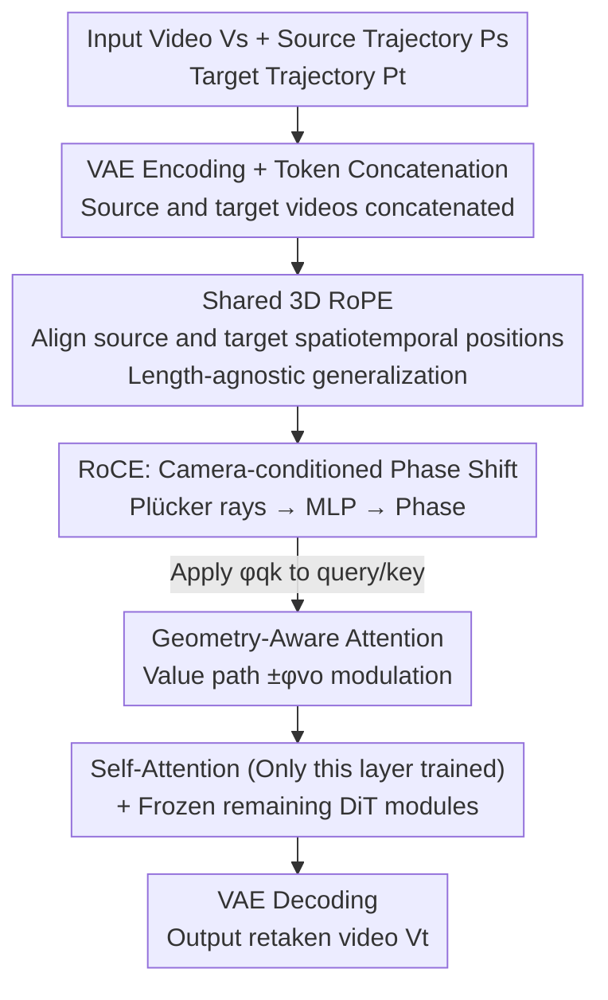

# ReDirector: Creating Any-Length Video Retakes with Rotary Camera Encoding

**Conference**: CVPR 2026  
**Paper**: [CVF Open Access](https://openaccess.thecvf.com/content/CVPR2026/html/Park_ReDirector_Creating_Any-Length_Video_Retakes_with_Rotary_Camera_Encoding_CVPR_2026_paper.html)  
**Code**: [Project Page](https://byeongjun-park.github.io/ReDirector/) (no open-source code found)  
**Area**: Video Generation / Camera-Controllable Video  
**Keywords**: Video Retaking, Camera Control, Rotary Position Embedding, RoPE, Geometry-Aware Attention

## TL;DR
ReDirector injects camera parameters as phase shifts into the Rotary Position Embedding (RoPE) of video diffusion models. It shares a single 3D RoPE across both the input video and the target retake to align spatiotemporal coordinates, enabling camera-controlled video retakes of arbitrary lengths with drastic camera motions. It significantly outperforms prior warping-based and implicit conditioning methods in terms of geometric consistency, camera controllability, and generalization to long sequences.

## Background & Motivation
**Background**: Video retaking refers to generating a new video of an existing scene along a new target camera trajectory. This facilitates capturing physically impossible viewpoints or stabilizing shaky shots, which is crucial for film and virtual production. Mainstream approaches fall into two categories: ① **Warping-based methods** (e.g., TrajectoryCrafter, CogNVS) first use video depth estimation and point tracking to unproject each frame into a point cloud, re-project it to the target trajectory to obtain geometrically aligned "proxy frames", and finally employ a video generation model for refinement and inpainting; ② **Implicit conditioning methods** (e.g., GCD, ReCamMaster) bypass explicit warping, directly concatenating or adding camera extrinsics and input video latents into the video generator, relying on large-scale synthetic data for the model to internalize multi-view geometry implicitly.

**Limitations of Prior Work**: Warping-based methods heavily rely on external geometric estimators. Once the input video contains dynamic camera motions or complex structures, depth and tracking estimation degrade, directly injecting warping artifacts into the generative model without a pathway for self-correction. Moreover, frame-by-frame warping disrupts the decoupling of dynamic objects and static backgrounds. Implicit methods are extremely sensitive to training data distributions, and usually encode only **target** camera extrinsics, applying absolute position embeddings or 3D RoPE along only a subset of axes for the input video. This forces them to **assume fixed-length inputs with minor camera movements**, leading to rapid quality degradation when operating beyond these assumptions (i.e., longer videos, more drastic motions).

**Key Challenge**: Neither of the two approaches seamlessly integrates both the "input video" and "target trajectory" control signals under a **length-agnostic** setting. The core open challenge is how to encode the multi-view relationships between the input video and the target video, as well as along their respective camera trajectories, under variable-length inputs and dynamic cameras.

**Core Idea**: The authors observe that Rotary Position Embedding (RoPE), as a relative position encoding, naturally generalizes across sequence lengths. Consequently, **Ours uses a shared 3D RoPE** for both input and target videos to align their spatiotemporal positions (correcting the "misuse of RoPE" in prior works), and injects camera conditions as **physically grounded positional signals** in the form of phase shifts within the RoPE. This leads to the proposed Rotary Camera Encoding (RoCE), which generates learnable phase shifts from camera parameters to enhance multi-view attention across the same physical locations, facilitating multi-view consistent video retaking under variable-length, dynamic camera conditions.

## Method

### Overall Architecture
ReDirector is fine-tuned on the pre-trained, camera-controllable image-to-video model Wan-I2V-CamCtrl, transforming it into a video-to-video model. The inputs are the source video $V_s$, source camera trajectory $P_s$ (obtained from datasets during training and estimated via ViPE during inference), and target camera trajectory $P_t$. The output is the retaken video $V_t$ along $P_t$. The source and target videos are encoded by a VAE and concatenated along the token dimension, sharing the same 3D RoPE to encode spatiotemporal positions. Camera conditions, in the form of Plücker rays, are transformed into phase shifts using an MLP and injected into the self-attention mechanism. Following ReCamMaster, **only the self-attention layers are updated** during training, while other components (cross-attention, FFN, VAE) are frozen. The RoCE module is inserted into the self-attention blocks, outputting two sets of phase shifts: one applied to queries and keys to provide camera-grounded positional encoding, and the other modulating the value path to enable geometry-aware attention.

### Key Designs

**1. Shared 3D RoPE: Correcting prior misuse of positional encoding for length-agnostic generalization**

Prior methods applied highly restricted positional encodings to the input video—either using absolute position encodings or only a subset of axes in 3D RoPE, which locks the model to fixed-length inputs. The authors' correction is simple yet crucial: let the input and target videos **share the same set of 3D RoPE rotation matrices** $\mathbf{R}=[\mathbf{R}_t,\mathbf{R}_s]$, where $\mathbf{R}_t=\mathbf{R}_s$. The 3D RoPE is constructed from temporal, height, and width rotation matrices via Kronecker products and channel concatenation, $\mathbf{R}=\tilde{\mathbf{R}}_f\oplus\tilde{\mathbf{R}}_h\oplus\tilde{\mathbf{R}}_w$, with each element defined as $R(n,c)=e^{i\theta_c n}$ and an exponentially decaying frequency $\theta_c=10000^{-\frac{c-1}{d_{head}/2}}$. Since RoPE encodes **relative** positions (as the attention matrix contains $e^{i\theta_c(n-m)}$, relying purely on $n-m$), it naturally generalizes across sequence lengths. Attaching the exact same RoPE indices to both input and target tokens informs the model that these tokens exist in closely aligned spatiotemporal positions. Consequently, even if longer sequences are unseen during training, the model stably generalizes to hundreds of frames during inference. This step, combined with token-level camera encoding via Plücker rays, serves as the foundation for RoCE.

**2. Rotary Camera Encoding (RoCE): Translating camera parameters to phase shifts in RoPE**

Simply aligning spatiotemporal coordinates is insufficient—shared RoPE makes the input and target "look similar" at identical indices, but the model needs to **distinguish** geometric differences between input and target viewpoints at the same locations. RoCE solves this by layering a camera-dependent phase shift: in each DiT block, an MLP maps the Plücker ray tokens $\mathbf{c}=[c_t,c_s]$ to phases $\boldsymbol{\phi}_{qk}=[\mathbf{0},\text{MLP}_{qk}(\mathbf{c})]$, where the first $d_{head}/6$ dimensions are forced to zero to avoid interfering with temporal coordinates. Then, a learnable camera rotation matrix $\tilde{\mathbf{R}}_{qk}=e^{i\boldsymbol{\phi}_{qk}}$ is constructed and applied to query and key vectors: $\bar{q}'=\bar{q}\circ\mathbf{R}\circ\tilde{\mathbf{R}}_{qk}$. Consequently, the attention matrix becomes:

$$\mathbf{A}'_{(n,m)}=\text{Re}\big[\bar{q}_n(\bar{k}_m^*\circ e^{i(\theta_c(n-m)+\phi_{qk}(n,c)-\phi_{qk}(m,c))})\big].$$

Crucially, RoCE is **initialized with zero phase**. At the start of training, no camera conditioning is applied, and non-zero phases are gradually learned during fine-tuning. This ensures camera signals smoothly seep in without disrupting the pre-trained weights. The authors observe (Fig. 3) that attention matrices composed purely of phase shifts act similarly to RoPE within a single frame but are **more sensitive to relative pose differences**, strongly suppressing attention between distant views. This aligns tokens that are temporally distant but physically correspond to the same background region, maintaining background consistency across long time horizons. Compared to implicit methods that simply concatenate/add camera extrinsics into latents, injecting camera signals as phase shifts in the complex domain represents a more "native" camera encoding approach.

**3. Geometry-Aware Attention: SO(2) phase round-tripping on the value path without training from scratch**

Recent geometry-aware attention mechanisms (e.g., GTA, PRoPE) insert explicit geometric transformations into attention layers, but they are typically trained from scratch on static scenes, making them unsuitable for fine-tuning a pre-trained video generator. ReDirector bypasses explicit geometric transformations with camera-conditioned phase shifts: it generates another set of phases $\boldsymbol{\phi}_{vo}$, corresponding to the rotation matrix $\tilde{\mathbf{R}}_{vo}=e^{i\boldsymbol{\phi}_{vo}}$, and performs a "first inverse rotate, aggregate, then forward rotate" round-trip on the values:

$$\bar{o}'=\Big(\mathbf{A}'\big(\underbrace{\bar{v}\circ\tilde{\mathbf{R}}_{vo}^{-1}}_{\bar{v}'}\big)\Big)\circ\tilde{\mathbf{R}}_{vo}.$$

That is, $-\phi_{vo}$ is applied to the values **before** attention weighting, and $+\phi_{vo}$ is applied **after** value aggregation. Exploiting the SO(2) property of phase shifts, this is mathematically equivalent to learnable geometry-aware attention (similar to GTA), yet it can be applied directly for fine-tuning video generators without starting from scratch. An added benefit is **enhanced decoupling of dynamic objects and static backgrounds**: while tokens of static regions stay multi-view consistent under perspective shifts, dynamic object tokens disrupt this consistency, allowing the model to naturally segregate the two and yield geometrically convincing retakes.

### Loss & Training
The model is trained using a rectified flow framework and conditional flow matching loss. Defining the noise distribution $p_1\sim\mathcal{N}(0,I)$ and data distribution (target video) $p_0$, the mapping is constructed via the ODE $\mathrm{d}z_t=u_\theta(z_t,t)\mathrm{d}t$ and the interpolation $z_t=tz_1+(1-t)z_0$, minimized by the loss:

$$\mathcal{L}_{\text{CFM}}=\mathbb{E}_{t,p_0,p_1}\big[\|(z_1-z_0)-u_\theta(z_t,t)\|^2\big].$$

During inference, generating retakes is achieved by solving the ODE from $t=1$ to $t=0$. Two training augmentation strategies are employed: ① **Identity retake pairs**, where the input and target share the same trajectory $\{V_s,P_s\}=\{V_t,P_t\}$, encouraging the model to learn tight alignments between tokens sharing the same RoPE/RoCE; ② **Temporal reversal augmentation**, which reverses videos to expose a more diverse set of camera trajectories, enabling the model to generate correct retakes starting from the initial frame.

## Key Experimental Results

### Main Results
Evaluated on the DAVIS dataset across 50 videos × 10 target trajectories from ReCamMaster (500 test cases in total). Video lengths range from tens of frames to around 100 frames. Metrics include VBench Imaging Quality, Dyn-MEt3R (geometry consistency of the retake), frame-by-frame MEt3R (consistency with the input video), and TransErr/RotErr (relative translation and rotation errors).

| Method | Dyn-MEt3R↑ | MEt3R↓ | TransErr↓ | RotErr↓ | Imaging Quality↑ |
|------|-----------|--------|-----------|---------|------------------|
| GCD | 0.6898 | 0.4438 | 0.1062 | 22.853 | 0.9639 |
| ReCamMaster | 0.7857 | 0.3472 | 0.0292 | 2.347 | 0.9881 |
| TrajectoryCrafter | 0.7338 | 0.3272 | 0.0697 | 9.115 | 0.9727 |
| CogNVS | 0.6845 | 0.4036 | 0.0768 | 10.878 | 0.9721 |
| **Ours (ReDirector)** | **0.8477** | **0.3073** | **0.0165** | **1.666** | 0.9867 |

The improvements are most pronounced in geometric consistency (Dyn-MEt3R 0.6898 $\rightarrow$ 0.8477) and camera fidelity (RotErr 2.347 $\rightarrow$ 1.666, TransErr 0.0292 $\rightarrow$ 0.0165). Regarding slightly lower imaging quality metrics (such as aesthetics or background consistency), the authors clarify that ReDirector explores a vastly larger scene scale under equivalent camera movements, whereas methods targeting milder camera motions naturally benefit in "background consistency/motion smoothness" metrics.

Long-sequence generalization on the iPhone dataset (novel view synthesis, OOD trajectories/lengths/resolutions):

| Method | 81f PSNR↑ | 81f LPIPS↓ | 161f PSNR↑ | 161f LPIPS↓ | 241f PSNR↑ | 241f LPIPS↓ |
|------|-----------|-----------|------------|-------------|------------|-------------|
| ReCamMaster | 10.69 | 0.678 | 10.03 | 0.762 | 10.37 | 0.772 |
| CogNVS† | 10.56 | 0.720 | 10.63 | 0.741 | 10.81 | 0.720 |
| **Ours** | **10.82** | **0.655** | **11.56** | **0.631** | **11.85** | **0.611** |

ReDirector does not rely on LiDAR depth or external geometric models. Crucially, **its performance steadily increases** with longer input videos (PSNR of 11.85 for 241 frames), whereas all prior methods severely degrade on longer sequences.

### Ablation Study
Gradually integrating components on DAVIS:

| Configuration | Shared RoPE | Dyn-MEt3R↑ | MEt3R↓ | TransErr↓ | RotErr↓ |
|------|:--:|-----------|--------|-----------|---------|
| ReCamMaster (Wan2.1-T2V, Addition) | ✗ | 0.7857 | 0.3472 | 0.0292 | 2.347 |
| + I2V-CamCtrl backbone (Addition) | ✗ | 0.8339 | 0.3308 | 0.0243 | 2.291 |
| + Shared RoPE (Addition) | ✓ | 0.8378 | 0.3159 | 0.0202 | 1.975 |
| + RoCE (w/o GTA) | ✓ | 0.8341 | 0.3164 | 0.0193 | 1.897 |
| **+ Geometry-Aware Attention (Full)** | ✓ | **0.8477** | **0.3073** | **0.0165** | **1.666** |

Training iteration ablation: going from 20K to 50K steps, Dyn-MEt3R improves from 0.8477 to 0.8491, and RotErr decreases from 1.666 to 1.521. The steady rise in geometric consistency and camera accuracy indicates that the model is gradually internalizing multi-view geometry purely via data.

### Key Findings
- **Shared 3D RoPE contributes most significantly**: Adding shared RoPE to the ReCamMaster baseline boosts Dyn-MEt3R from 0.7857 to 0.8378 and decreases RotErr from 2.347 to 1.975. This demonstrates that correct incorporation of position encoding coupled with tight alignment of input and target is essential.
- **RoCE improves coarse alignment but degrades fine-grained geometric consistency when used alone**: Incorporating RoCE further enhances imaging quality and camera fidelity (TransErr/RotErr), but slightly reduces Dyn-MEt3R from 0.8378 to 0.8341. This suggests that while phase shifts excel at coarse alignment, they struggle to support fine-grained multi-view consistency unless combined with geometry-aware attention (GTA), which drives Dyn-MEt3R to its peak of 0.8477.
- **Longer sequences lead to stronger performance**: In stark contrast to prior works collapsing on long videos, ReDirector exploits the fact that "longer inputs cover larger scene scales" to reconstruct broader regions and recover scene scales closer to the ground truth.

## Highlights & Insights
- **Treating camera conditions as "positional encodings" rather than "extra channels" is the core insight**: Camera parameters are physically grounded spatial coordinates, which token indices alone cannot represent. Instead of concatenating or adding camera extrinsics, the authors convert them into phase shifts in RoPE. This retains RoPE's length-agnostic generalization while utilizing complex rotations to naturally model multi-view geometric transitions—a highly transferable perspective that can be generalized to any multi-view or multi-modal generation task utilizing RoPE.
- **Zero-phase initialization is the key trick to smoothly seed camera signals**: Initializing RoCE with zero phase ensures it operates identically to vanilla RoPE at the beginning of training, and only introduces non-zero phases during fine-tuning. This prevents the degradation of pre-trained weights during the initial updates. Such a design strategy of "starting from an identity mapping and gradually injecting new conditions" is broadly applicable to fine-tuning large generative models.
- **SO(2) phase round-tripping along the value path transforms "from-scratch trained geometric attention" into a "fine-tuneable" variant**: Inversely rotating value vectors before attention weighting and forwardly rotating them after aggregation mathematically mirrors GTA-like geometry-aware attention. However, it integrates seamlessly with pre-trained models rather than mandating training from scratch. This delivers an added bonus of **improved dynamic/static decoupling**: static background tokens remain multi-view consistent across perspective shifts, whereas dynamic foreground tokens break this symmetry, allowing the model to naturally segregate them without requiring explicit segmentation or mask supervision.

## Limitations & Future Work
- **Dependency on input camera pose estimation**: During inference, source video trajectories are estimated via ViPE. The evaluation metrics (TransErr/RotErr) also rely on ViPE's estimated poses. Drastic camera motions or dynamic object interference can lead to inaccuracies in pose estimation, which directly impacts retaking quality and evaluation realism.
- **Trade-offs in visual quality metrics**: ReDirector yields slightly lower scores on aesthetics and background consistency compared to methods prioritizing conservative camera movements. The authors attribute this to "exploring larger scene scales," but this suggests that the method may not be optimal for conservative, stable shots.
- **Substantial training overhead**: Training on 81 frames at 480x832 resolution for 20K steps requires approximately 90 hours on 8 RTX Pro 6000 GPUs. Furthermore, all training videos are restricted to 81 frames, meaning its long-sequence capabilities rely entirely on RoPE extrapolation rather than direct exposure, and the upper limit of its length scalability requires further validation.
- **Tight decoupling to a specific backbone**: The methodology is implemented on Wan-I2V-CamCtrl and only optimizes the self-attention blocks. Migrating this approach to other video diffusion architectures (with non-RoPE structures or different attention paradigms) will require redesigning the phase injection mechanism.

## Related Work & Insights
- **vs. Warping-based methods (TrajectoryCrafter / CogNVS)**: These methods explicitly estimate depth $\rightarrow$ unproject to point clouds $\rightarrow$ re-project $\rightarrow$ refine with a generative model. This pipeline depends entirely on external geometric estimators. Under dynamic camera settings, warping artifacts directly pollute the outputs and disrupt dynamic/static decoupling. ReDirector is purely implicit, bypasses warping entirely, and integrates geometry into RoPE phases. It is notably more robust in dynamic scenarios and long sequences (241f PSNR of 11.85 on iPhone vs. 10.81 from CogNVS).
- **vs. Implicit conditioning methods (GCD / ReCamMaster)**: These methods rely on large-scale synthetic datasets + concatenating/adding camera extrinsics. They only encode target camera conditions and utilize highly restricted position embeddings for the input video, restricting tasks to fixed lengths and minor camera motions. ReDirector implements a shared RoPE + token-level Plücker ray encoding + RoCE phase shifts to seamlessly integrate both input and target signals, improving generalization across OOD trajectories, sequence lengths, and resolutions. Our work directly builds upon the training setup of ReCamMaster (only training self-attention blocks on the MultiCamVideo dataset).
- **vs. Geometry-Aware Attention (GTA / PRoPE)**: These paradigms train explicit geometric transformations from scratch on static scenes, making them unviable for fine-tuning pre-trained video diffusion models. ReDirector replaces explicit transformations with camera-conditioned phase shifts, injecting geometry-aware priors into the attention layer in a fine-tuneable manner.

## Rating
- Novelty: ⭐⭐⭐⭐⭐ Injecting camera parameters as RoPE phase shifts paired with SO(2) round-tripping for values to enable fine-tuneable geometry-aware attention is exceptionally innovative.
- Experimental Thoroughness: ⭐⭐⭐⭐ Complete evaluations across DAVIS and iPhone datasets, comparisons with four base methods, and granular component-wise/iteration-wise ablations. However, training was confined to a fixed 81-frame horizon, and long-sequence evaluation samples are somewhat limited.
- Writing Quality: ⭐⭐⭐⭐ The motivation ("correcting the misuse of RoPE") and mathematical derivations are clear. Formulas are well-structured, though CVF extracted layouts are slightly compressed physically.
- Value: ⭐⭐⭐⭐ Camera-controlled video retaking is a core demand for cinematic and virtual production. Offering robust performance over long sequences without external geometric models is highly practical.

<!-- RELATED:START -->

## Related Papers

- [\[CVPR 2026\] Unified Camera Positional Encoding for Controlled Video Generation](unified_camera_positional_encoding_for_controlled_video_generation.md)
- [\[ICCV 2025\] SteerX: Creating Any Camera-Free 3D and 4D Scenes with Geometric Steering](../../ICCV2025/video_generation/steerx_creating_any_camera-free_3d_and_4d_scenes_with_geometric_steering.md)
- [\[CVPR 2026\] SymphoMotion: Joint Control of Camera Motion and Object Dynamics for Coherent Video Generation](symphomotion_joint_control_of_camera_motion_and_object_dynamics_for_coherent_vid.md)
- [\[CVPR 2026\] AnyID: Ultra-Fidelity Universal Identity-Preserving Video Generation from Any Visual References](anyid_ultra-fidelity_universal_identity-preserving_video_generation_from_any_vis.md)
- [\[CVPR 2026\] FaceCam: Portrait Video Camera Control via Scale-Aware Conditioning](facecam_portrait_video_camera_control_via_scale-aware_conditioning.md)

<!-- RELATED:END -->
