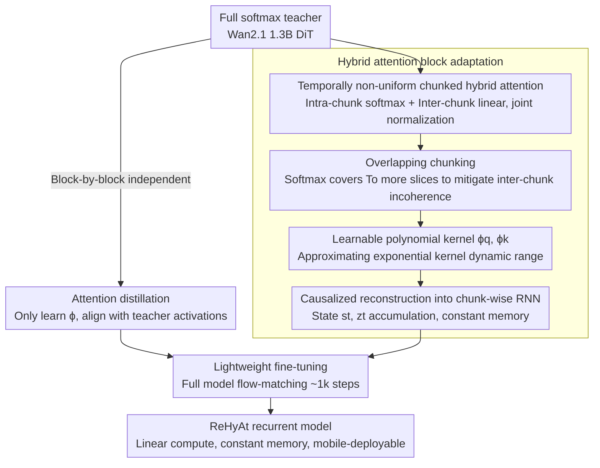

# ReHyAt: Recurrent Hybrid Attention for Video Diffusion Transformers

**Conference**: CVPR 2026  
**Paper**: [CVF Open Access](https://openaccess.thecvf.com/content/CVPR2026/html/Ghafoorian_ReHyAt_Recurrent_Hybrid_Attention_for_Video_Diffusion_Transformers_CVPR_2026_paper.html)  
**Code**: None  
**Area**: Video Generation / Diffusion Models / Efficient Attention  
**Keywords**: Video Diffusion, Linear Attention, Hybrid Attention, Recurrent Reconstruction, Attention Distillation

## TL;DR
ReHyAt converts the $O(N^2)$ full softmax attention in video diffusion Transformers into a temporally chunked hybrid attention ("intra-chunk softmax + inter-chunk linear") and causally reconstructs it into a chunk-wise RNN (constant memory, linear complexity). Using a two-stage pipeline of "attention distillation + lightweight fine-tuning," it transforms Wan2.1 1.3B into an equivalent-quality, mobile-friendly recurrent model capable of generating long videos, in approximately 160 GPU hours.

## Background & Motivation
**Background**: Currently, the strongest video generation models (e.g., Wan2.1, CogVideoX, HunyuanVideo, Open-Sora Plan) have largely transitioned from U-Net to Diffusion Transformers (DiT). These models treat videos as spatiotemporal patch sequences, capturing global context starting from the very first layer, which yields superior quality and scalability.

**Limitations of Prior Work**: The self-attention in DiT incurs a quadratic complexity of time $O(N^2 d)$ and memory $O(N^2)$ with respect to sequence length. The token count $N$ of a video is the product of temporal length and spatial patch count. Even for moderate resolutions and durations, $N$ can easily reach tens of thousands, with attention consuming the vast majority of compute in the DiT block. IO optimizations like FlashAttention only scale down the constant factor without solving the fundamental quadratic dependence on $N$. Consequently, generating videos longer than 10 seconds is challenging under typical GPU memory and latency budgets, and mobile deployment is nearly impossible for even a few seconds.

**Key Challenge**: Linear attention can reduce the complexity to linear and can be reconstructed into an RNN (constant memory) when causalized, making it naturally suited for generating long videos chunk by chunk. However, its kernel function represents features far less effectively than the exponential kernel of softmax, resulting in decreased activation diversity and weak modeling of fine-grained dependencies, which typically requires intensive retraining to become viable. Existing hybrid attention methods (such as Attention Surgery) do regain quality, but they still retain quadratic complexity and cannot be restructured as an RNN. Thus, high quality and "linear complexity with constant memory" have been difficult to achieve simultaneously.

**Goal**: (1) To design a hybrid attention mechanism that maintains the high fidelity of softmax while achieving linear compute and constant memory. (2) Instead of training from scratch, to "distill" an existing SOTA full-softmax bi-directional model into this efficient recurrent format, capping the training cost at several hundred GPU hours.

**Key Insight**: The authors observe that the tokens genuinely requiring high-fidelity softmax modeling are a tightly localized subset of highly interdependent tokens between adjacent frames. Long-range dependencies can be sufficiently approximated by linear attention. Therefore, instead of treating all tokens equally, one can perform a **temporally non-uniform** attention allocation.

**Core Idea**: The sequence is temporally split into chunks, performing **intra-chunk softmax and inter-chunk linear** attention, followed by joint normalization. By temporally decoupling the chunks, the system can be causalized into a chunk-wise RNN to achieve linear compute and constant memory. Finally, distillation is applied to transfer the softmax dependencies of Wan2.1 into the linear kernels, preserving the model quality.

## Method

### Overall Architecture
Instead of training a new model from scratch, ReHyAt performs "attention surgery" on an existing bi-directional, full-softmax teacher (Wan2.1 1.3B). The input consists of several DiT blocks of the teacher model, and the output is a student model with some blocks (15, 20, or 25 out of 30 blocks) replaced by recurrent hybrid attention. The pipeline operates in two stages:
First, **attention distillation** is performed, which is trained block-by-block independently. In this step, only the linear kernel feature maps $\phi_q, \phi_k$ of each block are learned, aligning the output of the hybrid attention with the activation of the teacher's softmax attention.
Second, **lightweight fine-tuning** is executed, where the entire DiT is fine-tuned for approximately 1k steps using a flow-matching objective on a small set of prompt/video pairs to smooth out transition artifacts between chunks caused by the independent block-wise distillation.
During inference, the trained causal model is reformed into a chunk-wise RNN, generating one temporal chunk ($T_c$ temporal steps) at a time, keeping memory constant.

The core of the hybrid attention lies in chunking, allocating softmax vs. linear attention, and causalization:

### Key Designs

**1. Temporally non-uniform chunked hybrid attention: Preserving local high fidelity at minimum cost**

Pure linear attention has weak modeling of fine-grained dependencies, while pure softmax is too costly. ReHyAt segments tokens along the temporal dimension, dynamically treating different tokens differently. The $N = THW$ tokens are rearranged temporally into $T'$ chunks, each containing $N' = T_c HW$ tokens. For the queries in the $t$-th chunk, the keys and values to attend to are partitioned into two groups: the intra-chunk token set $\mathcal{T}^S_t = \{j \mid tN' \le j < (t+1)N'\}$ which undergoes **softmax** attention, and the out-of-chunk token set $\mathcal{T}^L_t = \mathcal{T} - \mathcal{T}^S_t$ which undergoes **linear** attention. The outputs from both branches (carrying numerator and denominator) are **jointly normalized**:

$$\hat{y}_t=\frac{a^S_t+a^L_t}{n^S_t+n^L_t}$$

where the softmax branch $a^S_t=\sum_{j\in\mathcal{T}^S_t}\exp(Q_t k_j^\top/\sqrt{D}-c_t)v_j$ uses a standard exponential kernel with a stabilizing constant $c_t$; the linear branch $a^L_t=\phi_q(Q_t)\big(\sum_{j\in\mathcal{T}^L_t}\phi_k(k_j)v_j^\top\big)$ factors the summation outside of the query multiplication, allowing for reusable caching. This temporally non-uniform distribution is a key differentiator from the uniform temporal mixing of Attention Surgery: it provides a more suitable inductive bias for video generation by concentrating expensive softmax computations on tokens within the same temporal chunk (highly interdependent localized features) while assigning all other long-range context to linear attention, thereby bringing down overall complexity to linear.

**2. Overlapping chunking: Preventing motion and appearance "fragmentation" between adjacent chunks**

Non-overlapping chunking incurs a side effect: at chunk boundaries, because the out-of-chunk tokens are modelled only via low-fidelity linear attention, motion or appearance can exhibit "episodic incoherence," where chunks do not seamlessly connect. ReHyAt fixes this directly by letting the softmax branch keys/values cover an additional $T_o$ temporal slices of the previous chunk. That is, while queries are still chunked by $T_c$, the attended tokens span $T_c + T_o$, changing the softmax set to $\mathcal{T}^S_t=\{j\mid \max(tN'-T_oHW,0)\le j<(t{+}1)N'\}$. Consequently, chunk boundaries are bridged by the high-fidelity softmax, correcting cross-chunk message passing. Ablation tests show that when increasing $T_o$ from 0 to 1, subject consistency jumps from 90.90 to 92.05, validating the enhancement in temporal coherence across chunks.

**3. Learnable polynomial kernel feature map $\phi$: Compensating for linear attention's representational weakness**

The fundamental bottleneck of linear attention is that the kernel function $\phi(q)\phi(k)^\top$ is less expressive than the exponential kernel $e^{qk^\top}$. A fixed mapping like the original $\phi(x)=1+\mathrm{elu}(x)$ has a limited dynamic range. ReHyAt proposes a **learnable feature map with polynomial expansion** for $\phi_q, \phi_k: \mathbb{R}^D \to \mathbb{R}^{D'}$. First, it uses a lightweight per-head embedding network (grouped $1 \times 1$ convolutions + non-linearity) to compute intermediate representations, then splits them into $P$ equal parts, raising the $i$-th partition to the power of $i$ before concatenation:

$$\phi(x)=\big[(\psi_1(x))^1,(\psi_2(x))^2,\dots,(\psi_P(x))^P\big]^\top$$

Overlaying polynomial features of varying degrees allows the linear branch to better approximate the high dynamic range of the exponential kernel, effectively reconstructing softmax dependencies. Analysis indicates that a 2-layer MLP paired with a degree-2 polynomial is sufficient, adding only about 2.4M parameters per converted block.

**4. Causalized reconstruction into chunk-wise RNN: Constant memory as the key to long video and mobile deployment**

A hybrid attention mechanism alone is not enough; achieving "constant memory + arbitrarily long video generation" requires reconstruction into an RNN, which in turn demands causal attention. ReHyAt shrinks the linear branch's search space to only look at earlier chunks, $\mathcal{T}^L_t=\{j\mid j<\max(tN'-T_oHW,0)\}$ (eliminating non-causal linear attention looking forward), while keeping the softmax branch strictly inside the current chunk (no intra-chunk causal constraint is needed since sampling computes the current chunk in one pass). Consequently, the outer-chunk linear contribution can be expressed as state variables recurrently accumulated along chunks: $s_t\in\mathbb{R}^{D'\times D}$, $z_t\in\mathbb{R}^{D'\times1}$:

$$y_t=\frac{a^S_t+\phi_q(Q_t)s_t}{n^S_t+\phi_q(Q_t)z_t},\quad s_{t+1}=s_t+\sum_{j\in\mathcal{T}^S_t}\phi_k(k_j)v_j^\top,\quad z_{t+1}=z_t+\sum_{j\in\mathcal{T}^S_t}\phi_k(k_j)$$

Because states simply accumulate $\phi_k v^\top$ from previous chunks, the computational cost scales linearly $O(N)$ with video length while peak memory remains constant. Crucially, training can be performed in a non-recursive causal manner, and reorganized into an RNN during inference since the two forms are equivalent. The ablation study (Table 8) demonstrates that discarding non-causal dependencies yields negligible changes in VBench (82.27 vs. 82.35) and saves little Flops. Thus, the true value of causalization is not the compute saving, but rather unlocking the RNN temporal format with a constant peak memory, which forms the foundation of generating videos longer than 10 seconds on mobile devices.

**5. Two-stage training: Distillation + fine-tuning to compress a million-GPU-hour teacher into hundreds of GPU hours**

Training state-of-the-art video diffusion models from scratch is prohibitively expensive. ReHyAt sidesteps this by distilling a pre-trained teacher.  
**Stage 1: Attention Distillation**: Blocks are trained independently, with only the $\phi_q, \phi_k$ parameter sets unfrozen. The goal is to align the student's hybrid attention outputs with the teacher's softmax activations:

$$\phi_l\leftarrow\phi_l-\eta\nabla_{\phi_l}\Big(\mathbb{E}_{\epsilon,p,i}\,\lVert y_{(l,\epsilon,p,i)}-\hat{y}_{(l,\epsilon,p,i)}\rVert\Big)$$

across different prompts $p$, noise levels $\epsilon$, and denoising steps $i$. This stage **does not require any paired prompt/video data**, as only teacher activations are needed.  
**Stage 2: Lightweight Fine-Tuning**: Because block-wise independent distillation might yield sub-optimal transitioning across blocks (specifically in terms of generation smoothness), the entire DiT is fine-tuned for roughly 1k steps using a standard flow-matching objective on a small set of prompt/video pairs to recover any lost quality. This entire recipe reduces the transformation cost to about 160 H100 GPU hours—less than 1% of SANA-Video's and under 0.01% of MovieGen's training budgets.

### Loss & Training
- **Distillation Loss**: Block-by-block activation matching via L1/norm error (Eq. 19), optimizing only $\phi_q$ and $\phi_k$, requiring no paired data.
- **Fine-tuning Loss**: Standard flow-matching objective over the entire model for approximately 1k steps.
- **Data**: Low-resolution fine-tuning uses a 350K subset from Open-Sora Plan; high-resolution utilizes 22K videos synthesized via Wan2.1 14B.
- **Key Hyperparameters**: Number of converted blocks $\in \{15, 20, 25\}$, chunk size $T_c \in \{1, 2, 3, 5, 7\}$, overlap $T_o\in \{0, 1, 2, 3\}$. $\phi$ uses a 2-layer MLP with a degree-2 polynomial, adding approximately 2.4M parameters per block.

## Key Experimental Results

### Main Results
Based on Wan2.1 1.3B distillation, evaluated on VBench and VBench-2.0 compared with SOTA efficient video diffusion models (using the original resolution and duration of $81 \times 480 \times 832$).

| Model | Parameter Scale | VBench Total↑ | Quality↑ | Semantic↑ |
|------|--------|---------------|----------|-----------|
| Wan2.1 1.3B (Teacher) | $\le$2B | 83.31 | 85.23 | 75.65 |
| SANA-Video | Linear/Hybrid | 83.71 | 84.35 | **81.35** |
| Attention Surgery (15×R2) | Hybrid (Quadratic) | 83.21 | 85.19 | 75.25 |
| M4V (Distilled Mamba) | Linear | 81.91 | 83.36 | 76.10 |
| **ReHyAt 15×($T_c{=}3,T_o{=}1$)** | Recurrent Hybrid | **83.79** | 84.57 | 80.70 |

ReHyAt's VBench Total outperforms the teacher (83.79 vs. 83.10 reproduced) and SANA-Video, whilst being the only model capable of restructuring into an RNN for mobile deployment. Training took only about 160 GPU hours (< 1% of SANA-Video).

On VBench-2.0, ReHyAt 15×$T_c{=}5$ achieves a 56.3 Total, surpassing Wan2.1 1.3B (56.0) and CogVideoX-1.5 5B (53.4). A human preference study (500 blind test pairs) showed no significant difference compared to the original Wan2.1 (27.6% preferred ReHyAt, 43.5% had no preference, and 29.0% preferred Wan2.1).

Efficiency-wise: on 5-second videos, ReHyAt saves up to approximately $4\times$ FLOPs compared to FlashAttention. On a Snapdragon 8 Gen4-powered mobile device with 121 frames, the latency is approximately $16\times$ faster than FlashAttention, with peak read/write memory reduced by about $11\times$, making it the only method capable of stably scale to >10 seconds without OOM.

### Ablation Study

| Configuration | VBench Total | Description |
|------|-------------|------|
| $T_c{=}1$ | 80.97 | Intra-chunk softmax degrades to spatial-only |
| $T_c{=}2$ | 82.08 | Softmax expands from spatial to spatiotemporal, yielding the largest gain |
| $T_c{=}3$ | 82.17 | Continued scaling exhibits diminishing returns |
| $T_c{=}5$ | 82.48 | Higher quality but at the expense of more compute |
| $T_o{=}0$ | 81.56 / Subj.Cons. 90.90 | No overlap; prone to inter-chunk incoherence |
| $T_o{=}1$ | 82.17 / Subj.Cons. 92.05 | Visual consistency jumps significantly with overlap enabled |
| Non-causal | 82.27 | VBench remains nearly on par with the causal variant |
| Causal | 82.35 | Quality is preserved while unlocking the RNN format and constant memory |

### Key Findings
- **Chunk size $T_c$**: The jump from 1 to 2 yields the largest improvement (extending softmax from purely spatial to spatiotemporal), with diminishing returns thereafter—suggesting that "highly interdependent adjacent frames" is where softmax computes should be prioritized.
- **Overlap $T_o$**: Increasing $T_o$ from 0 to 1 brings a noticeable leap in both Total score and subject consistency, after which it saturates. Overlapping is the key mechanism for suppressing inter-chunk temporal incoherence.
- **Causalization**: It barely degrades quality and saves little compute by itself. However, it is the absolute prerequisite for RNN restructuring (constant peak memory, allowing long video generation on mobile)—which represents its true value.

## Highlights & Insights
- **"Temporally non-uniform" is the core insight**: Rather than treating all tokens uniformly, expensive softmax is precisely allocated to highly interdependent tokens in the same temporal chunk, with all other tokens assigned to linear attention. This provides a better-suited inductive bias for video generation than Attention Surgery's "temporally uniform hybrid attention," while simultaneously achieving linear complexity.
- **"Distillation over retraining" slashes costs by orders of magnitude**: The attention distillation stage only fits $\phi$ and **requires no paired data**, retaining the block structures of the teacher. This allows converting a million-GPU-hour SOTA model to an efficient RNN in only ~160 GPU hours, presenting a highly reusable recipe for future bi-directional softmax models.
- **Honest and sober reasoning for causalization**: The authors clarify that causalization itself does not save much compute, nor does it affect quality; rather, its sole purpose is enabling the RNN format for a constant peak memory footprint—a must-have for deploying on mobile and scaling beyond 10 seconds.

## Limitations & Future Work
- The authors acknowledge that despite overall strength, the most efficient variant still occasionally exhibits temporal incoherence in a few video outputs, presenting an area for future improvement.
- Our observation: Validation is primarily conducted on a single teacher (Wan2.1 1.3B); its generalizability to larger models or other architectures remains to be empirically tested. Out of 30 blocks, only 15-25 are converted, meaning end-to-end complexity is still bound by the remaining full softmax blocks.
- On VBench-2.0, there remains a slight gap compared to the strongest large-scale models. Distillation requires running the teacher to obtain activations, which is inapplicable to entirely closed-source models.
- Future directions: Pushing the conversion ratio closer to 100% of all blocks, or considering inter-chunk transition constraints directly during distillation, might further alleviate residual temporal incoherence.

## Related Work & Insights
- **vs SANA-Video**: Both target efficient attention but SANA-Video is pure linear attention trained from scratch (64×H100 for 12 days). ReHyAt is hybrid (local softmax + long-range linear) and distilled from a SOTA teacher, slashing training costs by orders of magnitude while preserving higher quality.
- **vs Attention Surgery**: Both are hybrid attention mechanisms, but Attention Surgery performs temporally uniform hybrid attention, retaining quadratic complexity and inability to reconstruct as RNN. ReHyAt is temporally non-uniform and causalizable to RNN, gaining linear complexity and constant memory, and recording higher scores on VBench-2.0 (56.x vs 55.1).
- **vs M4V (Distilled Mamba)**: M4V distills DiT into Mamba blocks, causing massive architectural shifts; ReHyAt maintains the original block architecture, making distillation more cost-efficient and stable, with superior quality and efficiency.

## Rating
- Novelty: ⭐⭐⭐⭐ The combination of "temporally non-uniform mixture + RNN causalization" represents a substantial improvement over existing hybrid/linear attention methods, hitting the inductive bias sweet spot.
- Experimental Thoroughness: ⭐⭐⭐⭐ Strong coverage of VBench, VBench-2.0, human preference, FLOPs, and mobile latency/memory. Comprehensive $T_c/T_o$/causalization ablations, though tested on a single teacher model.
- Writing Quality: ⭐⭐⭐⭐ Clear motivation logical chain; robust mathematical formulation and causal derivations; honest reflection on the true value of causalization.
- Value: ⭐⭐⭐⭐⭐ Provides a highly reusable recipe to convert SOTA softmax video models to mobile-friendly, long-range efficient models at a very low budget. High practical/engineering value.

<!-- RELATED:START -->

## Related Papers

- [\[CVPR 2026\] Attention Surgery: An Efficient Recipe to Linearize Your Video Diffusion Transformer](attention_surgery_an_efficient_recipe_to_linearize_your_video_diffusion_transfor.md)
- [\[CVPR 2026\] VMonarch: Efficient Video Diffusion Transformers with Structured Attention](vmonarch_efficient_video_diffusion_transformers_with_structured_attention.md)
- [\[CVPR 2026\] RAPID: Reusing Attention Sparsity with Inter-step Adaptation for Efficient Video Diffusion](rapid_reusing_attention_sparsity_with_inter-step_adaptation_for_efficient_video_.md)
- [\[CVPR 2026\] Towards Holistic Modeling for Video Frame Interpolation with Auto-regressive Diffusion Transformers](towards_holistic_modeling_for_video_frame_interpolation_with_auto-regressive_dif.md)
- [\[CVPR 2026\] DisCa: Accelerating Video Diffusion Transformers with Distillation-Compatible Learnable Feature Caching](disca_accelerating_video_diffusion_transformers_wi.md)

<!-- RELATED:END -->
