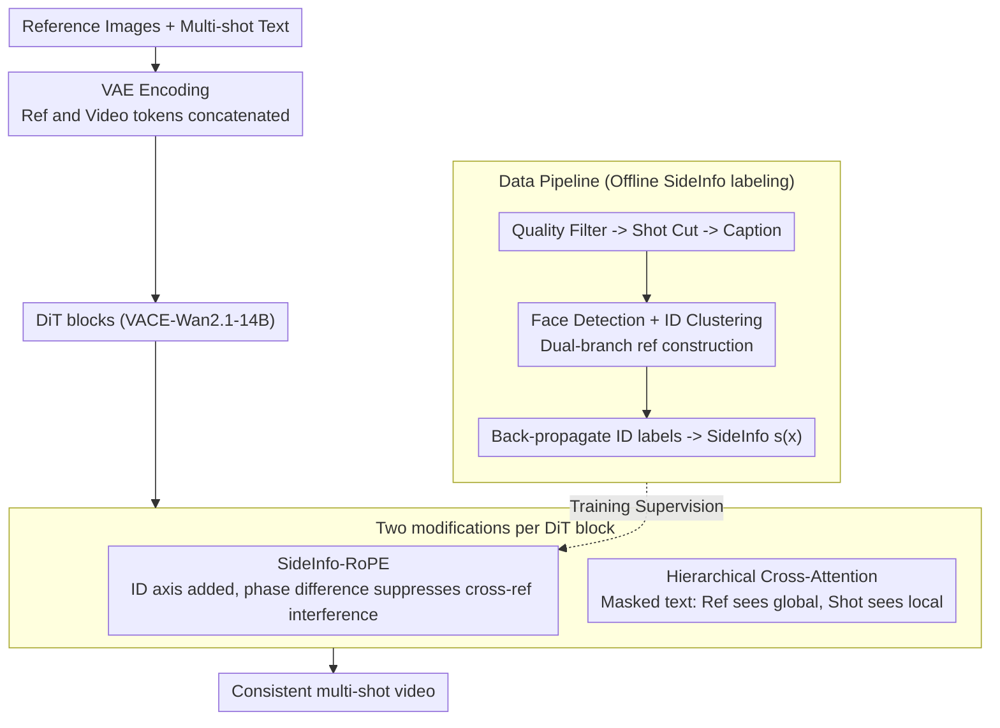

# Rethinking Position Embedding as a Context Controller for Multi-Reference and Multi-Shot Video Generation

**Conference**: CVPR 2026  
**arXiv**: [2604.03738](https://arxiv.org/abs/2604.03738)  
**Code**: [https://poco-multiref-multishot.github.io/](https://poco-multiref-multishot.github.io/)  
**Area**: Video Generation / Diffusion Models / Multi-Reference Multi-Shot Generation  
**Keywords**: Position Embedding, Context Control, Multi-Reference Video Generation, RoPE, Identity Confusion

## TL;DR

PoCo (Position Embedding as Context Controller) is proposed to address "reference confusion" in multi-reference multi-shot video generation—where models fail to correctly associate shots with references when reference images have highly similar appearances. By encoding additional SideInfo axes in RoPE to represent reference entity information, the method achieves SOTA cross-shot consistency on the VACE-Wan2.1-14B framework (CrossShot-FaceSim 89.35, CrossShot-DINO 92.66).

## Background & Motivation

1.  **Background**: Video generation has made rapid progress in text-to-video and reference-to-video tasks. Multi-reference multi-shot video generation is crucial for film production and narrative videos, yet research in this area remains limited (closed-source systems like Sora2 demonstrate possibilities but remain opaque).
2.  **Limitations of Prior Work**:
    *   Existing reference-to-video methods (Phantom, VACE) mostly generate shots independently, leading to inconsistent backgrounds and appearances across shots.
    *   "Naive" schemes that directly concatenate multi-reference and multi-shot tokens into attention suffer from **reference confusion**—when multiple references look similar, semantically similar tokens prevent the model from distinguishing the correct shot-reference associations.
    *   Attention visualization confirms this issue: a shot may assign higher attention weights to an incorrect reference than the correct one.
3.  **Key Challenge**: There is a fundamental tension between maintaining scene-level semantic consistency across multiple shots (requiring global attention interaction) and faithfully maintaining distinct reference identities (requiring precise reference association).
4.  **Goal**: (1) Solve the confusion issue among semantically similar references; (2) achieve precise context control without introducing additional computational overhead.
5.  **Key Insight**: Re-examining the attention mechanism by decomposing it into "semantics-driven learnable components" (Q-K retrieval) and "manually designed position embedding components" (organizing context)—the latter can serve as an additional means of context control.
6.  **Core Idea**: Encode auxiliary attribute information of tokens (e.g., @character_i identifiers) as extra rotation dimensions in RoPE, allowing position embeddings to undertake precise context routing "beyond semantics."

## Method

### Overall Architecture

PoCo addresses "reference confusion" in multi-reference multi-shot video generation. When tokens from multiple reference images and multiple shots are concatenated into attention, the model struggles to distinguish which shot corresponds to which reference if references appear similar. The authors posit that this should not be fixed by modifying the attention architecture, but rather by leveraging the "manually designed" RoPE channel, which has the capacity for additional context routing.

The pipeline is built on VACE-Wan2.1-14B. Reference images are first encoded into tokens via VAE, concatenated with video tokens to be generated, and fed into DiT blocks. In each block, Self-Attention uses SideInfo-RoPE, and Cross-Attention is replaced with a hierarchical version. Training and inference are unified under a 9s / 480p / 16fps setup with two references. Only two modifications are made—adding an axis to the position embedding and using a mask for text conditions—while the rest of the framework remains unchanged. The SideInfo identity labels required for these changes are automatically extracted from raw long videos using an offline data pipeline.

### Key Designs

**1. SideInfo-RoPE: Adding a "Reference Identity" axis to Position Embedding to naturally suppress cross-reference interference via phase difference**

Confusion stems from similar reference token semantics, which the learnable Q-K retrieval channel cannot override. The authors circumvent this by modifying the fixed position embedding side. Standard 3D-RoPE coordinates are $\mathbf{p}=(t,h,w)$; PoCo extends this to $\mathbf{p}^*=(t,h,w,s)$, where the new $s$ specifically encodes "which reference entity this token belongs to." Specifically, each visual token $\mathbf{x}$ is assigned a side information vector $\mathbf{s}(\mathbf{x})\in\{0,1\}^K$, where $s_i(\mathbf{x})=1$ indicates the shot contains reference $i$. The SideInfo distance between two tokens is the bitwise difference:

$$\Delta_{m,n}^s = |\mathbf{s}(\mathbf{x}_m) - \mathbf{s}(\mathbf{x}_n)|.$$

Within the $D$ dimensions of RoPE, $D_s = 2K$ dimensions are allocated to this axis, with each reference $i$ corresponding to a 2×2 rotation block $\hat{\mathbf{R}}^{(i)}_{\Delta^s_{m,n}}$. The key is determining the rotation phase: since SideInfo values are restricted to {0,1} and the range is much smaller than $(t,h,w)$, the authors discretize the phase uniformly over a $2\pi$ period, using $\phi_i=\frac{2\pi i-\pi}{K}$ for reference $i$. Consequently, if two tokens share the same SideInfo ($\Delta^s=0$), no rotation occurs, phases align, and attention is not suppressed. If identities differ ($\Delta^s\neq0$), a phase shift is rotated in, causing their inner product to decay—thus "physically" suppressing incorrect shot-reference associations. For example, in a two-reference setup: if Shot A is labeled with Reference 1 and Shot B with Reference 2, when a token from A looks at a token from B, $\Delta^s\neq0$ triggers a phase shift and weakens attention; meanwhile, within A and between A and Reference 1, $\Delta^s=0$ maintains full phase, preserving correct associations. This mechanism requires zero extra parameters and zero extra computation, merely modifying coordinates.

**2. Hierarchical Cross-Attention: References see global info while shots see local info, partitioning text conditions via a mask**

Text conditions also face a tension between global and local needs—references require the entire narrative to provide consistent identity and style, while each shot should only follow its own description to avoid cross-shot "flavor" contamination. PoCo uses a binary mask $\mathbf{M}\in\{0,1\}^{L_v\times L_t}$ to separate these: reference image tokens have access to all text tokens ($\mathbf{M}[1:L_{ref},1:L_t]=1$), providing global identity and style guidance across shots; conversely, video tokens of the $s$-th shot only attend to the corresponding text segment $\mathcal{T}_s$ ($\mathbf{M}[\mathcal{V}_s,\mathcal{T}_s]=1$, $\mathbf{M}[\mathcal{V}_s,\mathcal{T}_{s'\neq s}]=0$), ensuring local conditions remain uncontaminated. This one-global-one-local approach perfectly maps to the "consistent identity, independent content" requirement.

**3. Data Pipeline: Automatically extracting multi-shot samples with SideInfo labels from raw long videos**

High-quality multi-reference multi-shot training data is scarce, and SideInfo supervision is absent from existing datasets. A two-stage pipeline is used: the video processing stage performs quality filtering (VQA, sharpness, exposure), followed by AutoShot + PySceneDetect for shot cutting, OCR for watermark removal, MLLM for captioning, and merging adjacent clips. The reference construction stage performs face detection and ID clustering, keeping only identities that appear frequently enough, and prepares two types of references for each ID—raw crops and SeedReam-enhanced frontal portraits—to make identity conditioning robust. Finally, the clustered ID labels are back-propagated to corresponding shots, serving as the $\mathbf{s}(\mathbf{x})$ supervision required for training SideInfo-RoPE.

### Loss & Training

*   Standard diffusion training based on the VACE-Wan2.1-14B framework.
*   Learning rate: 1e-5.
*   4 channels allocated to the SideInfo axis (corresponding to 2 SideInfo rotation planes in a two-reference setup).
*   Channels are reallocated from low-frequency temporal channels (T-low outperformed T-high).

## Key Experimental Results

### Main Results

| Method | Type | CrossShot-FaceSim ↑ | CrossShot-DINO ↑ | FaceSim ↑ | AvgScore ↑ |
| :--- | :--- | :--- | :--- | :--- | :--- |
| Phantom-14B | Single-shot | 86.12 | 73.24 | 72.75 | 80.72 |
| VACE-14B | Single-shot | 69.49 | 67.30 | 67.05 | 75.56 |
| EchoShot | Multi-shot | 87.05 | 79.81 | N/A | 83.82* |
| **PoCo (Ours)** | Multi-shot | **89.35** | **92.66** | 70.12 | **83.46** |

*AvgScore for EchoShot is w/o Alignment-FaceSim.

### Ablation Study

**Ablation of SideInfo-RoPE Channel Selection**

| Configuration | CrossShot-FaceSim ↑ | CrossShot-DINO ↑ | FaceSim ↑ |
| :--- | :--- | :--- | :--- |
| w/o SideInfo-RoPE | 77.29 | 91.25 | 45.42 |
| w/ SideInfo-RoPE-Tlow | **81.55** | **91.32** | **60.35** |
| w/ SideInfo-RoPE-Thigh | 80.96 | 91.32 | 55.54 |

### Key Findings

*   **Significant gains from SideInfo-RoPE**: FaceSim increased from 45.42 to 60.35 (+14.93), and CrossShot-FaceSim from 77.29 to 81.55 (+4.26), proving that reference confusion is a severe issue.
*   **Low-frequency temporal channels are better for SideInfo**: T-low outperformed T-high (FaceSim 60.35 vs 55.54); high-frequency channels model rapid temporal changes, and reallocation leads to motion artifacts.
*   **PoCo leads significantly in CrossShot-DINO** (92.66 vs Phantom's 73.24), indicating that joint multi-shot generation is far superior to independent generation in terms of background semantic consistency.
*   Qualitative comparisons with commercial systems Kling-1.6 and Vidu-Q2 show PoCo is superior in cross-shot scene layout, lighting, and fine appearance consistency.
*   Even compared to VACE-14B (the base of PoCo), PoCo improves single-shot FaceSim (67.05→70.12).

## Highlights & Insights

*   **Reinterpreting position embedding as a context controller** is an elegant insight: without modifying the attention architecture or adding extra modules, precise reference routing is achieved by adding a single axis to RoPE. This incurs zero extra computational overhead and maintains full context connectivity.
*   The **binary design of SideInfo distance** is simple yet clever—whether a reference appears is a natural binary attribute that fits perfectly with the rotation mechanism of RoPE.
*   The **complete design of the data pipeline** (VQA filtering → shot cutting → ID clustering → dual-branch reference construction → SideInfo annotation) is a valuable engineering contribution, providing a replicable workflow for constructing multi-reference multi-shot training data.

## Limitations & Future Work

*   Currently primarily addresses cross-shot reference confusion; fine-grained control for **multiple similar individuals within a single shot** (e.g., precise action binding, close interaction) remains limited.
*   Only tested on two-reference setups; whether increasing K (leading to more SideInfo rotation planes) affects performance in other dimensions needs verification.
*   The evaluation set is relatively small (54 shots/18 videos/9 pairs of references), which may imply limited statistical significance.
*   Dynamic SideInfo (e.g., characters entering/exiting between shots) has not been explored.
*   Alignment-FaceSim (70.12) is slightly lower than Phantom-14B (72.75), suggesting that joint multi-shot generation still incurs a minor cost in single-shot reference fidelity.

## Related Work & Insights

*   **vs EchoShot**: EchoShot introduces TcRoPE/TaRoPE to handle multi-shot temporal and caption alignment but does not directly encode reference identity; PoCo's SideInfo-RoPE addresses identity association more directly (CrossShot-FaceSim +2.30).
*   **vs Phantom**: Phantom uses VAE latent + CLIP semantics for reference injection, but independent shot generation leads to cross-shot inconsistency (DINO 73.24 vs 92.66).
*   **vs "Context as Memory"**: Whereas those methods use external retrieval modules to fetch relevant frames, PoCo removes the need for external retrieval and controls context directly within attention via position embeddings.

## Rating

*   Novelty: ⭐⭐⭐⭐⭐ The core idea of reframing position embedding as a context controller is novel and elegant; the SideInfo-RoPE design is simple and effective.
*   Experimental Thoroughness: ⭐⭐⭐⭐ Quantitative and qualitative experiments are sufficient, including comparisons with commercial systems, though the evaluation set size is small.
*   Writing Quality: ⭐⭐⭐⭐⭐ Problem definition is precise, the derivation from attention decomposition to SideInfo-RoPE is logical, and illustrations are intuitive.
*   Value: ⭐⭐⭐⭐⭐ Multi-reference multi-shot generation is a key bottleneck in video generation; PoCo provides a zero-overhead solution with high generalizability.

<!-- RELATED:START -->

## Related Papers

- [\[CVPR 2026\] MultiShotMaster: A Controllable Multi-Shot Video Generation Framework](multishotmaster_a_controllable_multi-shot_video_generation_framework.md)
- [\[CVPR 2026\] OneStory: Coherent Multi-Shot Video Generation with Adaptive Memory](onestory_coherent_multi-shot_video_generation_with_adaptive_memory.md)
- [\[CVPR 2026\] STAGE: Storyboard-Anchored Generation for Cinematic Multi-shot Narrative](stage_storyboard-anchored_generation_for_cinematic_multi-shot_narrative.md)
- [\[CVPR 2026\] HoloCine: Holistic Generation of Cinematic Multi-Shot Long Video Narratives](holocine_holistic_generation_of_cinematic_multi-shot_long_video_narratives.md)
- [\[CVPR 2026\] ShotDirector: Directorially Controllable Multi-Shot Video Generation with Cinematographic Transitions](shotdirector_directorially_controllable_multi-shot_video_generation_with_cinemat.md)

<!-- RELATED:END -->
