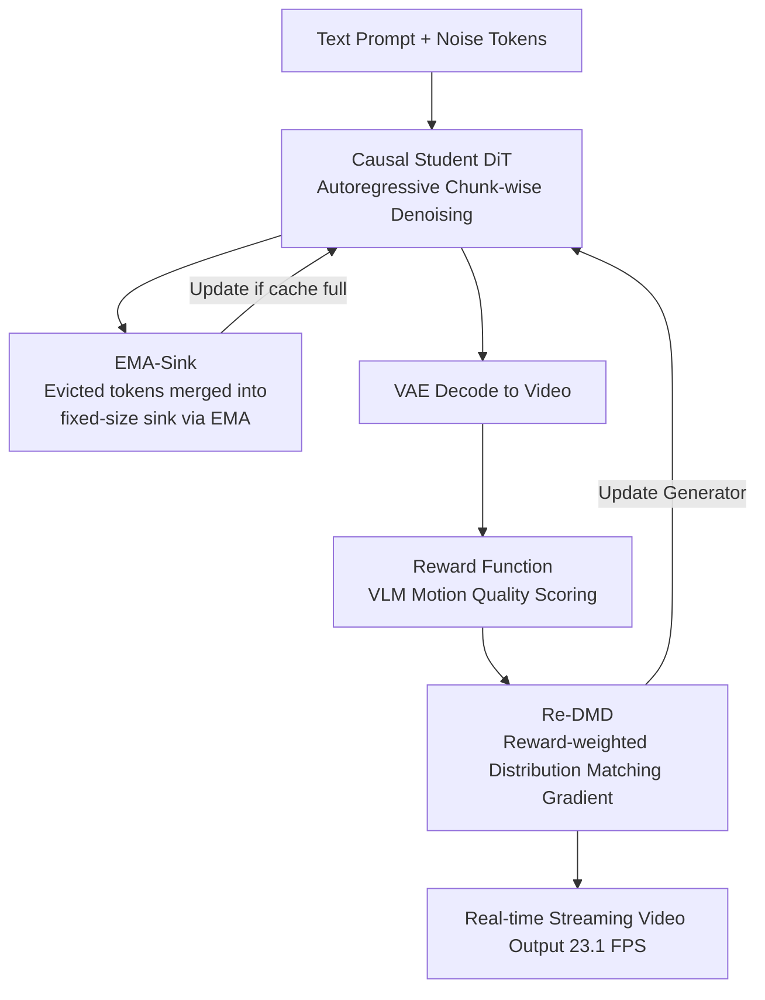

# Reward Forcing: Efficient Streaming Video Generation with Rewarded Distribution Matching Distillation

**Conference**: CVPR 2026  
**Paper**: [CVF Open Access](https://openaccess.thecvf.com/content/CVPR2026/html/Lu_Reward_Forcing_Efficient_Streaming_Video_Generation_with_Rewarded_Distribution_Matching_CVPR_2026_paper.html)  
**Code**: [Project Page reward-forcing.github.io](https://reward-forcing.github.io/)  
**Area**: Video Generation / Diffusion Models  
**Keywords**: Streaming Video Generation, Distillation, Attention Sink, Distribution Matching, Reinforcement Learning Reward  

## TL;DR
Reward Forcing distills bidirectional video diffusion models into few-step autoregressive student models. It employs EMA-Sink to compress historical context, preventing "frame copying," and utilizes Re-DMD to bias distribution matching gradients toward high-dynamic samples based on motion quality rewards. It achieves high-quality real-time streaming video generation at 23.1 FPS on a single H100, outperforming all same-scale baselines in VBench total scores.

## Background & Motivation

**Background**: Video Diffusion Transformers (DiT) generate high-quality short videos via joint denoising with bidirectional attention across all frames. However, they cannot meet the requirements of "generate-while-playing, infinitely extendable" streaming scenarios. Predominant approaches distill slow bidirectional diffusion models into few-step autoregressive student models: each frame only attends to preceding frames via a **sliding window attention**, utilizing KV cache for real-time inference (e.g., CausVid, Self Forcing, LongLive, Rolling Forcing).

**Limitations of Prior Work**: Autoregressive generation suffers from the notorious **error accumulation** problem—each frame depends on potentially corrupted prior outputs, causing errors to propagate. To mitigate drift, recent works introduce **attention sinks**, keeping the initial tokens permanently in the KV cache as anchors. While this stabilizes long-range attention, it causes the model to **over-rely on initial frames**, leading to rapid decay in motion magnitude where subsequent frames fail to evolve naturally or even frequently "flash back" to the first frame (frame copying/freezing).

**Key Challenge**: ① Sink tokens are **static**, compressing only the "initial" context while losing recent dynamics of intermediate frames, thus hijacking attention toward the starting frame; ② Classic Distribution Matching Distillation (DMD) **treats all samples equally**, while motion-degraded samples, despite poor dynamics, often have high visual quality and fall near the teacher distribution, making them difficult to distinguish and optimize. Consequently, standard DMD cannot resolve the "over-focus on initial frames" issue. A trade-off persists between low latency and high dynamic fidelity.

**Goal**: Achieve high visual fidelity and high motion dynamics simultaneously while maintaining real-time streaming inference. This is decomposed into two sub-problems: (a) How to retain global context while injecting recent dynamics within a fixed window; (b) How to "favor" high-dynamic samples during distillation without compromising visual quality.

**Key Insight**: Since static sink tokens cause issues, they should be **dynamically updated**—using Exponential Moving Average (EMA) to continuously merge evicted tokens into a fixed-size sink, preserving both long-term memory and recent dynamics. Since uniform DMD fails to learn dynamics, RL rewards are introduced to weight distribution matching gradients by motion quality.

**Core Idea**: Replace "static sinks" with "updating EMA-Sinks" to break the information bottleneck, and replace "uniform DMD" with "reward-weighted Re-DMD" to pull the output distribution toward high-dynamic regions.

## Method

### Overall Architecture
Reward Forcing generates streaming text-to-video autoregressively by chunks (following the self-rollout of Self Forcing to bridge the train-test gap). Noisy tokens of the current stream are projected into new KV pairs and appended to the KV cache. When the cache reaches the maximum window size, the **sink tokens** (yellow blocks), initialized from the first frame, are updated via EMA using the **evicted tokens** (pink blocks). During training, generated videos are decoded and fed into a **Vision-Language reward function** for motion scoring, which then **weights** the distribution matching gradients from the teacher model. The student is a causal DiT based on Wan2.1-T2V-1.3B.

The pipeline consists of a four-step loop: "Autoregressive rollout → EMA-Sink context maintenance → Decode & Reward scoring → Reward-weighted distillation":

### Key Designs

**1. EMA-Sink: Compressing "Discarded History" via Sliding Average to Break Fixed-Window Information Bottleneck**

Sliding window attention caches only the recent $w$ frames to save computation. As the window slides forward, the oldest frame $x^{i-w+1}$ is permanently discarded, causing information bottlenecks and long-range quality drift. EMA-Sink addresses this by continuously merging the KV pairs of evicted frames into the fixed-size compressed sink states $S^i_*$. When frame $x^{i-w}$ is evicted:

$$S^i_K = \alpha \cdot S^{i-1}_K + (1-\alpha)\cdot K^{i-w}, \qquad S^i_V = \alpha \cdot S^{i-1}_V + (1-\alpha)\cdot V^{i-w}$$

where $\alpha\in(0,1)$ is the momentum decay coefficient controlling the compression rate—recent information dominates while distant history is retained as "fading memory." During attention, the compressed sink is prepended to the local window: $K^i_{global}=[S^i_K; K^{i-w+1:i}]$, $V^i_{global}=[S^i_V; V^{i-w+1:i}]$. This allows each query to access fine-grained local context and coarse-grained global history. Combined with causal RoPE, this ensures temporal order. This approach **adds no extra computational cost** (eviction is $O(1)$, attention remains $O(w^2)$) while maintaining performance and injecting dynamics to prevent frame copying.

**2. Re-DMD: Biasing Distribution Matching via Motion Quality Rewards**

Classic DMD transfers knowledge by minimizing the reverse KL divergence between generated and real (teacher) distributions:

$$\nabla_\theta L_{DMD}\approx -\mathbb{E}_t\!\left[\int \big(s_{real}(\Psi(G_\theta(\epsilon),t),t)-s_{fake}(\Psi(G_\theta(\epsilon),t),t)\big)\frac{dG_\theta(\epsilon)}{d\theta}d\epsilon\right]$$

It treats all regions of the target distribution equally. In video generation, models tend to produce static frames over time; these samples often have high quality and stay close to the teacher distribution, making them indistinguishable with vanilla DMD. Re-DMD leverages the **Reward-Weighted Regression (RWR)** framework to transform the RL problem into probabilistic inference via the EM algorithm. The E-step solves the RL objective $J_{RL}=\mathbb{E}[r(x_0,c)/\beta-\log p/q]$ into a closed-form solution $p(x_0|c)=\frac{1}{Z(c)}q(x_0|c)\exp(r(x_0,c)/\beta)$. The M-step projects it back to the parametric model, yielding:

$$\nabla_\theta J_{Re\text{-}DMD}\approx -\mathbb{E}_t\!\left[\int \exp(r_c(x_t)/\beta)\cdot\big(s_{real}-s_{fake}\big)\frac{dG_\theta(\epsilon)}{d\theta}d\epsilon\right]$$

Crucially, the DMD gradient is multiplied by a reward weight $\exp(r_c(x_t)/\beta)$, where $r$ is the motion score from VideoAlign and $\beta$ controls reward influence. This is equivalent to "maximizing expected reward under distribution matching constraints." The beauty is that the **reward acts only as a static weight**: no backpropagation through the reward model is needed, normalization constants $Z(c)$ are avoided, and instability from noisy reward gradients is bypassed, resulting in stable and fast convergence.

### Loss & Training
The student is built on Wan2.1-T2V-1.3B, generating 5-second $832\times480$ videos. It is initialized on 16k ODE solution pairs from the base model with causal masks. Rewards use VideoAlign's motion quality score with $\beta=1/2$. Training involves chunk-wise denoising (3 latent frames/chunk) with steps $[1000, 750, 500, 250]$ and an attention window of 9. Training takes 600 steps on 64 H200s with a total batch size of 64 (~3 hours). AdamW optimizer is used with a generator rate of $2.0\times10^{-6}$ and fake score rate of $4.0\times10^{-7}$.

## Key Experimental Results

### Main Results

Short Video (5s, VBench, 946 prompts × 5 seeds): Reward Forcing achieves the fastest inference and highest total score under the smallest attention window.

| Model | Params | FPS↑ | VBench Total↑ | Quality | Semantic |
|--------|------|------|------|------|------|
| Wan-2.1 (Bidir) | 1.3B | 0.78 | 84.26 | 85.30 | 80.09 |
| CausVid | 1.3B | 17.0 | 82.88 | 83.93 | 78.69 |
| Self Forcing | 1.3B | 17.0 | 83.80 | 84.59 | 80.64 |
| LongLive | 1.3B | 20.7 | 83.22 | 83.68 | 81.37 |
| Rolling Forcing | 1.3B | 17.5 | 81.22 | 84.08 | 69.78 |
| **Ours** | 1.3B | **23.1** | **84.13** | **84.84** | 81.32 |

At 23.1 FPS, it is 47.14× faster than SkyReels-V2 and 1.36× faster than Self Forcing, achieving the highest total score among autoregressive methods.

Long Video (60s, MovieGen top 128 prompts, VBenchLong + Qwen3-VL scoring):

| Model | Total↑ | Dynamic↑ | Drift↓ | Qwen-Visual↑ | Qwen-Dynamic↑ | Qwen-Text↑ |
|--------|------|------|------|------|------|------|
| SkyReels-V2 | 75.94 | 39.86 | 7.315 | 3.30 | 3.05 | 2.70 |
| CausVid | 77.78 | 27.55 | 2.906 | 4.66 | 3.16 | 3.32 |
| Self Forcing | 79.34 | 54.94 | 5.075 | 3.89 | 3.44 | 3.11 |
| LongLive | 79.53 | 35.54 | 2.531 | 4.79 | 3.81 | 3.98 |
| **Ours** | **81.41** | **66.95** | **2.505** | **4.82** | **4.18** | **4.04** |

Ours significantly outperforms LongLive (81.41 vs 79.53). The dynamic score of 66.95 represents an 88.38% improvement in motion magnitude while maintaining the lowest drift.

### Ablation Study

| Config | Background | Smooth | Dynamic | Quality | Drift↓ | Note |
|------|------|------|------|------|------|------|
| **Ours (Full)** | 95.07 | 98.82 | 64.06 | 70.57 | 2.51 | Full Model |
| w/o Re-DMD | 95.85 | 98.91 | 43.75 | 71.42 | 1.77 | Dynamics drop to 43.75 |
| w/o EMA | 95.61 | 98.64 | 35.15 | 70.50 | 2.65 | Dynamics drop further to 35.15 |
| w/o Sink | 94.94 | 98.56 | 51.56 | 69.92 | 5.08 | Drift spikes to 5.08 |

### Key Findings
- **Re-DMD controls dynamics**: Removing it drops dynamics from 64.06 to 43.75. While removing it lowers drift (1.77), Re-DMD optimizes the trade-off by achieving much higher dynamics with controllable stability.
- **EMA and Sink synergy**: Removing EMA crashes dynamics to 35.15 (returning to "static sink" frame copying). Removing Sink tokens spikes drift to 5.08, proving sinks anchor long-term stability while EMA pulses recent dynamics.
- **Efficiency**: Inference FPS is inversely proportional to window size. Re-DMD training scales well, exceeding LongLive within 100 GPU hours and total training under 200 GPU hours.

## Highlights & Insights
- **Static Sink to Dynamic EMA-Sink**: Breaking the assumption that sinks must be fixed initial tokens allows the model to absorb history intermittently—addressing both stability and dynamics with zero overhead.
- **Rewards as Static Weights**: Utilizing RWR to treat rewards as scalar multipliers on the DMD gradient provides "preference guidance" without RL complexity (no backprop through reward model, no normalization stability issues).
- **Insightful Diagnosis**: Identifying that degraded samples fall near the teacher distribution explains why standard DMD fails to correct motion decay—this is the theoretical pivot of the paper.
- **Interactivity**: Clearing cross-attention cache and recomputing allows for mid-generation prompt switching (e.g., empty cup → pouring coffee) with seamless transitions via EMA-Sink.

## Limitations & Future Work
- Verification is limited to the Wan2.1-1.3B backbone and 5s chunks; it is unclear if EMA-Sink compression is lossless at higher resolutions or larger models.
- Reward dependency: Relying solely on VideoAlign's motion quality may inject reward model biases; low $\beta$ values risk reward hacking (high dynamics but low quality).
- The $\alpha$ parameter is a global constant; adaptive decay for different semantic segments could be beneficial. 

## Related Work & Insights
- **vs Self Forcing**: Both use self-rollout, but Self Forcing uses static sinks + standard DMD, leading to high drift (5.075). Ours improves both dynamics and stability.
- **vs LongLive**: LongLive relies on KV recaching but suffers from initial frame over-reliance (Dynamics 35.54). Ours effectively solves "frame copying."
- **vs CausVid**: CausVid established causal DMD distillation; this work evolves "uniform distillation" into "dynamic-prioritized distillation" using reward weighting.

## Rating
- Novelty: ⭐⭐⭐⭐⭐ EMA-Sink and rewarded DMD both target the root causes of streaming degradation with elegant, low-cost modifications.
- Experimental Thoroughness: ⭐⭐⭐⭐ Extensive benchmarks and ablations, though focused on a single backbone.
- Writing Quality: ⭐⭐⭐⭐ Clear motivation and derivations, despite minor parameter notation inconsistencies.
- Value: ⭐⭐⭐⭐⭐ 23.1 FPS real-time performance with SOTA dynamics is highly valuable for interactive world simulation.

<!-- RELATED:START -->

## Related Papers

- [\[ICCV 2025\] Adversarial Distribution Matching for Diffusion Distillation Towards Efficient Image and Video Synthesis](../../ICCV2025/video_generation/adversarial_distribution_matching_for_diffusion_distillation_towards_efficient_i.md)
- [\[ICLR 2026\] Streaming Autoregressive Video Generation via Diagonal Distillation](../../ICLR2026/video_generation/streaming_autoregressive_video_generation_via_diagonal_distillation.md)
- [\[CVPR 2026\] StreamDiT: Real-Time Streaming Text-to-Video Generation](streamdit_real-time_streaming_text-to-video_generation.md)
- [\[CVPR 2026\] Dual-Granularity Memory for Efficient Video Generation](dual-granularity_memory_for_efficient_video_generation.md)
- [\[CVPR 2026\] SoliReward: Mitigating Susceptibility to Reward Hacking and Annotation Noise in Video Generation Reward Models](solireward_mitigating_susceptibility_to_reward_hacking_and_annotation_noise_in_v.md)

<!-- RELATED:END -->
