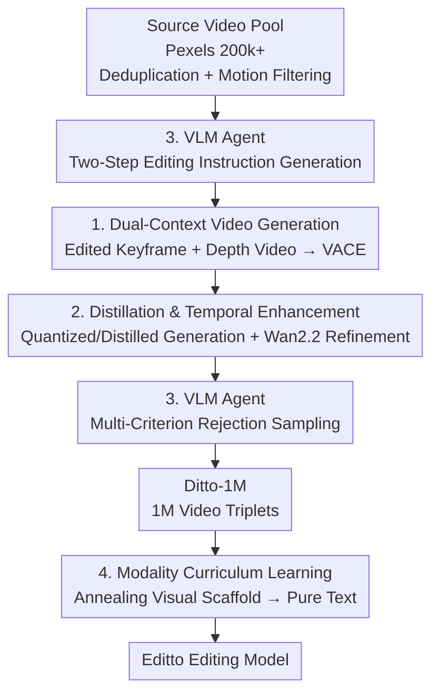

# Scaling Instruction-Based Video Editing with a High-Quality Synthetic Dataset

**Conference**: CVPR 2026  
**Paper**: [CVF Open Access](https://openaccess.thecvf.com/content/CVPR2026/html/Bai_Scaling_Instruction-Based_Video_Editing_with_a_High-Quality_Synthetic_Dataset_CVPR_2026_paper.html)  
**Code**: To be confirmed (the paper claims data/models/code are open-sourced on the project page)  
**Area**: Video Generation / Instruction-based Video Editing / Synthetic Datasets  
**Keywords**: Instruction-based video editing, synthetic data, in-context video generation, modality curriculum learning, VLM filtering

## TL;DR
This paper proposes a data synthesis framework named **Ditto**, which drives an in-context video generator using "image editing priors + depth video" combined with distillation acceleration and VLM agent auto-quality control. Consuming 12k GPU-days, it constructs a million-scale instruction video editing dataset, **Ditto-1M**. It then utilizes "modality curriculum learning" to train **Editto**, a model capable of editing videos solely based on text instructions, refreshing the SOTA in instruction-based video editing across both automatic metrics and human evaluations.

## Background & Motivation
**Background**: Instruction-based image editing (e.g., InstructPix2Pix, FLUX.1 Kontext, Qwen-Image, Nano-Banana) has achieved high precision and usability. However, its video counterpart lags significantly behind—editing a video not only requires modified content but also demands that these changes propagate consistently across all frames along the temporal dimension.

**Limitations of Prior Work**: The fundamental bottleneck for video editing is the **lack of large-scale, high-quality, and diverse paired training data**. Existing data synthesis schemes suffer from serious limitations: 1) Per-video optimization yields acceptable quality but is prohibitively expensive (high-fidelity methods take ~50 GPU-minutes per sample); 2) Training-free "edit-and-propagate" pipelines (such as VEGGIE or InsViE) are cheap and scalable, but temporal consistency is bottlenecked by the propagation model; 3) Señorita employs an "expert system" to split editing tasks into 18 subcategories, assigning a dedicated expert model to each, which yields high quality but is difficult to scale and incurs immense maintenance overhead.

**Key Challenge**: Existing pipelines remain trapped in two trade-offs: **fidelity/diversity vs. scalability** and **generation efficiency vs. temporal consistency**. Attempting to scale up sacrifices quality, while pursuing high quality sacrifices scalability.

**Goal**: Design a data synthesis pipeline that is **scalable, cost-effective, and capable of producing high-fidelity results**, and leverage it to train a genuinely "text-instruction-driven" video editing model.

**Key Insight**: The authors note that instruction-based **image** editing is highly mature, allowing edited keyframes to serve as strong visual prior constraints. By overlaying depth video as a spatiotemporal structural constraint and feeding both into an in-context video generator (VACE), the framework can ensure both editing fidelity and temporal consistency, bypassing costly per-video optimization.

**Core Idea**: Use "edited keyframes from a mature image editor + depth video" as dual contexts to drive an in-context video generator for bulk data synthesis. Then, apply distillation to reduce costs, and utilize VLM agents for automated quality control to scale the pipeline to a million samples. Finally, employ modality curriculum learning to transform the "visually conditioned" generator into a "purely text-instruction-conditioned" editor.

## Method

### Overall Architecture
The entire workflow is divided into two layers: the **Ditto data pipeline** (data generation) and **Editto model training** (data utilization).

The Ditto pipeline consists of three stages, intentionally employing entirely **open-source models** to guarantee reproducibility:
1. **Preprocessing (~60 GPU-days)**: Collect over 200k professional-grade source videos from Pexels, deduplicate them based on visual encoder features, filter out near-static videos using motion scores computed via CoTracker3 point tracking trajectories, and unify resolution and frame rate to 20 FPS.
2. **Core Generation (~6000 GPU-days)**: Use Qwen2.5-VL to generate "dense video descriptions $\rightarrow$ editing instructions" in two steps; utilize Qwen-Image to edit a keyframe into $f_k'$ according to the instructions; extract depth video $V_d$ via a video depth predictor; feed the three modalities—instruction $p$, edited keyframe $f_k'$, and depth video $V_d$—into the in-context video generator VACE to synthesize the edited video $V_e$. Quantization and distillation are applied in this stage to substantially reduce costs.
3. **Post-processing (~6000 GPU-days)**: Employ VLMs for multi-criterion rejection sampling to filter the collection, and utilize a fine-grained denoiser from Wan2.2 for a 4-step lightweight enhancement to elevate visual quality.

Ultimately, this constructs **Ditto-1M** (~1M triplets), which is then used to train Editto via **modality curriculum learning**.

### Key Designs

**1. Dual-context in-context video generation: Appearance via image editing priors, structure via depth video**

This is the key design to break the "fidelity/diversity vs. scalability" trade-off. Traditionally, per-video optimization is too expensive, while the temporal consistency of "edit-one-frame and propagate" is hard-capped by the propagation model. This work changes the perspective: it first uses a mature instruction-based image editor Qwen-Image $\mathcal{E}_{\text{img}}$ to edit a chosen keyframe $f_k$ from the source video into $f_k' = \mathcal{E}_{\text{img}}(f_k, p)$. This edited frame defines the final **appearance** (style, texture, etc.), serving as a strong visual prior. Meanwhile, a video depth predictor extracts depth video $V_d$ from the source video to act as a **spatiotemporal structural scaffold**, constraining geometry and motion frame-by-frame. Finally, the framework feeds the three inputs along with instruction $p$ into the in-context video generator VACE:

$$V_e = \mathcal{G}(V_d, f_k', p)$$

VACE faithfully propagates the edits defined in $f_k'$ across the entire sequence via attention mechanisms, while adhering to the motion and structure provided by $V_d$ and aligning semantically with $p$. Consequently, this inheriting strategy gains the mature capability of the image editor while securing temporal consistency via depth constraints—**without requiring any per-video optimization**—achieving both quality and scalability.

**2. Distillation + Quantization + Temporal Enhancer: Driving generation cost down to 20% while boosting visual quality**

Directly utilizing full-precision, high-fidelity video models takes ~50 GPU-minutes per sample, which is unsustainable for million-scale data generation. Conversely, crudely substituting them with fast distilled models introduces artifacts like temporal flickering. This paper resolves the "efficiency vs. quality" dilemma with two features: In the generation phase, **post-training quantization + knowledge distillation** are applied to yield a few-step inference generation model, slashing computing cost to approximately **20%** of the original with minimal impact on output quality. In the post-processing phase, instead of simple super-resolution, they leverage the **MoE architecture of Wan2.2**—which comprises a coarse denoiser responsible for structure/semantic formation at high-noise stages and a fine denoiser for detail refinement at low-noise stages. The authors employ only the **fine denoiser**: they inject light Gaussian noise into $V_e$ and run a **4-step only** reverse process. Since the fine denoiser is inherently adept at making minimal, semantic-preserving refinements to nearly completed videos, it successfully eliminates minor artifacts and enhances texture details without mutating the edited semantics. Splitting cost reduction and quality enhancement across different pipeline stages prevents compromise.

**3. VLM Agent: Acting as both the "writer" of editing instructions and the "quality inspector" for substandard samples**

Manual instruction writing and quality checks are completely infeasible at a million-scale dataset level. Therefore, the authors deploy an autonomous VLM agent that handles both roles. **Generation side**: Qwen2.5-VL is used with a two-step prompt—first generating a dense video description $c = \text{VLM}(V_s, p_{caption})$ as a semantic anchor, then feeding both the video and the description back to generate a plausible editing instruction $p = \text{VLM}(V_s, c, p_{instruct})$. This conditional approach of "understanding content before instructing" ensures that instructions closely fit the video content while covering a diverse range from global style transformations to local object modifications. **Quality control side**: The VLM acts as an automatic judge to perform rejection sampling, scoring across multiple criteria—instruction fidelity (whether the edit matches $p$), content fidelity (whether gravity, motion, and semantics of the source video are preserved), visual quality (detecting obvious distortion or artifacts), and safety compliance (filtering pornographic, violent, or horrific content). Triplets failing to meet any threshold are directly discarded. The agent automates the two most challenging bottlenecks of data synthesis: generation diversity and quality gating.

**4. Modality Curriculum Learning (MCL): Annealing the "visually conditioned" generator into a "purely text-conditioned" editor**

During data synthesis, the model observes both the edited keyframe and the depth video. However, during inference deployment, the user should ideally provide only a textual instruction. Fine-tuning the model directly to bridge the gap from visual-conditioned to pure text-conditioned generation is prone to failure due to the vast semantic divergence. MCL addresses this by using the "image reference condition"—which the model is already adept at—as a temporary scaffolding. During the initial training stages, both the edited reference frame (strong visual scaffold) and the text instruction are provided. As training progresses, the probability of providing this visual scaffold is **gradually annealed** to zero, forcing the model to migrate its dependency from "concrete visual targets it understands" to "abstract textual instructions." Structurally, the original VACE architecture is retained with its Context Branch (extracting spatiotemporal features of source/reference frames) and DiT Main Branch (generating under the joint guidance of visual context and text embeddings). The training uses a flow matching objective:

$$\mathcal{L} = \mathbb{E}_{t, \mathbf{z}_0, \mathbf{c}} \| \mathbf{v}_t(\mathbf{z}_t, t, \mathbf{c}) - (\mathbf{z}_0 - \mathbf{z}_t) \|^2$$

where $\mathbf{z}_0$ is the clean latent of the target edited video, $\mathbf{z}_t$ is its noisy version at timestep $t$, $\mathbf{c}$ is the joint condition of text and visual contexts, and $\mathbf{v}_t$ is the model's predicted vector field pointing from $\mathbf{z}_t$ to $\mathbf{z}_0$. This curriculum annealing lets the model cross the modality gap smoothly, ultimately emerging as a pure instruction-driven video editor.

### Loss & Training
- **Backbone**: Based on the in-context video generator VACE as the backbone. Most pretrained parameters are frozen; only the linear projection layers of the context blocks are fine-tuned, preserving generation priors while saving compute.
- **Optimization**: AdamW, constant learning rate of $1\text{e-}4$, 64 GPUs, for approximately 16,000 steps; the first 5,000 steps serve as the curriculum warm-up phase (gradually annealing the visual scaffold).
- **Objective**: Flow matching (Eq. 5).
- **Dataset Statistics**: Over 200k source videos (roughly half containing human activities) $\rightarrow$ filtered, edited, and re-filtered $\rightarrow$ ~1 million edited videos, comprising ~700k global edits (styles, environments, etc.) and ~300k local edits (object replacement/addition/removal). Final resolution is 1280×720 at 101 frames per video, 20 FPS. Total investment exceeded 12,000 GPU-days (~60 for preprocessing, ~6000 for generation, and ~6000 for post-processing).

## Key Experimental Results

### Main Results
The test set comprises 50 videos sourced from various web channels (**deliberately excluding Pexels to evaluate out-of-distribution performance**), with each video paired with 5 distinct editing instructions. Automatic metrics: CLIP-T (text-to-video similarity, measuring instruction following), CLIP-F (frame-to-frame CLIP similarity, measuring temporal consistency), and VLM (overall quality scoring). Human evaluation (1000 votes total): Edit-Acc (instruction following), Temp-Con (temporal consistency), and Overall (overall quality).

| Method | CLIP-T ↑ | CLIP-F ↑ | VLM ↑ | Edit-Acc ↑ | Temp-Con ↑ | Overall ↑ |
|------|---------|---------|-------|-----------|-----------|-----------|
| TokenFlow | 23.63 | 98.43 | 7.10 | 1.70 | 1.97 | 1.70 |
| InsV2V | 22.49 | 97.99 | 6.55 | 2.17 | 1.96 | 2.07 |
| InsViE | 23.56 | 98.78 | 7.35 | 2.28 | 2.30 | 2.36 |
| **Ours (Editto)** | **25.54** | **99.03** | **8.10** | **3.85** | **3.76** | **3.86** |

Editto clearly leads on all 6 metrics: in automatic evaluation, VLM scores increase from the second-best 7.35 to 8.10; in human evaluations, Edit-Acc/Temp-Con/Overall are nearly 1.6x higher than the strongest baseline (InsViE), with instruction following and temporal smoothness showing particularly outstanding improvements.

### Ablation Study
The ablation study of the paper is mostly presented via qualitative figures (Fig. 7), primarily exploring two factors: training data scale and the presence/absence of the MCL module.

| Configuration | Phenomenon | Explanation |
|------|------|------|
| Data ~60K → 120K → 250K → 500K | Style editing quality and fidelity to original video content/motion improve monotonically with scale | Confirms the value of large-scale datasets, with performance scaling effectively with data volume |
| Full (w/ MCL) | Correctly understands the complete semantic intent of the instruction | Complete modality curriculum learning |
| w/o MCL | Frequently fails to interpret the complete semantic intent of the instruction | Hard to bridge the cross-modality gap without curriculum learning |

### Key Findings
- **Data Scale is the Primary Factor**: Performance scales effectively with the number of training samples, with style editing quality and content/motion fidelity improving in tandem. This directly validates the core value proposition of a "million-scale high-quality dataset."
- **MCL is Indispensable**: Without modality curriculum learning, the model frequently fails to grasp the full semantics of instructions, indicating that the transition from "visual conditioning" to "pure text conditioning" must be stabilized via curriculum annealing.
- **Surpassing the Data Generator Itself**: The final trained Editto model performs noticeably better than the original generator in the data synthesis pipeline (Fig. 6), exhibiting higher stability particularly when dealing with newly introduced content beyond the keyframe—thanks to large-scale training, curriculum learning, and high-quality filtered data.
- **Unexpected Sim2Real Capability**: Training the model in reverse using this data (mapping stylized videos back to real source videos) enables synthetic-to-real domain transfer (Fig. 5), showing that the dataset contains rich realistic information, offering value beyond the standard editing task itself.

## Highlights & Insights
- **Leveraging the Image Editor is the Smartest Move**: Instead of building video editing capabilities from scratch, reusing mature instruction-based image editing as an "appearance prior factory" and layering depth video to enforce temporal consistency simplifies a hard problem into the union of a "mature module + structural constraints," eliminating expensive per-video optimization.
- **Decoupling Cost Reduction and Quality Improvement works Harmoniously**: Speed is addressed in the generation stage through distillation and quantization (cutting costs to 20%), while detail is polished in post-processing by running only 4 steps of the Wan2.2 fine denoiser. This avoids the conventional pitfall of sacrificing quality for speed. This "divided labor" strategy easily scales to other large-scale generative data pipelines.
- **VLM Agent Killing Two Birds with One Stone**: The same VLM generates diverse instructions and serves as a quality gate, automating the two most challenging bottlenecks of data synthesis. This establishes a highly reusable paradigm for large-scale synthetic data operations.
- **MCL's Annealed Visual Scaffolding is Elegant**: Using a visual condition the model already understands as a temporary crutch and gradually removing it enables a expression transition toward abstract textual instructions. This "start with strong conditions, then anneal" curriculum strategy applies broadly to scenarios requiring multimodal training but single-modality deployment.

## Limitations & Future Work
- **Extremely High Compute Barrier**: The synthesis cost of >12,000 GPU-days is unfriendly for community reproduction. Even though the components are fully open-source, rebuilding the entire dataset is not affordable for everyone.
- **Quality Upper Bound Capped by Components**: Editing fidelity relies on Qwen-Image's image editing prowess, while temporal consistency depends on VACE and the depth predictor. Biases or errors from any upstream model (e.g., keyframe editing failure, erroneous depth estimation) will cascade to the final video.
- **Qualitative-leaning Ablation Studies**: Ablation studies on data scale and MCL are primarily shown through qualitative figures; they lack quantitative curves using the same automated and human evaluation metrics from the main results. Consequently, the marginal returns of scaling and the quantitative gains from MCL are not entirely clear (⚠️ subject to the original text).
- **Small Evaluation Scale**: The test set comprises only 50 videos $\times$ 5 instructions. Moreover, the VLM participates in both data generation and evaluation, which might introduce potential evaluation bias. A larger, more neutral benchmark would be much more convincing.
- **Potential Improvements**: Replacing or integrating upstream open-source components into a unified trainable module, or introducing stronger motion/geometric constraints to handle complex occlusions and large motions, could further improve fidelity and lower the reliance on prior depth maps.

## Related Work & Insights
- **vs. Inversion-based Methods (e.g., TokenFlow / FateZero / Tune-A-Video)**: These tools rely on DDIM inversion + feature propagation or single-video fine-tuning to bypass paired data, which is computationally heavy, capped by inversion fidelity, and fragile against complex motions/occlusions. In contrast, Ours is feed-forward end-to-end, offering fast inference and more stable quality.
- **vs. Lift-and-propagate Methods (e.g., VEGGIE / InsViE)**: These edit a single frame and then propagate it via image-to-video, meaning temporal consistency is capped by the propagation model. Ours feeds both "edited keyframes + depth video" dual contexts into an in-context generator, explicitly constraining the temporal domain with a depth structure for superior quality.
- **vs. Señorita (Expert Systems)**: This splits the task into 18 subcategories, with a dedicated expert model for each. It yields good quality but is hard to scale and high-maintenance. Ours uses an "All-in-One" single in-context generator to handle both global/local edits uniformly, which is much more scalable.
- **vs. InstructPix2Pix (The Origin of the Image-side Paradigm)**: IP2P uses "LLM for instruction generation + T2I for image-pair generation" to synthesize image triplets. Ours successfully adopts this "synthesize paired data then train end-to-end" paradigm into the video domain, adding the missing pieces of video-specific temporal consistency and modality transfer (MCL).

## Rating
- Novelty: ⭐⭐⭐⭐⭐ The combination of "image-editing-prior + depth-constraint driven in-context generation" and "modality curriculum learning" is highly novel, systematically translating the image-editing paradigm to the video domain.
- Experimental Thoroughness: ⭐⭐⭐⭐ Automated metrics and human evaluation in the main results are comprehensive and show clear leads, though ablation studies are somewhat qualitative and the test set is relatively small.
- Writing Quality: ⭐⭐⭐⭐⭐ The problems are dissected clearly (resolving the four main challenges sequentially), with informative illustrations of the pipeline and highly coherent logic.
- Value: ⭐⭐⭐⭐⭐ Open-sourcing a million-scale dataset + SOTA models + a reusable synthesis paradigm provides a massive push for the instruction-based video editing community.

<!-- RELATED:START -->

## Related Papers

- [\[CVPR 2026\] EasyV2V: A High-quality Instruction-based Video Editing Framework](easyv2v_a_high-quality_instruction-based_video_editing_framework.md)
- [\[CVPR 2026\] VIVA: VLM-Guided Instruction-Based Video Editing with Reward Optimization](viva_vlm-guided_instruction-based_video_editing_with_reward_optimization.md)
- [\[CVPR 2026\] CoT-Edit: Let CoT Guide Instruction Video Editing](cot-edit_let_cot_guide_instruction_video_editing.md)
- [\[CVPR 2026\] FFP-300K: Scaling First-Frame Propagation for Generalizable Video Editing](ffp-300k_scaling_first-frame_propagation_for_generalizable_video_editing.md)
- [\[CVPR 2026\] EgoEdit: Dataset, Real-Time Streaming Model, and Benchmark for Egocentric Video Editing](egoedit_dataset_real-time_streaming_model_and_benchmark_for_egocentric_video_edi.md)

<!-- RELATED:END -->
