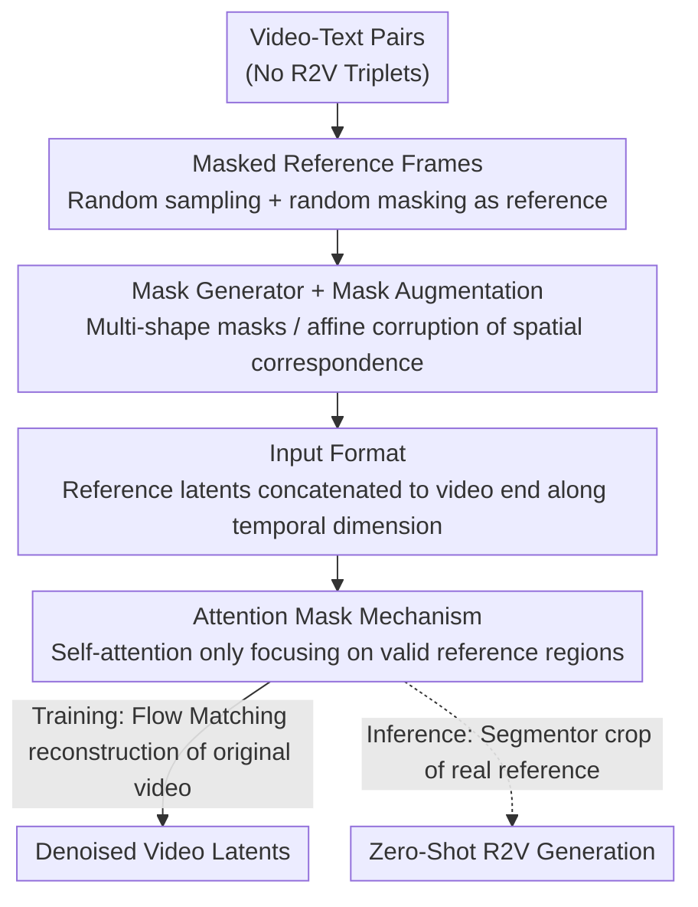

# Scaling Zero-Shot Reference-to-Video Generation

**Conference**: CVPR 2026  
**Paper**: [CVF Open Access](https://openaccess.thecvf.com/content/CVPR2026/html/Zhou_Scaling_Zero-Shot_Reference-to-Video_Generation_CVPR_2026_paper.html)  
**Code**: None  
**Area**: Video Generation  
**Keywords**: Reference-to-Video (R2V), Zero-Shot, Masked Training, Identity Preservation, Attention Mask

## TL;DR
This paper proposes Saber—the first reference-to-video (R2V) framework that **does not rely on R2V triplet data**. Trained solely on massive video-text pairs, it utilizes a masked training strategy that treats randomly masked video frames as reference images, combined with tailored attention masks and mask augmentation. Consequently, Saber achieves zero-shot performance on OpenS2V-Eval that outperforms all methods trained with explicit R2V data, including the commercial closed-source model Kling 1.6.

## Background & Motivation
**Background**: Reference-to-Video (R2V) generation is a key step in personalized video generation (e.g., customized storytelling, virtual avatars), requiring simultaneous adherence to textual instructions and preservation of the subject's identity/appearance in the reference image. Current mainstream approaches (such as Phantom, VACE, SkyReels-A2, HunyuanCustom, MAGREF, PolyVivid, BindWeave, etc.) almost all follow the same path: constructing **explicit R2V triplet datasets**—i.e., "reference image + video + text" pairings (e.g., OpenS2V-5M, Phantom-Data)—and then training models on them.

**Limitations of Prior Work**: Constructing such triplet datasets is extremely expensive and difficult to scale, involving candidate extraction, low-quality filtering, sample clustering, cross-pair matching, and even calling costly APIs to generate reference images. This leads to two consequences: ① Uncontrollable data quality and restricted scale (far below the massive video-text pairs available for T2V/I2V); ② Because the reference images in these datasets mostly consist of humans and common objects, **subject diversity is limited**, leading to poor generalization on unseen categories.

**Key Challenge**: R2V capabilities are bottlenecked by the necessity for dedicated triplet data. While T2V/I2V benefit from the scaling dividends of internet-scale video-text pairs, R2V is forced to resort to small, expensive, manually curated data because of the extra dimension introduced by the "reference image".

**Goal**: Is it possible to **completely bypass triplet data** and train R2V capabilities using only the same video-text pairs as T2V/I2V?

**Key Insight**: The authors observe that video frames themselves are natural "reference images" sharing the same identity as the video content. If a few frames from a video are randomly sampled and partially masked, and these "corrupted frames" are fed to the model as reference conditions to reconstruct the original video, the model is forced to learn to extract identity/appearance features from the reference context and inject them into the generation process. This matches the exact objective of the R2V task, but **without requiring any extra annotations**.

**Core Idea**: Replace "manually collected reference images" with "randomly masked video frames" to **simulate the R2V task self-supervisedly** on video-text pairs, thereby scaling R2V training to the data scale of T2V/I2V.

## Method

### Overall Architecture
Saber is fine-tuned on the open-source Wan2.1-14B (VAE + DiT + umt5-xxl text encoder, trained with Flow Matching). **No reference images** are used during training; only video-text pairs are required: for each video, several frames are randomly sampled, binary masks of various shapes are generated using a mask generator, and the same affine augmentation is applied to both the image and the mask to obtain "masked reference frames". After being encoded by the VAE, these reference frames are **concatenated to the end of the video tokens along the temporal dimension**. A "reference region mask" is also provided. Within each transformer block, these tokens interact with video tokens through **self-attention with an attention mask** (only paying attention to the valid reference regions) and are integrated with text via cross-attention to ultimately predict the denoised video latent. During inference, real reference images are used: an off-the-shelf segmentor extracts the foreground subject, the background is filled with gray, and they are fed into the model with the same input format for standard Wan sampling—**the only difference between training and inference is whether the reference frame comes from a "random mask" or "segmented foreground extraction"**.

### Key Designs

**1. Masked Frames as References: Self-Supervised Simulation of R2V**

This is the core foundation of the paper. Addressing the pain point of expensive explicit R2V datasets and limited subject variety, the authors entirely discard reference images. During training, a frame $I_k$ is randomly sampled from each video, and a binary mask $M_k \in \{0, 1\}^{H \times W}$ is produced via a mask generator. After augmentation, $\bar{I}_k$ and $\bar{M}_k$ are obtained, which are multiplied element-wise to form the masked reference frame $\hat{I}_k = \bar{I}_k \odot \bar{M}_k$. Repeating this $K$ times yields a set of reference conditions $\{\hat{I}_k\}_{k=1}^K$. Since the reference frames are the video's own frames and the masked positions/shapes are randomized, the model is forced to learn identity-appearance consistent representations from these "corrupted clues" to reconstruct the entire video. Compared to fixed manual reference images, random masks naturally provide **massive and diverse** reference samples (any frame, any video, and any mask can be used). Thus, subject categories are not limited to humans and common objects, resulting in stronger generalization. Ablation studies confirm that when modifying the same architecture to fine-tune on OpenS2V-5M real R2V data (w/o masked training), the overall score drops by 1.67%, proving that masked training is not only data-efficient but also yields better results.

**2. Mask Generator + Mask Augmentation: Creating Diversity and Preventing "Copy-and-Paste"**

Simply applying "random masks" is insufficient; the method of masking is crucial. The mask generator randomly selects a shape from a set of predefined shapes (ellipses, Fourier blobs, convex/concave polygons, etc.) and ensures that the foreground area ratio $r$ falls within a target interval $[r_{min}, r_{max}]$. Each shape defines a continuous scale parameter (where area increases monotonically with scale), and a **binary search** is used to locate the scale matching the area ratio, followed by a topology-preserving fine-tuning (dilation/erosion of boundary pixels) when pixel discretization fails to align perfectly. During training, $r$ is sampled based on probability: a 10% probability of $r \in [0, 0.1]$ to simulate "almost no reference details" (forcing the model to handle varying reference counts), an 80% probability of $[0.1, 0.5]$ representing typical subjects, and a 10% probability of $[0.5, 1.0]$ to learn large reference images/background scenes. This adjustable ratio allows Saber to accept both foreground subjects and background scenes during inference.

Mask augmentation addresses the notorious "copy-paste artifact" in R2V (where the model directly pastes the reference image into the video). The authors apply the **same set of random affine transformations** (rotation $[-10^\circ, 10^\circ]$, scaling $[0.8, 2.0]$, shear $[-10^\circ, 10^\circ]$, and 50% horizontal flip) to both the image $I_k$ and mask $M_k$, ensuring that the masked area remains within bounds after transformation. This artificially **breaks the spatial correspondence between the reference frame and the target video frames**. Since the reference frame is rotated and scaled and no longer pixel-aligned with the original frame, the model cannot cheat by simply copying locations and is forced to actually comprehend the shape and appearance of the subject. Ablation results show that using only single shapes, such as ellipse, Fourier, or polygon, drops performance by 3.35%, 1.58%, and 1.42%, respectively, and a fixed ratio $r=0.3$ drops it by 6.18%, proving that **mask diversity is the lifeblood of masked training**. Figure 5 also visualizes that without augmentation, the T-shirt stands upright on the rock (copy-paste), whereas with augmentation, it lies naturally on the stone surface.

**3. Input Format + Attention Mask: Clean Interaction Between Reference and Video in Latent Space**

How are the masked reference frames fed into the DiT without introducing noise? The authors employ a simple and effective input representation: each reference frame is encoded by the VAE to obtain $z_{ref} = \{z_k\}_{k=1}^K$ (**kept noise-free** to provide precise conditioning) and concatenated to the end of the noisy video latent $z_t$ along the temporal dimension. The channel dimension is further concatenated with the mask channel $m_{ref}$ and a zero-valued video latent, forming the overall transformer input:

$$z_{in} = \mathrm{cat}\Big[\;\mathrm{cat}[z_t,\,z_{ref}]_{\text{temporal}},\;\;\mathrm{cat}[m_{zero},\,m_{ref}]_{\text{temporal}},\;\;\mathrm{cat}[z_{zero},\,z_{ref}]_{\text{temporal}}\;\Big]_{\text{channel}}$$

where $m_{ref}$ resizes each $M_k$ to the latent resolution (1 denotes reference area, 0 denotes non-reference area), and $z_{zero}$/$m_{zero}$ are zero-valued placeholders on the video side. The crucial part is the **attention mask**: in self-attention, video tokens can attend to each other bidirectionally, whereas the reference side **is only permitted to attend to valid reference regions** (where the mask is 1), preventing the model from attending to the grayed-out background. The self-attention output is passed to cross-attention for interaction with textual features $z_P$; video tokens are guided by text, and reference tokens learn semantic alignment, allowing the reference image details to be integrated into the generation process under textual constraints. Figure 6 shows that removing the attention mask leads to gray artifacts around the subject (suggesting the model failed to recruit the subject cleanly from the gray background), whereas adding/enabling it leads to clean foreground separation and smooth blending.

### Loss & Training
Following the Flow Matching objective of Wan2.1: the forward process $z_t=(1-t)z_0+t\epsilon$ interpolates linearly between data and noise, and the model predicts the target velocity:

$$\mathcal{L}_{FM}=\mathbb{E}_{z_0,\epsilon,t,c}\big[\,\|(z_0-\epsilon)-\Psi_\theta(z_t,t,c)\|_2^2\,\big]$$

where $c$ represents the conditional features derived from text and reference images. Saber is fine-tuned from Wan2.1-14B on ShutterStock videos with captions generated by Qwen2.5-VL. Training uses AdamW, a learning rate of $1\text{e}{-5}$, and a global batch size of 64. Inference adopts BiRefNet for foreground cropping, 50 denoising steps, and a CFG scale of 5.0.

## Key Experimental Results

### Main Results
Evaluated on OpenS2V-Eval (180 prompts across 7 categories, including single/multi-reference face/human/entity scenarios). Saber achieves the highest overall score in a **zero-shot** manner, and places first in NexusScore (subject consistency, the most representative metric for R2V performance):

| Method | Type | Total↑ | NexusScore↑ | FaceSim↑ | NaturalScore↑ |
|------|------|--------|-------------|----------|---------------|
| Kling1.6 | Closed-source Commercial | 56.23% | 45.89% | 40.10% | 74.59% |
| Phantom-14B | Explicit R2V Data | 56.77% | 37.43% | 51.46% | 69.35% |
| VACE-14B | Explicit R2V Data | 57.55% | 44.08% | 55.09% | 67.04% |
| BindWeave | Explicit R2V Data | 57.61% | 46.84% | 53.71% | 66.85% |
| **Saber (Ours)** | **Zero-Shot** | **57.91%** | **47.22%** | 49.89% | 72.55% |

In terms of overall score, Saber outperforms Kling 1.6 by 1.68%, Phantom by 1.14%, VACE by 0.36%, and BindWeave by 0.30%. On NexusScore, it exceeds Phantom by 9.79%, VACE by 3.14%, and BindWeave by 0.36%—indicating that the subject features learned via masked training under a zero-shot setting are more consistent than those of all models trained in supervised R2V data settings.

### Ablation Study

| Configuration | Total↑ | NexusScore↑ | Description |
|------|--------|-------------|------|
| Saber (Full) | 57.91% | 47.22% | Full masked training scheme |
| w/o masked training | 56.24% | 45.33% | Fine-tuned on OpenS2V-5M real R2V data instead, drops by 1.67% |
| ellipse only | 54.56% | 40.28% | Only ellipse masks used, drops by 3.35% |
| fourier only | 56.33% | 44.82% | Only Fourier blobs used, drops by 1.58% |
| polygon only | 56.49% | 45.24% | Only polygons used, drops by 1.42% |
| fixed r = 0.3 | 51.73% | 39.20% | Fixed foreground area ratio, drops by 6.18% |

### Key Findings
- **Mask diversity is more important than "real reference images"**: Training on real R2V data is inferior to training with random masks (-1.67%), and a fixed area ratio leads to the worst degradation (-6.18%), demonstrating that "shape diversity + ratio diversity" is key to the success of masked training.
- **Mask augmentation prevents copy-paste issues**: Removing augmentation creates artifacts where reference content is pasted directly into the video (Figure 5), whereas the attention mask eliminates residual gray frames around the subject (Figure 6).
- **Emergent capabilities**: ① Multi-view inputs of the same subject (e.g., front, side, and back views of a robot) can be recognized as the same entity and blended into a coherent video (Figure 7); ② Cross-modal alignment—swapping descriptive subject attributes in the prompt (e.g., clothing color, left/right positions) correctly alters the generated video (Figure 8), showing that self-attention (video $\leftrightarrow$ reference) + cross-attention (incorporating text) establishes robust reference-text alignment.

## Highlights & Insights
- **"Data bottleneck" elegantly solved**: R2V has long been bottlenecked by the need for triplet data. This paper uses the insight that "video frames are natural reference images" to self-supervise the task, directly inheriting the scaling dividends of T2V/I2V data. This represents a paradigm shift rather than an incremental utility.
- **Random masking serves threefold**: It creates infinitely diverse reference samples (improving generalization), breaks spatial correspondence through affine augmentation (preventing copy-paste), and enables a single model to simultaneously support foreground subjects, background scenes, and variable reference counts through area-ratio sampling. A simple mechanism solving multiple issues elegantly.
- **Transferable concepts**: Utilizing "random occlusion + reconstruction" as a generic recipe to simulate conditional tasks without annotations can inspire other conditional generation tasks lacking paired data (e.g., reference-to-3D, reference-audio-to-video) to bypass data construction via self-supervision.

## Limitations & Future Work
- **Degradation with excessive reference images**: The authors acknowledge that when the number of reference images scale significantly (e.g., 12 images), the generation degrades into fragmented compositions that piecemeal the references together rather than synthesizing them coherently.
- **Focus on identity preservation over motion control**: Saber primarily ensures identity consistency and visual coherence; detailed motion control and temporal consistency under complex prompts remain challenging.
- **Reliance on external segmentations**: During inference, BiRefNet is used to crop the foreground. The division quality directly dictates the reference conditioning—subjects with failed segmentation may fail to inject properly (noted supplementary observation, ⚠️ refer to the original paper).
- **Directions for improvement**: Exploring how to effectively incorporate a larger volume of reference images into a unified generation process, as well as adaptive guidance to improve controllability and realism.

## Related Work & Insights
- **vs Phantom / VACE / BindWeave (trained on explicit R2V data)**: These methods rely on constructing expensive image-video-text triplet datasets (candidate extraction, clustering, filtering, API-based reference generation). Saber entirely dispenses with such data and only employs video-text pairs. It substitutes "acquiring reference images" with "randomly masking video frames," yet surpasses them in zero-shot performance on OpenS2V-Eval, completely eliminating data construction overheads.
- **vs SkyReels-A2 / HunyuanCustom / MAGREF / PolyVivid**: These methods focus on "how to inject reference features" (joint embeddings, LLaVA fusion, regional mask concatenation, 3D-RoPE, etc.), but all rely on explicit R2V data. Saber's contribution is orthogonal and further upstream—it resolves the question of "where the reference data comes from," while utilizing a simple temporal concatenation + attention mask for feature injection.
- **vs Kling1.6 (Closed-source Commercial)**: Without knowing its exact training data, Saber surpasses it by 1.68% overall in an open-source, zero-shot setup, indicating that "how to train" can be more critical than "how much proprietary data you have."

## Rating
- Novelty: ⭐⭐⭐⭐⭐ Self-supervising R2V via "masked video frames as reference images" successfully bypasses the triplet data bottleneck, achieving a paradigm-level innovation.
- Experimental Thoroughness: ⭐⭐⭐⭐ Solid evaluation on OpenS2V-Eval, thorough mask-design ablations, and verification of multi-view/cross-modal emergent capabilities. However, comparisons with more zero-shot baselines are missing.
- Writing Quality: ⭐⭐⭐⭐⭐ Clear logical chain running from motivation to method and experiments, intuitive diagrams, and in-depth description of the masking design.
- Value: ⭐⭐⭐⭐⭐ Bringing R2V training costs down to the same level as T2V/I2V is a significant and highly meaningful contribution to scalable personalized video generation.

<!-- RELATED:START -->

## Related Papers

- [\[CVPR 2026\] StoryTailor: A Zero-Shot Pipeline for Action-Rich Multi-Subject Visual Narratives](storytailora_zero-shot_pipeline_for_action-rich_multi-subject_visual_narratives.md)
- [\[CVPR 2026\] Are Image-to-Video Models Good Zero-Shot Image Editors?](are_image-to-video_models_good_zero-shot_image_editors.md)
- [\[CVPR 2026\] Rethinking Position Embedding as a Context Controller for Multi-Reference and Multi-Shot Video Generation](rethinking_position_embedding_as_a_context_controller_for_multi-reference_and_mu.md)
- [\[CVPR 2026\] LoL: Longer than Longer, Scaling Video Generation to Hour](lol_longer_than_longer_scaling_video_generation_to_hour.md)
- [\[ICML 2026\] WIND: Weather Inverse Diffusion for Zero-Shot Atmospheric Modeling](../../ICML2026/video_generation/wind_weather_inverse_diffusion_for_zero-shot_atmospheric_modeling.md)

<!-- RELATED:END -->
