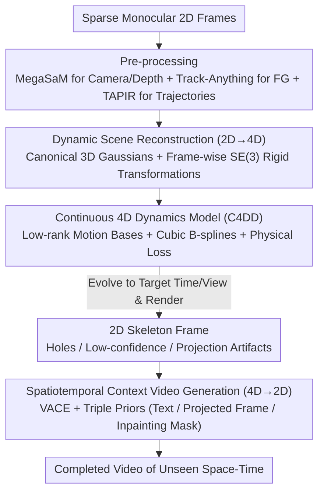

# SeeU: Seeing the Unseen World via 4D Dynamics-aware Generation

**Conference**: CVPR 2026  
**arXiv**: [2512.03350](https://arxiv.org/abs/2512.03350)  
**Code**: [https://yuyuanspace.com/SeeU/](https://yuyuanspace.com/SeeU/) (Data and code available)  
**Area**: Video Generation  
**Keywords**: 4D Dynamic Modeling, Continuous Dynamics, Spatiotemporal Generation, B-spline, Physical Consistency

## TL;DR
SeeU is proposed as a 2D→4D→2D learning framework: it reconstructs a 4D world representation from sparse monocular 2D frames, learns continuous and physically consistent 4D dynamics on a low-rank representation (via B-spline parameterization and physical constraints), and finally re-projects the 4D world back to 2D. A spatiotemporal context-aware video generator completes unseen regions, enabling the generation of unseen visual content across time and space.

## Background & Motivation

1. **Background**: Tasks such as video generation, frame interpolation, and frame prediction primarily model dynamics in 2D pixel or latent spaces through end-to-end learning. Large-scale video diffusion models (e.g., Sora, Wan) perform well in in-distribution scenarios. World model research often learns dynamics in low-dimensional latent spaces for efficiency.
2. **Limitations of Prior Work**: Modeling dynamics directly on 2D frames has three fundamental limitations: (a) Images and videos are discrete 2D projections of a 4D world (3D space + time); learning directly in 2D loses vital 3D structure and temporal correlations. (b) Observations mix camera motion and scene dynamics; changing camera poses increase motion complexity and irregularity. (c) In complex out-of-distribution scenarios (occlusion, non-rigid deformation, etc.), 2D models lacking 3D or physical supervision often fail to capture realistic geometric and physical dynamics.
3. **Key Challenge**: Real-world motion is often simple and structured in 4D space (constrained by biological/mechanical limits, classical mechanics, symmetry, etc.), but becomes complex and ill-posed after projection to 2D. Modeling dynamics in 4D can naturally leverage these physical priors, yet existing methods either remain in 2D or lack continuous dynamics modeling in 4D reconstruction.
4. **Goal**: (1) How to reconstruct 4D dynamic scenes from sparse monocular frames? (2) How to learn continuous and physically consistent 4D dynamics? (3) How to generate 2D content for arbitrary time and viewpoints from the 4D world?
5. **Key Insight**: Modeling continuous dynamics in native 4D space offers three advantages: 3D-awareness (explicit 3D representation handles occlusion/viewpoint changes), physical consistency (motion is simpler in 4D and can be constrained by physical priors), and motion decoupling (camera, foreground, and background can be explicitly separated in a unified 4D coordinate system).
6. **Core Idea**: Realize the generation of unseen time and space through a 2D→4D→2D information flow—lifting from 2D to a 4D world representation, learning continuous physically consistent dynamics via B-splines in 4D, and then projecting back to 2D for context completion.

## Method

### Overall Architecture
SeeU aims to solve "seeing the unseen": given a few sparse monocular video frames, it generates what the scene should look like at other times (past/interpolation/future) and from different viewpoints. The core proposition is to avoid direct end-to-end dynamics learning on 2D pixels and instead take a detour—lifting 2D to 4D (3D space + time) to understand the true motion of the world before projecting 4D back to 2D to complete the imagery. The pipeline is thus a 2D→4D→2D loop: The first stage reconstructs a set of 3D Gaussians undergoing rigid transformations over time and camera trajectories from sparse frames, converting discrete observations into a 4D scene. The second stage fits this "frame-wise discrete" 4D scene into a **continuous time function**, making it queryable at any moment. The third stage evolves the 4D world to the target time and viewpoint, renders a typically incomplete 2D "skeleton frame," and hands it to a video generator to fill in the gaps.

### Key Designs

**1. Dynamic Scene Reconstruction (2D→4D): Decoupling camera motion and scene dynamics into explicit 3D representations**

A fundamental difficulty in learning dynamics directly in 2D is the entanglement of camera and object motion during projection, alongside the loss of 3D structure. SeeU utilizes the Shape-of-Motion framework to represent the scene as a set of canonical 3D Gaussians $\{g_0^i\}_{i=1}^N$ (each with position $\mu_0^i$, orientation $R_0^i$, scale $s^i$, opacity $o^i$, and color $c^i$). Object motion is carried by frame-wise rigid transformations $T_{0 \to t} \in SE(3)$, moving the Gaussians from the canonical frame to the position at frame $t$:

$$\mu_t^i = R_{0 \to t}\,\mu_0^i + t_{0 \to t}$$

Shape-of-Motion is chosen over other reconstructors because it works on ordinary mobile phone videos with weak parallax and explicitly separates the static background from the dynamic foreground—aligning with the need to decouple "camera motion vs. scene dynamics." Before reconstruction, MegaSaM estimates camera parameters and depth, Track-Anything segments the foreground, and TAPIR extracts 2D point trajectories to provide supervision. The output of this step is a 4D scene that can be replayed frame-by-frame but is only defined at discrete observed moments.

**2. Continuous 4D Dynamics Model (C4DD): Interpolating discrete motion into a smooth curve queryable at any time**

The motion reconstructed in the first stage is discrete—one set of transformations per frame with gaps in between; interpolation or extrapolation requires linear guessing (contributing to the base SoM's low 15.5 PSNR). C4DD fits these discrete transformations into a continuous time function while addressing two challenges. First is **efficiency**: with approximately 80,000 foreground Gaussians, learning independent trajectories for each is expensive and prone to overfitting. Thus, low-rank motion parameterization compresses the motion onto a set of **globally shared** motion bases:

$$P_t^i = P_0^i + B(t)\,w_i, \qquad B(t) \in \mathbb{R}^{m \times K},\ K \ll N$$

where $B(t)$ are $K$ motion bases shared by all Gaussians, and $w_i$ are time-invariant coefficients for each Gaussian—reducing the number of continuous functions to learn from 80,000 to $K$. Second is **physical consistency**: the authors observed that these motion bases exhibit simple, smooth temporal trends in $SE(3)$ (even if the original video motion looks complex). Therefore, cubic B-splines are used to parameterize the motion bases themselves:

$$\hat{B}_t = \sum_{j=1}^{M} N_{j,d}(t)\,q_j$$

$N_{j,d}$ represents the B-spline basis functions, and $q_j$ are control points. The number of control points $M$ directly controls the trade-off between capacity and smoothness. B-splines were chosen over MLPs for their natural smoothness inductive bias; replacing them with an MLP in ablations resulted in noisy trajectories and a 3.5-point drop in PSNR. During training, camera and motion bases are optimized jointly: a data loss $\mathcal{L}_{data}$ ensures fit to discrete observations, while a physical loss $\mathcal{L}_{phys}$ penalizes the translation/rotation acceleration of motion bases and camera trajectories (with increased weights in extrapolation zones) to suppress non-physical sudden changes.

**3. Spatiotemporal Context Video Generation (4D→2D): Using the 4D rendered "semi-finished product" as a skeleton for the generator to fill only unseen parts**

With continuous dynamics, the 4D world can evolve to any timestamp and camera pose, rendering a 2D projection as a "skeleton" for the video. However, this skeleton inherently has three types of vacancies: regions never observed (new views or occlusions), regions where projected Gaussian confidence is too low, and projection artifacts at depth discontinuities. SeeU does not force the generator to guess from scratch; instead, it feeds the skeleton and gap information to the VACE video generation model, injecting triple context priors—structured text prompts from a VLM (global semantics and inpainting instructions), the projected frame itself (structural reference for geometry and photometry), and frame-wise inpainting masks (spatial markers for where to generate). Together, these provide the generator with a complete command chain from semantics and structure to spatial location, ensuring it only hallucinates details in marked uncertain areas without damaging correctly reconstructed geometry.

### Loss & Training
- Stage 1: 80K foreground + 80K background Gaussians, 10 motion bases, 4000 iterations, taking ~1 hour for a typical 10-frame 960×540 sequence.
- Stage 2: Cubic B-splines (degree=3), 8 control points, $\lambda_{phy} = 1 \times 10^{-4}$, lr=1e-5, batch=64, taking ~10 minutes for 1000 epochs.
- Stage 3: Fine-tuning VACE on multi-semantic mask distributions, ~2 hours.
- All stages completed on a single A100 80GB.

## Key Experimental Results

### Main Results
Unseen generation in the temporal domain (SeeU45 dataset):

| Method | Past PSNR↑ | Interp PSNR↑ | Future PSNR↑ | Past LPIPS↓ | Interp LPIPS↓ | Future LPIPS↓ |
|------|-----------|-------------|-------------|------------|--------------|--------------|
| SoM | 15.55 | 16.37 | 15.43 | 0.388 | 0.356 | 0.389 |
| InterpAny | - | 20.54 | - | - | 0.242 | - |
| VACE | 17.14 | 18.16 | 17.71 | 0.367 | 0.359 | 0.354 |
| **Ours** | **20.47** | **21.07** | **20.54** | **0.248** | **0.227** | **0.243** |

Unseen generation in the spatial domain (EE↓ lower is better, EIR↑ higher is better):

| Method | Dolly Out EE↓ | EIR↑ | CLIP-V↑ |
|------|-------------|------|---------|
| ReCamMaster | 0.238 | 0.674 | 0.937 |
| **Ours** | **0.200** | **0.785** | **0.969** |

### Ablation Study

| Configuration | PSNR↑ | LPIPS↓ | EE↓ | CLIP-V↑ |
|------|-------|--------|-----|---------|
| C4DD w/ MLP | 17.54 | 0.427 | 0.313 | 0.739 |
| w/o physical loss | 19.36 | 0.274 | 0.224 | 0.920 |
| 5 frames input | 18.36 | 0.305 | 0.285 | 0.928 |
| 10 frames input | 20.16 | 0.251 | 0.204 | 0.955 |
| 15 frames input | 20.39 | 0.241 | 0.200 | 0.958 |
| **20 frames input** | **21.08** | **0.239** | **0.197** | **0.960** |

### Key Findings
- **B-spline >> MLP**: The MLP variant showed a 3.5-point drop in PSNR and a 0.19 increase in LPIPS, indicating that the smooth inductive bias of B-splines is crucial for continuous dynamics modeling—MLPs can fit trends but produce noisy trajectories.
- **Physical Loss is Crucial**: Removing $\mathcal{L}_{phys}$ significantly decreased inter-frame consistency, especially in extrapolation regions.
- **Robustness to Sparse Input**: PSNR dropped by only ~2.7 when decreasing from 20 to 5 frames; C4DD maintains reasonable temporal continuity under extremely sparse observations.
- **Linear Growth of Temporal Prediction Error**: Extrapolation accuracy decays roughly linearly with temporal distance, aligning with physical intuition.
- SeeU outperforms specialized models across three temporal sub-tasks: past inference, dynamic interpolation, and future prediction.

## Highlights & Insights
- **2D→4D→2D Information Flow Paradigm**: Rather than direct 2D end-to-end learning, lifting to 4D to understand the world before returning to 2D generation presents a "understanding-first" paradigm contrasting with purely data-driven generation. This approach is transferable: for any generation task involving physical laws, modeling in physical space before projecting to observation space may be superior.
- **Low-rank Motion Parameterization + B-splines**: A dual simplification strategy—compressing the motion of 80K Gaussians into 10 bases via low-rank decomposition, then continuous-tuning these bases via B-splines. This hierarchical simplification of complex dynamics is both elegant and efficient.
- **Triple Prior Injection for Unseen Completion**: The combination of text semantics + projection structure + spatial masks provides a complete guidance chain for the video generator, from "what should be generated" to "where to generate."

## Limitations & Future Work
- Dependent on the quality of underlying modules (tracking, camera estimation, 4D reconstruction)—small objects or textureless foregrounds can cause failures.
- Currently focused on scenes with prominent, smooth, temporally stable foreground motion; support for highly non-rigid or abrupt motion is limited.
- 4D reconstruction in Stage 1 (~1 hour) is an efficiency bottleneck, hindering real-time applications.
- The SeeU45 dataset contains only 45 scenes; while diverse, the scale is small.
- Extrapolation accuracy decays linearly over time; physical consistency in long-range prediction still needs improvement.

## Related Work & Insights
- **vs Shape-of-Motion (SoM)**: SeeU's Stage 1 is based on SoM, but SoM only provides discrete frame-level reconstruction; temporal extrapolation relies on simple linear guessing, resulting in poor performance (PSNR 15.5). SeeU adds continuous dynamics and context completion, raising PSNR to 20.5.
- **vs VACE**: VACE is a purely 2D video inpainting method lacking 3D awareness. SeeU provides VACE with 4D-projected skeleton frames and precise masks, removing the need for VACE to guess geometric structures.
- **vs ReCamMaster**: A camera-controllable video generation model that lacks explicit 3D reconstruction. SeeU outperforms it in geometric consistency (EE/EIR) and scene coherence (CLIP-V).
- **vs Physics-aware Video Generation**: Prior methods either perform physical simulation after generation, simulation before generation, or use distilled physical priors to guide generation. SeeU infers deterministic dynamics from multi-frame observations to serve as a physical skeleton for generation, representing a new paradigm.

## Rating
- Novelty: ⭐⭐⭐⭐⭐ The 2D→4D→2D information flow is innovative; learning continuous dynamics in native 4D space is a fresh approach.
- Experimental Thoroughness: ⭐⭐⭐⭐ Covers both temporal and spatial dimensions with thorough ablations, though the dataset scale is small (45 scenes).
- Writing Quality: ⭐⭐⭐⭐⭐ Strong motivation (Section 2 independently analyzes why 4D modeling is necessary), with clear diagrams.
- Value: ⭐⭐⭐⭐ Opens new directions for physically consistent video generation and world models, though utility is limited by efficiency and scene constraints.

<!-- RELATED:START -->

## Related Papers

- [\[AAAI 2026\] Seeing the Unseen: Zooming in the Dark with Event Cameras](../../AAAI2026/video_generation/seeing_the_unseen_zooming_in_the_dark_with_event_cameras.md)
- [\[CVPR 2026\] VerseCrafter: Dynamic Realistic Video World Model with 4D Geometric Control](versecrafter_dynamic_realistic_video_world_model_with_4d_geometric_control.md)
- [\[CVPR 2026\] Endless World: Real-Time 3D-Aware Long Video Generation](endless_world_real-time_3d-aware_long_video_generation.md)
- [\[CVPR 2026\] Open-world Hand-Object Interaction Video Generation Based on Structure and Contact-aware Representation](open-world_hand-object_interaction_video_generation_based_on_structure_and_conta.md)
- [\[CVPR 2026\] UnityVideo: Unified Multi-Modal Multi-Task Learning for Enhancing World-Aware Video Generation](unityvideo_unified_multi-modal_multi-task_learning_for_enhancing_world-aware_vid.md)

<!-- RELATED:END -->
