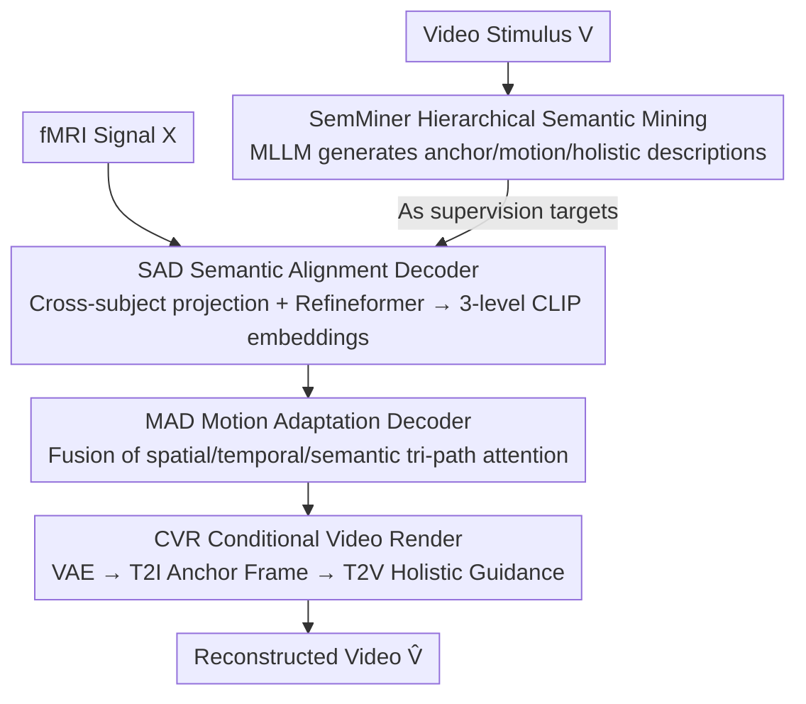

# SemVideo: Reconstructs What You Watch from Brain Activity via Hierarchical Semantic Guidance

**Conference**: CVPR 2026  
**Paper**: [CVF Open Access](https://openaccess.thecvf.com/content/CVPR2026/html/Yang_SemVideo_Reconstructs_What_You_Watch_from_Brain_Activity_via_Hierarchical_CVPR_2026_paper.html)  
**Code**: https://github.com/yang-minghan/SemVideo  
**Area**: Video Generation  
**Keywords**: fMRI video reconstruction, brain activity decoding, hierarchical semantic guidance, text-to-video diffusion, cross-subject decoding

## TL;DR
SemVideo first employs a Multi-modal Large Language Model (MLLM) to decompose video stimuli into three semantic levels: "anchor description, motion narrative, and holistic summary." It then decodes these semantics hierarchically from fMRI signals and reconstructs motion latents via tri-path attention. Finally, a text-to-video diffusion model generates the video guided by these hierarchical semantics, significantly addressing the persistent issues of "appearance mismatch" and "motion incoherence" in brain-to-video reconstruction.

## Background & Motivation

**Background**: Reconstructing external visual stimuli from brain activity (especially non-invasive fMRI) is a core task in cognitive neuroscience. Utilizing large-scale fMRI-image paired datasets like NSD and text-to-image diffusion models, brain reconstruction of **static images** has achieved high-quality results. Recently, research has extended this to **video** reconstruction, with models such as MinD-Video, NeuroClips, and Mind-Animator.

**Limitations of Prior Work**: fMRI relies on the slow blood-oxygen-level-dependent (BOLD) hemodynamic response, which integrates brain activity over several seconds, making it difficult to capture rapid motion changes in videos. Consequently, current fMRI-to-video methods typically suffer from two flaws: (i) inconsistent visual representations of salient objects across frames, leading to **appearance mismatch**; and (ii) poor temporal continuity, leading to **motion misalignment or abrupt inter-frame transitions**.

**Key Challenge**: The root cause lies in **under-specified semantic supervision**. Existing methods often lack effective video captioning models and rely on image captioning models (e.g., GIT, BLIP) to label frames individually. This produces a sequence of fragmented, static descriptions that fail to capture temporal dynamics or fine-grained semantics, resulting in incoherent and inaccurate downstream generation.

**Goal**: (1) Provide **hierarchical semantic supervision** containing both static content, motion, and global summaries for fMRI-to-video; (2) robustly decode these semantics from noisy fMRI signals with varying dimensions across subjects; (3) align motion latents with semantics to generate videos with consistent appearance and coherent motion.

**Key Insight**: Inspired by neuroscience, the human brain perceives videos **discretely** due to persistence of vision and delayed memory; strong responses are triggered only by keyframes. The brain captures key semantics rather than pixel-by-pixel details. Thus, the authors advocate for "decoding key semantic hierarchies" rather than frame-wise pixel alignment, which aligns better with the efficient nature of the human visual system.

**Core Idea**: Use hierarchical semantics (anchor/motion/holistic) as an **intermediate target** between fMRI and video. Brain signals are first decoded into these three semantic levels, which then guide T2V diffusion generation in stages.

## Method

### Overall Architecture
The input to SemVideo is fMRI signals (with corresponding video stimuli used during training for supervision), and the output is the reconstructed video. The pipeline consists of four serial stages: **SemMiner** uses an MLLM to decompose video stimuli into three-level text semantics (anchor description $C_{anchor}$, motion narrative $C_{motion}$, and holistic summary $C_{holi}$) as supervision targets; **SAD (Semantic Alignment Decoder)** decodes cross-subject fMRI signals into these three CLIP semantic embeddings; **MAD (Motion Adaptation Decoder)** reconstructs motion latents using tri-path attention guided by the decoded motion semantics; **CVR (Conditional Video Render)** feeds the motion latents, anchor frames, and holistic semantics into T2I/T2V diffusion models to render the final video.

### Key Designs

**1. SemMiner Hierarchical Semantic Mining: Extracting Three-Level Semantics via a Two-Stage "Rein-then-Expand" Process**

To address the issue of under-specified semantics from frame-wise image captioning, SemMiner utilizes an MLLM to decompose videos into three complementary perspectives: $C_{anchor}$ captures the static content of the first frame as a semantic anchor; $C_{motion}$ focuses on actions and dynamic transitions; $C_{holi}$ is the global summary of the entire video. It operates in two stages: the first stage uses an MLLM $\Psi$ to generate a basic summary $C_{basic}=\Psi(P_{basic},V)$ limited to 20 words, serving as a "rein" to prevent subsequent diversified descriptions from hallucinating (similar to restraining a runaway horse). The word limit ensures only core content is captured without introducing excessive priors. The second stage uses customized instructions $P_L$ under the condition of $V$ and $C_{basic}$ to generate the target semantics $C_L=\Psi(P_L,C_{basic},V),\ L\in\{anchor,motion,holi\}$. The authors also expanded CC2017 into the CC2017-SE dataset with these three-level descriptions. This hierarchical supervision simulates the human recall process of "capturing the gist before filling in details."

**2. SAD Semantic Alignment Decoder: Decoding fMRI into Three-Level CLIP Semantics Across Subjects**

To handle varying voxel counts across subjects and noisy fMRI signals, SAD decodes brain signals $X\in\mathbb{R}^{D_m}$ into predicted semantics $\hat{Z}(C_L)\in\mathbb{R}^{77\times768}$. It first uses a **subject-specific** projection layer $f_{SAD}^{\theta_m}$ to map $X$ of different dimensions into a unified latent space $X'$, then employs a **subject-shared** encoder $f_{SAD}$ (a four-layer MLP plus a causal Transformer called Refineformer) to map to the CLIP text feature space. Refineformer utilizes a diffusion-denoising objective $\mathcal{L}_{refine}=\mathbb{E}_{t}\|f^{Refine}_{SAD}(Z^t_L,t,f^{MLP}_{SAD}(X'))-Z(C_L)\|^2$ to maximize the extraction of meaningful neural activity and suppress noise. The total training objective is $\mathcal{L}_{SAD}=\lambda_{refine}\mathcal{L}_{refine}+\lambda_{SoftCLIP}\mathcal{L}_{SoftCLIP}+\mathcal{L}_{MSE}$, where SoftCLIP is a soft-label contrastive loss aligning predicted and ground-truth semantics within a batch, and MSE is used for direct regression. The "specific projection + shared mapping" design allows a single model to process multiple subjects while preserving individual differences.

**3. MAD Motion Adaptation Decoder: Tri-path Attention Aligning Motion Latents with Structure and Semantics**

To address the low temporal resolution of fMRI and the difficulty of reconstructing coherent actions, MAD first uses a subject-specific projection $f^{proj}_{MAD}$ to map $X$ into a latent space, obtaining frame sequence embeddings $S$ via a Motion Embedder. It then performs **tri-path fusion attention**: (i) Spatial Self-Attention $E_{spat}=\mathrm{Softmax}(Q_{spat}K^\top_{spat}/\sqrt{d})V_{spat}$ captures intra-frame structure; (ii) Temporal Self-Attention models inter-frame dependencies along the time axis; (iii) **Semantic-guided Cross-Attention** $E_{cross}=\mathrm{Softmax}(Q_{cross}K^\top_{cross}/\sqrt{d})V_{cross}$, where key/value are provided by the motion semantics $\hat{Z}(C_{motion})$ decoded by SAD, explicitly injecting semantic priors into the attention mechanism. The weighted sum $\hat{e}_i=\lambda_{spat}e^{spat}_i+\lambda_{temp}e^{temp}_i+e^{cross}_i$ yields the motion latent for each frame. Training utilizes L1 reconstruction and bidirectional contrastive loss, ensuring that reconstructed latents $\hat{e}_i$ are close to ground truth $e_i$ and distinguishable within the sequence, thereby aligning "spatial structure + semantic action."

**4. CVR Conditional Video Render: Hierarchically Injecting Cues into Diffusion Generation**

To stably transform decoded semantics/motion into coherent videos, CVR is a sequential inference framework that integrates fMRI cues step-by-step. First, the motion latents $\hat{E}(X)$ from MAD are decoded by a pre-trained VAE into a sequence of (blurry) motion frames $\{I^{motion}_i\}$. Next, the anchor semantics $\hat{Z}(C_{anchor})$ and the first motion frame are fed into a T2I model to generate a clear initial anchor frame $\hat{v}_1$. Finally, a pre-trained T2V generator (using AnimateDiff) is **jointly guided** by the holistic semantics $\hat{Z}(C_{holi})$, the anchor frame $\hat{v}_1$, and the motion frame sequence to synthesize the final video $\hat{V}=\Phi(\hat{Z}(C_{anchor}),\hat{Z}(C_{holi}),\hat{E}(X))$, which is both temporally smooth and semantically faithful. This progressive conditioning of "coarse motion, then anchor frame, then holistic completion" corresponds directly to the anchor/motion/holistic semantic levels.

## Key Experimental Results

The datasets used are CC2017 (3 subjects viewing 23 high-definition natural clips, 3T fMRI) and a subset of HCP 7T (3 subjects). Evaluation is divided into three levels: Semantic-level (2-way/50-way retrieval, I=frame-level/V=video-level; VIFI-score is the cosine similarity of VIFICLIP features), Pixel-level (SSIM, PSNR, Hue-PCC), and Spatiotemporal-level (CLIP-PCC, the similarity of adjacent frame CLIP embeddings, set to 0 if VIFI < 0.6 to prevent inflated scores; EPE, the average endpoint error of predicted vs. ground-truth optical flow, lower is better). ⚠️ Metric definitions follow the original text.

### Main Results (CC2017, Selected Representative Metrics)

| Method | 2-way-V↑ | 50-way-V↑ | VIFI↑ | SSIM↑ | Hue-pcc↑ | CLIP↑ | EPE↓ |
|------|----------|-----------|-------|-------|----------|-------|------|
| Mind-Video (NeurIPS'23) | 0.848 | 0.197 | 0.593 | 0.177 | 0.768 | 0.409 | 6.125 |
| NeuroClips (NeurIPS'25) | 0.834 | 0.220 | 0.602 | **0.390** | 0.812 | 0.513 | 4.833 |
| Mind-Animator (ICLR'25) | 0.830 | 0.186 | **0.608** | 0.321 | 0.786 | 0.425 | 5.422 |
| NEURONS (ICCV'25) | 0.853 | 0.246 | 0.597 | 0.285 | 0.830 | 0.482 | 4.827 |
| **SemVideo (Ours)** | **0.865** | **0.264** | **0.608** | 0.321 | **0.849** | **0.526** | **4.788** |

SemVideo achieves SOTA on 8 out of 10 metrics: Semantic-level 2-way-V (0.865) and 50-way-V (0.264) lead the field, with VIFI tied at 0.608 with Mind-Animator. For Pixel-level, Hue-pcc (0.849) is highest, while SSIM/PSNR are close to optimal. For Spatiotemporal-level, CLIP (0.526) is highest and EPE (4.788) is lowest, indicating the best motion coherence. Similar optimal semantic and spatiotemporal metrics were achieved on the HCP dataset, verifying cross-dataset generalization.

### Ablation Study (Removing different SAD semantic decoding targets, CC2017)

| Configuration | 2-way-V↑ | 50-way-V↑ | VIFI↑ | Hue-pcc↑ | CLIP↑ | EPE↓ |
|------|----------|-----------|-------|----------|-------|------|
| Ours (full) | **0.860** | **0.239** | **0.590** | **0.841** | **0.502** | 4.768 |
| w/o $C_{anchor}$ | 0.808 | 0.147 | 0.534 | 0.835 | 0.488 | 4.796 |
| w/o $C_{holi}$ | 0.849 | 0.221 | 0.584 | 0.834 | 0.490 | 4.859 |
| w/o $C_{motion}$ | 0.846 | 0.216 | 0.583 | 0.741 | 0.481 | **4.930** |

### Key Findings
- All three semantic levels are indispensable but serve different roles: removing $C_{anchor}$ causes the sharpest drop in semantic metrics (50-way-V 0.239 → 0.147), indicating that anchor descriptions are the primary pillar for object appearance consistency. Removing $C_{motion}$ significantly degrades Hue-pcc and EPE (EPE 4.768 → 4.930), confirming that motion narratives specifically manage spatiotemporal coherence.
- SemVideo's strength lies in spatiotemporal coherence (first in both CLIP and EPE), enabling the reconstruction of continuous actions (e.g., "a person turning their head") that were challenging for prior works. This validates the effectiveness of the "hierarchical semantic intermediate target + tri-path attention" approach for motion misalignment.
- Pixel-level metrics like SSIM/PSNR are not universally highest (slightly lower than NeuroClips), suggesting the method prioritizes semantic and motion fidelity over pixel-by-pixel low-level accuracy—consistent with its goal of "decoding key semantics."

## Highlights & Insights
- **Using "hierarchical semantics" as an intermediate target** between fMRI and video is the core "aha" moment: it bypasses the deadlock of "pixel-wise alignment of low temporal resolution fMRI" while using anchor/motion/holistic perspectives to specifically address appearance consistency and motion coherence.
- **The two-stage "rein-then-expand" prompting in SemMiner** is clever; using a 20-word rein to prevent MLLM hallucination is a reusable technique for controlling the open-ended generation of large models.
- **The subject-specific projection + subject-shared mapping** architecture allows a single framework to handle multiple subjects while accounting for individual differences, serving as a practical paradigm for brain decoding where voxel counts vary.

## Limitations & Future Work
- Heavy reliance on an external pre-trained chain of models (MLLM for labeling, CLIP, VAE, T2I, T2V/AnimateDiff); generation quality and errors are constrained by these models, and SemMiner's annotation quality determines the supervision ceiling.
- Validated only on 3 subjects each for CC2017 and HCP; generalization across more subjects/different acquisition devices and robustness to individual differences remain limited.
- Pixel-level fidelity (SSIM/PSNR) is not leading across the board, which may be insufficient for scenarios requiring fine low-level details. The inherent slow hemodynamic bottleneck of fMRI also limits the reconstruction of extremely fast motions.

## Related Work & Insights
- **vs. MinD-Video / Brain Netflix (Masked brain modeling mapped to unified latent space)**: These map fMRI to a single latent space to drive diffusion with coarse semantic supervision. SemVideo uses explicit hierarchical text semantics as intermediate targets to manage appearance and motion separately.
- **vs. NeuroClips / Mind-Animator (Aligning CLIP/VAE deep features)**: These align with pre-trained deep features but still lack formal semantic constraints and have poor motion coherence. SemVideo's SemMiner provides fine-grained motion narratives + MAD semantic-guided attention, yielding significantly better spatiotemporal coherence (CLIP/EPE).
- **vs. Early frame-wise image captioning supervision**: Static frame-level descriptions fail to capture dynamics and fine semantics. SemVideo's motion narrative $C_{motion}$ and holistic summary $C_{holi}$ fill this gap.

## Rating
- Novelty: ⭐⭐⭐⭐ The "hierarchical semantics as an intermediate target + tri-path attention motion decoding" is a targeted new combination in fMRI-to-video, though underlying modules are largely mature components.
- Experimental Thoroughness: ⭐⭐⭐⭐ Two datasets, three levels of 10 metrics, including semantic target ablation and ROI visualization; quite thorough, though the subject sample size is small.
- Writing Quality: ⭐⭐⭐⭐ Motivation and hierarchical semantic narrative are clear with complete diagrams, though some formulas and notation should be verified against the original text.
- Value: ⭐⭐⭐⭐ Sets new SOTA on most metrics for brain-to-video reconstruction and releases the CC2017-SE dataset, benefiting neural decoding and BCI research.

<!-- RELATED:START -->

## Related Papers

- [\[CVPR 2026\] What Are You Doing? A Closer Look at Controllable Human Video Generation](what_are_you_doing_a_closer_look_at_controllable_human_video_generation.md)
- [\[CVPR 2026\] CineBrain: A Large-Scale Multi-Modal Audiovisual Brain Dataset for Brain-Conditioned Video Generation](cinebrain_a_large-scale_multi-modal_audiovisual_brain_dataset_for_brain-conditio.md)
- [\[CVPR 2026\] ActivityForensics: A Comprehensive Benchmark for Localizing Manipulated Activity in Videos](activityforensics_a_comprehensive_benchmark_for_localizing_manipulated_activity_.md)
- [\[ICML 2026\] iTryOn: Mastering Interactive Video Virtual Try-On with Spatial-Semantic Guidance](../../ICML2026/video_generation/itryon_mastering_interactive_video_virtual_try-on_with_spatial-semantic_guidance.md)
- [\[CVPR 2026\] YOSE: You Only Select Essential Tokens for Efficient DiT-based Video Object Removal](yose_you_only_select_essential_tokens_for_efficient_dit-based_video_object_remov.md)

<!-- RELATED:END -->
