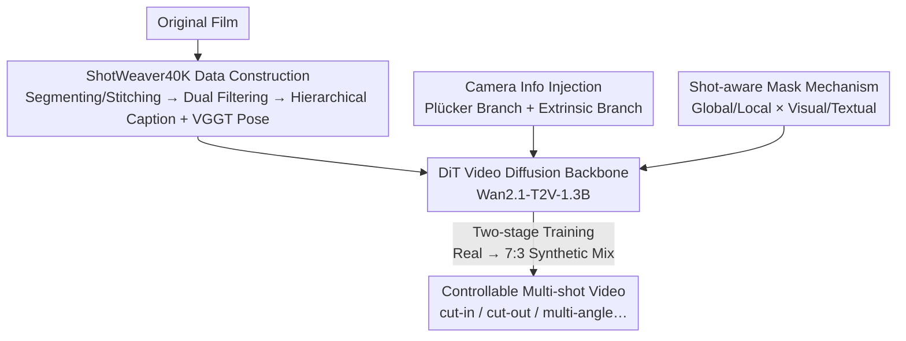

# ShotDirector: Directorially Controllable Multi-Shot Video Generation with Cinematographic Transitions

**Conference**: CVPR 2026  
**Paper**: [CVF Open Access](https://openaccess.thecvf.com/content/CVPR2026/html/Wu_ShotDirector_Directorially_Controllable_Multi_Shot_Video_Generation_with_Cinematographic_Transitions_CVPR_2026_paper.html)  
**Code**: [Project Page](https://uknowsth.github.io/ShotDirector/)  
**Area**: Video Generation / Diffusion Models  
**Keywords**: Multi-shot video generation, Shot transition, Camera control, Diffusion models, Film editing

## TL;DR
ShotDirector treats "how transitions should be edited" as a controllable signal, injecting parameter-level camera poses (dual-branch Plücker + extrinsic) and hierarchical editing mode-aware prompts (shot-aware mask) into a video diffusion model. This allows for generating professional multi-shot videos with cinematographic transitions such as cut-in, cut-out, shot-reverse-shot, and multi-angle scenes based on directorial intent.

## Background & Motivation
**Background**: While diffusion-based single-shot video generation has achieved high-fidelity and temporal consistency, the research focus is shifting toward **multi-shot video generation** to tell cinematic stories through shot transitions. Existing approaches generally fall into two categories: shot-by-shot methods (StoryDiffusion, VideoStudio, VGoT) that generate and concatenate frames with external consistency constraints, and end-to-end methods (Mask2DiT, CineTrans, LCT, MoGA) that modify diffusion models to allow cross-shot interaction.

**Limitations of Prior Work**: Both categories focus primarily on "low-level visual consistency" (preserving character appearance and style) while **completely ignoring transition design**. Shot-by-shot methods prioritize related frames over transition exploration. End-to-end methods treat transitions as "abrupt frame changes," which lack both controllability and semantic intent. Consequently, shots transition mechanically without adhering to professional film-editing patterns.

**Key Challenge**: Transitions are the core of directorial language, determining **how the next shot unfolds** (e.g., zooming in for a cut-in, pulling back for a cut-out, or switching perspectives in a shot-reverse-shot). Current models lack: ① Precise parameterized control over 6-DoF camera motion (the physical basis of transitions) and ② High-level semantic understanding of editing patterns (the narrative function of the transition). A flat text prompt fails to convey where the camera goes or the type of transition intended.

**Goal**: To explicitly model "transition design" as a controllable condition, enabling the model to manage precise camera movement and understand professional editing patterns for narratively coherent cinematic videos.

**Core Idea**: Control transitions via two complementary perspectives: **parameter-level camera settings** (dual-branch injection of 6-DoF poses and intrinsics) and **semantic-level hierarchical prompts** (shot-aware masks for structured global/local and visual/textual alignment). These priors are introduced through the **ShotWeaver40K** dataset, which is annotated with professional editing patterns.

## Method

### Overall Architecture
ShotDirector utilizes Wan2.1-T2V-1.3B (a DiT video diffusion model) as its backbone to produce multi-shot videos with professional transitions. The pipeline consists of three components: constructing the **ShotWeaver40K** dataset with fine-grained editing labels (extracted from films, filtered, captioned via GPT-5-mini, and pose-estimated via VGGT); injecting two conditional signals into the DiT—**Camera Info Injection** via a dual-branch (Plücker + extrinsic) system to encode poses into visual tokens, and a **Shot-aware Mask mechanism** that uses an attention mask to align global/local information; and finally, a **two-stage training strategy** (real data followed by a synthetic mix) to stabilize camera-guided generation.

### Key Designs

**1. ShotWeaver40K: A Transition-Aware Dataset with Explicit "Editing Patterns"**

The inability of models to learn professional transitions stems from the lack of "transition type" and "camera motion" labels in training data. The authors designed a pipeline (Fig. 3a): shot segmentation cuts films into single shots, followed by similar-segment stitching to create coherent sequences. Two filters are applied: **Baseline filtering** (resolution, frame rate, and aesthetics, specifically focusing on clarity near transitions) and **Transition filtering** (ensuring content changes significantly but maintains causal/spatial continuity). Annotation involves GPT-5-mini for hierarchical captions (subject, overall description, per-shot description, and transition type) and VGGT for relative 6-DoF camera matrices. The dataset focuses on four cinematic transitions: **shot/reverse shot**, **cut-in**, **cut-out**, and **multi-angle**.

**2. Camera Info Injection: 6-DoF Poses as Physical Transition Conditions**

Transitions rely heavily on camera movement, which flat prompts cannot describe precisely. The authors inject camera poses via a **dual-branch** system. Poses are defined by intrinsics $K\in\mathbb{R}^{3\times3}$ and extrinsics $E=[R;t]\in\mathbb{R}^{3\times4}$. The **Extrinsic Branch** uses an MLP to inject flattened extrinsics:

$$C_{\text{extrinsic}}=MLP(\text{flatten}(E))$$

The **Plücker Branch** encodes the sightline of each pixel $(u,v)$ into a 6D Plücker representation:

$$p_{u,v}=(o\times d_{u,v},\,d_{u,v})\in\mathbb{R}^6,\qquad d_{u,v}=RK^{-1}[u,v,1]^T$$

where $o$ is the camera center and $d_{u,v}$ is the normalized direction. The Plücker embedding $P\in\mathbb{R}^6$ is processed by a convolution $C_{\text{Plücker}}=Conv(P)$. Both signals are added to visual tokens $z_i$ before self-attention: $z_i'=z_i+C_{\text{extrinsic},i}+C_{\text{Plücker},i}$. This combination allows the model to refine viewpoint switching while suppressing unintended jumps.

**3. Shot-aware Mask Mechanism: Structured Alignment of Global/Local and Visual/Textual Contexts**

To ensure the model understands editing modes, a **shot-aware mask** constrains attention interactions:

$$\mathrm{Attn}_{\text{shot-aware}}(z_i')=\mathrm{Attn}(q_{z_i'},K^*,V^*),\quad K^*=[K^{global}_i,K^{local}_i],\ V^*=[V^{global}_i,V^{local}_i]$$

Visually, **local** refers to tokens within the current shot, while **global** refers to the first frame's tokens (allowing the model to see overall scene context). Textually, **local** includes shot-specific descriptions, while **global** includes shared subject attributes and the **transition semantics**. This structured visibility ensures subject consistency across shots while providing the transition prior.

### Loss & Training
The model is trained based on [41]. The extrinsic branch is initialized with a camera encoder [4] via a zero-initialized MLP transfer layer; the Plücker branch is randomly initialized. **Two-stage training** is employed: Stage I trains on ShotWeaver40K ($1\times10^{-4}$ lr, 10,000 steps) to learn transitions; Stage II mixes real and SynCamVideo synthetic data (7:3 ratio, $5\times10^{-5}$ lr, 3,000 steps) to strengthen camera-based auxiliary guidance.

## Key Experimental Results

### Main Results

| Method | Trans. Confidence↑ | Type Accuracy↑ | Aesthetics↑ | FVD↓ | Visual Consistency↑ |
|:---|:---:|:---:|:---:|:---:|:---:|
| Mask2DiT | 0.2233 | 0.2033 | 0.5958 | 69.49 | 0.7779 |
| CineTrans | 0.7976 | 0.3944 | 0.6305 | 71.89 | 0.7851 |
| Phantom | - | 0.6211 | 0.6183 | 86.61 | 0.5709 |
| HunyuanVideo | 0.4698 | 0.3222 | 0.6101 | 69.88 | 0.6601 |
| Wan2.2 | 0.2165 | 0.1022 | 0.5885 | 69.48 | 0.7547 |
| SynCamMaster | - | 0.3033 | 0.5453 | 72.47 | **0.8418** |
| **Ours** | **0.8956** | **0.6744** | **0.6374** | **68.45** | 0.8251 |

ShotDirector significantly leads in transition control (0.8956 vs. 0.7976 for CineTrans) and type accuracy. While SynCamMaster has high visual consistency (0.8418), it suffers in aesthetics (0.5453), suggesting consistency came at the cost of fidelity. Our model ranks second in consistency while maintaining high quality.

### Ablation Study

| Configuration | Trans. Confidence↑ | Type Accuracy↑ | FVD↓ | Visual Consistency↑ |
|:---|:---:|:---:|:---:|:---:|
| Full Model | 0.8956 | 0.6744 | 68.45 | 0.8251 |
| w/o Shot-aware Mask | 0.7572 | 0.5422 | 70.36 | 0.7910 |
| w/o Visual Mask | 0.8044 | 0.5583 | 69.47 | 0.8052 |
| w/o Semantic Mask | 0.8913 | 0.6428 | 71.54 | 0.7761 |
| w/o Stage II Training | 0.8615 | 0.6300 | 68.97 | 0.8076 |

**Visual masks** have a greater impact on transition control (dropping to 0.8044 if omitted), whereas **semantic masks** primarily influence consistency.

### Key Findings
- **Visual vs. Semantic Mask Division**: Omitting visual masks leads to information leakage across shots, flattening transitions. Semantic masks ensure "global" attributes (subjects) remain consistent.
- **"High Consistency" as a False Signal**: An untrained model might show high visual consistency (0.8256) simply because it fails to switch shots (confidence: 0.1402). Consistency must be evaluated alongside transition control.
- **Two-stage Training Benefits**: Incorporating 30% synthetic data in Stage II improves camera controllability and overall quality, compensating for noise in real-world pose estimation.

## Highlights & Insights
- **Transitions as First-Class Citizens**: Unlike prior work focusing only on character consistency, ShotDirector introduces "editing patterns + camera motion" as primary control signals.
- **Dual-branch Camera Injection**: Combining extrinsic MLPs (orientation) with Plücker convolutions (pixel-level rays) provides a reusable template for 6-DoF control in any DiT-based video/3D generation task.
- **Attention Masking for Balance**: The shot-aware mask elegantly balances global consistency and local diversity by structuring token visibility rather than relying on heavy loss functions.

## Limitations & Future Work
- **Transition Types**: Currently limited to four common types. Specialized edits like match cuts or fades are not yet covered.
- **Sequence Length**: Evaluation focused on short sequences; maintaining quality over long narratives remains a challenge.
- **Annotation Dependency**: Dependence on GPT-5-mini and VGGT means errors in these tools propagate to the model.
- **Base Model Size**: Built on the 1.3B DiT backbone; higher resolutions or more complex visuals are limited by the base model capacity.

## Related Work & Insights
- **vs. Mask2DiT / CineTrans**: These lack parameter-level camera control and treat transitions as abrupt changes. Ours improves transition confidence from 0.7976 to 0.8956.
- **vs. StoryDiffusion / VGoT**: These are "shot-by-shot" and focus on ID preservation rather than the transition itself.
- **vs. SynCamMaster**: While SynCamMaster controls cameras, it lacks semantic "editing mode" awareness and suffers from lower aesthetic quality.

## Rating
- Novelty: ⭐⭐⭐⭐
- Experimental Thoroughness: ⭐⭐⭐⭐
- Writing Quality: ⭐⭐⭐⭐
- Value: ⭐⭐⭐⭐

<!-- RELATED:START -->

## Related Papers

- [\[CVPR 2026\] MultiShotMaster: A Controllable Multi-Shot Video Generation Framework](multishotmaster_a_controllable_multi-shot_video_generation_framework.md)
- [\[CVPR 2026\] OneStory: Coherent Multi-Shot Video Generation with Adaptive Memory](onestory_coherent_multi-shot_video_generation_with_adaptive_memory.md)
- [\[CVPR 2026\] STAGE: Storyboard-Anchored Generation for Cinematic Multi-shot Narrative](stage_storyboard-anchored_generation_for_cinematic_multi-shot_narrative.md)
- [\[CVPR 2026\] HoloCine: Holistic Generation of Cinematic Multi-Shot Long Video Narratives](holocine_holistic_generation_of_cinematic_multi-shot_long_video_narratives.md)
- [\[CVPR 2026\] StoryTailor: A Zero-Shot Pipeline for Action-Rich Multi-Subject Visual Narratives](storytailora_zero-shot_pipeline_for_action-rich_multi-subject_visual_narratives.md)

<!-- RELATED:END -->
## Related Papers

- [\[CVPR 2026\] MultiShotMaster: A Controllable Multi-Shot Video Generation Framework](multishotmaster_a_controllable_multi-shot_video_generation_framework.md)
- [\[CVPR 2026\] OneStory: Coherent Multi-Shot Video Generation with Adaptive Memory](onestory_coherent_multi-shot_video_generation_with_adaptive_memory.md)
- [\[CVPR 2026\] STAGE: Storyboard-Anchored Generation for Cinematic Multi-shot Narrative](stage_storyboard-anchored_generation_for_cinematic_multi-shot_narrative.md)
- [\[CVPR 2026\] HoloCine: Holistic Generation of Cinematic Multi-Shot Long Video Narratives](holocine_holistic_generation_of_cinematic_multi-shot_long_video_narratives.md)
- [\[CVPR 2026\] StoryTailor: A Zero-Shot Pipeline for Action-Rich Multi-Subject Visual Narratives](storytailora_zero-shot_pipeline_for_action-rich_multi-subject_visual_narratives.md)

<!-- RELATED:END -->
