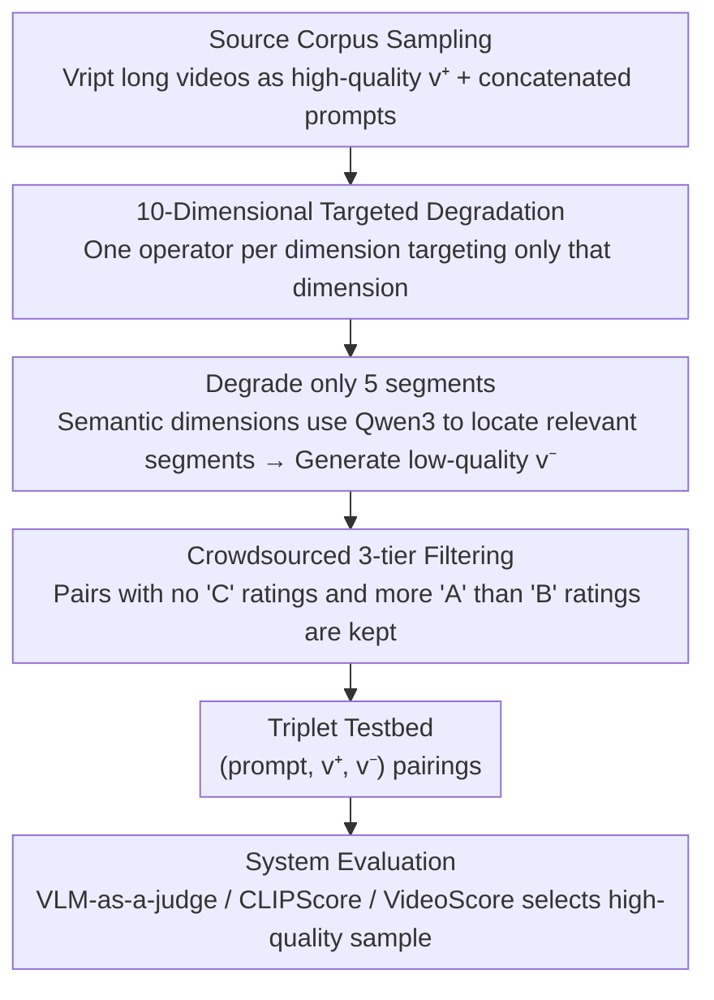

# SLVMEval: Synthetic Meta Evaluation Benchmark for Text-to-Long Video Generation

**Conference**: CVPR 2026  
**arXiv**: [2603.29186](https://arxiv.org/abs/2603.29186)  
**Code**: [https://slvmeval.github.io/](https://slvmeval.github.io/)  
**Area**: Video Generation  
**Keywords**: Long video generation evaluation, meta-evaluation benchmark, text-to-video, synthetic degradation, VLM-as-a-judge

## TL;DR

Proposes the SLVMEval meta-evaluation benchmark, which tests the ability of existing T2V evaluation systems to identify quality differences in long videos (up to ~3 hours). By synthesizing controlled "high-quality vs. low-quality" video pairs from dense video captioning datasets, it reveals that humans achieve 84.7%-96.8% accuracy across 10 dimensions, while existing automated systems lag behind in 9/10 dimensions.

## Background & Motivation

1. **Background**: Text-to-Video (T2V) models are evolving from short videos (seconds) to long videos (minutes to hours). Systems like StreamingT2V and Phenaki can theoretically generate videos of arbitrary length.
2. **Limitations of Prior Work**: Common evaluation metrics such as VideoScore were originally designed for short clips (seconds to tens of seconds), leading to length mismatch issues in long video evaluation. Meta-benchmarks like VBench and UVE only cover ~10s videos, failing to verify the reliability of metrics for long videos.
3. **Key Challenge**: While long video generation is becoming a frontier, there is a lack of testing environments to verify the basic evaluation capabilities of systems for long video quality.
4. **Goal**: Construct a meta-evaluation benchmark specifically for long videos to test whether existing evaluation systems possess at least the quality judgment capabilities easily achieved by humans.
5. **Key Insight**: Starting from dense video description datasets, controlled degradations (e.g., reduced contrast, lower resolution, deleted segments) are applied to original videos to build pair-wise contrastive experiments, with crowdsourcing used to verify perceivability.
6. **Core Idea**: Synthesize long video pairs with controllable degradation to test the evaluation bottleneck where "humans distinguish easily, but automated systems fail."

## Method

### Overall Architecture

SLVMEval addresses a fundamental question: Can current T2V evaluation systems detect quality differences in long videos that are obvious to humans? To create "obvious" differences, the authors do not generate long videos (as generation itself is uncontrollable). Instead, they sample real long videos from the Vript dense captioning dataset as high-quality samples $v^+$ and inject specific defects to produce low-quality samples $v^-$. The pipeline consists of: sampling original videos $\rightarrow$ applying controlled degradation for a specific dimension $\rightarrow$ crowdsourced filtering of non-obvious pairs $\rightarrow$ using the remaining $(p, \{v^+, v^-\})$ triplets to test evaluation systems. The testing method is straightforward: provide the same prompt with one good and one bad video to an evaluator (automated or human) and measure the accuracy in selecting the high-quality one.

### Key Designs

**1. Dimensional "Targeted Degradations": Ensuring defects affect only one capability**

Uniformly blurring a video makes it impossible to distinguish if a system fails on image quality or semantics. The authors decompose evaluation capabilities into two categories across ten dimensions, each paired with a degradation operator that only affects that specific dimension. Video quality dimensions use traditional image processing: lowering contrast for Aesthetics, lowering resolution for Technical Quality, using OpenCV for Oil Painting/Manga styles for Appearance Style, and removing the foreground with rembg to paste a random background for Background Consistency. Video-Text Alignment dimensions require semantic manipulation: shuffling 5 consecutive segments for Temporal Flow, randomly deleting 5 segments for Completeness, using GroundingDINO and Stable Diffusion Inpainting to erase prompt-mentioned objects for Object Integrity, horizontally flipping segments with left/right descriptions for Spatial Relationship, replacing motion segments with static frames for Dynamic Degree, and using Qwen-Image-Edit to change object colors for Color. This setup allows failures to be cleanly attributed to missing specific capabilities.

**2. Degrading only 5 segments: Eliciting "non-uniform quality" inherent to long videos**

Uniformly degrading an entire long video is unrealistic and too easy to identify. In real T2V generation, quality is often inconsistent and locally flawed. Thus, degradation is randomly applied to only 5 selected segments (Algorithm 1). For semantic-dependent dimensions, segments are selected by using Qwen3-8B to identify relevant parts (e.g., those mentioning colors or spatial relations) before applying degradation. This local degradation tests whether an evaluation system can locate localized issues within a long video and aggregate sparse signals into a global judgment—a task never required by short video metrics.

**3. Three-tier Crowdsourced Filtering: Ensuring human-level discriminability**

The benchmark assumes "easy for humans, hard for machines." Thus, it must be confirmed that humans can indeed distinguish the pairs. Five crowdsourced workers rate each pair across three tiers: A (all selected segments successfully degraded), B (partially successful), and C (complete failure). Only pairs with no C ratings and more A than B ratings are retained. This resulted in 3,932 pairs. A secondary finding was that system performance before and after filtering is highly correlated, suggesting the expensive manual filtering could be bypassed in future expansions.

### Evaluation System Comparison

SLVMEval is a benchmark rather than a training method. It compares the following categories:
- **Video-based VLM-as-a-judge**: GPT-5, GPT-5-mini, Qwen3-VL-235B directly judging video pairs.
- **Text-based VLM-as-a-judge**: VLMs generate descriptions, then LMs compare description-prompt alignment.
- **CLIPScore**: Average CLIP similarity between center frames of segments and the prompt.
- **VideoScore v1.1**: Quality scoring based on a VLM+Regression head.

## Key Experimental Results

### Main Results

Comparison of accuracy (%) across systems (representative dimensions):

| System | Aesthetics | Tech Quality | Object Integrity | Temporal Flow | Dynamic Degree |
|------|------|---------|-----------|--------|---------|
| GPT-5 (video) | **90.1** | **85.8** | 72.0 | 50.3 | 35.3 |
| GPT-5 (text) | 74.8 | 46.2 | 68.0 | 43.5 | 43.1 |
| CLIPScore | 56.4 | 72.3 | **76.0** | 50.5 | 51.7 |
| VideoScore | 52.5 | 33.8 | 66.0 | 46.3 | 48.6 |
| **Human** | **96.5** | **91.8** | **86.6** | **86.6** | **95.9** |

### Ablation Study

Pearson correlation ($\rho_P$) of system accuracy before and after manual filtering:

| Dimension | Correlation $\rho_P$ |
|------|-------------------|
| Aesthetics | High Correlation |
| Tech Quality | High Correlation |
| Object Integrity | High Correlation |

(All 10 dimensions show strong positive correlation, proving the feasibility of producing a reliable benchmark without filtering.)

Relationship between video duration and accuracy:

| Trend | Explanation |
|------|------|
| Most Dimensions | Accuracy of automated systems decreases as video length increases. |
| Dynamic Degree | Weak correlation (accuracy is already low/fails even on short videos). |

### Key Findings

- **Semantics and Temporal dimensions are the biggest bottlenecks**: Accuracy for Dynamic Degree (GPT-5 at 35.3%, below random 50%), Temporal Flow (50.3% $\approx$ random), and Completeness (51.3% $\approx$ random) indicates current systems cannot reason across frames regarding motion and event sequences.
- **Video-based GPT-5 is strongest in visual quality**: High performance in Aesthetics (90.1%) and Background Consistency (98.9%), though still lower than humans.
- **CLIPScore shows unexpected advantages in local integrity**: CLIP's contrastive pre-training makes it sensitive to the disappearance of prompt-mentioned objects (76.0% in Object Integrity), but its frame-independent processing yields near-random results in temporal dimensions.
- **Text-based approaches outperform Video-based in some dimensions**: Text-based Qwen3 leads Video-based by 23.3 pts in Background Consistency and 17.1 pts in Appearance Style, suggesting video-to-text projection benefits certain evaluations.
- **Dataset Statistics**: 3,932 video pairs, average duration of 1,141s (~19 mins), maximum duration of 10,486s (~2 hours 54 mins), average prompt length of 57,884 characters.

## Highlights & Insights

- **"Minimum Requirement" Test Philosophy**: Rather than asking for advanced judgments, the benchmark asks if systems can perform tasks humans find trivial. This "floor test" exposes fundamental flaws more effectively than complex tests.
- **Scalability of Synthetic Degradation**: The finding that manual filtering isn't strictly necessary for reliable benchmarking lowers the barrier for constructing large-scale T2LV evaluation benchmarks.
- **First expansion to hour-level video evaluation**: Covering videos up to 3 hours, it fills the gap in validating long video evaluation metrics compared to existing benchmarks limited to seconds.

## Limitations & Future Work

- Synthetic degradations may not fully simulate real T2V generation artifacts (e.g., semantic drift, character inconsistency).
- Source videos are real rather than AI-generated, missing specific T2V artifacts like flickering or warping.
- Degradation was only applied to 5 segments; the impact of degradation density was not fully explored.
- Large models like GPT-5 are limited by context length and cannot process every frame, losing inter-frame details.
- The Spearman correlation p-values for duration were not significant at the 0.05 level, implying duration effects are "trends" rather than strong effects.

## Related Work & Insights

- **vs VBench**: VBench provides 16-dimensional fine-grained human annotations but is limited to 3.3s. SLVMEval covers 10 dimensions but scales to hour-long videos; the two are complementary.
- **vs UVE-Bench**: Focuses on LM-based meta-evaluation but with a maximum video length of only 6.1s. SLVMEval’s durations are over 1700x longer.
- **vs VideoScore**: As a test subject, VideoScore performs poorly on SLVMEval, confirming the need for metrics specifically designed for long videos.

## Rating

- Novelty: ⭐⭐⭐⭐ First T2V meta-evaluation benchmark for long videos; synthetic degradation + filtering methodology is valuable.
- Experimental Thoroughness: ⭐⭐⭐⭐ Comprehensive comparison of 8 systems across 10 dimensions, including human baselines and duration analysis.
- Writing Quality: ⭐⭐⭐⭐ Clear definitions and easy-to-understand Algorithm 1.
- Value: ⭐⭐⭐⭐ Precisely identifies bottlenecks in long video evaluation (semantics + temporal), providing a clear research direction for the community.

<!-- RELATED:START -->

## Related Papers

- [\[CVPR 2026\] VGA-Bench: A Unified Benchmark and Multi-Model Framework for Video Aesthetics and Generation Quality Evaluation](vga-bench_a_unified_benchmark_and_multi-model_framework_for_video_aesthetics_and.md)
- [\[CVPR 2026\] VideoRealBench: A Chain-of-Thought Realism Evaluation Benchmark for Generated Human-Centric Videos](videorealbench_a_chain-of-thought_realism_evaluation_benchmark_for_generated_hum.md)
- [\[CVPR 2026\] SVBench: Evaluation of Video Generation Models on Social Reasoning](svbench_evaluation_of_video_generation_models_on_social_reasoning.md)
- [\[ICML 2026\] V2V-Bench: A Comprehensive Benchmark for Video-to-Video Generation Evaluation](../../ICML2026/video_generation/v2v-bench_a_comprehensive_benchmark_for_video-to-video_generation_evaluation.md)
- [\[CVPR 2026\] Ref4D-VideoBench: Four-Dimensional Reference-Based Evaluation of Text-to-Video Generative Models](ref4d-videobench_four-dimensional_reference-based_evaluation_of_text-to-video_ge.md)

<!-- RELATED:END -->
