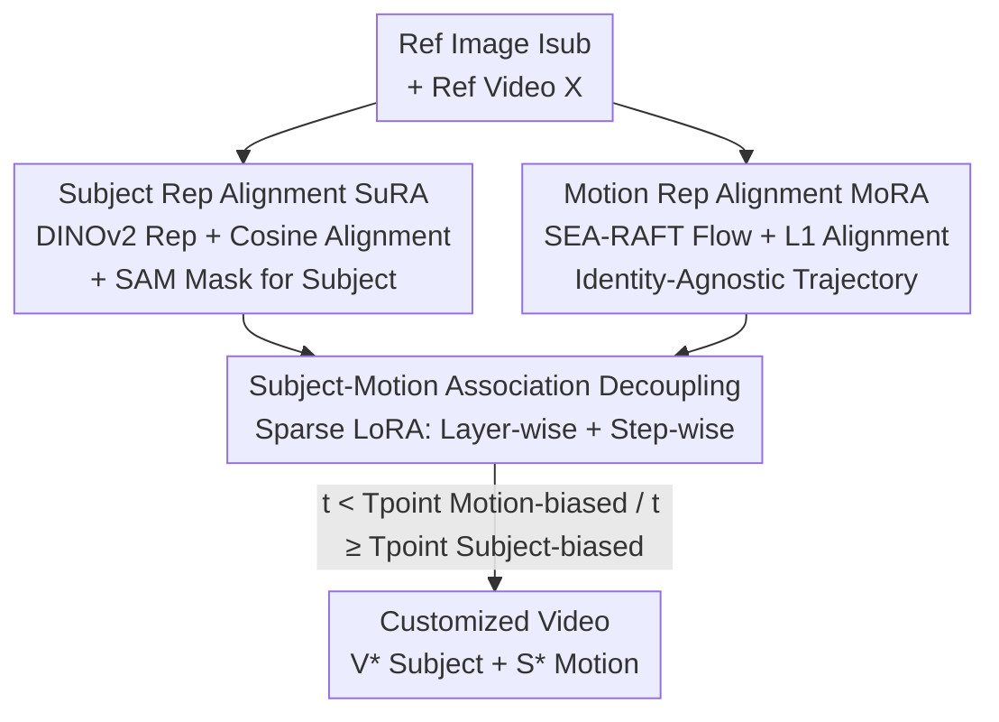

# SMRABooth: Subject and Motion Representation Alignment for Customized Video Generation

**Conference**: CVPR 2026  
**Paper**: [CVF Open Access](https://openaccess.thecvf.com/content/CVPR2026/html/Xu_SMRABooth_Subject_and_Motion_Representation_Alignment_for_Customized_Video_Generation_CVPR_2026_paper.html)  
**Code**: [Project Page](https://smrabooth.github.io)  
**Area**: Video Generation / Customized Generation  
**Keywords**: Customized Video Generation, Subject Alignment, Motion Alignment, Optical Flow, Sparse LoRA

## TL;DR
SMRABooth utilizes a self-supervised visual encoder (DINOv2) and an optical flow encoder (SEA-RAFT) to provide object-level alignment targets for "subject appearance" and "object motion," respectively. A "cross-layer + cross-timestep" sparse LoRA injection strategy is then employed to decouple the two, achieving simultaneous subject fidelity and motion consistency in DiT video diffusion models.

## Background & Motivation

**Background**: Customized video generation requires two tasks: preserving the subject appearance from a reference image and replicating motion patterns from a reference video, allowing for the free combination of any subject and motion (e.g., "Terracotta Warrior dribbling a basketball," "White Lamborghini running on the moon"). The prevailing approach involves two-stage training, learning one LoRA for the subject and another for motion, which are merged during inference.

**Limitations of Prior Work**: Existing methods rely on pixel or feature-level supervision and lack **object-level overall guidance**, failing to capture the global structure of the subject or the overall trend of the motion. Consequently, generated subjects exhibit "generalized" appearances, and motion patterns are incorrect (e.g., Fig. 2 shows confused motion trends for humans and basketballs, or disappearing hands).

**Key Challenge**: ① Supervision signals are too "local." Models lack awareness of the global spatial structure of the subject and global motion trends. ② Structural difficulties of the DiT backbone. In the U-Net era, subject LoRAs could be placed in spatial layers and motion LoRAs in temporal layers for natural isolation. However, DiT (such as WAN2.1) **has no explicit distinction between spatial and temporal layers**. Injecting both LoRAs into all layers causes subject and motion features to entangle, leading to artifacts, background copying, and quality degradation.

**Goal**: (1) Learn a global structure/semantic alignment target for the subject; (2) Learn an identity-agnostic object-level motion alignment target; (3) Find a way to decouple subject LoRAs and motion LoRAs on DiTs that lack spatial/temporal layer separation to avoid mutual interference during inference.

**Key Insight**: Prior research found that "aligning intermediate model features with external visual encoder representations enhances global semantic and spatial structural perception." The authors adapt this for customized generation: the subject uses a self-supervised encoder (expert in modeling global structure), and motion uses an optical flow encoder (expert in extracting identity-decoupled trajectories). Meanwhile, the authors observe through "LoRA sparsity experiments" that different linear layers contribute drastically differently to subject vs. motion, suggesting that decoupling can be achieved via **layer selection** rather than spatial/temporal layer classification.

**Core Idea**: Utilize external encoder representations for object-level alignment (Subject → self-supervised encoder, Motion → optical flow encoder), and then decouple subject and motion on DiT using "layer-wise + timestep-wise" sparse LoRA injection.

## Method

### Overall Architecture
SMRABooth is a stage-by-stage customization framework based on the frozen DiT video diffusion model WAN2.1 (trained via flow matching/velocity prediction). The pipeline consists of three steps: first, **Subject Learning** (SuRA module aligns subject LoRA with DINOv2 representations); next, **Motion Learning** (MoRA module aligns motion LoRA with optical flow representations); finally, **Inference Merging** uses a "Subject-Motion Association Decoupling" strategy—meaning the two LoRAs are injected into their most effective linear layers and weighted differently across denoising timesteps. During training, the backbone remains frozen, and only the two sets of low-rank matrices are updated.

### Key Designs

**1. SuRA Subject Representation Alignment: Global Structure Supervision via Self-Supervised Encoder**

The limitation is that subject LoRAs trained solely via reconstruction loss tend to capture low-level details while losing global structure, leading to "similar but not quite" subjects. SuRA introduces a frozen DINOv2-ViT encoder $E$ to encode the reference subject image $I^i_{sub}$ into patch-level target representations $y^* = E(I^i_{sub}) \in \mathbb{R}^{N\times D}$ ($N$ being the number of patches, $D$ the dimensionality). These representations encode global spatial relationships between parts and high-level semantics. During training, denoising features $z^1_t$ are taken after the first DiT transformer layer at timestep $t$. A trainable MLP $h_\phi$ aligns the dimensionality to $y^*$, and a cosine similarity loss pulls the intermediate features toward the target:

$$L_{SuRA}(\theta) = -\mathbb{E}_{z,v,t}\left[\frac{1}{N}\sum_{n=1}^{N}\frac{y^*[n]\cdot h_\phi(z^{1[n]}_t)}{\|y^*[n]\|\cdot\|h_\phi(z^{1[n]}_t)\|}\right]$$

To prevent subject LoRA from overfitting to the background of the reference image, the authors use SAM to generate a subject mask $M$, restricting the velocity prediction loss to the subject area: $L_{region} = \mathbb{E}\|u(z_t,c_{txt},t;\theta)\cdot M - v_t\cdot M\|^2$. The total loss for the subject stage is $L = L_{region} + \lambda L_{SuRA}$ ($\lambda=0.05$). Consequently, subject LoRA learns "global structure + high-level semantics" rather than background and low-level textures, significantly improving semantic similarity scores like CLIP-I / DINO-I.

**2. MoRA Motion Representation Alignment: Isolating Motion via Optical Flow**

The hardest part of customized motion is decoupling "motion" from "appearance"—learning from videos directly tends to incorporate the source appearance. MoRA uses the SEA-RAFT optical flow encoder ($F$) to capture identity-agnostic object-level trajectories. It calculates ground-truth optical flow between adjacent frames of the reference video $F_{\{1,N\}} = \{F(x_1,x_2),\dots,F(x_{N-1},x_N)\} \in \mathbb{R}^{(N-1)\times H\times W\times 2}$. Crucially, after each denoising step, latent features are transformed back to pixel space using a 3D VAE decoder $D$ to obtain denoised frames $\{\tilde{x}_i\}$, and denoised optical flow $\tilde{F}_{\{1,N\}}$ is calculated similarly. An L1 loss is then used for alignment:

$$L_{MoRA} = \|F_{\{1,N\}} - \tilde{F}_{\{1,N\}}\|$$

Combined with the temporal velocity prediction loss $L_{temporal}$, the total loss for the motion stage is $L = L_{temporal} + \alpha L_{MoRA}$ ($\alpha=1.0$). Since optical flow naturally filters out appearance and retains only direction and speed, the motion LoRA learns "structurally coherent motion trends," significantly improving Motion Fidelity and temporal consistency without copying source appearance.

**3. Subject-Motion Association Decoupling: Layer-wise + Step-wise Sparse LoRA Injection**

This is the core patch for DiT's lack of spatial/temporal layer distinction. Directly injecting both LoRA sets into all layers (Combination 1 in ablations) disrupts the subject-motion balance, causing artifacts and background copying. The authors conducted "LoRA sparsity experiments": normalizing full-layer fine-tuning metrics to 100% and zeroing out LoRA scales for other layers to observe single-layer contributions. The conclusion is that **LoRA is sparse in both "injection location" and "injection timing"**:

- **Location Sparsity**: Subject LoRA is mainly influenced by $Q, K, FFN.0$, while motion LoRA is mainly influenced by $V, O, FFN.0, FFN.2$. Thus, injecting each LoRA only into its most effective layers (noting that $FFN.0$ is critical for both) isolates interference while approaching full fine-tuning performance.
- **Timing Sparsity**: Research indicates that T2V models recover motion in early denoising stages and refine spatial details later. Monitoring DINO-I / CLIP-I showed significant jumps between steps 10-25. Based on this, a switching point $T_{point}$ is set: before $T_{point}$, subject LoRA weight is lower to prioritize motion; after $T_{point}$, subject LoRA weight is doubled to strengthen fidelity. $T_{point}=15$ was chosen. A $T_{point}$ too small results in nearly static videos (subject LoRA interferes with motion), while a $T_{point}$ too large loses subject consistency.

This approach transforms the inability to isolate layers by "type" in DiT into isolation via "empirically measured layer importance + denoising stage characteristics," a key difference from U-Net era spatial/temporal separation.

### Loss & Training
- **Subject Stage**: $L = L_{region} + \lambda L_{SuRA}$, $\lambda=0.05$. DINOv2-ViT-g encoder, subject LoRA rank 32, subject resized to $512\times512$.
- **Motion Stage**: $L = L_{temporal} + \alpha L_{MoRA}$, $\alpha=1.0$. SEA-RAFT optical flow encoder, motion LoRA rank 64, video sampled at 49 frames with $576\times320$ resolution.
- Learning rates are $1.0\times10^{-4}$. Inference uses 50-step DDIM + classifier-free guidance, generating 49 frames at $832\times480$, 15fps. Backbone is WAN2.1 1.3B, using 2x 96G H20.

## Key Experimental Results

### Main Results
Comparison on DiT backbone with WAN2.1, WAN2.1+LoRAs, and DualReal:

| Method | CLIP-T↑ | CLIP-I↑ | DINO-I↑ | Motion Fidelity↑ | Subject Consist.↑ | Temporal Consist.↑ | PickScore↑ | Aesthetic↑ | Imaging↑ |
|:---|:---:|:---:|:---:|:---:|:---:|:---:|:---:|:---:|:---:|
| WAN2.1 | 0.339 | 0.586 | 0.165 | 35.18 | **95.62** | 0.988 | 19.96 | 61.09 | 65.12 |
| +LoRAs | 0.314 | 0.681 | 0.464 | 60.08 | 94.33 | 0.980 | 19.85 | 56.17 | 55.90 |
| DualReal | 0.351 | 0.692 | 0.509 | 45.75 | 94.07 | 0.982 | 20.58 | 61.03 | 65.27 |
| **Ours** | **0.363** | **0.700** | **0.519** | **62.89** | 95.31 | 0.988 | **21.14** | **62.18** | **67.46** |

Ours leads in almost all categories: semantic alignment, motion quality, and perceptual quality. Most notably, Motion Fidelity (62.89 vs 45.75 for DualReal) shows that object-level flow alignment captures motion trends effectively. DINO-I of 0.519 also indicates better subject structural fidelity. Note: WAN2.1's high Subject Consistency (95.62) is due to its lack of motion/customization.

**Human Study**:

| Method | Prompt Align | Motion Sim | Vision Sim | Video Quality |
|:---|:---:|:---:|:---:|:---:|
| WAN2.1 | 3.688 | 1.764 | 1.498 | 3.855 |
| +LoRAs | 3.523 | 3.185 | 3.444 | 3.242 |
| DualReal | 3.919 | 3.019 | 3.527 | 3.968 |
| **Ours** | **4.228** | **3.468** | **4.178** | **4.244** |

Ours ranks first in all four subjective metrics, with statistical significance under 95% confidence intervals.

### Ablation Study

| Config | CLIP-I | DINO-I | Motion Fidelity | Note |
|:---|:---:|:---:|:---:|:---|
| Ours (Full) | 0.700 | 0.519 | 62.89 | Full Model |
| w/o $L_{SuRA}$ | 0.667 | 0.467 | 62.15 | Loss of subject alignment, CLIP-I/DINO-I drop |
| w/o $L_{MoRA}$ | 0.686 | 0.501 | 60.02 | Loss of motion alignment, Motion Fidelity drops |
| Combination ① All-layer | 0.652 | 0.460 | 61.77 | Full injection leads to artifacts and background copying |
| Combination ② Sub w/o FFN.0 | 0.649 | 0.357 | 57.80 | Removing FFN.0 from subject LoRA causes DINO-I crash |
| Combination ③ Mot w/o FFN.0 | 0.684 | 0.480 | 56.12 | Removing FFN.0 from motion LoRA drops fidelity |

### Key Findings
- **FFN.0 is critical for both subject and motion**: Removing it from either LoRA (Combination ② and ③) leads to severe performance drops. This validates that layer selection, rather than layer-type selection, is the correct solution for DiT decoupling.
- **Full-layer injection is detrimental**: Combination ① shows lower CLIP-I and DINO-I compared to the sparse scheme, confirming the harms of feature entanglement. Sparse injection is for isolation, not just parameter efficiency.
- **$T_{point}$ Sensitivity**: $T_{point}=15$ is optimal. Smaller values result in static videos; larger values lose subject consistency. This point corresponds to the transition from "motion recovery" to "spatial refinement."

## Highlights & Insights
- **Dual-path External Encoder Alignment**: Splitting representation alignment into two paths—self-supervised (DINOv2) for global structure and optical flow (SEA-RAFT) for identity-decoupled motion—provides specialized alignment targets. This "physics-based alignment source" approach can generalize to other attribute decoupling tasks.
- **Pixel-Space Optical Flow Loss**: Calculating MoRA loss by decoding latent variables back to pixels allows motion supervision to occur in the domain where optical flow is physically meaningful, a critical engineering detail for consistency.
- **Empirical Sparsity for DiT Decoupling**: By measuring contributions layer-by-layer, the authors identify $Q/K/FFN.0$ for subjects and $V/O/FFN.0/FFN.2$ for motion. This paradigm provides a reference for attribute decoupling in any DiT-based models.
- **Step-wise Weighting**: Leveraging the diffusion phase characteristics (motion early, appearance late) to switch LoRA weights at $T_{point}$ mitigates temporal conflicts between LoRAs at nearly zero cost.

## Limitations & Future Work
- **Dependency on External Encoders**: Fidelity is capped by DINOv2 and SEA-RAFT. Optical flow itself is unreliable during fast motion, occlusion, or large deformation, which may degrade MoRA's supervision.
- **Backbone Binding**: The layer importance findings ($Q/K/FFN.0$ vs $V/O/FFN.0/FFN.2$) are specific to WAN2.1 1.3B. The generalizability to larger models or different DiT architectures remains to be seen.
- **Scale and Efficiency**: The two-stage training and the need to decode latents at every step for flow calculation involve significant overhead. Scalability for high-resolution or long videos is unknown.
- **Empirical $T_{point}$**: The switching point is determined by human observation; whether adaptive $T_{point}$ is needed for different content remains undiscussed.

## Related Work & Insights
- **vs DualReal (State-of-the-Art DiT Customization)**: DualReal struggle to replicate complex motion (Motion Fidelity only 45.75). SMRABooth achieves 62.89 through object-level flow alignment and sparse decoupling.
- **vs DreamVideo / MotionBooth / MotionDirector (U-Net Era)**: These relied on spatial/temporal layer isolation but lacked object-level guidance, often losing the subject or producing nearly static videos. SMRABooth provides global supervision and upgrades the isolation strategy from "layer types" to "empirical layer importance."
- **vs Attention Constraints (e.g., BBox-based)**: Those methods provide coarse control; SMRABooth's flow alignment offers pixel-level, appearance-decoupled signals for finer control.

## Rating
- Novelty: ⭐⭐⭐⭐ The combination of dual-encoder alignment and empirical sparse LoRA decoupling is novel, particularly the solution for DiT's lack of layer separation.
- Experimental Thoroughness: ⭐⭐⭐⭐ Nine metrics, human studies, and detailed ablation on layers/timesteps are solid; however, testing on 1.3B only and the lack of difficult motion analysis are slight drawbacks.
- Writing Quality: ⭐⭐⭐⭐ Clear motivation-to-method logic. Symbols and $T_{point}$ logic are well-explained.
- Value: ⭐⭐⭐⭐ Provides a reusable decoupling paradigm for subject + motion customization in the DiT era.

<!-- RELATED:START -->

## Related Papers

- [\[CVPR 2026\] SynMotion: Semantic-Visual Adaptation for Motion Customized Video Generation](synmotion_semantic-visual_adaptation_for_motion_customized_video_generation.md)
- [\[CVPR 2026\] CineScene: Implicit 3D as Effective Scene Representation for Cinematic Video Generation](cinescene_implicit_3d_as_effective_scene_representation_for_cinematic_video_gene.md)
- [\[CVPR 2026\] Open-world Hand-Object Interaction Video Generation Based on Structure and Contact-aware Representation](open-world_hand-object_interaction_video_generation_based_on_structure_and_conta.md)
- [\[CVPR 2026\] ProPhy: Progressive Physical Alignment for Dynamic World Simulation](prophy_progressive_physical_alignment_for_dynamic_world_simulation.md)
- [\[CVPR 2026\] From Static to Dynamic: Exploring Self-supervised Image-to-Video Representation Transfer Learning](from_static_to_dynamic_exploring_self-supervised_image-to-video_representation_t.md)

<!-- RELATED:END -->
