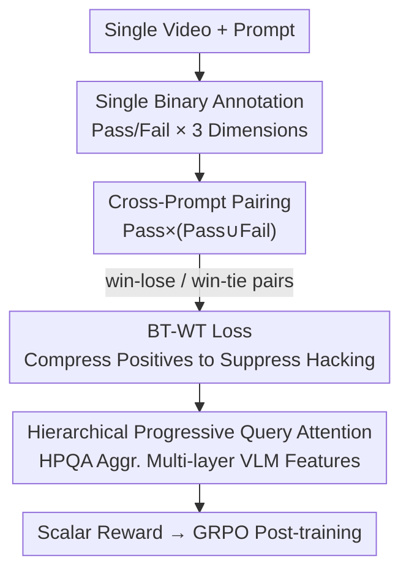

# SoliReward: Mitigating Susceptibility to Reward Hacking and Annotation Noise in Video Generation Reward Models

**Conference**: CVPR 2026  
**Paper**: [CVF Open Access](https://openaccess.thecvf.com/content/CVPR2026/html/Lian_SoliReward_Mitigating_Susceptibility_to_Reward_Hacking_and_Annotation_Noise_in_CVPR_2026_paper.html)  
**Code**: https://github.com/lian700/SoliReward  
**Area**: Video Generation / Reward Models  
**Keywords**: Video Reward Model, RLHF, Reward Hacking, Annotation Noise, Bradley-Terry

## TL;DR
SoliReward systematically reformulates video generation reward models across "data annotation + training loss + model architecture": it uses single-item binary annotation (Pass/Fail) with cross-prompt pairing to reduce annotation noise, employs a Bradley-Terry loss with Wide Ties (BT-WT) to compress positive samples into a compact interval to suppress reward hacking, and integrates Hierarchical Progressive Query Attention (HPQA) to aggregate multi-layer VLM features. It outperforms existing baselines in RM accuracy and downstream GRPO post-training.

## Background & Motivation
**Background**: Video generation models (Sora 2, Veo 3, Seedance) rely on RLHF-style post-training alignment to correct physical inconsistencies, visual artifacts, and instruction-following issues. The core component of alignment is the Reward Model (RM), which quantifies human preferences into scalar scores for optimizing generation policies using flow-based GRPO algorithms like DanceGRPO. The quality of the RM directly determines alignment effectiveness.

**Limitations of Prior Work**: Training an RM that accurately characterizes video quality face three specific problems. First, **data annotation noise**: widely used in-prompt pairwise preference annotations (comparing two videos under the same prompt) easily trigger subjective hesitation when quality is similar, injecting significant label noise; point-wise scoring (e.g., 1-5 Likert scale) shows massive inter-annotator disagreement on boundary samples (VideoScore reports Fleiss' κ < 0.1). Second, **reward hacking**: learned proxy objectives may deviate from true human preferences, allowing policies to exploit RM loopholes during post-training. Third, **insufficient architectural expressivity**: simple scalar extraction methods from VLMs (last token embedding, specialized tokens, yes/no token probabilities) lead to reward collapse and clustered scores.

**Key Challenge**: There is a natural conflict between the "relative comparison information" pursued by pairwise/pointwise annotation and "annotation consistency"—the more fine-grained the comparison, the more annotators hesitate, leading to higher noise. Furthermore, pure win-lose training only maximizes the reward gap $r_\theta(y_i)-r_\theta(y_j)$ between positive and negative samples, without constraining the score distribution within the positive sample set, which facilitates reward hacking.

**Goal**: Address three sub-problems: (1) how to obtain low-noise preference data while retaining ranking capabilities; (2) how to modify the training loss to suppress reward hacking; and (3) how to design an architecture that fully utilizes multi-layer VLM information for scalar rewards.

**Key Insight**: The authors observe that binary annotation (Pass/Fail) achieves much higher consistency than pairwise comparison (VisionReward showed binary checklists reach ∼89% agreement), and the Bradley-Terry model theoretically does not require pairs to originate from the same prompt. Combining these allows the construction of large-scale, cross-prompt preference pairs from simple binary labels.

**Core Idea**: Replace ambiguous relative comparisons with "single-item binary annotation + cross-prompt pairing," apply compactness constraints on positive samples via "BT loss with ties," and fuse multi-layer features using "Hierarchical Progressive Query Attention" to create a robust video RM.

## Method

### Overall Architecture
SoliReward is a complete pipeline covering "data → loss → architecture." The input consists of videos and prompts, and the output is a VLM-RM that provides robust scalar rewards for downstream GRPO post-training. The process follows three steps: first, binary annotation (Pass/Fail) is performed on individual videos across three dimensions (physical consistency, subject deformation, semantic alignment); then, Pass and Fail sets are cross-paired across prompts to generate preference pairs; these pairs (including win-lose and win-tie) are fed into the BT-WT loss for training; the scoring backbone uses InternVL3 with an HPQA adapter that refines queries layer-by-layer from LM transformer layers and fuses them with the final residual for the RewardHead output.

### Key Designs

**1. Single-item Binary Annotation + Cross-prompt Pairing: Constructing Large-scale Preference Sets from Low-noise Labels**

To address high noise in pairwise/pointwise annotation, the task is simplified from "comparing two videos" or "rating 1-5" to "does this single video Pass or Fail on a specific dimension." Since annotators judge individual videos against objective criteria without subjective tie-breaking, consistency increases significantly (IAA for binary reached Moderate, α=0.4939, raw agreement 77.33%, compared to Fair, α=0.3516, 54.67% for pairwise). To introduce ranking info, the authors assume all Pass samples are preference-equivalent ($\forall y_i,y_j\in W,\ y_i\sim y_j$) and any Pass is strictly superior to any Fail ($\forall y_i\in W,\forall y_j\in L,\ y_i\succ y_j$). By pairing Pass and Fail samples **across prompts**, the RM learns generalized quality representations rather than being restricted to relative rankings within the same prompt. This also allows the utilization of prompts that only generated a single video.

**2. Bradley-Terry Loss with Wide Ties (BT-WT): Compactness Constraints to Suppress Reward Hacking**

Standard BT loss is defined as:
$$\mathcal{L}_{\mathrm{BT}}=\mathbb{E}_{(y_i,y_j)\in D}\left[-\log\sigma\!\left(r_\theta(y_i)-r_\theta(y_j)\right)\right]$$
This only maximizes the gap between positive and negative samples, leaving the internal distribution of positive samples unconstrained. Consequently, the RM might assign abnormally high scores to positive samples with "shortcut features," leading the policy to converge toward these reward peaks—the root of reward hacking. The authors introduce win-tie pairs (pairing two positive samples as a tie) and modify the loss:
$$\mathcal{L}_{\mathrm{BT\text{-}WT}}=\mathbb{E}_{(y_i,y_j)\in W\times(W\cup L)}\left[-\mu\log\sigma(\Delta r)-(1-\mu)\log\sigma(-\Delta r)\right]$$
where $\Delta r=r_\theta(y_i)-r_\theta(y_j)$, and $\mu=1$ (if $y_i\succ y_j$) or $\mu=0.5$ (if $y_i\sim y_j$). When $\mu=0.5$, the loss is symmetric, pulling scores of positive samples toward equality $r_\theta(y_i)\approx r_\theta(y_j)$. This tie term acts as a regularizer in the reward space, forcing positive samples onto a compact manifold and smoothing spurious peaks. This reduces the variance of group advantages $A_i=\frac{r_i-\bar r}{\sigma}$ in GRPO. Unlike VideoAlign, which uses both win-tie and lose-tie, BT-WT only ties positive samples, as independent negative samples (e.g., varying deformations) cannot be reliably deemed equivalent.

**3. Hierarchical Progressive Query Attention (HPQA): Layer-wise Refinement + Residual Fusion to Avoid Reward Collapse**

To address scalar reward collapse where scores cluster together, HPQA explicitly aggregates features from multiple transformer layers of the LM. Given layer indices $I=[l_1,\dots,l_N]$ and hidden states $H_i\in\mathbb{R}^{B\times S\times D}$, a learnable query $q^{(0)}$ performs multi-head attention on the first specified layer: $q^{(1)}=\mathrm{MHA}_1(Q=q^{(0)},K=H_{l_1},V=H_{l_1})$. This is refined progressively: $q^{(i)}=\mathrm{MHA}_i(Q=q^{(i-1)},K=H_{l_i},V=H_{l_i})$ for $i=2,\dots,N$, resulting in $q_{\mathrm{prog}}$. Simultaneously, a learnable query $q_{\mathrm{res}}$ attends to the final layer $H_L$ to obtain residual features $o_{\mathrm{res}}$. The final reward is: $r=\mathrm{RewardHead}(q_{\mathrm{prog}}+o_{\mathrm{res}})$. This design leverages the functional differentiation of LLM layers (middle layers for syntax, deep layers for long-range relations), allowing the query to integrate low-level visual fidelity and high-level semantic abstraction.

### Loss & Training
The training objective is the BT-WT loss optimized over $W\times(W\cup L)$ for both win-lose ($\mu=1$) and win-tie ($\mu=0.5$) pairs. The backbone follows the InternVL3 series, and post-training is validated using HunyuanVideo + DanceGRPO. The dataset includes 250k self-generated training videos and 50k OOD test videos across 20k unique prompts.

## Key Experimental Results

### Main Results
RM Accuracy comparison (ID = held-out partition, OOD = human-annotated videos from other SOTA models), in %:

| Task | Method | RM ACC (ID) | RM ACC (OOD) |
|------|------|-------------|--------------|
| Phy & Deform | VideoAlign | 54.40 | 71.60 (Runner-up) |
| Phy & Deform | VideoPhy | 67.35 | 65.10 |
| Phy & Deform | **Ours** | **78.48** | **80.08** |
| TA (Alignment) | VideoPhy | 54.85 | 60.52 |
| TA (Alignment) | VideoAlign | 49.50 | 49.14 |
| TA (Alignment) | **Ours** | **79.02** | 60.25 |

Post-training performance (HunyuanVideo + DanceGRPO; MQ = VideoAlign Motion Quality, VBench2 = Human Fidelity, SoliReward = Ours RM Score):

| Backbone | Guiding RM | MQ | SoliReward | VBench2 |
|----------|---------|----|-----------|---------|
| HunyuanVideo | None | -0.0980 | 4.5628 | 0.8426 |
| HunyuanVideo | MQ | 0.1607 | 4.8968 | 0.8695 |
| HunyuanVideo | **Ours** | **0.3302** | **5.3554** | **0.8999** |

### Ablation Study
Architecture ablation (changing RM adapter on same backbone; ∗ denotes score collapse to discrete values):

| Task | Architecture | RM ACC (ID) | RM ACC (OOD) |
|------|------|-------------|--------------|
| Phy & Deform | Linear (Last token) | 74.69 | 78.66 |
| Phy & Deform | 'Yes' token logits | 75.43 | 78.46 |
| Phy & Deform | Special token + Ln | 75.91 | 73.61 |
| Phy & Deform | **HPQA (Ours)** | **78.48** | **80.08** |
| TA | Linear (Last token) | 72.41∗ | 31.92∗ |
| TA | Special token + Ln | 76.25 | 58.38 |
| TA | **HPQA (Ours)** | **79.02** | **60.25** |

Loss ablation (BT vs. BT-WT, focusing on post-training):

| Method | RM ACC | Post-train VBench2 | Post-train MQ |
|------|--------|----------------|-----------|
| BT | 77.63 | 0.8693 | 0.1719 |
| BT-WT | 78.27 | **0.8999** | **0.3302** |

### Key Findings
- **RM accuracy is nearly identical for BT and BT-WT (77.63 vs 78.27), but post-training gaps are massive** (MQ 0.1719→0.3302). This indicates RM accuracy does not fully predict alignment success; reward distribution compactness is crucial. BT-WT significantly reduces absolute group advantages for top-ranked samples, leading to lower gradient variance and more stable policy updates.
- **OOD reflects real utility better than ID**: Several baselines output discrete scores (1-5 integers), causing score collapse and poor OOD generalization. In the TA task, Linear/Yes-token OOD accuracy dropped to ∼31%.
- **HPQA significantly combats collapse in TA tasks**: While Linear and Yes-token logits collapsed in TA-OOD, HPQA maintained 60.25, suggesting multi-layer fusion is vital for dimensions requiring high-level semantic abstraction.

## Highlights & Insights
- **Counter-intuitive improvement via simplified annotation**: Reducing the task from relative comparison to single-video binary judgment seemingly loses information but recovers ranking quality through "Pass-set equivalence + Pass > Fail + Cross-prompt pairing" with lower noise and higher volume.
- **Tie-pairs as Regularization**: Win-tie is not just for using more data; it explicitly penalizes the internal score variance of positive samples, blocking the root cause of reward hacking.
- **RM Accuracy $\neq$ Alignment Effectiveness**: The experiments decouple these metrics, suggesting that post-training evaluation should focus on reward distribution shape and advantage variance rather than just RM ACC.

## Limitations & Future Work
- **Dimension-dependent win-tie**: The authors noted that not all dimensions are suitable for win-tie pairs; forcing ties on dimensions with true internal quality gradients may lose useful information.
- **Cross-prompt evidence**: Details of cross-prompt versus in-prompt comparisons are largely in the appendix; whether cross-prompt pairing introduces semantic confusion in certain tasks requires more evidence.
- **Post-training scope**: Validation is limited to the HunyuanVideo + DanceGRPO combination; transferability to other backbones or alignment algorithms (DPO, ReFL) is not fully explored.
- **HPQA Hyperparameters**: Sensitivity analysis for layer indexing and the number of layers $N$ is not detailed in the main text.

## Related Work & Insights
- **vs. VideoAlign**: VideoAlign uses specialized tokens and maintains both win-tie and lose-tie. **Ours** argues against lose-ties for independent negative samples and uses HPQA for multi-layer aggregation instead of single-token extraction.
- **vs. VisionReward**: VisionReward uses binary checklists but its BT target reduces to learning linear weights, resulting in discrete scores and lacking fine-grained ranking. **Ours** maintains continuous scalar ranking through cross-prompt pairing and HPQA.
- **vs. VideoScore**: VideoScore uses 1-5 Likert scales which suffer from extremely low consistency (κ < 0.1); **Ours** avoids this via binary tasks.
- **vs. Simple Heads**: Linear, Yes-token, and Special token heads are prone to score collapse on OOD data; HPQA mitigates this through hierarchical progressive fusion.

## Rating
- Novelty: ⭐⭐⭐⭐ Systematic "Data+Loss+Architecture" solution; viewing win-tie as a regularizer for hacking is a fresh perspective.
- Experimental Thoroughness: ⭐⭐⭐⭐ Comprehensive RM ACC, IAA, and ablation studies, though some key details remain in the appendix.
- Writing Quality: ⭐⭐⭐⭐ Clear logic with well-defined contribution lines; formulas map closely to design motivations.
- Value: ⭐⭐⭐⭐ High demand for robust RMs in video alignment; the low-noise annotation and anti-hacking loss are highly reusable.

<!-- RELATED:START -->

## Related Papers

- [\[CVPR 2026\] GT-SVJ: Generative-Transformer-Based Self-Supervised Video Judge For Efficient Video Reward Modeling](gt-svj_generative-transformer-based_self-supervised_video_judge.md)
- [\[CVPR 2026\] Goal-Driven Reward by Video Diffusion Models for Reinforcement Learning](goal-driven_reward_by_video_diffusion_models_for_reinforcement_learning.md)
- [\[CVPR 2026\] Identity-Preserving Image-to-Video Generation via Reward-Guided Optimization](identity-preserving_image-to-video_generation_via_reward-guided_optimization.md)
- [\[CVPR 2026\] VIVA: VLM-Guided Instruction-Based Video Editing with Reward Optimization](viva_vlm-guided_instruction-based_video_editing_with_reward_optimization.md)
- [\[CVPR 2026\] Reward Forcing: Efficient Streaming Video Generation with Rewarded Distribution Matching Distillation](reward_forcing_efficient_streaming_video_generation_with_rewarded_distribution_m.md)

<!-- RELATED:END -->
