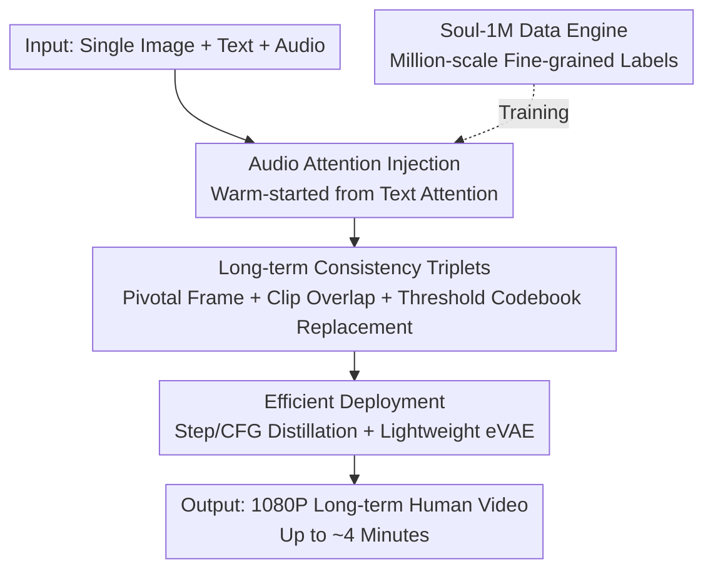

# Soul: Breathe Life into Digital Human for High-fidelity Long-term Multimodal Animation

**Conference**: CVPR 2026  
**Paper**: [CVF Open Access](https://openaccess.thecvf.com/content/CVPR2026/html/Zhang_Soul_Breathe_Life_into_Digital_Human_for_High-fidelity_Long_term_Multimodal_CVPR_2026_paper.html)  
**Code**: https://zhangzjn.github.io/projects/Soul/ (Project Page)  
**Area**: Video Generation  
**Keywords**: Digital Human Animation, Multimodal Driving, Long-term Video Generation, Lip Synthesis, Diffusion Models

## TL;DR
Soul employs a single portrait, text, and audio to drive high-fidelity digital human animation. Built upon the Wan2.2-5B diffusion video backbone, it integrates audio attention and a "three-piece suite" (pivotal frames + clip overlap + threshold-aware codebook replacement) to suppress long-term drift. By utilizing step/CFG distillation and a lightweight eVAE, it achieves an 11.4× speedup. Supported by the self-constructed million-scale Soul-1M dataset and Soul-Bench, it produces identity-consistent 1080P animations up to four minutes long.

## Background & Motivation
**Background**: Digital human animation has evolved from "face-only" to "full-body" motion. The mainstream approach involves attaching audio drivers to large-scale video diffusion bases (such as Wan2.1/2.2 or HunyuanVideo with DiT architectures) to synchronize lip movements with speech and body movements with text. Representative works include Wan-S2V, OmniAvatar, InfiniteTalk, and StableAvatar.

**Limitations of Prior Work**: The authors identify three persistent issues not yet simultaneously resolved. First, **narrow data distribution**: most public datasets favor single scenarios (e.g., front-facing portraits), lacking fine-grained annotations for actions, gestures, and camera movements, and have limited training durations (Wan-S2V and OmniAvatar use only ~1.3K hours), preventing models from generating walking motions. Second, **long-term inference collapse**: models trained on short clips suffer from gradual latent feature shifts during multi-segment concatenation, leading to identity drift, color distortion, and loss of detail. Third, **conflict between high-fidelity and efficiency**: 1080P generation often sacrifices speed or consumes massive computational resources, hindering deployment.

**Key Challenge**: A systematic "latent feature distribution mismatch" exists between the training distribution (short, single clips) and the inference distribution (long sequences, auto-regressive concatenation of multiple clips); additionally, multi-step denoising in high-resolution diffusion is inherently opposed to real-time deployment.

**Goal**: To achieve "semantic consistency + high-fidelity 1080P + long-term stability + deployability" starting from a single image, text, and audio.

**Key Insight**: Instead of incremental algorithmic patches, the authors adopt a three-pronged strategy: "Data + Long-term Mechanism + Deployment." They use million-scale precisely labeled data to improve generalization, address the root cause of long-term drift (latent feature mismatch) with targeted codebook replacement, and systematically reduce inference costs.

**Core Idea**: Long-term drift is diagnosed as "conditional features deviating from the training distribution." A "threshold-aware" pullback is applied to each conditional frame feature using a codebook derived from latent feature clustering of the training set. This corrects deviations without the bluntness of global replacement. Combined with audio attention, distillation, and a lightweight VAE, this forms a complete, deployable high-definition long-term digital human system.

## Method

### Overall Architecture
Soul takes a portrait (providing subject, background, and style), text (controlling actions, gestures, camera, and scene), and audio (controlling lips and expression) as input to output semantically consistent long-term human animation videos. The pipeline is built on the Wan2.2-5B DiT video diffusion backbone. Audio attention layers are injected into DiT blocks, warm-started from text attention weights. Generation proceeds auto-regressively via clips, maintaining cross-segment consistency through pivotal frames, clip overlap, and threshold-aware codebook replacement. Finally, step/CFG distillation and a lightweight eVAE reduce inference costs for deployment. All training is conducted on the self-built Soul-1M dataset.

### Key Designs

**1. Audio Attention Injection: Cross-modal Lip Control Warm-started from Text Attention**

Digital humans require precise lip-syncing and emotional alignment with audio, yet text diffusion backbones lack an audio path. Soul extracts audio features using Whisper and adds a **new Audio-Attention layer** to each DiT block. Critically, this layer is not randomly initialized but **warm-started by copying weights from the existing text-attention layer**. Since the text-attention has already learned "condition-to-frame" alignment, inheriting this prior significantly accelerates convergence. Text governs "what action/camera," while audio governs "how to sync/express," allowing the model to support both speech and singing.

**2. Long-term Consistency Triplets: Pivotal Frame + Clip Overlap + Threshold-Aware Codebook Replacement**

This is the core design addressing identity drift and quality collapse during long-term concatenation. Soul generates one clip at a time (109 frames in pixel space, 28 in latent space) using three strategies:

- **Pivotal Frame**: The first frame serves as the reference anchor (padded/copied) for each clip, providing consistent identity, background, and style. During training, a random frame from the source video is used as a reference (condition only, no loss calculated) to improve generalization.
- **Intra-clip Overlap**: To ensure natural transitions beyond a static reference, the last few frames of the previous segment (default: 2) are copied into the beginning of the current segment's latent space. This is applied with a 50% probability during training to improve cross-frame semantic coherence.
- **Threshold-aware Codebook Replacement**: This addresses the "latent feature drift" observed during long inference (e.g., color shifts and loss of detail in Figure 7). The mismatch arises because inference uses **self-generated** previous frames as conditions, which deviate from the training distribution. The solution: pre-extract latent features from Soul-1M and perform K-Means clustering into a codebook (default: 40K clusters). During inference, for each conditional frame feature, the nearest centroid $c$ is found, and a pullback with threshold $\tau$ is applied:

$$f' = \begin{cases} f, & \|f-c\| \le \tau \\ c + \tau\cdot\dfrac{f-c}{\|f-c\|}, & \|f-c\| > \tau \end{cases}$$

If the distance is within the threshold, the feature is kept; if it exceeds $\tau$, it is truncated toward the centroid. This pulls stray features back toward the training distribution without the crude distortion of full replacement, offering more restraint than traditional discrete quantization.

**3. Soul-1M Data Engine: Million-scale Fine-grained Multimodal Annotation Pipeline**

To solve poor generalization, the authors built Soul-1M, focusing on "broad coverage + fine labels + clean quality." Data includes portraits, upper-body, full-body, and multi-person scenes. An **automated filtering pipeline** includes resolution checks (>480p), DINOv2 + PySceneDetect for shot cutting, RetinaFace for face validation, FineVQ for aesthetics, PaddleOCR for subtitle removal, and MLLMs for defect tagging. Data augmentation includes cropping upper-body shots from full-body videos using MMPose. **Fine-grained annotation** uses Qwen3-VL to label segments (4–5s) with specific prompts for scene, camera, action, gesture, and lighting. Qwen2.5-VL-72B is used for consistency secondary checks. The final dataset includes 8.5K hours of training data and the 226-sample Soul-Bench evaluation set.

**4. Efficient Deployment: Step/CFG Distillation + Lightweight eVAE for 11.4× Acceleration**

To enable real-time deployment, Soul optimizes two axes. First, **Joint Step and CFG Distillation**: Inspired by DMD2, the model distills both the denoising steps (reducing from 25 steps) and the classifier-free guidance (removing the dual forward pass requirement) while omitting GAN losses. Second, **Lightweight eVAE**: Finding that the Wan2.2-5B decoder was a bottleneck, the authors designed eVAE-Wan2.2-5B-35M, reducing parameters/MACs from 555.05M/688.58T to 34.97M/43.34T (approx. 8.1× decoder speedup) with minimal quality loss (LPIPS 0.0324→0.052). Together, these achieve an overall 11.4× speedup.

### Loss & Training
Full fine-tuning of Wan2.2-5B was performed on 64 GPUs using AdamW (LR $2\times10^{-5}$). Training involved 2 epochs at 720p followed by 1 epoch at 1080p. The training set includes 800K sync segments from Soul-1M, with **20% non-audio general videos** (cartoons, animals, cityscapes) mixed in to preserve scene diversity. Negative prompts based on synthesized failure cases were also used to enhance temporal consistency.

## Key Experimental Results

### Main Results
Compared against recent open-source methods on Soul-Bench (226 samples). Soul leads in video-text consistency, Lip Sync Error-Distance (LSE-D), identity consistency, and video quality:

| Method | Video-Text Consist.↑ | LSE-D↓ | LSE-C↑ | ID Consist.↑ | Video Quality↑ | Sync Alignment↑ |
|------|------|------|------|------|------|------|
| HunyuanVideo-Avatar | 4.82 | 0.419 | 6.33 | 0.727 | 67.02 | 0.195 |
| Sonic | 4.57 | 0.663 | **7.80** | 0.613 | 68.58 | 0.191 |
| Wan-S2V | 4.74 | 5.455 | 6.71 | 0.750 | 71.22 | **0.330** |
| InfiniteTalk | 4.75 | 2.313 | 8.48 | 0.609 | 68.53 | 0.211 |
| StableAvatar | 4.77 | 3.948 | 4.05 | 0.733 | 71.40 | 0.250 |
| OmniAvatar | 4.77 | 1.009 | 5.84 | 0.497 | 67.24 | 0.225 |
| **Ours (Soul)** | **4.85** | **0.130** | 6.82 | **0.763** | **72.60** | 0.255 |

*Note: The paper states that for LSE-C values above 6.12 and Sync Alignment above 23.19, the discriminative power is limited; Soul's LSE-C of 6.82 falls within the high-quality range.*

### Ablation Study
Efficiency component ablation (1088×1920, single GPU, speedup relative to FA2 baseline):

| Config | Total Latency | Speedup | Video Quality↑ | ID Consist.↑ |
|------|------|------|------|------|
| FA2 (Baseline) | 1019.2s | 1.0× | 72.60 | 0.763 |
| + KD Step/CFG Distill | 135.3s | 7.5× | 71.90 | 0.696 |
| + eVAE Decoder | 89.4s | 11.4× | 71.68 | 0.702 |

Human evaluation vs. commercial products (Scales 1–5: ① Naturalness ② ID Consistency ③ Text Alignment ④ Lip-Sync):

| Method | ① | ② | ③ | ④ |
|------|------|------|------|------|
| HeyGen | 4.07 | 3.54 | 3.82 | **4.20** |
| Kling-Avatar | 3.93 | 3.86 | 3.90 | 4.05 |
| **Ours** | **4.17** | **4.00** | **4.11** | **4.20** |

### Key Findings
- **Threshold-aware codebook replacement is the lifeline for long-term generation**: Without it, even with clip overlap, quality degrades over time. Codebook replacement allows stable generation up to four minutes with consistent ArcFace similarity scores.
- **Efficiency gains are additive and near-lossless**: Distillation provides a 7.5× boost, and combined with eVAE, it reaches 11.4×. Video quality drops only slightly ($72.60 \rightarrow 71.68$), proving high-definition long-term generation is feasible for near-real-time use.
- **Lip-Sync Nuances**: Soul's LSE-D (0.130) is significantly better than competitors (next best: OmniAvatar at 1.009), though its LSE-C (Confidence) is ranked third, likely due to the metric's saturation.
- **Mixed-modality training preserves general scenarios**: Training with 20% general video (cartoons, cityscapes) allows the model to handle diverse non-human scenes, expanding its utility to virtual idols and animated animals.

## Highlights & Insights
- **Diagnosing long-term drift as "Distribution Mismatch"**: Soul identifies that using self-generated features as conditions causes drift. The "threshold pullback" is a restrained yet effective solution that is applicable to any auto-regressive video generation task.
- **Warm-starting Audio Attention**: A clever engineering shortcut where the new audio branch inherits the "alignment prior" from the text-attention weights, saving training time and cost.
- **Integrated System Value**: Soul isn't just a single-point innovation but a complete system (Data + Mechanism + Deployment) that rivals closed-source commercial products like HeyGen in human evaluations.
- **VAE Optimization Insight**: Identifying the decoder as the bottleneck after backbone distillation shows a clear understanding of practical deployment constraints.

## Limitations & Future Work
- **Artifacts in complex motions**: Highly complex full-body movements still produce artifacts. Future work aims to expand Soul-1M with rarer actions and incorporate 3D geometric priors for better spatial consistency.
- **Benchmark Bias**: Evaluation relies heavily on Soul-Bench, which has some overlap with the training distribution. Further validation on external public benchmarks is needed.
- **Hyperparameter sensitivity**: The sensitivity of the 40K codebook size and threshold $\tau$ were not fully explored in the paper.

## Related Work & Insights
- **vs Wan-S2V / OmniAvatar**: These use much smaller datasets (~1.3K hours) and struggle with walking motions. Soul's 8.5K hours and long-term mechanisms provide superior stability.
- **vs InfiniteTalk / StableAvatar**: While strong in lip-sync or consistency, they lack systematic deployment optimizations. Soul's 11.4× speedup bridges the gap between research and production.
- **vs commercial products**: Soul matches or exceeds commercial baselines in naturalness and consistency, providing an open-source paradigm for high-quality digital human animation.

## Rating
- Novelty: ⭐⭐⭐⭐ (Codebook pullback is a genuine innovation for long-term drift; others are strong engineering integrations.)
- Experimental Thoroughness: ⭐⭐⭐⭐ (Main comparisons, efficiency ablations, and human evals are present, though more external benchmarks would be ideal.)
- Writing Quality: ⭐⭐⭐⭐ (Clear logic, good visualizations, minor symbolic inconsistencies don't hinder comprehension.)
- Value: ⭐⭐⭐⭐⭐ (The full pipeline from data to deployment-ready model is highly valuable for the industry.)

<!-- RELATED:START -->

## Related Papers

- [\[CVPR 2026\] Archon: A Unified Multimodal Model for Holistic Digital Human Generation](archon_a_unified_multimodal_model_for_holistic_digital_human_generation.md)
- [\[CVPR 2026\] Lynx: Towards High-Fidelity Personalized Video Generation](lynx_towards_high-fidelity_personalized_video_generation.md)
- [\[CVPR 2026\] CamDirector: Towards Long-Term Coherent Video Trajectory Editing](camdirector_towards_long-term_coherent_video_trajectory_editing.md)
- [\[CVPR 2026\] M4V: Multimodal Mamba for Efficient Text-to-Video Generation](m4v_multimodal_mamba_for_efficient_text-to-video_generation.md)
- [\[CVPR 2026\] Vanast: Virtual Try-On with Human Image Animation via Synthetic Triplet Supervision](vanast_virtual_try-on_with_human_image_animation_via_synthetic_triplet_supervisi.md)

<!-- RELATED:END -->
