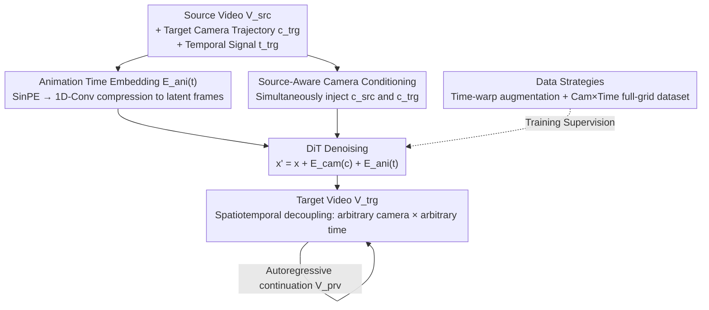

# SpaceTimePilot: Generative Rendering of Dynamic Scenes Across Space and Time

**Conference**: CVPR 2026  
**Paper**: [CVF Open Access](https://openaccess.thecvf.com/content/CVPR2026/html/Huang_SpaceTimePilot_Generative_Rendering_of_Dynamic_Scenes_Across_Space_and_Time_CVPR_2026_paper.html)  
**Code**: [Project Page](https://zheninghuang.github.io/Space-Time-Pilot/)  
**Area**: Video Generation / Diffusion Models / Dynamic Scene Rendering  
**Keywords**: Video Diffusion Models, Spatiotemporal Decoupling, Novel View Synthesis, Camera Control, Animation Time Embedding

## TL;DR
SpaceTimePilot is the first video diffusion model that decouples and independently controls "camera viewpoint (space)" and "motion progress (time)". Given a monocular video, it can independently overwrite the camera trajectory and playback tempo (bullet time, slow motion, reversal, and arbitrary mixtures) during the generation process, thereby re-rendering the dynamic scene along any spatiotemporal trajectory.

## Background & Motivation

**Background**: Videos are 2D projections of 3D world evolution, driven by two independent generative factors: spatial change (camera viewpoint) and temporal evolution (scene motion). To freely explore a scene from a video, the ideal scenario is to be able to arbitrarily "reframe" (view from another angle) and "retime" (view at another moment). Mainstream approaches follow two paths: first, reconstruct in 4D (NeRF / Dynamic Gaussian Splatting) and then re-render; second, recent video diffusion methods, which directly generate novel views conditioned on camera parameters.

**Limitations of Prior Work**: The 4D reconstruction pipeline often suffers from geometric distortions and artifacts under novel views, and relies heavily on extensive preprocessing. While video diffusion pipelines have grown increasingly powerful in camera control (space) (e.g., ReCamMaster, TrajectoryCrafter, and even interactive exploration like Genie-3), **the temporal dimension remains almost completely locked**. They implicitly assume that time flows forward monotonically, rendering them incapable of time-manipulation operations such as reversal, bullet time, and slow motion. A few attempts to decouple space and time (e.g., 4DiM, CAT4D) are either tightly bound to 4D reconstruction pipelines with poor scalability, or can only produce sparse discrete frames instead of continuous videos.

**Key Challenge**: Training a model capable of simultaneously controlling both camera and time requires paired videos of the "same dynamic scene under both camera motion and diverse playback speeds"—such data only exists in controlled studios and is **entirely absent** from open-source datasets. Without supervision signals, the model cannot distinguish whether a change in the frame is due to camera movement or physical scene progression, leading to spatiotemporal entanglement.

**Goal**: This work splits this challenge into two tasks: (1) designing a temporal control representation that can be injected into diffusion models without conflicting with camera signals; and (2) generating supervision signals that teach the model that "time can change non-monotonically" in the absence of readily available paired data.

**Key Insight**: The authors introduce a new concept—"**animation time**" $t$—specifically to depict the temporal state of scene motion in the source video. By explicitly splitting "which viewpoint to look from" and "which moment to look at" into two independent streams of signals, spatiotemporal decoupling becomes architecturally feasible.

**Core Idea**: An independent "animation time" embedding signal $t$ is utilized to strip temporal control away from camera control. Subsequently, two data strategies ("time-warp augmentation" and "Cam×Time synthetic dataset") are employed to teach the video diffusion model that "time can be arbitrarily remapped."

## Method

### Overall Architecture

SpaceTimePilot takes a source video $V_{src}\in\mathbb{R}^{F\times C\times H\times W}$, a target camera trajectory $c_{trg}\in\mathbb{R}^{F\times 3\times 4}$, and a temporal control signal $t_{trg}\in\mathbb{R}^{F}$, and outputs a target video $V_{trg}$ that preserves the scene dynamics, geometry, and appearance of the source video while strictly adhering to the specified camera motion and temporal progression. The backbone is a latent video diffusion model (3D-VAE compression + DiT denoising, based on Wan-2.1 T2V-1.3B), where both camera embeddings and animation-time embeddings are injected as conditions into patch tokens.

The entire framework is built around three pillars: **(1) Animation Time Representation** which allows independent control of time; **(2) Two Data Strategies** (time-warp augmentation + Cam×Time synthetic dataset) that create the necessary supervision signals for spatiotemporal decoupling from scratch; and **(3) Source-Aware Camera Conditioning** which enables precise camera control from any starting viewpoint. All three are indispensable: the temporal representation provides the "control knob," the data strategies provide the "training signal," and the camera condition ensures spatial precision.

### Key Designs

**1. Animation Time Embedding: Stripping Time from Camera with an Independent Temporal Signal**

The most straightforward idea is to reuse the existing latent frame positional encoding $\text{RoPE}(f')$ in the diffusion model to control time, but the authors found that this fails completely—RoPE constrains both time and camera motion simultaneously, entangling the two signals. If one tries to reverse playback, the camera path gets disrupted as well. The root of the problem is that frame-index positional encoding inherently assumes "time flows monotonically forward"; it lacks the semantic space for "arbitrary temporal rearrangement."

To resolve this, the authors introduce a dedicated temporal control parameter $t\in\mathbb{R}^{F}$. Manipulating $t_{trg}$ allows remapping the playback progress of the output video: setting $t_{trg}$ to a constant freezes the scene at a specific moment (bullet time), while reversing the frame index yields playback reversal. The specific injection method is as follows: first, sinusoidal embeddings are computed for both source and target temporal sequences, $e_{src}=\text{SinPE}(t_{src})$ and $e_{trg}=\text{SinPE}(t_{trg})$. Then, a two-layer 1D convolution is used to gradually compress the $F$-dimensional embedding to the latent frame space of $F'$ dimensions: $e=\text{Conv1D}_2(\text{Conv1D}_1(e))$, and finally the temporal features are added to the camera features and video tokens:

$$x' = x + E_{cam}(c) + E_{ani}(t)$$

Why use 1D convolutions instead of uniform sampling or MLPs? This is because each latent frame actually corresponds to a continuous block of time in the original video. Applying sinusoidal embedding directly at the coarse-grained $f'$ layer discards fine-grained details. 1D convolutions compress the fine-grained $F$-dimensional information into a compact $F$'-dimensional representation, preserving both precision and stability. In the ablation studies, this approach boosted PSNR from 14.10 (using uniform sampling) to 21.29 (when combined with Cam×Time).

**2. Time-Warp Augmentation: "Warping" Existing Multi-View Datasets for Temporal Variation Supervision**

The biggest obstacle to training spatiotemporal decoupling is the lack of paired data. The authors propose an elegant workaround: although existing multi-view video datasets (ReCamMaster, SynCamMaster) always share the same temporal sequence between source and target videos (preventing learning of temporal control), one can **apply a time-warp function** $\tau:[1,F]\to[1,F]$ to the target video to artificially introduce temporal discrepancies. Given a source video $V_{src}=\{I^f_{src}\}$ and a target $V_{trg}=\{I^f_{trg}\}$, the target is shuffled according to $\tau$ to yield $V'_{trg}=\{I^{\tau(f)}_{trg}\}$. The source timestamps are set to $t_{src}=1:F$, and the warped target timestamps are $t_{trg}=\tau(t_{src})$.

The authors design five warping operations to cover various non-linear temporal effects: (i) reversal, (ii) acceleration, (iii) freeze, (iv) piecewise slow-motion, and (v) zigzag motion (where time recurrently moves back and forth). Through these augmentations, the paired $(V_{src}, V'_{trg})$ differ **simultaneously** in both camera trajectory and temporal dynamics—precisely the clear signals needed for the model to learn decoupled representations. Compared to previous attempts that pieced together supervision using "static scenes + monotonic time" (which yields weak signals and easily muddles space and time), time-warp augmentation provides diverse and explicit temporal variations, teaching the model that "time can be arbitrarily remapped" at virtually zero cost.

**3. Cam×Time Full-Grid Synthetic Dataset: Adding Dense Supervision for Fine-Grained, Continuous Spatiotemporal Control**

While time-warp augmentation resolves the existence of decoupling signals, achieving **fine-grained and continuous** temporal control (smooth adjustments, bullet time at arbitrary moments) still requires a systematic dataset spanning both spatial and temporal dimensions. To this end, the authors rendered Cam×Time using Blender: given a camera trajectory and an animated subject, they **exhaustively sample a complete camera-time grid** $(c,t)$—for each animation, 120 camera positions along the trajectory $\times$ all temporal states are rendered. The dataset scale comprises 100 indoor/outdoor scenes $\times$ 750 animations $\times$ 4 camera paths, totaling **360,000 video segments**.

The key lies in this "full-grid" structure (Tab. 1): any two $F$-frame sequences in the grid can form a source-target pair. Typically, the source video is taken from the grid diagonal (where camera and time progress synchronously), while the target is sampled more freely as a continuous sequence within the grid—allowing the target time to range arbitrarily across the entire 0–120 frame span, with source time $t_{src}=1{:}120$ and target time $t_{trg}\in\{1,2,\dots,120\}^{120}$. This "fixed source, arbitrary target" full coverage provides a strong supervision that existing datasets (where source and target times are tied together, whether in static RE10k or dynamic Kubric-4D/ReCamMaster) cannot offer. This enables the model to learn bullet-time effects, motion stabilization, and arbitrary control combinations. The authors split a portion of this dataset as a test set and release it as a benchmark for controllable video generation.

**4. Source-Aware Camera Conditioning: Enabling Precise Camera Control from Any Starting Angle**

Prior novel-view synthesis methods (such as ReCamMaster) operating under a rigid assumption: the first frames of the source and target videos must be identical, with the target camera trajectory defined relative to this first frame. This introduces two drawbacks—first, it ignores the source video's own trajectory, leading to suboptimal source features when using target trajectories to calculate them; second, because the first frame is always identical in training, the model essentially learns to "blindly copy the first frame," largely ignoring the given camera poses.

The authors rectify this by **simultaneously injecting both source and target camera trajectories**: using a pretrained pose estimator to estimate the respective camera poses $c_{src}$ and $c_{trg}$ of the source and target videos, these are added to their corresponding tokens. The target and source tokens are then concatenated along the frame dimension and fed into the DiT:

$$x'_{src} = x_{src} + E_{cam}(c_{src}) + E_{ani}(t_{src})$$
$$x'_{trg} = x_{trg} + E_{cam}(c_{trg}) + E_{ani}(t_{trg}),\quad x' = [x'_{trg}, x'_{src}]_{\text{frame-dim}}$$

This provides the model with both source and target camera contexts, allowing it to precisely follow the complete target trajectory with the first frame taking an arbitrary angle. A counter-intuitive finding in the experiments confirms its necessity: simply feeding more "different first-frame" augmented data to ReCamMaster (ReCamM+Aug) actually led to higher errors. Without the explicit reference $c_{src}$, more diverse starting frames only confuse the model; only by explicitly adding $c_{src}$ can camera accuracy be significantly improved. Furthermore, not forcing the source and target to share the first frame is precisely what enables flexible camera control during autoregressive continuation of long videos (where each segment is conditioned on the previous segment $V_{prv}$ + source video).

## Key Experimental Results

Implementation details: Backbone Wan-2.1 T2V-1.3B, outputting 21 latent frames decoded into 81 RGB frames via 3D-VAE; trained by default jointly on ReCamMaster + SynCamMaster (with time-warp augmentation) + Cam×Time.

### Main Results

Temporal control evaluation (on the held-out Cam×Time test set, with camera poses fixed and only the temporal signal varied, including reversal / speed / bullet time):

| Method | PSNR↑ (Avg) | SSIM↑ (Avg) | LPIPS↓ (Avg) |
|------|------|------|------|
| TrajectoryCrafter † | 14.56 | 0.6421 | 0.5276 |
| ReCamM+preshuffled † | 14.49 | 0.5674 | 0.5392 |
| ReCamM+jointdata | 17.86 | 0.7250 | 0.3073 |
| **SpaceTimePilot (Ours)** | **21.29** | **0.7459** | **0.2308** |

(† denotes simulating temporal operations prior to inference using a simple frame-reshuffling operator.) SpaceTimePilot leads comprehensively across all three temporal controls (Direction / Speed / Bullet), outperforming the strongest baseline by approximately 3.4 in PSNR.

Camera control evaluation (real-world OpenVideoHD 90 videos $\times$ 20 camera trajectories, containing 10 trajectories sharing the same starting pose as the source and 10 trajectories with different starting poses):

| Method | RelRot↓ | AbsRot↓ | RTA@30↑ |
|------|------|------|------|
| TrajectoryCrafter | 5.94 | 6.93 | 25.93% |
| ReCamM | 4.26 | 10.08 | 10.20% |
| ReCamM+Aug | 3.66 | 11.74 | 5.93% |
| **SpaceTimePilot (Ours)** | **2.71** | **5.63** | **54.44%** |

Source-aware camera conditioning allows the first frame to start from arbitrary angles while achieving state-of-the-art camera accuracy (boosting RTA@30 from ~26% to 54%). On the 6-dimension VBench visual quality evaluation, the proposed method is on par with the baselines overall (achieving the highest ImgQ of 0.6486), demonstrating that decoupled control does not sacrifice generative fidelity.

### Ablation Study

Ablation study on temporal embedding compressor (Tab. 5):

| Configuration | PSNR↑ | SSIM↑ | LPIPS↓ | Description |
|------|------|------|------|------|
| Uniform Sampling | 14.10 | 0.5981 | 0.5039 | Sinusoidal embedding directly at the coarse latent frame $f'$ level |
| 1D-Conv | 14.75 | 0.6134 | 0.4878 | Trained solely on ReCamMaster+SynCamMaster |
| 1D-Conv + Joint Data | 15.41 | 0.6252 | 0.4830 | Adding extra static scene datasets |
| **1D-Conv + Cam×Time** | **21.29** | **0.7459** | **0.2308** | Full model |

### Key Findings
- **The dataset is the biggest contributor**: 1D-Conv alone only yields 14.75. Adding a static scene dataset brings it up marginally to 15.41, whereas switching to Cam×Time triggers a sharp leap to 21.29. This shows that the bottleneck of spatiotemporal decoupling lies in the supervision signal rather than the architecture; the "single temporal mode" of static scenes teaches almost zero temporal control.
- **Compressor selection affects motion smoothness**: Uniform sampling yields prominent artifacts, and the MLP compressor causes abrupt camera jumps. Only the 1D convolution manages to both lock the animation time and achieve smooth camera movement (Fig. 7).
- **More augmentation does not equal better results**: ReCamM+Aug (with more augmentations featuring different start frames) leads to higher camera errors than the original ReCamM. It must be paired with the explicit source camera condition $c_{src}$ to translate into accuracy gains—augmentation itself introduces ambiguity, and it needs reference anchors.

## Highlights & Insights
- **The abstraction of "animation time" is crucial**: Explicitly abstracting "time" into an independent signal that can be arbitrarily remapped by a function $\tau$, instead of binding it to frame indices, is the foundation for performing playback reversal and bullet time. This concept of "explicitly splitting entangled factors into independent conditions to inject" can be generalized to any generative task requiring decoupled control.
- **Ingenious zero-cost supervision generation**: Instead of collecting any new data, time-warp augmentation relies solely on performing five types of reshuffling on the target sequences of pre-existing multi-view videos, generating paired supervision with "simultaneous camera and temporal changes" from thin air. This is a highly clever bootstrap strategy in data-scarce scenarios.
- **Spatiotemporal grid data-centric view**: Cam×Time is not just about rendering more videos; it is a structured design that "exhaustively samples a camera $\times$ time grid where any two sequences can be paired." This transforms the dataset itself into a continuously sampleable spatiotemporal field. This construction methodology serves as a valuable reference for future controllable generation benchmarks.

## Limitations & Future Work
- **Heavy reliance on synthetic data**: Cam×Time is synthetic data rendered via Blender. The fine-grained control capabilities of spatiotemporal decoupling are heavily built upon synthetic full-grid supervision; its generalization under complex real-world scenes (e.g., strong specular reflections, complex occlusions, non-rigid deformations) has not been fully verified.
- **Pose estimation is an implicit bottleneck**: The source-aware camera condition relies on pretrained pose estimators (evaluations used SpatialTracker-v2 / DUSt3R). When pose estimation on real videos is inaccurate, the control precision degrades accordingly. The paper does not quantify this error propagation.
- **Small backbone, limited resolution/duration**: Based on the 1.3B Wan-2.1 with single segments of 81 frames, long videos rely on simple autoregressive continuation. Long-term consistency and cumulative drift issues (deferred to the supplementary material) remain open problems.
- **Future directions**: Potential paths include extending the animation time embedding to higher frame rates/longer sequences, supplementing the domain gap of synthetic data using real-world capture, and modeling robustness against pose estimation errors.

## Related Work & Insights
- **vs ReCamMaster [1]**: ReCamMaster only performs camera (spatial) control with monotonic forward time, and assumes the first frames of source/target match, leading to "first-frame copying." This work inherits its camera conditioning philosophy but adds animation time to enable temporal control, and relieves the first-frame constraint via source-aware conditioning $c_{src}$—comprehensively surpassing it in both camera accuracy and temporal capabilities.
- **vs TrajectoryCrafter [46]**: It utilizes a warp-and-inpaint pipeline, simulating temporal operations via pre-inference frame reshuffling. However, camera poses become disordered upon playback reversal (the camera of the source's last frame erroneously appears in the generated first frame). This method decouples space and time within the generation process itself, maintaining camera precision even during reversal.
- **vs 4DiM [39] / CAT4D [41]**: Both seek to decouple space and time. However, the former relies on Masked FiLM + joint static/dynamic multimodal training (yielding weak signals), while the latter is tightly bound to an explicit 4D reconstruction pipeline with poor scalability and only produces sparse, discrete frames. The proposed method avoids 4D reconstruction, directly adding temporal embeddings and stabilizing camera conditions on text-to-video diffusion to yield continuous videos with more fine-grained control.

## Rating
- Novelty: ⭐⭐⭐⭐⭐ First diffusion model to truly decouple camera (space) and animation time (time) for continuous controllable video generation. The "animation time" abstraction and time-warp bootstrap are highly original.
- Experimental Thoroughness: ⭐⭐⭐⭐ Time/camera/visual quality evaluations plus compressor ablations are comprehensive, though real-world generalization and pose error propagation verification are somewhat lacking.
- Writing Quality: ⭐⭐⭐⭐ Motivation and methods are clearly presented with abundant illustrations; the CVF version has a few obvious typos in some paragraphs (not affecting comprehension).
- Value: ⭐⭐⭐⭐⭐ Concurrently contributes new capabilities (4D spatiotemporal free exploration), new methodologies (time-warping + source-aware camera), and a new dataset (360,000-segment Cam×Time benchmark), offering high value to the controllable video generation community.

<!-- RELATED:START -->

## Related Papers

- [\[CVPR 2026\] LaVR: Scene Latent Conditioned Generative Video Trajectory Re-Rendering using Large 4D Reconstruction Models](lavr_scene_latent_conditioned_generative_video_trajectory_re-rendering_using_lar.md)
- [\[ICCV 2025\] ReCamMaster: Camera-Controlled Generative Rendering from A Single Video](../../ICCV2025/video_generation/recammaster_camera-controlled_generative_rendering_from_a_single_video.md)
- [\[CVPR 2026\] Inference-time Physics Alignment of Video Generative Models with Latent World Models](inference-time_physics_alignment_of_video_generative_models_with_latent_world_mo.md)
- [\[CVPR 2026\] EditCtrl: Disentangled Local and Global Control for Real-Time Generative Video Editing](editctrl_disentangled_local_and_global_control_for_real-time_generative_video_ed.md)
- [\[ICLR 2026\] Light-X: Generative 4D Video Rendering with Camera and Illumination Control](../../ICLR2026/video_generation/light-x_generative_4d_video_rendering_with_camera_and_illumination_control.md)

<!-- RELATED:END -->
