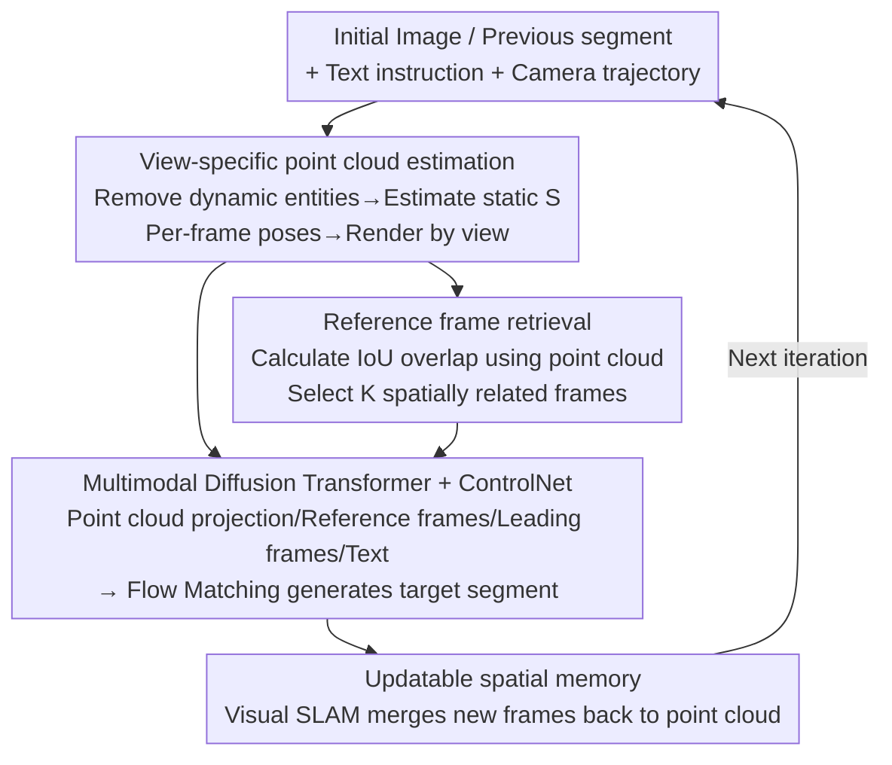

# Spatia: Video Generation with Updatable Spatial Memory

**Conference**: CVPR 2026  
**Paper**: [CVF Open Access](https://openaccess.thecvf.com/content/CVPR2026/html/Zhao_Spatia_Video_Generation_with_Updatable_Spatial_Memory_CVPR_2026_paper.html)  
**Code**: None (Project page: https://zhaojingjing713.github.io/Spatia/)  
**Area**: Video Generation  
**Keywords**: Long-term video generation, spatial memory, scene point cloud, camera control, ControlNet

## TL;DR
Spatia equips video generation models with an "updatable spatial memory" by explicitly maintaining the scene as a 3D point cloud. After generating each video segment, the point cloud is updated using visual SLAM, and the point cloud is then projected back to constrain the next stage of generation. This allows the model to "remember" visited locations over long sequences while enabling clean separation of static scenes and dynamic objects, explicit camera control, and 3D interactive editing.

## Background & Motivation
**Background**: Video generation has evolved from UNet-based latent diffusion to large-scale Diffusion Transformers, achieving high quality and controllability for short clips. However, truly valuable downstream applications—such as world models, AI gaming, and embodied intelligence—require **long-term** generation across minutes or hours while maintaining spatio-temporal consistency.

**Limitations of Prior Work**: Video signals are dense and high-dimensional. The paper provides an intuitive calculation: a 5-second, 480P, 24FPS video (120 frames), encoded with a video encoder (spatial downsampling 16×, temporal 4×), results in $40\times30\times30=36{,}000$ spatio-temporal tokens. Large-scale models exceed compute and memory limits when attempting to fit even a single additional 5-second segment into the context. In comparison, 36,000 tokens in an LLM represent approximately 27,000 words, whereas a video model can only accommodate 5 seconds of visual history. Thus, **video models cannot directly attend to all historical tokens like LLMs**.

**Key Challenge**: Diffusion models generally use bidirectional spatio-temporal attention, which prevents standard KV-cache reuse and locks the context window. Consequently, long-term generation relies on autoregressive segment extension. However, this lacks an **explicit spatial memory**—when the camera pans back to a previous location, the model fails to recall the original appearance, leading to geometric drift.

**Limitations of Prior Work**: Previous work addressing memory (Voyager, ViewCrafter, VMem, etc.) mostly focuses on **static** scenes and struggles to generate dynamic objects while maintaining spatial consistency. Explicit camera control methods often encode trajectories as latent features, an indirect approach prone to inaccuracy and instability.

**Core Idea**: A **3D scene point cloud** is used as persistent, explicit memory. Only the static scene geometry is stored (dynamic entities are removed). After generating a segment, new content is merged into the point cloud via SLAM. During generation, the point cloud is projected back to 2D according to the current camera viewpoint to serve as a condition. This "static-dynamic decoupling + point cloud memory" anchors long-term spatial consistency without sacrificing the ability to generate dynamic objects, while naturally enabling explicit camera control and scene-level interactive editing.

## Method

### Overall Architecture
Spatia formalizes long-term video generation as a cycle of **multimodal conditional generation + iterative memory updates**. Inputs include an initial image (or segment from the previous round), a text instruction, and a user-specified camera trajectory. The output is a new video segment consistent with the spatial history, accompanied by a refreshed spatial memory. The pipeline revolves around two tasks: (1) Estimating/maintaining a **static scene point cloud** $S$ as spatial memory; (2) Projecting the point cloud into a "scene projection video" and retrieving spatially relevant reference frames from history to feed the generation network as conditions for Flow Matching. New frames are merged back into the point cloud using visual SLAM.

During training, each video is split into three parts: the **target segment** $\{T\}_N$ (N frames to be generated), the **leading segment** $\{P\}_M$ (immediate predecessors for temporal continuity), and the **candidate frame set** $\{C\}_O$ (acting as a spatial reference pool).

### Key Designs

**1. Updatable Spatial Memory and Static-Dynamic Decoupling: Memory as Static Geometry**

This foundation addresses the conflict between dense video tokens and limited context. Instead of forcing historical tokens into the window, Spatia compresses the scene into a **static 3D point cloud** $S$. Benefits are two-fold: the point cloud is a compact, accumulative geometric representation that allows exact reproduction of old scenes when the camera returns, and the exclusion of dynamic entities allows the model to freely render moving objects onto this static canvas. This differs fundamentally from static-only memory methods like Voyager or ViewCrafter.

**2. View-Specific Point Cloud Estimation: 3D Point Clouds to 2D Conditional Projections**

To make the point cloud digestible for the video model, it must align with each frame's viewpoint. First, a frame is sampled from $\{C\}_O$, and MapAnything estimates the scene point cloud $S$. If dynamic entities exist, Keye-VL-1.5 identifies objects to generate text prompts, and ReferDINO segments and removes them, **ensuring $S$ contains only static components**. MapAnything then estimates per-frame poses $\{\theta_T\}_N, \{\theta_P\}_M, \{\theta_C\}_O$ to render $\{S_T\}_N, \{S_P\}_M, \{S_C\}_O$. This architecture enables explicit camera control by applying user paths directly to the point cloud rendering process, which is more stable than latent-based methods.

**3. IoU-based Reference Frame Retrieval: Strengthening Geometry via Historical Pixels**

While point cloud projections provide geometric skeletons, the network needs real historical pixels to reinforce appearance consistency. Up to $K$ frames from $\{C\}_O$ that spatially overlap with target $\{T\}_N$ are selected as reference frames $\{R\}_K$. The criterion uses the **IoU overlap** ($\mathrm{IoU}(T_i, C_j)$) between view-specific point cloud projections. Candidate frames exceeding a threshold $\varepsilon$ are considered to have seen similar regions and are included. Ablations show that removing reference frames drops the camera control score from 84.47 to 80.13.

**4. Multimodal Diffusion Transformer + Parallel ControlNet: Integrating Conditions**

The backbone is initialized from Wan2.2 (5B parameters) and trained via **Flow Matching**. Given target video tokens $X_T$, $t \in [0,1]$ is sampled from a logit-normal distribution, and $x_t=(1-t)x_0+tX_T$ is computed with noise $x_0 \sim \mathcal{N}(0,I)$. The model predicts the velocity field by minimizing $\mathcal{L}=\mathbb{E}_{t,x_0,X_T}\lVert v_t-u_t\rVert^2$. Video modalities (target, leading, reference) are processed by the Wan2.2 video encoder. Point cloud sequences $\{S_T\}_N, \{S_P\}_M$ are projected to 2D and also encoded. The network consists of 8 blocks, each with **a ControlNet block in parallel with four main blocks**. The ControlNet branch specifically processes scene point cloud tokens, which are then fused into the main blocks via simple addition.

### Loss & Training
The training uses two stages and two datasets: RealEstate (40K videos) + SpatialVID (10K HD videos), all at 720P. First, the **backbone is frozen while the ControlNet blocks are trained for 8,000 steps** (LR 1e-5). Second, **ControlNet is frozen, and main blocks are fine-tuned using LoRA (rank=64) for 5,000 steps** (LR 1e-4). Both stages use AdamW with a batch size of 64 on 64×AMD MI250 GPUs. Inference generates 81 frames for the first round and 72 frames for subsequent iterations.

## Key Experimental Results

### Main Results
Spatia achieved the highest comprehensive score on the WorldScore benchmark (3,000 samples), leading in both static and dynamic metrics—validating the value of static-dynamic decoupling.

| Method | Category | Average | Static | Dynamic |
|------|------|---------|--------|---------|
| Voyager | Static Scene Gen | 66.08 | 77.62 | 54.53 |
| WonderWorld | Static Scene Gen | 61.79 | 72.69 | 50.88 |
| CogVideoX-I2V | Base Video Gen | 60.64 | 62.15 | 59.12 |
| Wan2.1 | Base Video Gen | 55.21 | 57.56 | 52.85 |
| **Spatia (Ours)** | Spatial Memory | **69.73** | 72.63 | **66.82** |

On the RealEstate test set (comparing generation against GT):

| Method | PSNR ↑ | SSIM ↑ | LPIPS ↓ |
|------|--------|--------|---------|
| ViewCrafter | 15.78 | 0.580 | 0.396 |
| FlexWorld | 16.25 | 0.593 | 0.370 |
| Voyager | 17.79 | 0.636 | 0.297 |
| **Spatia (Ours)** | **18.58** | **0.646** | **0.254** |

Memory evaluation using a "closed-loop" setting (final frame returns to initial view):

| Method | PSNR$_C$ ↑ | SSIM$_C$ ↑ | LPIPS$_C$ ↓ | Match Acc ↑ |
|------|-----------|-----------|------------|-------------|
| ViewCrafter | 14.79 | 0.481 | 0.365 | 0.447 |
| Voyager | 17.66 | 0.540 | 0.380 | 0.507 |
| **Spatia (Ours)** | **19.38** | **0.579** | **0.213** | **0.698** |

### Ablation Study
Contribution of scene projection video and reference frames:

| Scene Video | Ref Frames | Camera Ctrl | PSNR$_C$ | SSIM$_C$ | LPIPS$_C$ |
|:---:|:---:|---|---|---|---|
| ✗ | ✗ | 58.81 | 15.55 | 0.444 | 0.379 |
| ✓ | ✗ | 80.13 | 17.18 | 0.500 | 0.295 |
| ✗ | ✓ | 61.38 | 15.64 | 0.444 | 0.393 |
| ✓ | ✓ | **84.47** | **19.38** | **0.579** | **0.213** |

Long-term stability—performance as a function of segment count:

| Method | #Clips | Camera Ctrl | PSNR$_C$ | SSIM$_C$ |
|------|:---:|---|---|---|
| Wan2.2 | 2 / 6 | 56.87 / 49.97 | 13.00 / 10.74 | 0.377 / 0.310 |
| **Spatia** | 2 / 6 | **84.47 / 83.41** | **19.38 / 18.04** | **0.579 / 0.541** |

### Key Findings
- **Scene projection is primary for camera control**: Adding scene video alone improves Camera Control from 58.81 to 80.13. Geometric conditions contribute more to precision than appearance cues.
- **Reference count $K=7$ is the sweet spot**: Match Acc increases up to $K=7$ (0.698) and saturates thereafter.
- **Resistance to long-term degradation**: While Wan2.2 collapses by segment 6 (PSNR$_C$ 10.74), Spatia only drops slightly (18.04), proving the memory anchors consistency.
- **Point cloud density affects quality**: A denser grid (0.01m vs 0.05m cube side) provides more accurate geometric conditions, raising PSNR from 16.35 to 18.58.

## Highlights & Insights
- **Transitioning memory from tokens to 3D geometry**: Recognizing that video tokens are too dense for history, the paper switches to compact, cumulative point clouds as memory. This paradigm is transferable to other long-form generation tasks with underlying low-dimensional structures.
- **Decoupling ensures "pure memory"**: Only static geometry is recorded, preventing movement from confusing the spatial representation—this explains the high performance in both static and dynamic benchmarks.
- **Projection-based control instead of latent injection**: Rendering 2D conditions from a point cloud path is more groundable and controllable than encoding trajectories into latents, while naturally supporting 3D editing.
- **ControlNet-based modularity**: Using parallel ControlNet branches with LoRA fine-tuning allows the reuse of powerful backbones like Wan2.2 with minimal training cost.

## Limitations & Future Work
- **Heavy reliance on external tools**: Point cloud, pose estimation, and segmentation rely on a chain (MapAnything, Keye-VL, ReferDINO) where errors propagate easily.
- **Static memory assumption**: The memory lacks modeling for actual scene changes (e.g., objects being moved).
- **Compute barriers**: 64×MI250 for training and iterative SLAM during inference represent significant overhead.
- **Future Work**: Exploring end-to-end differentiable point cloud updates, lightweight trajectory memory for dynamic objects, and adaptive point cloud density.

## Related Work & Insights
- **vs. Autoregressive methods (e.g., CausVid)**: These focus on temporal continuity but lack **explicit spatial memory**, leading to geometric drift during loopbacks; Spatia anchors geometry via point clouds.
- **vs. Static world generation (Voyager / ViewCrafter)**: These use warping/warping-based expansion for consistency but are **limited to static scenes**; Spatia's decoupling allows dynamic entities.
- **vs. VMem / Context-as-Memory**: These use index-based view memory or FOV overlap for retrieval; Spatia uses an updatable dense point cloud as the core memory rather than a frame library.
- **vs. Latent camera control (AnimateDiff)**: These inject trajectories as latents; Spatia renders explicit conditions, yielding better geometric grounding.

## Rating
- Novelty: ⭐⭐⭐⭐⭐ Explicit 3D point cloud memory + static-dynamic decoupling is a clean and versatile approach.
- Experimental Thoroughness: ⭐⭐⭐⭐ Strong benchmarks and ablations, though lacking analysis of preprocessing tool failures.
- Writing Quality: ⭐⭐⭐⭐⭐ Well-reasoned motivation using token calculations and clear methodological descriptions.
- Value: ⭐⭐⭐⭐⭐ Provides a scalable, geometrically grounded memory paradigm for long-term video generation relevant to world modeling.

<!-- RELATED:START -->

## Related Papers

- [\[CVPR 2026\] Dual-Granularity Memory for Efficient Video Generation](dual-granularity_memory_for_efficient_video_generation.md)
- [\[CVPR 2026\] OneStory: Coherent Multi-Shot Video Generation with Adaptive Memory](onestory_coherent_multi-shot_video_generation_with_adaptive_memory.md)
- [\[CVPR 2026\] Captain Safari: A World Engine with Pose-Aligned 3D Memory](captain_safari_a_world_engine_with_pose-aligned_3d_memory.md)
- [\[ICML 2026\] iTryOn: Mastering Interactive Video Virtual Try-On with Spatial-Semantic Guidance](../../ICML2026/video_generation/itryon_mastering_interactive_video_virtual_try-on_with_spatial-semantic_guidance.md)
- [\[CVPR 2025\] MIMO: Controllable Character Video Synthesis with Spatial Decomposed Modeling](../../CVPR2025/video_generation/mimo_controllable_character_video_synthesis_with_spatial_decomposed_modeling.md)

<!-- RELATED:END -->
