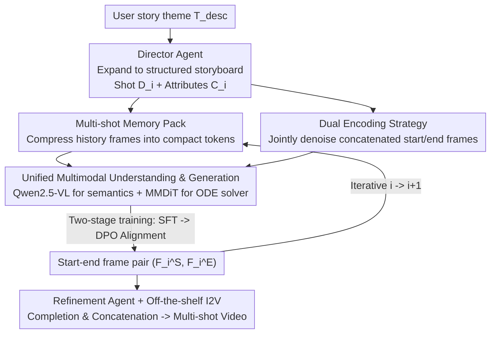

# STAGE: Storyboard-Anchored Generation for Cinematic Multi-shot Narrative

**Conference**: CVPR 2026  
**Paper**: [CVF Open Access](https://openaccess.thecvf.com/content/CVPR2026/html/Zhang_STAGE_Storyboard-Anchored_Generation_for_Cinematic_Multi-shot_Narrative_CVPR_2026_paper.html)  
**Code**: To be open-sourced (Paper states code/dataset will be public upon acceptance)  
**Area**: Video Generation / Multi-shot Narrative  
**Keywords**: Multi-shot video generation, storyboard, start-end frame pairs, shot consistency, cinematic language

## TL;DR
STAGE reformulates "keyframe-based multi-shot video generation" into a storyboard-anchored problem by "predicting a pair of start/end frames for each shot." By using the STEP2 model (multi-shot memory pack + dual encoding + two-stage training) to iteratively generate these pairs and delegating the completion to off-the-shelf I2V models, it significantly outperforms existing end-to-end and keyframe methods in cross-shot consistency and cinematic transitions.

## Background & Motivation
**Background**: Single-shot video generation is mature, with Diffusion Transformers (DiT) producing high-fidelity short clips. However, creating "storytelling" long videos requires stitching multiple shots with different scales/perspectives into a coherent narrative, which remains a weakness for current models. Existing approaches follow two routes: end-to-end generation of the entire multi-shot video at once, and keyframe-based methods—generating sparse keyframes as a narrative skeleton before completing each shot with an external I2V model.

**Limitations of Prior Work**: End-to-end methods are computationally expensive and follow an "all-or-nothing" paradigm, offering users almost no fine-grained control and high trial-and-error costs. Keyframe methods are efficient and controllable but provide only one sparse keyframe per shot, which **fails to preserve cross-shot consistency** (drifting character appearance or background) and **cannot express cinematic language** (e.g., transitions like shot-reverse-shot or zoom-in/out). The example in Fig. 1 is straightforward: a close-up shot of opening a ring box shows temporal discontinuity, where a white shirt with a dark tie in the previous shot changes to a blue shirt with a green tie.

**Key Challenge**: A single keyframe can only "anchor" one moment in a shot; it **cannot simultaneously encode intra-shot temporal evolution (how it moves) and inter-shot transitions (how it cuts)**. Narrative coherence survives precisely within these transitions, which sparse keyframes discard.

**Goal**: While maintaining the "efficiency + controllability" of the keyframe route, Ours aims to recover three elements: global entity consistency, intra-shot coherence, and inter-shot transitions—along with a structured dataset for training.

**Key Insight**: Rather than providing one keyframe per shot, it is better to provide a pair of "start frame $F_i^S$ and end frame $F_i^E$." This pair brings triple benefits: (i) the start-end pairs form a robust narrative skeleton, ensuring long-term consistency of entities and scenes; (ii) the intra-shot pair $(F_i^S, F_i^E)$ explicitly anchors visual content and intra-shot evolution (e.g., camera movement); (iii) the cross-shot pair $(F_i^E, F_{i+1}^S)$ of adjacent shots explicitly models transitions, conveying complex cinematic language.

**Core Idea**: Replace "one sparse keyframe per shot" with "predicting a pair of start/end frames per shot," transforming multi-shot generation into an iterative prediction problem where transitions and intra-shot dynamics are explicitly encoded into anchors.

## Method

### Overall Architecture
STAGE is a workflow where the input is a single-sentence story theme $T_{desc}$ and the output is a stitched multi-shot video $V=[V_1,\dots,V_N]$. It follows three steps: first, a **Director Agent** expands the theme into a structured storyboard (a text description $D_i$ and a set of cinematic attributes $C_i$ per shot, such as scale, duration, camera position, and movement); then, the core of the workflow—**STEP2 (Start-End frame Pair Prediction model)**—draws the abstract storyboard into concrete start-end frame pairs $(F_i^S, F_i^E)$ shot by shot; finally, a **Refinement Agent** fuses the generated frame pairs with the original storyboard into enhanced prompts for completion by off-the-shelf video models (WanX, Veo3.1, etc.).

STEP2 is the heart of STAGE. To iteratively generate start-end pairs for the $i$-th shot, it must simultaneously observe three types of context: the history of all previous shots (to maintain entity consistency), the start/end frames of the current shot (to ensure intra-shot coherence), and the semantic description/cinematic attributes of the current shot (to ensure cross-shot logic). Accordingly, STEP2 features a multi-shot memory pack, a dual encoding strategy, and a unified multimodal understanding + generation backbone, trained via a two-stage process (SFT + preference alignment) to acquire cinematic language.

### Key Designs

**1. Start-End Frame Pair Reformulation: Turning multi-shot generation into iterative STEP2 prediction**

This is the foundation. The limitation of a single keyframe is its inability to encode intra-shot dynamics and inter-shot transitions. STAGE reformulates the task: predict a pair of $(F_i^S, F_i^E)$ for shot $i$, conditioned on description $D_i$, attributes $C_i$, and all previous start-end pairs: $(F_i^S, F_i^E) = \mathrm{STEP2}(D_i, C_i, \{(F_j^S, F_j^E)\}_{j=1}^{i-1})$. The first shot has no history; subsequent shots iterate from $i=1$ to $i=N$. Thus, "start $\to$ end" intra-shot evolution is anchored by the pair, and $(F_i^E, F_{i+1}^S)$ between adjacent shots naturally serves transition modeling—recovering the two types of transitions lost by sparse keyframes.

**2. Multi-shot Memory Pack: Compressing infinite history into a compact token via progressive spatial tiling**

To maintain long-term entity consistency (appearance, scene) at shot $i$, the model must refer to all previous shots; however, full reference imposes a massive computational burden. The memory pack collects start-end frames of shots $1$ to $i-1$ into a memory bank $\{F_j^M\}_{j=1}^{2i-2}$, encodes them to latent space $m_j = E_{vae}(F_j^M)$ via a pre-trained VAE, sorts them by CLIP similarity (placing semantically relevant memories first), and compresses them into a memory token via **progressive spatial tiling**:

$$M_i = \mathrm{SpatialTile}_{j\in\{1,\dots,2i-2\}}\big(P(m'_j, A_j)\big)$$

Where $P(m'_j, A_j)$ is a downsampling function that compresses the $j$-th latent code by a factor $A_j = \frac{1}{2^j}$. This $\frac{1}{2^j}$ design is clever: more distant (less relevant) memories are compressed more heavily, and the total area mathematically converges—$\sum_{j=1}^{\infty} A_j = 1$. Consequently, the total volume of the memory token is bounded regardless of history length. This allows STEP2 to represent "potentially infinite" generation history within a fixed memory budget, a key factor for long video generation.

**3. Dual Encoding Strategy: Implicitly sharing visual context between start and end frames**

To ensure intra-shot coherence (visual consistency and plausible camera motion), start and end frames cannot be generated independently. Dual encoding takes the ground truth start-end pair, encodes them separately with a VAE, and concatenates them along the sequence dimension into a joint tensor $x_i = [E_{vae}(F_i^S); E_{vae}(F_i^E)]$. Following flow matching conventions, this is linearly interpolated with Gaussian noise: $x_i^t = t\cdot x_i^1 + (1-t)\cdot x_i^0$, where $x_i^1=x_i$ is the clean tensor and $x_i^0\sim\mathcal{N}(0,I)$. By denoising the concatenated tensor together, self-attention within MMDiT blocks allows start and end frames to reference each other throughout the process, avoiding intra-shot contradictions like the "changing castle" seen in ablations.

**4. Unified Multimodal Understanding + Generation Backbone: Reading semantics before ODE solving**

Image conditions alone are insufficient; the model must "understand" the story and character performance. STEP2 first uses a Qwen2.5-VL-based understanding model $E_{mu}$ to process the previous shot's end frame $F_{i-1}^E$, current description $D_i$, and cinematic attributes $C_i$, producing a unified context token $U_i = E_{mu}(F_{i-1}^E, D_i, C_i)$. Then, $U_i$, memory token $M_i$, and the interpolated joint tensor $x_i^t$ are fed into the generation model $E_{gen}$ (MMDiT blocks with global context interaction). A numerical solver integrates the ODE from $t=0$ to $t=1$:

$$dx_i^t/dt = E_{gen}(U_i, t, x_i^t, M_i)$$

This yields the clean start-end pair. Unifying understanding and generation within one architecture allows STEP2 to perform robust inference across diverse contexts while maintaining cross-shot coherence.

### Loss & Training
Ours utilizes two-stage training (corresponding to TTS in ablations). **Phase 1: SFT**: Both the understanding model $E_{mu}$ (high-level semantics) and generation model $E_{gen}$ (low-level frame generation) are fine-tuned via LoRA on ConStoryBoard. They learn a constant velocity field $v_t = x_i^1 - x_i^0$ following flow matching:

$$L_{SFT} = \mathbb{E}_{x_i^1, x_i^0, \mathcal{C}_i, t}\|v_\theta(x_i^t, t, \mathcal{C}_i) - v_t\|^2$$

where $\mathcal{C}_i = [D_i, C_i, \{(F_j^S, F_j^E)\}_{j=1}^{i-1}]$ aggregates text descriptions, cinematic attributes, and all prior start-end pairs. **Phase 2: Preference Alignment**: Using the SFT model as a reference $v_{ref}$, DPO post-training is performed on the human-curated ConStoryBoard-HP to maximize the likelihood of the policy model preferring positive samples $y_w$ over negative samples $y_l$:

$$L_{DPO} = -\mathbb{E}_{(y_w,y_l),\mathcal{C}_i,t}\big[\log\sigma(\beta(D_\theta - D_{ref}))\big]$$

where the preference difference is $D_k = \|v_k(\hat{x}_i^t,t,\mathcal{C}_i)-\hat{v}_t\|^2 - \|v_k(\check{x}_i^t,t,\mathcal{C}_i)-\check{v}_t\|^2$ ($k\in\{\theta,ref\}$, $\hat{\cdot}$ for negative samples, $\check{\cdot}$ for positive samples). Negative samples are ingeniously constructed by randomly sampling two internal frames from the same video clip as $y_l$ (representing "incomplete camera movement" or incorrect cinematic language), while ground truth start-end pairs serve as $y_w$. This aligns preferences directly with "correct cinematic language."

## Key Experimental Results

Implementation is based on Qwen-Image with a frozen VAE, LoRA rank=64, 8×A800, Adam optimizer, and learning rate $1\times10^{-4}$. SFT runs for 100K steps, followed by 20K steps for preference alignment. Evaluation covers 8 quantitative metrics across 5 dimensions (VBench AQ/IQ/OC/SC/BC, extended cross-shot SC-E/BC-E, and a custom transition metric TVS) plus 4 VLM scores (OVQ/VTC/ISC/STS).

### Main Results

| Method | AQ↑ | OC↑ | SC-E↑ | BC-E↑ | TVS↑ | OVQ↑ | VTC↑ | ISC↑ | STS↑ |
|------|-----|-----|-------|-------|------|------|------|------|------|
| CineTrans (End-to-End) | 0.5652 | 0.2018 | 0.6197 | 0.7428 | 0.0455 | 0.7972 | 0.3551 | 0.5585 | 0.4931 |
| IC-LoRA + WanX | 0.6333 | 0.2140 | 0.5319 | 0.7438 | 0.2090 | 0.7597 | 0.3897 | 0.4901 | 0.4696 |
| StoryDiffusion + WanX | 0.6941 | 0.2087 | 0.5780 | 0.7988 | 0.1441 | 0.5343 | 0.2069 | 0.4813 | 0.4575 |
| VideoGen-of-Thought | 0.7210 | 0.1689 | 0.6278 | 0.7830 | 0.0966 | 0.8106 | 0.1120 | 0.5086 | 0.4507 |
| MovieAgent | 0.5742 | 0.0711 | 0.4993 | 0.6473 | 0.0079 | 0.4895 | 0.1931 | 0.4511 | 0.4182 |
| **Ours (STAGE)** | **0.7689** | **0.2713** | **0.6917** | **0.8207** | **0.2732** | **0.8929** | **0.6069** | **0.6985** | **0.6255** |

STAGE ranks first in all 8 quantitative metrics and 4 LLM scores. Notably, VTC (video-text consistency) jumps from the runner-up's 0.3897 to 0.6069, and TVS (transition quality) from 0.2090 to 0.2732, showing a significant lead in "faithful instruction following" and "cinematic transitions"—the two hardest challenges—rather than just overall quality.

Human evaluation (25 AMT volunteers, 20 random samples, 4 criteria) further confirms:

| Method | Visual Quality (VQE) | Text Alignment (TAE) | Shot Consistency (SCE) | Transition (ITE) |
|------|------|------|------|------|
| CineTrans | 13.2 | 18.4 | 6.4 | 16.4 |
| IC-LoRA + WanX | 24.4 | 12.8 | 13.2 | 7.2 |
| StoryDiffusion + WanX | 1.2 | 8.0 | 5.6 | 3.6 |
| VideoGen-of-Thought | 2.8 | 4.4 | 0.4 | 2.0 |
| MovieAgent | 0.8 | 3.2 | 1.6 | 1.2 |
| **Ours (STAGE)** | **57.6** | **53.2** | **72.8** | **69.6** |

Preference rates for shot consistency (72.8%) and transitions (69.6%) are overwhelmingly dominant, matching the core selling points of the method.

### Ablation Study

| Config | Change in SC↓ | Change in BC↓ | SC-E | BC-E | TVS | Explanation |
|------|------|------|------|------|------|------|
| Full (STAGE) | 0.9695 | 0.9685 | 0.6917 | 0.8207 | 0.2732 | Full Model |
| w/o MMP | 0.9631 | 0.9592 | 0.6088 | 0.7311 | 0.2370 | Removing memory pack hurts cross-shot consistency (SC-E/BC-E) most, causing night-to-day jumps. |
| w/o DES | 0.9542 | 0.9476 | 0.6803 | 0.8124 | 0.2680 | Removing dual encoding hurts intra-shot SC/BC most; castle looks different between frames. |
| w/o TTS | 0.9613 | 0.9633 | 0.6636 | 0.8037 | 0.2195 | SFT only without DPO; TVS drops most (0.2732→0.2195), transitions are abrupt. |

### Key Findings
- **Modular specializations align with design intent**: Removing MMP mainly harms cross-shot consistency (SC-E 0.6917→0.6088), removing DES mainly harms intra-shot consistency (SC 0.9695→0.9542), and removing TTS mainly harms transitions (TVS 0.2732→0.2195). This clean "module-to-metric" mapping provides strong evidence for the effectiveness of each design.
- **DPO is the primary source of cinematic language**: SFT-only models lack exposure to negative examples and fail to learn effective inter-shot transitions, often resulting in "hard cuts" like a character looking down followed by an immediate sky shot. Constructing negatives from "internal frames of the same clip" is a brilliant way to capture "incorrect cinematic language" at zero cost.
- **The dataset fills a structural gap in keyframe data**: Current keyframe datasets provide only a single frame per shot and focus on text-shot alignment. ConStoryBoard (100K training + 1K test pairs, filtered from Condensed Movies for 1080p+, aesthetics 5.5+, shot cuts via TransNetV2, and InternVL-3.5 labels) specifically provides start-end pairs and cinematic attributes, which is the prerequisite for training STEP2.

## Highlights & Insights
- **The reformulation itself is the biggest highlight**: Switching from "sparse keyframes" to "start-end pairs" seems like a simple shift from 1 frame to 2, but it transforms "intra-shot dynamics" and "inter-shot transitions"—previously homeless modeling goals—into explicitly predictable and supervised targets. This "representation swap to make problems learnable" is transferable to any sequential generation task.
- **The $\sum 1/2^j=1$ convergence of progressive spatial tiling is elegant**: Ensuring a bounded memory token volume via a geometric series allows "potentially infinite history" to be representable under a fixed budget. This engineering trick for long videos is reusable in any iterative generation scenario requiring history compression.
- **Using "internal frames" for DPO negative samples**: It eliminates the need for additional labeling or external reward models. Sampling internal frames from the same clip naturally corresponds to negative examples of "incomplete camera movement," driving the data cost of preference alignment to zero.
- **Decoupled Workflow**: Director Agent (Planning) $\to$ STEP2 (Visual Anchors) $\to$ Refinement Agent + off-the-shelf I2V (Completion). This division of labor maintains fine-grained control and allows leveraging the latest video models without crushing all capabilities into an end-to-end black box.

## Limitations & Future Work
- **Limitations acknowledged by authors**: Final frame completion depends on off-the-shelf I2V models, which may introduce temporal inconsistency within a single shot segment—STEP2 only guarantees the quality and cross-shot consistency of the start/end frames, not the coherence of intermediate frames from downstream generators.
- **Self-identified limitations**: (1) Cross-shot indicators (SC-E/BC-E/TVS) are largely custom or extended, lacking recognized community benchmarks, making the absolute values less meaningful than the relative advantage and human preference. (2) The pipeline relies on multiple large models (Qwen2.5-VL, Qwen-Image, VBench, etc.), presenting a high barrier for reproduction and inference costs. (3) The DPO negative sample assumption (internal frames = incorrect cinematic language) might not hold for certain slow-paced long takes.
- **Improvements**: Integrating downstream I2V into joint training or adding cross-shot consistency constraints to mitigate intra-shot drift; or allowing STEP2 to predict a sparse anchor sequence of $>2$ frames to find a better balance between "controllability" and "intermediate coherence."

## Related Work & Insights
- **vs End-to-End (CineTrans)**: E2E generates the entire multi-shot video at once but is expensive, "all-or-nothing," and hard to control; STAGE adopts the keyframe route's controllability and efficiency while recovering the coherence typically associated with E2E, leading across metrics (e.g., VTC 0.6069 vs 0.3551).
- **vs Keyframe-based (IC-LoRA+WanX / StoryDiffusion / MovieAgent / VideoGen-of-Thought)**: These provide a single sparse keyframe per shot, ignoring cinematic transitions and leading to hard cuts. STAGE reformulates keyframes into start-end pairs, **directly modeling transitions** $(F_i^E, F_{i+1}^S)$, crushing them in shot consistency (72.8%) and transition (69.6%) human preference.
- **vs RLHF/DPO in Visual Generation**: Prior works mostly use DPO for static attributes (fidelity, aesthetics). STAGE extends it to **temporal relations/cinematic language** in multi-shot videos, a meaningful expansion of DPO's application range.

## Rating
- Novelty: ⭐⭐⭐⭐ "Start-end pair reformulation + Progressive spatial tiling memory + DPO negatives from internal frames" are self-consistent and transferable insights.
- Experimental Thoroughness: ⭐⭐⭐⭐ Comparison with 5 methods + ablation of 3 modules + human eval. Ablations match design intent; however, cross-shot metrics are custom and lack public benchmarks.
- Writing Quality: ⭐⭐⭐⭐ Clear chain from motivation to triple benefits to method to experiment; diagrams (Fig. 1/3) make the abstract reformulation intuitive.
- Value: ⭐⭐⭐⭐ A practical workflow for AI-assisted cinema/long narrative video, with a 100K-scale dataset that has lasting value for the community.

<!-- RELATED:START -->

## Related Papers

- [\[CVPR 2026\] HoloCine: Holistic Generation of Cinematic Multi-Shot Long Video Narratives](holocine_holistic_generation_of_cinematic_multi-shot_long_video_narratives.md)
- [\[CVPR 2026\] MultiShotMaster: A Controllable Multi-Shot Video Generation Framework](multishotmaster_a_controllable_multi-shot_video_generation_framework.md)
- [\[CVPR 2026\] OneStory: Coherent Multi-Shot Video Generation with Adaptive Memory](onestory_coherent_multi-shot_video_generation_with_adaptive_memory.md)
- [\[CVPR 2026\] ShotDirector: Directorially Controllable Multi-Shot Video Generation with Cinematographic Transitions](shotdirector_directorially_controllable_multi-shot_video_generation_with_cinemat.md)
- [\[CVPR 2026\] Rethinking Position Embedding as a Context Controller for Multi-Reference and Multi-Shot Video Generation](rethinking_position_embedding_as_a_context_controller_for_multi-reference_and_mu.md)

<!-- RELATED:END -->
