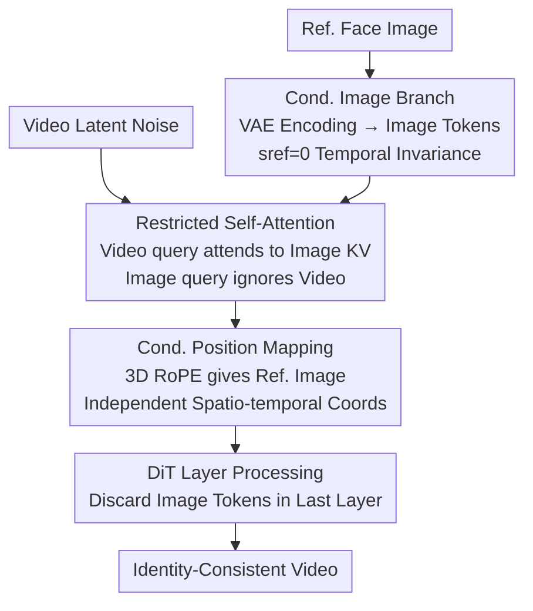

# Stand-In: A Lightweight and Plug-and-Play Identity Control for Video Generation

**Conference**: CVPR 2026  
**Area**: Video Generation / Diffusion Models  
**Keywords**: Identity Preservation, Video Generation, Plug-and-Play, Restricted Self-Attention, Conditional Position Mapping  
**Code**: https://github.com/WeChatCV/Stand-In  
**Paper**: [CVF Open Access](https://openaccess.thecvf.com/content/CVPR2026/html/Xue_Stand-In_A_Lightweight_and_Plug-and-Play_Identity_Control_for_Video_Generation_CVPR_2026_paper.html)  

## TL;DR
Stand-In introduces a "conditional image branch" to pretrained video Diffusion Transformers (DiT). By utilizing **Restricted Self-Attention and Conditional Position Mapping**, it injects the identity of a reference face into generated videos. While training only ~1% extra parameters on 2,000 video pairs, it outperforms full-parameter fine-tuning methods in face similarity. Since it preserves the backbone, it remains plug-and-play for tasks like stylization, face swapping, and pose-guided generation.

## Background & Motivation
**Background**: Identity-preserving video generation requires that a character's identity remains consistent across a video given a single reference face. Existing approaches fall into two categories: early methods (e.g., ID-Animator, ConsistID) that use an **explicit face encoder** to extract identity features for injection via cross-attention, and recent methods (e.g., Phantom, HunyuanCustom) that perform **full-parameter fine-tuning** of the entire Diffusion Transformer.

**Limitations of Prior Work**: The face encoder approach lacks flexibility and struggles to capture fine facial details required for high-quality generation, as encoders often output compressed identity embeddings that lose texture. Conversely, full-parameter fine-tuning is computationally expensive (often involving 14B parameters) and compromises compatibility with the broader AIGC ecosystem (e.g., stylization LoRAs or pose-control frameworks).

**Key Challenge**: Achieving high identity fidelity, lightweight training, and ecosystem compatibility simultaneously is difficult—fidelity often necessitates backbone retraining, which in turn destroys pretrained priors and plug-and-play capabilities.

**Goal**: Achieve SOTA identity preservation **without modifying the backbone, without introducing explicit face encoders, and by training minimal parameters**.

**Key Insight**: The authors observe that the pretrained **VAE** inherent to video generation models already encodes images into the same latent space as videos. Thus, an external face encoder is redundant. By using the backbone's VAE to encode reference images, rich facial features can be extracted while ensuring feature isomorphism with the video, bypassing the need for feature space alignment.

**Core Idea**: Replace explicit face encoders with a "conditional image branch" that shares the backbone's VAE and transformer blocks. Use **Restricted Self-Attention** to allow video tokens to unidirectionally reference image tokens, injecting identity with only ~1% parameter overhead.

## Method

### Overall Architecture
Stand-In is built upon the **Wan2.1-14B-T2V** DiT architecture. Given a reference face, the backbone's VAE maps it to image tokens (following the **exact same** patchification process as the video latent). These tokens are concatenated with video latent tokens along the sequence dimension and fed into the DiT blocks. Within each block, tokens remain separate during LayerNorm, cross-attention, and FFN modules, interacting only in the self-attention layer where video tokens "reference" the image tokens' identity. The image tokens are discarded in the final layer.

To maintain the reference image as a "static condition," the authors fix its diffusion timestep at $s_{ref}=0$, ensuring temporal invariance throughout the denoising process. The core mechanism is summarized below:

### Key Designs

**1. Conditional Image Branch: Replacing Face Encoders with Backbone VAE**

This design directly addresses the limitation that face encoders fail to capture fine details and require alignment across divergent feature spaces. By feeding the reference image into the **video model's own VAE**, the resulting tokens reside in the same latent space as the video. This strategy leverages the backbone's intrinsic image-reading capabilities. To ensure the reference image acts as a "static identity anchor" rather than content to be denoised, its timestep is fixed at $s_{ref}=0$, making its features temporally invariant.

**2. Restricted Self-Attention (RSA): Unidirectional Identity Reference**

Concatenating image and video tokens in **Vanilla Self-Attention** (VSA) leads to two issues: first, the static image query may attend to dynamic video content, "contaminating" the identity; second, the model may ignore image tokens entirely. The "restricted" version separates $Q_I,K_I,V_I$ for images and $Q_V,K_V,V_V$ for videos. The image branch performs internal attention $\text{Out}_I=\text{Attention}(Q'_I,K'_I,V_I)$ while ignoring the video, whereas the video branch uses concatenated KVs:

$$\text{Out}_V=\text{Attention}\big(Q'_V,\,[K'_V,K'_I],\,[V_V,V_I]\big)$$

This ensures a unidirectional flow of information from the image to the video. To preserve backbone robustness, LoRAs are added only to the **image token QKV projections** (occupying ~1% of parameters). Furthermore, because $s_{ref}=0$ keeps $K_I,V_I$ constant, **KV Caching** is employed during inference to eliminate redundant computations.

**3. Conditional Position Mapping (CPM): Independent Coordinates for Reference Images**

To distinguish image and video tokens, the authors utilize **3D RoPE** to assign a **private, non-overlapping** coordinate space to reference tokens. In the temporal dimension, image tokens are assigned a temporal index of $-1$, establishing them as an "invariant global identity prior." Spatially, disjoint coordinates are used: video frames occupy $(h,w)\in[0,H_V)\times[0,W_V)$, while image tokens occupy a separate subspace $[H_V,H_V+H_I)\times[W_V,W_V+W_I)$. The positional encoding is applied via Hadamard product: $Q'_I=Q_I\cdot p_I$, $K'_I=K_I\cdot p_I$.

This geometric isolation prevents **spurious spatial correlations** and preserves the backbone's pretrained positional priors. It guides the model to treat the reference image as a semantic identity prior rather than a local pattern requiring pixel-wise alignment.

## Key Experimental Results

### Main Results
Evaluation focuses on Face Similarity (CurricularFace cosine similarity) and Naturalness (GPT-4o score, 1–5 scale), alongside Text Alignment (X-CLIP). With only 0.15B trainable parameters, Stand-In leads in face similarity:

| Method | Trainable Params | Face Sim.↑ | Naturalness↑ | Text Align.↑ |
|------|---------|------------|--------|----------|
| Hunyuan-Custom | 13B | 0.622 | 3.367 | 19.853 |
| VACE-14B | 14B | 0.647 | 3.728 | 19.520 |
| Phantom-14B | 14B | 0.519 | 3.828 | 20.476 |
| ConsistID | 5B | 0.432 | 3.233 | **20.552** |
| Hailuo (Closed) | — | 0.577 | 3.750 | 20.649 |
| **Stand-In (Ours)** | **0.15B** | **0.724** | **3.922** | 20.594 |

The face similarity score of 0.724 surpasses all open-source methods and even the closed-source Hailuo (0.577). A 20-person user study yielded consistent preferences:

| Method | Face Sim.↑ | Quality↑ |
|------|------------|----------|
| Hunyuan-Custom | 3.34 | 2.92 |
| VACE-14B | 3.00 | 3.07 |
| Kling | 2.21 | 3.09 |
| **Stand-In (Ours)** | **4.10** | **4.08** |

### Ablation Study
Ablations highlight the necessity of the core components:

| Configuration | Face Sim.↑ | Naturalness↑ | Description |
|------|------------|--------|------|
| RSA → VSA | 0.422 | 3.855 | RSA replaced by Vanilla Self-Attention |
| CPM → SPM | 0.536 | 3.755 | CPM replaced by Shared Position Mapping |
| Full Model | **0.724** | **3.922** | Complete Stand-In model |

### Key Findings
- **RSA is vital for identity fidelity**: Reversing to VSA causes Face Similarity to drop from 0.724 to 0.422.
- **CPM maintains scene stability**: Shared mapping (SPM) corrupts positional priors, destabilizing aspect ratios and naturalness.
- **Extremely Lightweight**: Adding 153M parameters to a 14B model results in only a +2.3% runtime increase during inference with KV Caching.
- **Strong Generalization**: Despite being trained on 2,000 human videos, the model zero-shot generalizes to non-human subjects like teddy bears and cartoons.

## Highlights & Insights
- **VAE as Face Encoder**: Replacing external encoders with the backbone’s VAE avoids detail loss and ensures natural feature isomorphism.
- **Structural Constraints over Loss**: RSA enforces unidirectional flow through its attention structure rather than a loss penalty, ensuring identity remains static.
- **Inference Efficiency**: The fixed $s_{ref}=0$ timestep facilitates KV Caching, making the identity control overhead nearly negligible.
- **Ecosystem Compatibility**: As a LoRA-based bypass, it can be combined with other tools like pose controllers or inpainting models.

## Limitations & Future Work
- The current training set consists of 2,000 human videos; more rigorous quantification is needed for non-human or multi-subject scenarios.
- Naturalness relies on GPT-4o proxy scores, which may contain inherent biases.
- The method is architecture-dependent (requiring 3D-VAE and RoPE), and its transferability to U-Net or non-RoPE models remains to be verified.
- Currently supports only single-subject identity control.

## Related Work & Insights
- **vs. Encoder-based (ID-Animator / ConsistID)**: Stand-In avoids detail loss from compressed embeddings; it achieves 0.724 Face Sim. vs. ConsistID’s 0.432.
- **vs. Full Fine-tuning (VACE-14B / Phantom)**: Stand-In achieves higher similarity (0.724 vs 0.647) with drastically fewer parameters (~1% of backbone).
- **vs. VACE (Pose Control)**: The two are complementary; Stand-In can be added to VACE to enhance identity consistency during pose-guided generation.

## Rating
- Novelty: ⭐⭐⭐⭐ 
- Experimental Thoroughness: ⭐⭐⭐⭐ 
- Writing Quality: ⭐⭐⭐⭐ 
- Value: ⭐⭐⭐⭐⭐ 

<!-- RELATED:START -->

## Related Papers

- [\[CVPR 2026\] Identity-Preserving Image-to-Video Generation via Reward-Guided Optimization](identity-preserving_image-to-video_generation_via_reward-guided_optimization.md)
- [\[CVPR 2026\] ConsID-Gen: View-Consistent and Identity-Preserving Image-to-Video Generation](consid-gen_view-consistent_and_identity-preserving_image-to-video_generation.md)
- [\[CVPR 2026\] PLACID: Identity-Preserving Multi-Object Compositing via Video Diffusion with Synthetic Trajectories](placid_identity-preserving_multi-object_compositing_via_video_diffusion_with_syn.md)
- [\[CVPR 2026\] EvoID: Reinforced Evolution for Identity-Preserving Video Generation](evoid_reinforced_evolution_for_identity-preserving_video_generation.md)
- [\[CVPR 2025\] Wav2Sem: Plug-and-Play Audio Semantic Decoupling for 3D Speech-Driven Facial Animation](../../CVPR2025/video_generation/wav2sem_plug-and-play_audio_semantic_decoupling_for_3d_speech-driven_facial_anim.md)

<!-- RELATED:END -->
