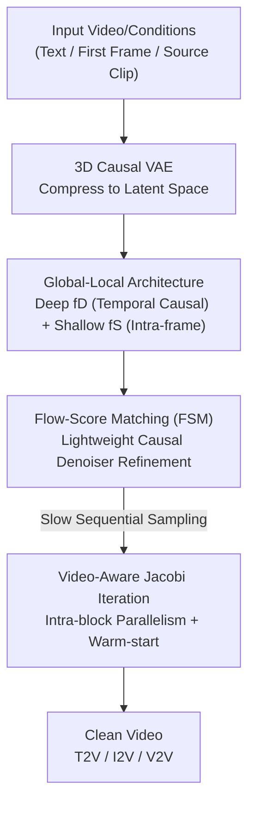

# STARFlow-V: End-to-End Video Generative Modeling with Autoregressive Normalizing Flows

**Conference**: CVPR 2026  
**Paper**: [CVF Open Access](https://openaccess.thecvf.com/content/CVPR2026/html/Gu_STARFlow-V_End-to-End_Video_Generative_Modeling_with_Autoregressive_Normalizing_Flows_CVPR_2026_paper.html)  
**Code**: https://github.com/apple/ml-starflow  
**Area**: Video Generation  
**Keywords**: Normalizing Flows, Autoregressive Generation, Video Generation, Causal Modeling, Flow-Score Matching

## TL;DR
STARFlow-V introduces Normalizing Flows (NF) to the field of video generation. By employing a "global-local" invertible architecture for end-to-end maximum likelihood training and causal autoregressive inference, combined with a lightweight causal denoiser (flow-score matching) and video-aware Jacobi parallel solving, it demonstrates for the first time that NF can achieve quality comparable to causal diffusion baselines on 480p video while naturally unifying T2V, I2V, and V2V tasks.

## Background & Motivation

**Background**: Video generation is currently dominated by diffusion models. Following Sora, DiT-style diffusion backbones have shown strong generalization in large-scale text-to-video (T2V) generation, with major systems like HunyuanVideo, Wan2.1, and CogVideoX all utilizing diffusion. Although NFs have recently caught up with diffusion in the image domain via TARFlow and STARFlow, they remain largely unexplored in the video domain where dimensionality and computational requirements are orders of magnitude higher.

**Limitations of Prior Work**: Diffusion video generation faces two structural issues. First, **training is not end-to-end**: it corrupts frames at random noise levels and learns a denoiser to invert the process, supervising only one noise level per update. This makes training extremely expensive for video and optimizes only a lower bound of $\log p$. Second, **parallel denoising is inherently non-causal**: all frames are noised and denoised together, allowing future frames to influence past frames, which is unsuitable for streaming or interactive scenarios. Autoregressive diffusion, proposed for causality, introduces **exposure bias**: models are fed ground-truth context during training but must rely on their own erroneous predictions during inference, causing errors to snowball along the temporal axis and degrading long-video quality.

**Key Challenge**: Diffusion relies on "noised conditions" for robustness, which sacrifices information and requires extra parameters. Autoregressive diffusion accumulates errors in **pixel space**, where defects in preceding frames propagate directly to subsequent ones. The root of the problem is that the conditional signal for autoregressive generation consists of error-prone pixels, and pixel space distributions are arbitrarily multimodal and unforgiving of small errors.

**Goal**: (1) Return video generation to **end-to-end maximum likelihood**; (2) Implement **strictly causal** autoregressive rolling to support streaming; (3) Suppress long-range error accumulation; (4) Unify T2V, I2V, and V2V with a single backbone.

**Key Insight**: Normalizing Flows are invertible mappings. Training utilizes the exact MLE from the change-of-variables formula, and sampling requires only a single inversion step—inherently end-to-end, iteration-free, and supportive of invertible feature mapping. Since STARFlow proved that "Transformer-parameterized autoregressive NFs" can scale to high-resolution images, aligning their autoregressive property with the temporal causality of video is a natural fit.

**Core Idea**: Bring the invertibility and causality of autoregressive NFs to video by performing "continuous next-token prediction" for temporal reasoning through deep flow layers in a **compact global latent space**, while shallow layers perform local frame-wise shaping. This confines error accumulation to a low-dimensional, unimodal, and easily regressed latent space rather than pixel space.

## Method

### Overall Architecture
STARFlow-V processes video into a spatiotemporal latent space using a pre-trained 3D causal VAE (from Wan2.2, with $16\times$ spatial and $4\times$ temporal compression to 48 channels). A sequence of autoregressive flow blocks then invertibly maps latents to a Gaussian prior. The core is a **deep–shallow decomposition** $f_\theta = f_D \circ f_S$: the shallow $f_S$ uses alternating (left-to-right / right-to-left) masks for intra-frame local shaping $u = f_S(x)$, while the deep $f_D$ is a causal Transformer flow mapping $u$ to the prior $z = f_D(u)$. The entire model remains an NF trained via exact MLE using change-of-variables. During inference, $f_D^{-1}$ is inverted for token-by-token and frame-by-frame causal sampling, followed by independent decoding of each frame with $f_S^{-1}$. Finally, a lightweight causal denoiser $s_\phi$ refines the slightly noisy output into clean video. The three tasks (T2V/I2V/V2V) only require changes to the conditional signals.

### Key Designs

**1. Global-Local Architecture: Shifting Error Accumulation to Unimodal Latent Space**

Naively treating the entire video as a single long token sequence fails because the alternating masks in shallow layers $f_S$ propagate future frame information back to the past, making the generator non-causal. The authors **restrict $f_S$ to work only within frames, allowing only $f_D$ to propagate global context across frames while maintaining causality**. The likelihood is rewritten as an autoregressive decomposition over frames:

$$p_\theta(x) = \prod_{n=1}^{N} p_D(u_n \mid u_{<n}) \,\big|\det J_{f_S}(x_n)\big|, \quad u_n = f_S(x_n)$$

This treats video as a **continuous language model**: the deep term $p_D(u_n \mid u_{<n})$ represents "Gaussian next-token prediction" in latent space, and the shallow layers provide the Jacobian factor $|\det J_{f_S}(x_n)|$. This works because $u$ is unimodal and easier to regress than multimodal pixels $x$. During sampling, $f_D^{-1}$ conditions on **previously generated latents** rather than pixels, preventing data-space errors from propagating—the antidote to autoregressive error accumulation in diffusion.

**2. Flow-Score Matching (FSM): Learning Causal Denoising**

NF training requires injecting small noise $\sigma$ into the data to stabilize optimization, which results in slightly noisy samples that require post-processing. Current solutions are problematic: decoder fine-tuning loses temporal consistency due to the limited receptive field of 3D causal VAEs, and score-based denoising using Tweedie estimates $x \approx \tilde{x} + \sigma^2 \nabla_{\tilde{x}} \log p_\theta(\tilde{x})$ suffers from high-frequency artifacts and non-causality (the gradient of $\log p_\theta$ is global by definition). 

Ours trains a lightweight neural denoiser $s_\phi$ to regress the model scores:

$$\mathcal{L}_{\text{denoise}}(\phi) = \mathbb{E}_{x,\epsilon}\big\| s_\phi(\tilde{x}) - \sigma \nabla_{\tilde{x}} \log p_\theta(\tilde{x}) \big\|_2^2, \quad \tilde{x} = x + \epsilon,\ \epsilon \sim \mathcal{N}(0, \sigma^2 I)$$

$s_\phi$ uses its inductive bias to suppress artifacts and is explicitly encoded with **causality** using one-step latency: $s_\phi(\tilde{x}_{\le n+1}) \approx (\sigma \nabla_{\tilde{x}} \log p_\theta)_n$. Training requires almost zero overhead as input gradients can be cached during the MLE backward pass.

**3. Video-Aware Block-wise Jacobi Iteration: Parallelizing Causal Sampling**

Sequential token-by-token sampling is expensive for long videos. This work reformulates the inversion as solving a fixed-point system $x = \mu_\theta(x \odot m) + \sigma_\theta(x \odot m)\cdot z$ using **Jacobi iteration**: starting from an initial estimate $x^{(0)}$, it iterates $x^{(k+1)} = \mu_\theta(x^{(k)} \odot m) + \sigma_\theta(x^{(k)} \odot m)\cdot z$ until convergence. A **block-wise** schedule is used, processing segments of size $B$ in parallel. To further accelerate, **video-aware initialization** uses the converged state of the previous frame $x^{(k)}_n$ as the warm-start $x^{(0)}_{n+1}$ for the next. This reduces inference latency by approximately $15\times$ without loss of fidelity.

### Loss & Training
The primary loss is the exact MLE for NF: $\mathcal{L}_{\text{NF}}(\theta) = \mathbb{E}_x[\log p_0(f_\theta(x)) + \log|\det J_{f_\theta}(x)|]$, co-trained with $\mathcal{L}_{\text{denoise}}$. The model was trained on 70M text-video pairs and 400M text-image pairs using a progressive curriculum from image initialization to a 7B parameter video model at 480p resolution.

## Key Experimental Results

### Main Results (VBench Text-to-Video)
STARFlow-V is the only NF method on the leaderboard, reaching parity with recent **causal diffusion** baselines († indicates usage of GPT-enhanced rewriter prompts).

| Model | Category | Total↑ | Quality↑ | Semantic↑ |
|------|------|--------|----------|-----------|
| Veo3 (Closed) | Closed | 85.06 | 85.70 | 82.49 |
| Wan2.1-T2V | Diffusion | 83.69 | 85.59 | 76.11 |
| HunyuanVideo | Diffusion | 83.24 | 85.09 | 75.82 |
| Self-Forcing (Chunk) | AR Diffusion | 84.31 | 85.07 | 81.28 |
| **STARFlow-V† (Ours)** | **NF** | **79.70** | **80.76** | **75.43** |
| STARFlow-V (Ours) | NF | 78.67 | 80.24 | 72.37 |

### Ablation Study (Denoiser Choice, VAE Reconstruction)

| Method | PSNR↑ | SSIM↑ | rFID↓ |
|------|-------|-------|-------|
| No noise (Upper Bound) | 32.22 | 0.8907 | 3.26 |
| Decoder fine-tuning [STARFlow] | 23.95 | 0.6403 | 19.74 |
| Score-based denoising [TARFlow] | 22.05 | 0.6490 | 7.65 |
| **Flow-score matching (Ours)** | **26.69** | **0.7601** | **7.06** |

### Key Findings
- **FSM is the superior denoiser**: It significantly outperforms decoder fine-tuning and score-based denoising in PSNR/SSIM, avoiding temporal jittering and bright-spot artifacts in high-motion areas.
- **Causality comes at little cost**: The non-causal variant is very close in quality to the causal version, indicating that causal structure for streaming does not significantly degrade perceptual quality.
- **Robust Long-range Extrapolation**: While trained on 5s clips, the model stably generates up to 30s. Unlike NOVA or Self-Forcing, which show color drift or structural deformation, STARFlow-V remains consistent, validating that latent-space error accumulation is more robust.
- **Jacobi block size sweet spot**: Video-aware warm-start allows for larger block sizes (512) after the first frame, achieving 15x acceleration.

## Highlights & Insights
- **"Continuous LM = Video Autoregressive Flow"**: Interpreting the deep flow term $p_D(u_n|u_{<n})$ as Gaussian next-token prediction allows for the direct transfer of LLM engineering (KV cache, block decoding, pipeline parallelism).
- **Reversibility is a "free lunch"**: Because the mapping is invertible, the decoder can be reused as an encoder, enabling I2V and V2V without requiring separate condition encoders.
- **Dimensionality reduction of error accumulation**: This work moves error accumulation from multimodal pixel space to unimodal latent space, addressing exposure bias fundamentally rather than through tricks.

## Limitations & Future Work
- **Latency is not yet real-time**: Despite $15\times$ acceleration, it remains far from real-time on commodity GPUs, which is a barrier for interactive applications.
- **Scaling Law is not yet clean**: The authors did not observe a clear scaling law with current data cleaning, limited by noise and bias in the dataset.
- **Quality gap with top-tier diffusion**: While proving the concept, it still trails behind the strongest diffusion models like Wan2.1.

## Related Work & Insights
- **vs Autoregressive Diffusion (NOVA / Self-Forcing)**: These use chain-rule diffusion but are not end-to-end and accumulate errors in pixel space. Ours uses end-to-end MLE and keeps errors in latent space, improving extrapolation.
- **vs VideoFlow**: VideoFlow was limited by Glow-based capacity and low resolution. STARFlow-V is the first NF model to approach the quality of modern causal diffusion.

## Rating
- Novelty: ⭐⭐⭐⭐⭐ First NF to achieve usable quality on 480p video with effective global-local and FSM designs.
- Experimental Thoroughness: ⭐⭐⭐⭐ Extensive VBench and ablation studies, though still trails SOTA diffusion quantitatively.
- Writing Quality: ⭐⭐⭐⭐⭐ Clear derivation of motivation and causal structure.
- Value: ⭐⭐⭐⭐ High potential as a world model backbone, though short-term deployment is limited by latency.

<!-- RELATED:START -->

## Related Papers

- [\[CVPR 2026\] MoCha: End-to-End Video Character Replacement without Structural Guidance](mocha_end-to-end_video_character_replacement_without_structural_guidance.md)
- [\[CVPR 2026\] AutoCut: End-to-end Advertisement Video Editing Based on Multimodal Discretization and Controllable Generation](autocut_end-to-end_advertisement_video_editing_based_on_multimodal_discretizatio.md)
- [\[CVPR 2026\] LottieGPT: Tokenizing Vector Animation for Autoregressive Generation](lottiegpt_vector_animation_generation.md)
- [\[CVPR 2026\] A Frame is Worth One Token: Efficient Generative World Modeling with Delta Tokens](a_frame_is_worth_one_token_efficient_generative_world_modeling_with_delta_tokens.md)
- [\[CVPR 2026\] GT-SVJ: Generative-Transformer-Based Self-Supervised Video Judge For Efficient Video Reward Modeling](gt-svj_generative-transformer-based_self-supervised_video_judge.md)

<!-- RELATED:END -->
