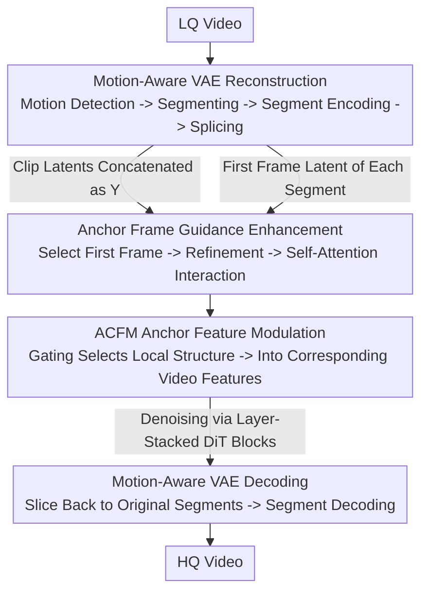

# STCDiT: Spatio-Temporally Consistent Diffusion Transformer for High-Quality Video Super-Resolution

**Conference**: CVPR 2026  
**Paper**: [CVF Open Access](https://openaccess.thecvf.com/content/CVPR2026/html/Chen_STCDiT_Spatio-Temporally_Consistent_Diffusion_Transformer_for_High-Quality_Video_Super-Resolution_CVPR_2026_paper.html)  
**Code**: https://jychen9811.github.io/STCDiT_page (Project Page)  
**Area**: Video Generation / Diffusion Models / Video Super-Resolution  
**Keywords**: Video Super-Resolution, Video Diffusion Models, Motion-Aware VAE, Anchor Frame Guidance, LoRA Fine-tuning

## TL;DR
STCDiT performs video super-resolution (VSR) based on a pre-trained video diffusion model. It addresses temporal distortions under complex camera movement using "Motion-Aware VAE Segmented Reconstruction" and injects structure information from the first frame of each segment (which avoids temporal compression) via "Anchor Frame Guidance." By adding only approximately 7% of LoRA parameters, it outperforms multiple SOTA methods in structural fidelity and temporal consistency.

## Background & Motivation

**Background**: Video Super-Resolution (VSR) aims to restore high-quality (HQ) frames from low-quality (LQ) videos. Traditional spatio-temporal modeling methods often lack detail, prompting a shift toward diffusion priors. While image diffusion models generate high perceptual quality frame-by-frame, video diffusion models naturally model spatio-temporal continuity and inter-frame coherence, making them a more promising direction.

**Limitations of Prior Work**: Directly applying pre-trained video diffusion models to VSR faces two major obstacles. First is the **temporal stability during the reconstruction stage**—video diffusion relies on pre-trained VAEs for temporal downsampling/upsampling. However, temporal scaling operators in VAEs operate only on local space and fail to capture complex spatial transformations across frames. When encountering motion like camera shake or zooming, VAE reconstruction suffers from structural distortion and artifacts. Second is the **structural fidelity during the generation stage**—existing methods (like SeedVR) rely on full fine-tuning of the DiT to maintain fidelity, which is computationally expensive. Using parameter-efficient LoRA often limits the model's ability to capture complex feature interactions due to low-rank constraints, making it difficult to preserve LQ structure while generating accurate details.

**Key Challenge**: The temporal operator of a VAE is a "globally shared local operator," but real-world video motion is **piecewise non-uniform**. Forcing a single operator to reconstruct an entire video containing abrupt motion inevitably leads to distortion. For the generation side to maintain fidelity, the missing piece is **structural anchors from the LQ input that have not been corrupted by temporal compression**.

**Core Idea**: Instead of re-designing the VAE architecture (high cost), it is better to **partition the video into small segments with "intra-segment motion consistency" for separate reconstruction**. Instead of full fine-tuning, the **latent variables of the first frame of each segment (unaffected by temporal compression and rich in structural information) are used as anchor frames**, injecting their structural information into the generation process via self-attention and gated modulation. The coupling of these two designs allows parameter-efficient diffusion models to achieve high-quality VSR.

## Method

### Overall Architecture

STCDiT is built upon the pre-trained Wan 2.1 video diffusion model. The pipeline consists of two stages: **Reconstruction** using a Motion-Aware VAE, and **Generation** using a DiT with Anchor Frame Guidance (LoRA fine-tuned). Given an LQ video, motion detection is first performed to segment the video into $L$ clips at abrupt motion points. Each clip is independently encoded by the VAE to obtain clip latents $\{X_i\}_{i=1}^{L}$, which are concatenated along the temporal dimension to form $Y$. Simultaneously, the latent of the first frame of each clip is selected as the anchor frame latent $I_{AF}$. $Y$ is concatenated with noise and a mask, then patchified into video features $F_V$. The anchor frames pass through a refinement module to produce $F_{AF}$. Both interact via self-attention in each DiT block, followed by ACFM gated modulation to inject structural information layer-by-layer into the video features. After diffusion, the restored latent $Y'$ is split back into $\{X_i'\}$ according to the original segments for independent decoding, forming the final HQ video.

### Key Designs

**1. Motion-Aware VAE Segmented Reconstruction: Bypassing Temporal Operator Weaknesses via Intra-Segment Consistency**

To address the inability of VAE temporal scaling operators to model complex inter-frame motion, the authors manipulate the input side rather than modifying the VAE architecture. The video is segmented into clips with **uniform intra-segment motion**, ensuring the VAE only deals with simple, consistent motion within each clip. The motion detection workflow involves: using the Shi–Tomasi algorithm to detect corner points in LQ frames, followed by Lucas–Kanade sparse optical flow to estimate motion trajectories and fit an affine transformation matrix. The affine matrix is decomposed into translation, rotation angle, and scaling parameters. Combined with empirical thresholds, these parameters locate **abrupt motion** frames for segmentation. Each segment $X_i \in \mathbb{R}^{C\times F\times H\times W}$ is encoded independently and concatenated into $Y\in\mathbb{R}^{C\times F'\times H\times W}$ for diffusion. The restored $Y'$ is split back into $\{X_i'\}$ for segmented decoding. During inference, the maximum segment length is limited to 9 frames to avoid motion mismatch in long clips. Ablation shows that MA VAE improves reconstruction PSNR by 4.20dB over standard VAE, proving that the "intra-segment consistency" assumption effectively addresses VAE bottlenecks.

**2. Anchor Frame Guidance Enhancement: Injecting Uncompressed Structural Information**

LoRA fine-tuning lacks structural constraints from the LQ side. The authors observe that when a VAE encodes a clip, **the first frame of each segment does not undergo temporal compression**, thus its latent retains richer spatial structure than subsequent frames. These first-frame latents are extracted as anchor frame latents $I_{AF}$ (sampling only 1/4 of total frames during inference to control overhead). The anchor frame is first enhanced via an Anchor Frame Refinement (AFR) module: $\hat I_{AF}=\mathrm{DConv}(\mathrm{PConv}(I_{AF}))$, $\tilde F_{AF}=\downarrow_2(\hat I_{AF})+\mathrm{TConv}(I_{AF})$, $F_{AF}=\mathrm{DConv}(\mathrm{PConv}(\zeta(\tilde F_{AF})))$, where DConv is $3\times3$ depth-wise convolution, PConv is $1\times1$ convolution, $\downarrow_2$ is $\times2$ max pooling, $\zeta$ is SiLU, and TConv is a $2\times2$ convolution with stride 2. Subsequently, anchor frame tokens and video tokens are concatenated along the sequence dimension as $T^C_j$ and fed into the self-attention layer of each DiT block:

$$\mathrm{Attn}(T^C_j)=\mathrm{softmax}\!\left(\frac{Q_jK_j^\top}{\sqrt d}\right)V_j$$

This allows video features to leverage structural information from the anchor frames. Two clever details: First, when applying positional encoding to $Q_j, K_j$, the original indices of video tokens are preserved, while anchor frame token indices are **shifted** along the temporal dimension using RoPE's extrapolation property to avoid index overlap and preserve temporal relationships. Second, anchor frame tokens **do not enter** the subsequent cross-attention layer (where text embeddings are injected), as interaction with text would corrupt the structural information (ablation shows a 4.84 drop in MUSIQ if anchor frames enter cross-attention).

**3. Anchor-Corresponding Feature Modulation (ACFM): Gated Selection of Local Structure**

Self-attention excels at global dependencies but underutilizes **local spatial information**. ACFM (inspired by DiT4SR) avoids direct injection of anchor features; instead, it uses a **gating unit** derived from anchor features for discriminative selection. After reshaping tokens back to features $O^V_j$ and $O^{AF}_j$, local anchor information is extracted: $\hat D^{AF}_j=\mathrm{DConv}(O^{AF}_j)+O^{AF}_j$, $\hat S^{AF}_j=\hat D^{AF}_j\odot\phi(\mathrm{DConv}(\hat D^{AF}_j))$, where $\odot$ is the element-wise product and $\phi$ is GELU. This gating allows the model to select only "useful" local features. These are then fused into the corresponding video features: $[\hat O^{V1}_j,\hat O^{V2}_j]=\mathrm{Split}(O^V_j)$, $\hat O^{V1'}_j=\hat O^{V1}_j+\hat S^{AF}_j$, $\hat D^{cat}_j=\mathrm{Concat}(\hat O^{V1'}_j,\hat O^{V2}_j)$. Finally, a DConv residual layer enhances local spatial characteristics: $\hat D^O_j=\mathrm{DConv}(\hat D^{cat}_j)+\hat D^{cat}_j$. ACFM's "discriminative selection + local fusion" is more effective for VSR than base injection, increasing MUSIQ/DOVER by 2.66/1.31.

### Loss & Training
Implemented based on Wan2.1 T2V-1.3B (STCDiT-tiny) and Wan2.1 I2V-14B (STCDiT), with LoRA rank=128, adding only ~7% overhead to LoRA parameters. Training uses Mean Squared Error (MSE) loss, AdamW optimizer with a constant learning rate of 5e-5, and batch sizes of 32 for video and 128 for images on 4x A800 GPUs. Videos are cropped to $480\times480$ with 27-33 frames. Inference uses 10 denoising steps. Training data is synthesized from UltraVideo (HQ Video) and LSDIR (HQ Image) using RealBasicVSR/Real-ESRGAN degradations, with added camera shake and zoom. Text prompts are generated via Qwen2.5-VL.

## Key Experimental Results

### Main Results

Evaluated against SOTA on REDS30, UDM10, RealVSR, VideoLQ, and the new SportsLQ ($\times4$ SR, RealVSR/SportsLQ at original resolution). Representative metrics for REDS30 and RealVSR are shown below (Red/Blue indicate best/second best):

| Dataset | Metric | STCDiT (14B) | Strongest Rival | Comparison |
|---------|--------|--------------|-----------------|------------|
| REDS30  | LPIPS↓ | **0.2866**   | 0.2943 (Wan)    | Best       |
| REDS30  | MUSIQ↑ | **61.65**    | 59.54 (UAV)     | Best       |
| REDS30  | DOVER↑ | **42.94**    | 40.09 (tiny)    | Best       |
| RealVSR | MUSIQ↑ | **48.54**    | 48.18 (tiny)    | Best       |
| RealVSR | DOVER↑ | **61.57**    | 59.60 (DOVE)    | Best       |
| RealVSR | LPIPS↓ | **0.1553**   | 0.1655 (Wan)    | Best       |

STCDiT leads across almost all non-reference metrics (MUSIQ, CLIPIQA+, MANIQA, FasterVQA, DOVER). It also performs best on VideoLQ, which covers shake and zoom. STCDiT-tiny (1.3B) often ranks second, proving the method's effectiveness regardless of parameter count. The authors note that the advantage in warping error $E^*_{warp}$ is less pronounced because this metric penalizes detailed results—more detail often results in higher warp scores.

### Ablation Study

Motion-Aware Reconstruction (REDS30 reconstruction task, VAE only):

| Configuration | PSNR↑ | SSIM↑ | $E^*_{warp}$↓ |
|---------------|-------|-------|---------------|
| Standard VAE (ST VAE) | 27.22 | 0.7802 | 1.76 |
| Motion-Aware VAE (MA VAE) | **31.42** | **0.8924** | **1.34** |

Anchor Frame Guidance component ablation (RealVSR):

| Configuration | MUSIQ↑ | DOVER↑ | Description |
|---------------|--------|--------|-------------|
| Base | 68.30 | 55.62 | No Anchor |
| Base w/ FF | 70.58 | 58.68 | + First frame self-attention |
| Base w/ FF & DWC | 71.87 | 59.34 | + Anchor injection via DWConv |
| Base w/ FF & ACFM | 73.24 | 59.99 | + ACFM injection |
| Ours w/ ITE | 68.73 | 56.15 | Anchor in Cross-Attn (Drop) |
| Ours w/o FF & w/ US | 69.72 | 56.39 | Uniform sampling (Drop) |
| Ours (full) | **73.57** | **60.81** | + Refinement module |

### Key Findings
- **Motion-Aware Reconstruction is the Foundation**: This single component increases reconstruction PSNR by 4.20dB, validating that VAE distortion stems from intra-segment motion inconsistency.
- **Anchors must be First-Frames and avoid Text Interaction**: Switching to uniform sampling (Ours w/o FF & w/ US) causes a significant drop, confirming that "first frames avoid temporal compression" is the source of rich structural information. Allowing anchors into cross-attention (Ours w/ ITE) drops MUSIQ by 4.84, suggesting text interaction pollutes pure structural information.
- **ACFM outperforms Direct Injection**: Replacing standard DWConv with ACFM raises MUSIQ from 71.87 to 73.24, confirming gated discriminative selection is better suited for VSR.

## Highlights & Insights
- **Engineering Wisdom of "Pre-processing over Architecture Changes"**: Instead of re-designing VAE operators to fix inherent flaws, the authors used classic CV tools (Shi-Tomasi + Lucas-Kanade + Affine Decomposition) to simplify the input. This strategy of "converting model weaknesses into data pre-processing problems" is highly portable.
- **The "Aha" Moment for Anchor Frames**: Observing that first-frame latents are uncompressed and structurally clean is a brilliant insight. Utilizing them as LQ structural anchors provides a high-fidelity prior for free.
- **RoPE Index Shifting**: Shifting anchor token indices to use RoPE's extrapolation allows the integration of extra tokens into pre-trained DiT without breaking original temporal relationships.

## Limitations & Future Work
- **Dependence on Motion Detection**: Segmentation quality relies on optical flow and corner detection. In scenes with extremely weak texture, heavy occlusion, or rapid lighting changes, affine fitting may fail.
- **Marginal Gains in $E^*_{warp}$**: While explained as the metric penalizing detail, the lack of a clear lead in objective temporal consistency measures suggests the model's stability in extreme scenarios needs further verification.
- **Empirical Hyperparameters**: Thresholds for motion, the 9-frame clip limit, and 1/4 sampling rate are empirical. Improving robustness and adaptive parameterization is a future direction.
- **Computational Overhead of Segmented Encoding**: Multiple VAE passes increase inference costs for long videos; efficiency needs further evaluation.

## Related Work & Insights
- **vs SeedVR (Full DiT Fine-tuning)**: Both use video diffusion for VSR, but SeedVR is computationally heavy. STCDiT uses LoRA + Anchor Guidance, achieving better fidelity with only ~7% extra LoRA parameters.
- **vs STAR-I2VGEN**: STAR suffers from structural distortion due to insufficient interaction between LQ and the generation process. STCDiT explicitly strengthens this via anchor self-attention and ACFM.
- **vs UAV / MGLD (Image Diffusion + Optical Flow)**: These use flow to mitigate flickering, but image diffusion is inherently less consistent across different noise seeds. STCDiT's video diffusion approach is fundamentally more stable.
- **vs DiT4SR**: ACFM is inspired by this but upgrades "direct injection" to "gated discriminative selection + local fusion," which is better for filtering VSR local structure.

## Rating
- Novelty: ⭐⭐⭐⭐ The combination of "Segmented Reconstruction + Anchor Guidance" is novel, especially the insight regarding VAE temporal compression. Components are cleverly integrated existing techniques.
- Experimental Thoroughness: ⭐⭐⭐⭐⭐ Evaluated across 5 datasets (including the new SportsLQ) with 10+ metrics and comprehensive ablation across two model scales.
- Writing Quality: ⭐⭐⭐⭐ Clear motivation and excellent alignment between text and figures, though mathematical notation is somewhat dense.
- Value: ⭐⭐⭐⭐ Provides a parameter-efficient way to apply video diffusion to VSR, with high practical value for complex camera motion scenes.

<!-- RELATED:START -->

## Related Papers

- [\[CVPR 2026\] I'm a Map! Interpretable Motion-Attentive Maps: Spatio-Temporally Localizing Concepts in Video Diffusion Transformers](interpretable_motion-attentive_maps_spatio-temporally_localizing_concepts_in_vid.md)
- [\[CVPR 2026\] Compressed-Domain-Aware Online Video Super-Resolution](compressed-domain-aware_online_video_super-resolution.md)
- [\[CVPR 2026\] Attention Surgery: An Efficient Recipe to Linearize Your Video Diffusion Transformer](attention_surgery_an_efficient_recipe_to_linearize_your_video_diffusion_transfor.md)
- [\[CVPR 2025\] Learning Temporally Consistent Video Depth from Video Diffusion Priors](../../CVPR2025/video_generation/learning_temporally_consistent_video_depth_from_video_diffusion_priors.md)
- [\[ICCV 2025\] NormalCrafter: Learning Temporally Consistent Normals from Video Diffusion Priors](../../ICCV2025/video_generation/normalcrafter_learning_temporally_consistent_normals_from_video_diffusion_priors.md)

<!-- RELATED:END -->
