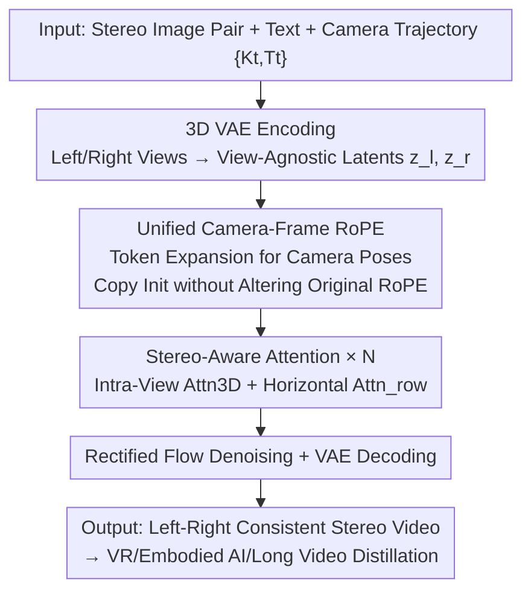

# Stereo World Model: Camera-Guided Stereo Video Generation

**Conference**: CVPR 2026  
**Paper**: [CVF Open Access](https://openaccess.thecvf.com/content/CVPR2026/html/Sun_Stereo_World_Model_Camera-Guided_Stereo_Video_Generation_CVPR_2026_paper.html)  
**Code**: None (Project page https://sunyangtian.github.io/StereoWorld-web/)  
**Area**: Video Generation / World Models / Stereo Vision  
**Keywords**: Stereo World Model, Camera Conditioning, Camera-frame RoPE, Epipolar Attention, Binocular Video Generation

## TL;DR
StereoWorld adapts a pre-trained monocular video diffusion model into a "camera-conditioned stereo world model". It deploys a "unified camera-frame RoPE" that expands token dimensions to inject camera poses without modifying the original RoPE, alongside an efficient stereo-aware attention mechanism that leverages epipolar priors to break down 4D attention into "intra-view 3D attention + horizontal row attention". This approach directly generates left-right consistent stereo videos end-to-end, running 3 times faster than strong baselines that post-process monocular videos into stereo while improving viewpoint consistency by approximately 5%.

## Background & Motivation

**Background**: Current generative world models (which predict future observations given actions/camera trajectories) are almost entirely built on **monocular video** representations. Leveraging large-scale video diffusion priors, they have achieved strong performance in controllable video synthesis. Another research direction, RGB-D world models, introduces geometry by adding an auxiliary depth channel to the video representation.

**Limitations of Prior Work**: Monocular observations suffer from fundamental geometric limitations: depth is implicit, scale is ambiguous, and geometric consistency can only be "inferred" rather than directly "observed". Consequently, 3D errors accumulate over long camera trajectories, rendering them unreliable in scenarios requiring precise geometry (e.g., embodied AI and navigation). While RGB-D approaches attempt to resolve this by appending depth, the predicted depth remains scene-dependent and scale-ambiguous. It relies on various ad-hoc normalizations, exhibits instability across domains, and is itself inherently noisy.

**Key Challenge**: World models require both the high-fidelity appearance enabled by video diffusion priors and **reliable, scale-aware geometry**. However, monocular representations lack geometry, while the geometry (explicit depth) in RGB-D models is noisy and unstable. The root cause is that geometric signals should be **directly observed** rather than reconstructed via "post-hoc depth estimation."

**Goal**: The target is to build a world model that anchors geometry directly in binocular observations (instead of predicting depth from monocular movement). The generated stereo videos must: (i) be temporally smooth and strictly follow a given camera motion, (ii) maintain strict left-right consistency in every frame, and (iii) remain compatible with diverse camera intrinsics, extrinsics, and baselines.

**Key Insight**: Stereo vision serves as the dominant perception mechanism in many biological systems, with binocular cues naturally providing direct and robust geometric clues for 3D structures. Based on this, the authors advocate for training the model to jointly learn appearance and binocular geometry within the RGB modality. Geometry is naturally grounded by disparity, eliminating the need to generate or stabilize explicit depth maps (avoiding the pitfalls of RGB-D) while preserving the powerful priors of video diffusion.

**Core Idea**: The monocular video diffusion model is fine-tuned into an end-to-end, camera-conditioned stereo world model through two key designs: (i) injecting camera RoPE via token-dimension expansion (without modifying the original RoPE) and (ii) scaling down the dimensionality of stereo attention using epipolar priors.

## Method

### Overall Architecture
Given a pair of rectified stereo images $(I_\text{left}, I_\text{right})$, a baseline $b$, a scene text prompt $c$, and a camera trajectory action $\{cam_t\}=\{(K_t, T_t)\}$ (with intrinsics $K$ and extrinsics $T$, where $t=1\dots N$), StereoWorld targets the generation of a stereo video that follows the specified camera motion and exhibits frame-by-frame left-right consistency.

It is built on top of a pre-trained latent video diffusion model (comprising a 3D VAE + DiT with rectified flow denoising), which provides the spatial-temporal priors and visual fidelity. Building upon this baseline, StereoWorld introduces two core contributions: (a) a **Unified Camera-Frame RoPE** that expands the latent token space of the backbone and injects camera-aware rotary position embeddings, enabling joint reasoning across the "time × left/right view" space while minimizing disruption to the pre-trained priors, and (b) **Stereo-Aware Attention**, which decomposes cross-view fusion into "intra-view 3D attention + horizontal row attention" to balance computational efficiency and epipolar alignment accuracy. The left and right views are encoded into $\{z_\text{left}, z_\text{right}\}$ in a "view-agnostic" manner using the same VAE. The entire DiT then denoises these latents using stereo attention blocks (repeated $N$ times), after which the VAE decodes them back to pixels to produce the stereo video.

### Key Designs

**1. Unified Camera-Frame RoPE: Expanding Token Dimensions instead of Modifying Original RoPE**

The integration challenge is highly specific: camera conditions (including stereoscopic cameras with different baselines and dynamic camera motion) must be integrated into the pre-trained DiT without destroying its existing priors. Previous methods concatenated Plücker ray maps to the input channels, encoding **absolute coordinates** which are sensitive to reference frame selection, entangle viewpoints with scene layout, and generalize poorly across different baselines or poses. Subsequent works like GTA/PRoPE instead utilized relative camera poses (substituting the relative rotation $R_{\Delta t,\Delta x,\Delta y}$ in Eq. (3) with the camera relative rotation $R^{\Delta cam}_{\Delta t,\Delta x,\Delta y}$, where $R^{cam_j}=\mathrm{diag}(I_{d/8}\otimes P_j,\ R_{t,x,y})$ and $P_j=\mathrm{diag}(K_j,1)T_j$), improving generalization. However, **re-parameterizing the original RoPE** directly (as in PRoPE) severely destabilizes the pre-trained model because the attention weights, normalization statistics, and token bases of the DiT are meticulously co-adapted with the original RoPE frequency and axis partitions. Modifying them causes immediate collapse.

The authors address this by **expanding the token dimensions without changing the original embeddings**. The self-attention feature dimension is expanded from $d$ to $d+d_c$, where the newly added $d_c$ dimensions are dedicated to carrying the camera RoPE: $\tilde q_{(t,x,y)}=[q_{(t,x,y)};\,q^{cam}_{(t,x,y)}]\in\mathbb{R}^{d+d_c}$. The corresponding rotation matrix is also expanded as block-diagonal $\tilde R^{cam_t}_{t,x,y}(d+d_c)=\mathrm{diag}\big(R_{\Delta t,\Delta x,\Delta y}(d),\ I_{d_c/4}\otimes P_t\big)$, yielding the unified camera-frame RoPE $\tilde R^{\Delta cam}_{\Delta t,\Delta x,\Delta y}=\tilde R^{cam_1}(\tilde R^{cam_2})^\top$. Crucially, because the first $d\times d$ block remains identical to the original formulations, the **pre-trained priors are fully preserved**, while the newly added $d_c\times d_c$ block functions as an orthogonal, camera-conditioned bypass channel. The authors compare two initialization strategies for this new channel: Zero Init (initializing new weights to zero, making initial outputs identical to the original model, which suffers from slow camera signal activation, slow training, and low camera accuracy) and **Copy Init** (initializing the new subspace using the **temporal attention weights**). Because both the camera and temporal embeddings operate at the frame level, this provides a highly effective starting point while preserving original behaviors. This "expansion instead of re-parameterization" distinguishes this method from PRoPE, leading to more stable training and faster convergence in experiments.

**2. Stereo-Aware Attention: Decomposing 4D Attention into "Intra-View 3D + Horizontal Row" via Epipolar Priors**

The primary pipeline bottleneck is computational cost. Under a unified camera-frame representation, a naive stereo generator would concatenate the left and right tokens along the sequence dimension to perform **full 4D joint attention** ($f^{in}\in\mathbb{R}^{b\times 2f\times h\times w\times c}$), simultaneously coupling space, time, and viewpoints. However, the computational overhead of self-attention scales quadratically with token count, making it prohibitively expensive for video generation.

The authors observe that **in rectified stereo pairs, epipolar lines are horizontally aligned**—meaning corresponding points between left and right views must lie on the same Scanline (the same row). Consequently, 4D attention is decomposed into two branches: (a) **Intra-View 3D Attention** $\text{Attn}_{3D}$, where spatial-temporal attention is computed independently for each view; (b) **Horizontal Row Attention** $\text{Attn}_{row}$, which performs cross-view attention only among tokens aligned on the same horizontal row at the same time step. The final output is the sum of these two branches: $f^{out}=\text{Attn}_{3D}(f^{in})+\text{Attn}_{row}(f^{in})$. This reduces the overall complexity from $O((2fhw)^2)$ to $O(2(fhw)^2)+fh(2w)^2)$. This formulation is effective because binocular matching geometrically occurs only along horizontal epipolar lines; thus, the vast majority of cross-view token pairs in full 4D attention are redundant. Restricting cross-view interaction to the same row captures disparity alignment while reducing the cross-view computational overhead from "full-image × full-image" to "single-row × single-row". In ablation studies, this approach improves FLOPs and FPS by approximately 50% with negligible loss in visual quality, and even slightly improves viewpoint consistency.

### Loss & Training
The model is implemented based on the video generation model **Wan2.2-TI2V-5B** and trained on the mixed dataset shown in Table 1. Each video clip contains 49 frames, cropped and resized to $480\times640$. Training is conducted using AdamW for 20k steps with a batch size of 24 across 24 NVIDIA H20 GPUs, with a learning rate of 1e-4. Denoising follows the rectified flow formulation. Notably, **no explicit depth supervision is used during training**; geometric signals are learned entirely from the binocular images themselves.

## Key Experimental Results

The evaluation set consists of 435 stereo images sampled from FoundationStereo, UnrealStereo4K, TartanAir (synthetic), and Middlebury (real) test sets, covering diverse indoor/outdoor scenes, textures, and baselines. Evaluation metrics cover visual quality (FID, FVD, CLIP-T, CLIP-F), camera accuracy (RotErr, TransErr), view synchronization (Mat. Pix., FVD-V, CLIP-V), and speed (FPS).

### Main Results
All baseline models follow a "SOTA camera-controllable video generation + post-hoc stereo conversion" pipeline: RGB-D models deploy predicted depth to warp the other view, and RGB models first estimate depth with DepthCrafter before warping (both employing StereoCrafter for warp-inpainting).

| Method | Modality | FID↘ | FVD↘ | RotErr↘ | TransErr↘ | Mat.Pix.(K)↗ | CLIP-V↗ | FPS↗ |
|--------|------|------|------|---------|-----------|--------------|---------|------|
| Voyager | RGBD | 226.97 | 170.37 | 1.34 | 0.25 | 4.26 | 91.41 | 0.03 |
| DeepVerse | RGBD | 191.32 | 176.72 | 1.51 | 0.16 | 4.48 | 93.86 | 0.35 |
| Aether | RGBD | 185.72 | 152.97 | 1.50 | 0.13 | 4.35 | 93.71 | 0.11 |
| SEVA | RGB | 195.70 | 170.92 | 1.09 | 0.51 | 4.49 | 94.73 | 0.10 |
| ViewCrafter | RGB | 211.89 | 185.76 | 1.24 | 0.20 | 4.49 | 93.51 | 0.13 |
| Ours Monocular | RGB | 126.83 | 96.87 | 1.36 | 0.14 | — | — | — |
| **Ours Stereo** | RGB | **111.36** | **83.04** | **1.01** | **0.11** | **4.56** | **97.50** | **0.49** |

Ours outperforms overall in visual quality (FID 111 vs. second-best 126, FVD 83 vs. 97), camera accuracy, and view consistency (CLIP-V 97.50 vs. 94.73). The FPS of 0.49 is also remarkably higher than most multi-stage baselines (achieving approximately a 3× speedup and around +5% view consistency improvement over SOTA stereo conversion methods, as reported in the paper). Ours also achieves optimal performance on VBench (Aesthetic: 44.27, Imaging: 66.51).

### Ablation Study

Camera injection strategy (Table 4, TartanAir):

| Configuration | FID↘ | FVD↘ | RotErr↘ | TransErr↘ | Description |
|------|------|------|---------|-----------|------|
| Plücker Ray | 142.46 | 130.39 | 1.52 | 0.21 | Absolute coordinates, poor generalization |
| PRoPE | 144.45 | 128.32 | 1.33 | 0.18 | Re-parameterizing original RoPE |
| Ours Zero Init | 131.07 | 96.62 | 1.81 | 0.24 | Preserves priors but hard to activate camera |
| **Ours Copy Init** | **122.41** | **93.17** | **1.16** | **0.15** | Initialized with temporal weights |

Attention scheme (Table 5):

| Configuration | CLIP-T↗ | CLIP-V↗ | FLOPs(×10¹⁰)↘ | FPS↗ | Description |
|------|---------|---------|---------------|------|------|
| 4D Attn | 25.74 | 97.55 | 3.11 | 0.34 | Full joint attention |
| **Stereo Attn** | 25.43 | 97.05 / 96.63 | **1.56** | **0.49** | Epipolar decomposition |

> ⚠️ In the original paper's Table 5, the CLIP-V column contains two values (97.05 and 96.63) due to a double-column layout; the original text is preserved here.

### Key Findings
- **Copy Init is crucial for camera injection**: Compared to Zero Init, initializing the newly added camera subspace with temporal attention weights improves both camera accuracy (RotErr 1.16 vs 1.81) and visual quality, as both camera and temporal conditions operate at the frame level, making temporal weights a natural starting point.
- **Epipolar decomposition accelerates inference at almost zero cost**: Stereo Attn slashes FLOPs from 3.11 to 1.56 and boosts FPS from 0.34 to 0.49 (approx. 50% improvement) with only marginal degradation in visual quality and stable viewpoint consistency. This confirms the validity of the geometric prior that cross-view interactions are concentrated along horizontal epipolar lines.
- **End-to-end processing prevents error accumulation**: Stereo-conversion baselines rely on depth estimation, warping, and inpainting, which are prone to errors and color mismatches in detailed regions (such as wire fences). In contrast, generating stereo pairs directly before estimating disparities yields much cleaner disparity maps, avoiding bleeding RGB textures into depth.
- **Metric-scale geometry is acquired without depth supervision**: Although trained without explicit depth labels, the model is capable of recovering metric-scale depth directly from the generated binocular streams.

## Highlights & Insights
- **"Dimension expansion vs. re-parameterization" offers a general paradigm for condition injection**: To integrate new conditions into pre-trained models without destroying inherent priors, a superior alternative to altering original embeddings is to construct an orthogonal bypass channel, keeping the original channel intact. This trick is readily transferable to any fine-tuning scenarios where protecting original RoPE/position embeddings is crucial.
- **Encoding domain-specific geometric priors directly into attention sparsity patterns**: The rigid geometric constraint of horizontally aligned epipolar lines is successfully translated into "restricting cross-view attention within the same row". This is a prime example of leveraging structural priors to trade for computational efficiency, proving far more efficient than forcing the model to learn such constraints from scratch in a full 4D attention space.
- **Bypassing explicit depth in favor of a closed-loop RGB + disparity setup**: Generating stereo pairs directly and recovering disparities afterward offers an elegant solution to the question of whether world models should build explicit geometry. It demonstrates that geometry can be implicitly embedded within binocular consistency.

## Limitations & Future Work
- **Dependency on rectified stereo inputs**: The efficiency of horizontal row attention hinges on "horizontal epipolar alignment". Unrectified or arbitrary stereo configurations must achieve rectification beforehand, otherwise this prior fails.
- **Geometry is implicitly grounded via binocular consistency without direct supervision**: While this eliminates the need for depth annotations, the upper bound of geometric precision depends heavily on the generated left-right consistency. The paper lacks quantitative error comparisons between generated disparities and ground truth depth, meaning the absolute accuracy of the resulting metric depth requires further validation.
- **The code is not open-sourced** (only the project page is available), and some critical details (such as long-video distillation and FLOPs calculation) are relegated to the supplementary materials, setting a high bar for replication.
- **Long-term interactive synthesis** depends on distilling this model into a 4-step causal model + KV cache to boost FPS from 0.49 to 5.6 for generating 10-second stereo videos. However, this is a separate distillation stage, and the quality-speed trade-off is not fully explored in the main text.

## Related Work & Insights
- **vs. Monocular-to-Stereo (StereoCrafter / StereoDiffusion / SVG)**: These approaches utilize multi-stage pipelines (depth estimation followed by warping and inpainting) that depend on depth quality and suffer from error accumulation in fine details. Ours generates stereo pairs directly in an end-to-end manner, achieving superior left-right consistency and speed.
- **vs. RGB-D World Models (Voyager / DeepVerse / Aether)**: They explicitly output depth channels, which suffer from scale ambiguity, domain instability, and texture bleeding. Ours bypasses explicit depth and grounds geometry using binocular disparity, resulting in cleaner and scale-aware geometry.
- **vs. Relative Camera Pose Embeddings (PRoPE / GTA)**: While also striving for relative and generalizable camera conditioning, PRoPE's re-parameterization of the original RoPE degrades pre-trained priors. Ours uses token-dimension expansion, strictly preserving the original priors in the first $d$ dimensions, which enables more stable training and faster convergence (validated in Table 4).

## Rating
- Novelty: ⭐⭐⭐⭐⭐ First end-to-end camera-conditioned stereo world model. The "token-expansion RoPE" and "epipolar decomposed attention" are highly targeted and well-designed.
- Experimental Thoroughness: ⭐⭐⭐⭐ Comprehensive including main results, two sets of ablations, and three application scenarios. However, it lacks quantitative accuracy against ground-truth depth and lacks a metric depth error table.
- Writing Quality: ⭐⭐⭐⭐ Clear motivational logic and complete formulations. Slight ambiguity in some tables (such as the dual-valued CLIP-V in Table 5).
- Value: ⭐⭐⭐⭐⭐ Bridges binocular rendering for VR/AR and metric geometry for embodied AI directly, eliminating depth estimation and inpainting pipelines. Highly valuable for practical applications.

<!-- RELATED:START -->

## Related Papers

- [\[CVPR 2026\] StereoWorld: Geometry-Aware Monocular-to-Stereo Video Generation](stereoworld_geometry-aware_monocular-to-stereo_video_generation.md)
- [\[CVPR 2026\] Yume1.5: A Text-Controlled Interactive World Generation Model](yume15_a_text-controlled_interactive_world_generation_model.md)
- [\[CVPR 2026\] Physical Object Understanding with a Physically Controllable World Model](physical_object_understanding_with_a_physically_controllable_world_model.md)
- [\[CVPR 2026\] VerseCrafter: Dynamic Realistic Video World Model with 4D Geometric Control](versecrafter_dynamic_realistic_video_world_model_with_4d_geometric_control.md)
- [\[CVPR 2026\] Unified Camera Positional Encoding for Controlled Video Generation](unified_camera_positional_encoding_for_controlled_video_generation.md)

<!-- RELATED:END -->
