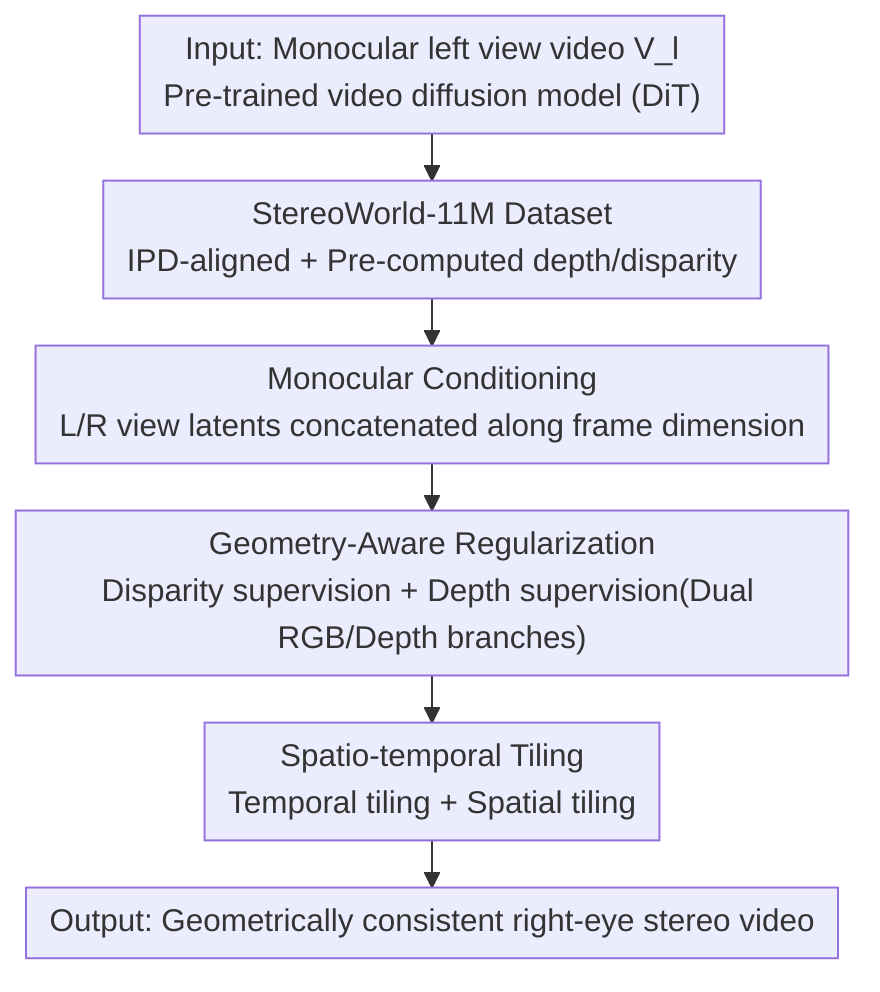

# StereoWorld: Geometry-Aware Monocular-to-Stereo Video Generation

**Conference**: CVPR 2026  
**Paper**: [CVF Open Access](https://openaccess.thecvf.com/content/CVPR2026/html/Xing_StereoWorld_Geometry-Aware_Monocular-to-Stereo_Video_Generation_CVPR_2026_paper.html)  
**Code**: [Project Page](https://ke-xing.github.io/StereoWorld/)  
**Area**: Video Generation  
**Keywords**: Monocular-to-Stereo, Video Diffusion, Geometry-Aware Regularization, Disparity/Depth Supervision, XR Stereo Video

## TL;DR
Ours directly "converts" a pre-trained monocular video diffusion model into a stereo video generator: using a minimalist conditioning approach by concatenating left and right views along the frame dimension, it forces the learning of authentic 3D structures through **disparity + depth dual geometry-aware regularization**. Combined with spatio-temporal tiling for high-resolution long videos and the first 11-million-frame stereo video dataset aligned with human Interpupillary Distance (IPD), it generates geometrically consistent right-eye views from arbitrary monocular videos end-to-end (PSNR 25.98 vs. StereoCrafter 23.04).

## Background & Motivation

**Background**: The popularity of XR devices (Apple Vision Pro, Meta Quest) has surged the demand for stereo video. However, capturing stereo content requires precisely calibrated and synchronized binocular cameras, which is highly demanding. Meanwhile, massive amounts of monocular videos are readily available online, making "monocular-to-stereo" a crucial necessity. Existing methods follow two paths: **Novel View Synthesis (NVS)**, which uses SfM/NeRF/3DGS to reconstruct geometry before rendering the right view; and the **depth-warp-inpaint** pipeline, which estimates depth, warps frames to the target view, and uses diffusion models to inpaint occluded areas.

**Limitations of Prior Work**: The NVS route is fragile to pose errors and non-rigid motion, often generating geometrically unstable and temporally inconsistent stereo. The fatal flaw of the warp-inpaint route is that the **inpainting stage is decoupled from stereo geometry estimation**—inpainting does not reference the original left view information, breaking pixel-level correspondence and leading to texture distortion, color shifts, and stereo artifacts that cause visual discomfort over time.

**Key Challenge**: The essence of stereo video is the "geometric correspondence between the left and right eyes for the same scene." Once the task is decomposed into multiple stages (depth estimation → warping → inpainting), each step introduces independent errors without mutual constraints, destroying the natural video distribution. To maintain geometric consistency, the generation process must **explicitly perceive 3D structures** rather than relying on post-processing patches.

**Goal**: To transform a general monocular video generation model into a stereo generator that is both visually faithful and geometrically accurate, directly generating the right view $V_r$ from the left view $V_l$.

**Key Insight**: The authors bet that "pre-trained video diffusion models themselves contain rich spatio-temporal priors." Instead of relying on fragile pose estimation or multi-stage warping, it is better to let the model **explicitly learn stereo geometry** and directly generate coherent right-eye views. However, pure RGB reconstruction loss cannot recover 3D structures (the model tends to flatten object boundaries with unstable disparity), so explicit geometric signals must be introduced.

**Core Idea**: Use a "minimalist frame-dimension concatenation conditioning + dual disparity/depth geometric supervision" to enable a monocular video diffusion model to grow stereo geometric awareness end-to-end, then employ spatio-temporal tiling to solve engineering constraints for high-resolution long videos.

## Method

### Overall Architecture
StereoWorld is built upon a pre-trained text-to-video diffusion model (Wan2.1-T2V-1.3B, DiT + 3D VAE + Rectified Flow) with the goal of diffusing the right view directly from the left view. The pipeline consists of four parts: First, constructing the StereoWorld-11M dataset aligned with human IPD (with pre-computed depth maps $D_r$ and disparity maps $\text{Disp}_{gt}$ for supervision). During training, latents of the left and right views (and depth) are **concatenated along the frame dimension** and fed into the diffusion model as monocular conditions. Simultaneously, a lightweight differentiable stereo projector estimates predicted disparity, constrained by a disparity loss for geometric correspondence. The final blocks of the DiT are duplicated into RGB and depth branches to jointly diffuse RGB and depth to complete geometry in non-overlapping regions. During inference, only the shared and RGB branches are used, paired with spatio-temporal tiling for high-resolution long video generation.

### Key Designs

**1. StereoWorld-11M: Large-scale Stereo Dataset Aligned with Human IPD**

The dilemma of stereo generation data is that existing stereo datasets (Spring, VKITTI2, TartanAir, etc.) have **baselines (eye separation) far exceeding human IPD (55–75mm)**—often over 10cm. Training on these produces exaggerated disparity that causes dizziness in XR. A few IPD-aligned datasets (like 3D Movies) are not public. The authors collected hundreds of HD Blu-ray SBS (Side-by-Side) stereo movies covering animation, realism, war, sci-fi, etc., cropped them into L/R views, and downsampled them to 480p/81 frames. This resulted in the first **large-scale + HD + IPD-aligned** stereo video dataset (>11 million frames, 142,520 clips after preprocessing). This serves as the foundation for all subsequent supervision—GT for disparity and depth is pre-computed on this data using Stereo Any Video and Video Depth Anything to ensure the generated disparity fits the human comfort zone.

**2. Monocular Conditioning: Latent Concatenation along Frame Dim**

The first challenge is how to condition a monocular generator into a stereo one. The warp-inpaint paradigm suffers from poor quality by not referencing the original left view during inpainting, while injecting left view features via cross-attention requires large architecture changes and overhead. Inspired by ReCamMaster, the authors used a minimalist solution: encode left and right views into latents $z_l=E(V_l)$ and $z_r=E(V_r)$ using VAE, then **directly concatenate them along the frame dimension** $z_i=[z_l,z_r]_{\text{frame-dim}}$ as diffusion input. The brilliance is **zero architecture change**—the model’s existing 3D spatio-temporal self-attention naturally fuses spatial, temporal, and viewpoint information across all tokens (including both views). This effectively borrows pre-trained attention for cross-view correspondence, being both efficient and preserving the full context of the left view.

**3. Geometry-Aware Regularization: Disparity + Depth Dual Supervision**

Relying solely on monocular conditioning and standard RGB reconstruction loss $L_{\text{rgb}}$ cannot learn geometry (the model flattens boundaries with unstable disparity). The core innovation is adding a set of **explicit geometric signals** composed of two complementary parts. **Disparity Supervision**: A pre-trained stereo matching network calculates GT disparity $\hat b_{gt}$ on GT L/R frames. During training, after the model predicts the denoised right latent $z_r'$, a lightweight differentiable **stereo projector** $\kappa$ estimates predicted disparity $\hat b_{\text{pred}}=\kappa(z_l,z_r')$. It is constrained by $L_{\text{dis}}=L_{\text{log}}+\lambda_{l1}L_{l1}$ (where $L_{\text{log}}=\mathbb{E}[d^2]-\lambda_1(\mathbb{E}[d])^2$ ensures global geometric consistency and $L_{l1}=\mathbb{E}[|\hat b_{\text{pred}}-\hat b_{gt}|]$ penalizes pixel-wise errors, with $d=\log\hat b_{\text{pred}}-\log\hat b_{gt}$). This forces the L/R views to establish accurate stereo correspondence and suppresses temporal disparity drift. However, disparity only constrains the **overlapping regions**. Horizontal camera translation causes new content to appear on one side and disappear on the other; stereo matching cannot handle these non-overlapping regions. **Depth Supervision** fills this gap: depth provides a pixel-wise geometric description including invisible areas. The authors re-formulate generation as "RGB + Depth joint multi-objective prediction," letting the model learn velocity fields for both the RGB video $L_{\text{rgb}}$ and the right-view depth map $L_{\text{dep}}$ (Depth GT $D_r$ pre-computed by Video Depth Anything and VAE-encoded as $d_r$).

**4. Dual-branch Architecture + Spatio-temporal Tiling**

Training the same DiT parameters on two different distributions (RGB and Depth) causes gradient conflict and slows convergence. The solution is **partial parameter sharing**: the initial transformer blocks are shared (learning joint texture + geometry representations), while the **last few DiT blocks are duplicated into two specialized branches**—one for RGB velocity field prediction and one for depth. This balances shared representation with task specialization (during inference, only the shared + RGB branch is used; the depth branch only provides geometric guidance during training). To ensure scalability, **spatio-temporal tiling** is used: the base model can only generate 81 frames (~3s). **Temporal Tiling** slices long videos into overlapping segments using the end of the previous segment to guide the next, with a probability $p$ of replacing early noise latents with clean frames to learn long-range temporal consistency and suppress flickering. **Spatial Tiling** slices high-resolution latents into overlapping tiles for denoising, stitching and blending them before decoding, enabling high-resolution generation with a model trained at 480p.

### Loss & Training
The total objective is $L=L_{\text{rgb}}+L_{\text{dep}}+\lambda_{\text{dis}}L_{\text{dis}}$, jointly supervising RGB reconstruction, depth consistency, and disparity learning. Base model: Wan2.1-T2V-1.3B; fine-tuned with LoRA (rank 128), $\lambda_1=\lambda_{l1}=0.1$, $\lambda_{\text{dis}}=0.5$, lr $1\times10^{-4}$ for 1 epoch (approx. 9k steps) on 8×A800 with bfloat16, taking about 11 days.

## Key Experimental Results

### Main Results
Compared against three types of representative methods on a custom test set (1000 clips): GenStereo (training-based Image-to-Image), SVG (training-free Video-to-Video), and StereoCrafter (training-based Video-to-Video).

| Method | PSNR ↑ | SSIM ↑ | LPIPS ↓ | EPE ↓ | D1-all ↓ |
|------|--------|--------|---------|-------|----------|
| GenStereo | 19.45 | 0.680 | 0.301 | 35.00 | 0.895 |
| SVG | 18.03 | 0.588 | 0.347 | 33.25 | 0.963 |
| StereoCrafter | 23.04 | 0.656 | 0.187 | 24.78 | 0.527 |
| **StereoWorld (Ours)** | **25.98** | **0.796** | **0.095** | **17.45** | **0.421** |

> Metric Definitions: **PSNR/SSIM/LPIPS** measure generation fidelity relative to GT right views; **EPE** (End-Point-Error) is the mean pixel-wise error between estimated disparities of the generated and GT stereo pairs; **D1-all** is the percentage of pixels where disparity error exceeds a threshold (typically 3px or 5% of ground truth)—the latter two measure geometric/stereo correspondence accuracy (lower is better). While StereoCrafter is competitive in perceptual quality, its EPE/D1-all are significantly worse, indicating inaccurate disparity and weak stereo correspondence; Ours leads across both visual and geometric metrics.

### Ablation Study
Toggle the two types of geometric supervision (on the main test set):

| Depth Supervision | Disparity Loss | PSNR ↑ | LPIPS ↓ | EPE ↓ | D1-all ↓ |
|:---:|:---:|--------|---------|-------|----------|
| ✗ | ✗ | 23.413 | 0.152 | 42.318 | 0.613 |
| ✓ | ✗ | 24.104 | 0.132 | 37.593 | 0.574 |
| ✗ | ✓ | 24.509 | 0.113 | 29.998 | 0.522 |
| ✓ | ✓ | **25.979** | **0.095** | **17.453** | **0.421** |

### Key Findings
- **Dual geometric supervision is complementary and indispensable**: Adding only disparity loss reduces EPE from 42.32 to 30.00 (most effective for overlapping regions), while depth supervision improves depth boundaries and spatial structure (filling non-overlapping regions). Together, EPE drops further to 17.45 and PSNR increases to 25.98, proving the "disparity for overlap, depth for full map" division of labor.
- **End-to-end vs. Warp-Inpaint superiority in text rendering**: Text is hardest in stereo generation; Ours maintains clear, readable, and consistently positioned text in both views, whereas all baselines show blurriness or ghosting.
- **Human evaluation lead across all dimensions**: 20 participants rated 15 scenes on a 1–5 scale. StereoWorld scored highest in Stereo Effect (SE 4.8), Visual Quality (VQ 4.7), Binocular Consistency (BC 4.9), and Temporal Consistency (TC 4.8), far exceeding StereoCrafter (4.0–4.2).

## Highlights & Insights
- **"Frame-dimension Concatenation" is a low-effort, high-impact move**: Without changing architecture or adding cross-attention, it purely leverages the pre-trained DiT's 3D spatio-temporal self-attention for cross-view fusion. Treating "viewpoint" as an additional temporal frame is a clever trick applicable to any multi-view or camera-controlled video task.
- **Deep insight into "Overlap/Non-overlap" division**: Clearly pointing out that disparity only constrains overlapping regions while depth covers new areas exposed by horizontal translation makes the two supervisions complementary rather than redundant. This geometric insight is the root cause of the significant EPE drop in ablations.
- **IPD-Aligned dataset fills a real gap**: Identifying that existing stereo data baselines are too wide for comfortable XR viewing and building a large-scale IPD-aligned set from Blu-ray movies is a contribution with high reusable value for the stereo community.

## Limitations & Future Work
- **Uncontrollable Stereo Baseline**: Disparity is learned end-to-end; there is no way to explicitly specify or adjust the stereo baseline to fit different IPD devices or user preferences.
- **Slow Generation Speed**: Approx. 6 minutes per clip, far from real-time; authors plan to use model distillation for acceleration.
- **Domain Bias (Blu-ray Movies)**: ⚠️ The training set is primarily movie content; generalization to real-world handheld or outdoor monocular videos is not fully verified. The depth/disparity GT comes from off-the-shelf models, transferring their error ceilings to the final results.

## Related Work & Insights
- **vs. StereoCrafter (Warp-Inpaint Paradigm)**: StereoCrafter uses "depth estimation → warping → diffusion inpainting," where decoupling leads to over-smoothed textures and poor geometric metrics (EPE/D1-all). Ours generates the right view directly end-to-end, preserving pixel-level correspondence with a +2.94 PSNR gain and nearly halved EPE.
- **vs. SVG (Training-free) / GenStereo (Image-to-Image)**: SVG produces obvious artifacts and structural defects in occluded areas; GenStereo, as an image-to-image method, suffers from severe temporal instability and frame-by-frame distortion when applied to video. Ours wins in both fidelity and temporal consistency by leveraging video diffusion priors + geometric supervision.
- **vs. NVS Route (NeRF / 3DGS / VGGT)**: These methods reconstruct geometry before rendering, suffering from pose errors and non-rigid motion which lead to sparse reconstruction and limited fidelity. Ours bypasses fragile pose estimation by directly producing stereo pairs via generative priors.

## Rating
- Novelty: ⭐⭐⭐⭐ First end-to-end monocular-to-stereo video diffusion framework; frame-dim concatenation + dual geometry supervision is novel.
- Experimental Thoroughness: ⭐⭐⭐⭐ Objective/subjective metrics + comprehensive ablations; however, only 3 baselines and data is movie-heavy.
- Writing Quality: ⭐⭐⭐⭐ Clear motivation and geometric insights; good text-figure coordination.
- Value: ⭐⭐⭐⭐⭐ Directly addresses XR stereo content pain points; IPD dataset + end-to-end paradigm offer high utility and community value.

<!-- RELATED:START -->

## Related Papers

- [\[CVPR 2026\] Geometry-as-context: Modulating Explicit 3D in Scene-consistent Video Generation to Geometry Context](geometry-as-context_modulating_explicit_3d_in_scene-consistent_video_generation_.md)
- [\[ICLR 2026\] Geometry-aware 4D Video Generation for Robot Manipulation](../../ICLR2026/video_generation/geometry-aware_4d_video_generation_for_robot_manipulation.md)
- [\[CVPR 2026\] Pantheon360: Taming Digital Twin Generation via 3D-Aware 360° Video Diffusion](pantheon360_taming_digital_twin_generation_via_3d-aware_360deg_video_diffusion.md)
- [\[CVPR 2026\] 3D-Aware Implicit Motion Control for View-Adaptive Human Video Generation](3d-aware_implicit_motion_control_for_view-adaptive_human_video_generation.md)
- [\[CVPR 2026\] Content-Aware Dynamic Patchification for Efficient Video Diffusion](content-aware_dynamic_patchification_for_efficient_video_diffusion.md)

<!-- RELATED:END -->
