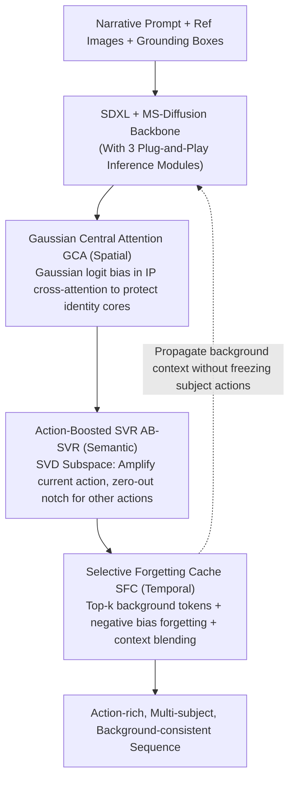

# StoryTailor: A Zero-Shot Pipeline for Action-Rich Multi-Subject Visual Narratives

**Conference**: CVPR 2026  
**arXiv**: [2602.21273](https://arxiv.org/abs/2602.21273)  
**Code**: Coming soon  
**Area**: Video Generation  
**Keywords**: visual storytelling, zero-shot, multi-subject, diffusion models, attention mechanisms

## TL;DR
The researchers propose StoryTailor, a zero-shot visual storytelling pipeline. By utilizing Gaussian Central Attention (GCA) to mitigate subject overlap and background leakage, Action-Boosted Singular Value Reweighting (AB-SVR) to amplify action semantics, and Selective Forgetting Cache (SFC) to maintain inter-frame background continuity, it achieves action-rich image narrative generation with multiple subjects on a single RTX 4090, improving CLIP-T by 10-15% over baselines.

## Background & Motivation

**Background**: Personalized image generation is divided into two approaches: fine-tuning methods (DreamBooth/LoRA/Textual Inversion), which require per-identity training, and adapter methods (IP-Adapter/MS-Diffusion), which are more lightweight but primarily single-frame. Sequence-level methods (FluxKontext, Video Diffusion) require GPU clusters and often suffer from identity entanglement during multi-subject interactions.

**Limitations of Prior Work**: A triple tension exists: (1) poor action-text fidelity (models excel at identity but struggle with actions); (2) collapse of subject identity fidelity during overlap or close proximity; (3) difficulty in maintaining inter-frame background continuity.

**Key Challenge**: Enhancing action response requires increasing text guidance strength, which often destroys identity consistency via cross-attention drift. Conversely, propagating background information across frames can restrict the dynamic movement of subjects.

**Goal**: To achieve zero-training visual narrative generation with multiple subjects, rich actions, and inter-frame consistency on a single 24GB GPU.

**Key Insight**: Rather than modifying the backbone (SDXL), the authors apply precise interventions in the attention mechanisms and text embedding space to address spatial positioning, semantic enhancement, and temporal continuity respectively.

**Core Idea**: Three inference-time modules handle three sub-problems: GCA for spatial control, AB-SVR for semantic control, and SFC for temporal control.

## Method

### Overall Architecture
StoryTailor aims to render a long narrative prompt into an image sequence with multiple subjects, rich actions, and continuous inter-frame backgrounds on a 24GB GPU without training any parameters. It directly reuses off-the-shelf SDXL + MS-Diffusion as the backbone. Inputs include a narrative prompt, reference images for each subject, and a set of grounding boxes. Three plug-and-play modules are attached during inference: GCA constrains subject spatial positions in the IP-branch cross-attention, AB-SVR amplifies current-frame actions and suppresses leaked actions from other frames in the text embedding space, and SFC propagates background context across frames. Since these act on different stages of the backbone without overlap, they can be stacked without interference.

### Key Designs

**1. Gaussian Central Attention (GCA): Keeping Subjects Separated Without Rigid Constraints**

In multi-subject scenes, grounding boxes often overlap or are very close. If attention spills into neighboring boxes, identities leak, and background noise from reference images creeps in. While hard box boundaries cut off limbs and soft masks lack room for movement, GCA calculates a centroid $\mu_i^*$ for each box via a Voronoi strategy. It then dynamically adjusts two Gaussian decay radii $s_i^{\text{in}}, s_i^{\text{out}}$ based on the current text attention intensity: the inner ring decays slowly to protect the identity core, while the outer ring decays rapidly to decouple the subject from the background. This Gaussian mask acts as a logit bias $B_{ip}$ in the IP-branch attention:

$$\alpha^{ip} = \text{softmax}\!\left(QK_{ip}^T/\sqrt{d} + B_{ip}\right)$$

This allows identity information at the center to be preserved while edges fade smoothly, giving subjects space for expansive actions without cross-contamination.

**2. Action-Boosted Singular Value Reweighting (AB-SVR): Amplifying Current Actions, Eliminating Future/Past Actions**

Diffusion models are inherently better at rendering identities than actions. Moreover, strengthening action response often requires high text guidance, which triggers identity drift. In sequences, action semantics from previous frames often linger in the text embedding. Unlike previous SVR methods (e.g., 1Prompt1Story) that merely "dampen" other semantics, AB-SVR performs precise splitting at the subspace level. For the current token $X_{\text{exp}}$, a thin SVD is performed, and a rank $k$ is selected using a cumulative energy threshold $\tau=0.85$ to construct a projection matrix $P_k = U_k U_k^T$. The current frame only retains this principal direction $\tilde{X}_{\text{exp}} = P_k X_{\text{exp}}$ to boost the action; other frames undergo a "notch" projection, removing components falling into the current frame's action subspace: $\tilde{X}_{\text{sup}}^{(\text{notch})} = (I - P_k) X_{\text{sup}}$. This ensures actions are explicitly strengthened or eliminated rather than vaguely weighted.

**3. Selective Forgetting Cache (SFC): Remembering Background, Forgetting Irrelevant History**

Inter-frame continuity requires background consistency, but copying entire KV caches freezes subject movement and exhausts VRAM. SFC uses a dual mechanism to transfer only relevant information. First, KV accumulation selects the top-$k$ (128) most relevant tokens from historical caches and applies a negative bias $\delta_h=-0.1$ to historical logit values to promote forgetting, with a cap of 512 tokens. Second, context blending mixes previous attention outputs into the current frame at a ratio $\alpha=0.6$, but only in lower-resolution layers and within the background mask $M_b'$:

$$\tilde{C} = C \odot (1-\alpha M_b') + \bar{C}_{\text{prev}} \odot (\alpha M_b'), \quad \alpha=0.6$$

The foreground ($M_b'=0$) remains unaffected for free movement, while the background inherits context to maintain stability.

### A Complete Example
Consider the prompt "A cat and a dog playing in the kitchen; next frame, the cat jumps onto the table," where the subject boxes overlap. In the first frame, GCA applies Gaussian masks to the cat and dog centroids; the overlap is suppressed by the rapid outer decay, preventing the cat from adopting the dog's patterns. AB-SVR performs SVD on the "playing" token to boost interaction poses. In the second frame ("cat jumps"), AB-SVR uses the notch projection $(I-P_k)$ to remove "playing" semantics, preventing the dog from repeating previous actions while boosting the "jumping" subspace. SFC retrieves background tokens for the kitchen and blends them into the background area, ensuring the table and cabinets remain consistent while the cat naturally transitions from playing to jumping.

### Loss & Training
This is a zero-training method. All three modules are plug-and-play during SDXL inference without learnable parameters. Key hyperparameters: Gaussian base radii (0.35 / 0.70), AB-SVR energy threshold $\tau=0.85$, SFC blending strength $\alpha=0.6$, and forgetting bias $\delta_h=-0.1$.

## Key Experimental Results

### Main Results

**Multi-Subject Image Consistency (MSBench)**

| Method | CLIP-I↑ | M-DINO↑ | CLIP-T↑ |
|------|---------|---------|---------|
| MS-Diffusion | 0.692 | 0.108 | 0.340 |
| FluxKontext | 0.732 | 0.107 | 0.372 |
| Nano-Banana | 0.749 | 0.114 | 0.389 |
| **Ours (StoryTailor)** | 0.717 | 0.112 | **0.414** |

### Ablation Study

| Configuration | CLIP-T | CLIP-I | Description |
|------|--------|--------|------|
| Baseline (MS-Diff) | 0.340 | 0.692 | Baseline |
| + GCA | ~0.355 | ~0.710 | Improved spatial localization |
| + AB-SVR | ~0.390 | ~0.705 | Significant action semantic boost |
| Full (Ours) | **0.414** | **0.717** | Optimal synergy |

### Key Findings
- CLIP-T increased by 10-15% (0.340 $\rightarrow$ 0.414), significantly improving text following for actions and interactions.
- CLIP-I is slightly lower than the API-based method Nano-Banana (0.717 vs 0.749), though the latter requires cluster deployment.
- Runnable on a single RTX 4090, whereas FluxKontext requires more VRAM and is slower.
- AB-SVR is the primary contributor to CLIP-T gains, while GCA drives CLIP-I improvements.

## Highlights & Insights
- **Clear architecture design** using three modules to decouple the triple tension of space (GCA), semantics (AB-SVR), and time (SFC).
- **Subspace separation in AB-SVR** is more precise than simple weight tuning; the "notch" projection effectively removes specific frame components by targeting principal singular directions.
- **High utility**: Zero-training, single GPU (24GB), and plug-and-play modules.

## Limitations & Future Work
- CLIP-I is not yet optimal (0.717 vs 0.749), suggesting room for better identity preservation strategies.
- The pipeline relies on user-provided grounding boxes, increasing the barrier to entry.
- Validated only on SDXL; compatibility with other diffusion backbones remains unverified.

## Related Work & Insights
- **vs MS-Diffusion**: StoryTailor builds upon it, raising CLIP-T from 0.340 to 0.414.
- **vs FluxKontext**: Similar quality but StoryTailor runs on a single GPU.
- **vs 1Prompt1Story**: A pioneer in SVR, but suffers from poor identity and limited actions; AB-SVR introduces superior subspace separation.

## Rating
- Novelty: ⭐⭐⭐⭐ (Subspace notch projection in AB-SVR is particularly novel)
- Experimental Thoroughness: ⭐⭐⭐⭐ (Multiple baselines, ablations, and qualitative results)
- Writing Quality: ⭐⭐⭐⭐ (Clear structure, though formula-heavy)
- Value: ⭐⭐⭐⭐ (Practical solution for single-GPU visual storytelling)

<!-- RELATED:START -->

## Related Papers

- [\[CVPR 2026\] HoloCine: Holistic Generation of Cinematic Multi-Shot Long Video Narratives](holocine_holistic_generation_of_cinematic_multi-shot_long_video_narratives.md)
- [\[CVPR 2026\] ShotDirector: Directorially Controllable Multi-Shot Video Generation with Cinematographic Transitions](shotdirector_directorially_controllable_multi-shot_video_generation_with_cinemat.md)
- [\[CVPR 2026\] Are Image-to-Video Models Good Zero-Shot Image Editors?](are_image-to-video_models_good_zero-shot_image_editors.md)
- [\[CVPR 2026\] MultiShotMaster: A Controllable Multi-Shot Video Generation Framework](multishotmaster_a_controllable_multi-shot_video_generation_framework.md)
- [\[CVPR 2026\] Rethinking Position Embedding as a Context Controller for Multi-Reference and Multi-Shot Video Generation](rethinking_position_embedding_as_a_context_controller_for_multi-reference_and_mu.md)

<!-- RELATED:END -->
