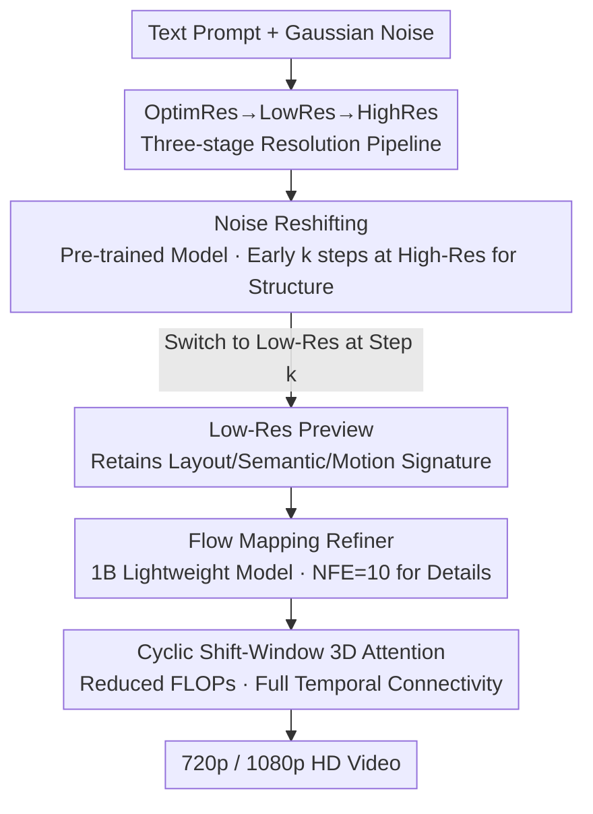

# SURF: Signature-Retained Fast Video Generation

**Conference**: CVPR 2026  
**Paper**: [CVF Open Access](https://openaccess.thecvf.com/content/CVPR2026/html/Ding_SURF_Signature-Retained_Fast_Video_Generation_CVPR_2026_paper.html)  
**Code**: None  
**Area**: Video Generation / Diffusion Model Acceleration  
**Keywords**: Video Generation Acceleration, Resolution Dynamics, Noise Reshifting, Super-resolution Refiner, Signature Retention

## TL;DR
SURF decomposes high-resolution video generation into two stages: "low-resolution preview from a pre-trained large model + lightweight Refiner upsampling." By using training-free noise reshifting, it enables large models to maintain their layout/semantic/motion "signatures" even at low resolutions. For Wan 2.1, it achieves a 12.5× speedup for 720p video generation with almost no loss in quality.

## Background & Motivation
**Background**: Current SOTA video generation models (e.g., Wan 2.1, HunyuanVideo) produce high-quality output but suffer from extremely slow inference—generating a 5-second 720p video takes approximately 50 minutes. To accelerate this, the community primarily follows three paths: step distillation (reducing denoising steps), attention sparsification (computing only important tokens), and cascaded multi-scale generation.

**Limitations of Prior Work**: While these methods increase speed, they almost invariably damage the "signature" of the original model—the unique aesthetic style, semantically aligned layout, and plausible motion dynamics. As shown in Fig. 2, distillation models lead to misaligned limbs and weakened semantic consistency; aggressive token dropping, even when retaining "important tokens," harms the learned generative priors. The signature is a direct manifestation of model quality; losing it during acceleration is counterproductive.

**Key Challenge**: Two fundamental factors affecting generation speed are **resolution** and **denoising steps**. An counter-intuitive observation is that every pre-trained model has its "optimal resolution" (usually the training resolution); forcing inference at a lower resolution leads to severe signature degradation. Thus, a direct conflict exists between "speeding up via resolution reduction" and "signature retention"—one cannot run the entire process at low resolution, nor can one run it entirely at high resolution (due to slowness).

**Key Insight**: The authors leverage a property of diffusion denoising: **early denoising steps determine the overall content structure, while later steps only refine details**. Since the overall layout is finalized in the first few steps, the large model should only use the optimal resolution during this "structural locking" phase, then switch to a lower resolution to gain speed once the structure is fixed.

**Core Idea**: Replace fixed-resolution inference with an "OptimRes→LowRes→HighRes" three-stage resolution flow. High resolution in the early stage preserves the signature, low resolution in the middle stage gains speed, and a lightweight Refiner in the final stage restores details. This makes simultaneous acceleration and signature retention possible as a plug-in solution.

## Method

### Overall Architecture
SURF splits video generation into two stages and three resolution flows. The **Preview Stage** employs a powerful pre-trained model (like Wan 2.1) for denoising, but switches from optimal resolution to low resolution mid-trajectory via noise reshifting to quickly produce a signature-retained low-resolution preview. The **Refinement Stage** uses a lightweight Refiner with only 1B parameters. It treats the preview as a "blurry low-resolution input" and learns the mapping from low to high resolution via flow mapping, restoring details and fixing artifacts in just 10 denoising steps to output 720p or even 1080p.

The mechanism is **dynamic scaling**: instead of permanently discarding tokens, the scale of the latent space is resized according to the denoising timestep to adjust the token count. This reduces computation while preserving global information. An example flow is 480p (OptimRes stage) → 240p (LowRes stage) → 1080p (Refinement stage).

### Key Designs

**1. OptimRes→LowRes→HighRes Dynamic Scaling: Resize instead of token dropping**

Existing acceleration methods operate on a fixed latent scale; sparse attention relies on dropping tokens, which inevitably damages the generative signature and has limited acceleration potential. SURF resolves this by delegating the "token count" bottleneck to **resolution**: since attention has quadratic complexity, the token count (determined by resolution) is the primary speed bottleneck. Instead of permanent token loss, resizing the latent space at different denoising stages ensures that the global information of the token set is always preserved. This three-stage flow allows the model to "capture global semantics at a coarse scale, generate a preview at a fine scale, and finalize details at high resolution," matching the resolution to the needs of each stage.

**2. Noise reshifting: Training-free mid-inference resolution reduction**

This is the core of the preview stage. Directly running a pre-trained model at low resolution causes severe signature degradation due to "resolution mismatch." SURF sets a transition step $k$ along the denoising trajectory, splitting it into pre-$k$ and post-$k$ steps. Pre-$k$ steps use ODE flow matching at the optimal resolution: $z_0 = z_1 + \int_1^0 u_\theta(z_t, t)\,dt$, where $u_\theta$ is the predicted direction. At step $k$, the clean latent is estimated as $\hat z_0 = z_k - \sigma_k \cdot u_\theta(z_k, k)$, then linearly downsampled in latent space $\hat z_0^{\downarrow} = \mathrm{Downscale}(\hat z_0)$. Noise is then re-injected into the low-resolution latent, reshifting it back to timestep $k$:

$$z_{k-1} = \hat z_0^{\downarrow} + \sigma_k \cdot \tilde\epsilon, \quad \tilde\epsilon \sim \mathcal{N}(0, I)$$

Post-$k$ steps proceed at low resolution for speed. This is effective because the first $k$ steps at optimal resolution have already "locked" the structure and signature (observed to stabilize around step 10); subsequent refinement at low resolution will not break the established structure. This is entirely training-free.

**3. Flow mapping Refiner: 10-step high-resolution completion using the preview as a starting point**

The refinement stage uses a 1B lightweight model. To avoid the high NFE typically required for upsampling, SURF modifies the flow matching formulation: the starting point $z_1$ is replaced by the linearly upsampled low-resolution latent $z_{lr}$, and the endpoint $z_0$ is the high-resolution latent $z_{hr}$. The Refiner learns the direction from $z_{lr}$ to $z_{hr}$. Since denoising starts from a "blurry preview with existing structure" rather than pure Gaussian noise, NFE can be compressed to 10. Training uses dual degradation (at both pixel and latent levels) to construct low-quality pairs, preventing the task from collapsing into trivial super-resolution and forcing the model to use its generative capacity to recover content.

**4. Cyclic shift-window 3D attention: Full temporal connectivity on large latent tensors**

Computational costs for 3D attention remain high for high-resolution long videos. SURF embeds a cyclic shift-window strategy into the Transformer: even blocks $2L$ perform 3D self-attention on non-overlapping temporal windows of size $W_t$; odd blocks $2L+1$ shift features by half a window $S_t = W_t/2$ before computation:

$$X^{(2L)} = \mathrm{Attention3D}(\mathrm{Partition}(X, W_t))$$
$$X_{shifted} = \mathrm{CyclicShift}(X^{(2L)}, W_t/2)$$
$$X^{(2L+1)} = \mathrm{Attention3D}(\mathrm{Partition}(X_{shifted}, W_t), \mathrm{Mask})$$

An attention mask isolates unrelated segments in boundary windows created by the shift. 3D RoPE (Rotary Positional Embedding) is used within windows to avoid resolution bias. This "shift/no-shift" design achieves full temporal connectivity with local window attention, significantly reducing VRAM and FLOPs. Ablations show that global receptive fields are unnecessary for the refinement stage; local context suffices for detail recovery.

## Key Experimental Results

### Main Results (Wan 2.1, 720p, NFE=50)
| Method | QS↑ | AQ↑ | DD↑ | SA↑ | PC↑ | Time↓ | Gain | PFLOPs↓ |
|------|-----|-----|-----|-----|-----|-------|------|---------|
| Wan 2.1 | 83.31 | 66.9 | 63.89 | 41.82 | 45.45 | 3497s (58min) | 1× | 658.5 |
| 30% step | 77.92 | 58.43 | 56.94 | 18.18 | 16.36 | 1049s | 3.34× | 197.5 |
| SVG (Sparse) | 83.36 | 65.6 | 68.06 | 25.45 | 20.00 | 2712s | 1.29× | 429.9 |
| DMD (Distill) | 83.31 | 66.11 | 52.78 | 34.55 | 30.91 | 282s | 12.40× | 39.5 |
| **SURF** | 83.26 | 66.86 | **72.22** | **41.82** | 38.18 | **278s** | **12.58×** | **34.3** |

Crucially, SA (Semantic Alignment) and PC (Physical Commonsense) show that SURF's SA matches the original Wan 2.1 (41.82), whereas DMD/SVG drop significantly to 34.55/25.45—indicating that distillation and sparse attention lose the signature, while SURF retains it. For 1080p scenarios, a 43× speedup is achieved compared to vanilla Wan 2.1.

### 1080p Comparison with Super-Resolution Methods
| Method | DINO↑ | CLIP↑ | LAION↑ | DOVER↑ | NFE/Time↓ |
|------|-------|-------|--------|--------|-----------|
| RealBasicVSR | 93.40 | 94.83 | 61.07 | 80.25 | 1/162.1s |
| VEnhancer | 93.55 | 96.02 | 63.46 | 79.78 | 15/2467.6s |
| STAR | 93.68 | **96.59** | 60.81 | 63.64 | 14/912.7s |
| **SURF** | **93.75** | 96.30 | **63.50** | **81.20** | **10/76.5s** |

SURF leads in quality metrics (highest DOVER 81.20) while taking only 76.5s—32× faster than the diffusion-based super-resolution model VEnhancer (2467s).

### Ablation Study
| Configuration | Key Metrics | Description |
|------|---------|------|
| Split 5-35 | AQ 63.45 / 201s | Too early; destroys layout and motion |
| **Split 10-30** | AQ 62.87 / 252s | **Recommended**: Switch after layout stabilizes at step 10 |
| Split 30-10 | AQ 61.37 / 481s | Too late; slow and disturbs fixed structure |
| Refiner 8 steps | DOVER 80.52 | Result lacks some fine detail |
| **Refiner 10 steps** | DOVER 81.20 | **Recommended**: Best quality/speed balance |
| w/o Shift-Window | Negligible visual diff | Local context is sufficient for refinement |

### Key Findings
- **The transition step $k$ is the most sensitive hyperparameter**: Too early (step 5) causes layout/motion degradation; too late (step 35) is slow and disrupts the fixed structure. Step 10-30 is optimal as layouts stabilize around step 10.
- **Global attention is unnecessary for refinement**: Removing the global receptive field through window attention yields negligible visual difference, supporting the use of local windows for computational efficiency.
- **High Plug-in Capability**: As a plug-in for HunyuanVideo + sparse attention, it achieves 8.7× speedup. For step-distilled AccVideo, it achieves 1.3× speedup and improves SA from 29~32 to 36~43.
- **User Study** (37 researchers, 24 videos): "Better/Same/Worse" vs Wan 2.1 stands at 46.24%/29.73%/24.02%, showing human preference is on par with the original model despite the 12.58× speedup.

## Highlights & Insights
- **"Signature Retention" is a critical but overlooked dimension for acceleration**: Previous works only compared quality scores. SURF highlights that distillation/sparsity loses model-specific priors and quantifies this with SA/PC metrics—a valuable perspective.
- **Noise reshifting is entirely training-free**: Switching resolutions mid-trajectory and re-injecting noise requires no extra training, allowing the large model to preserve its signature at a lower resolution. It is a plug-and-play inference trick with minimal migration cost.
- **Exploiting "Early steps for structure, late steps for details"**: This denoising property dictates when to switch resolutions in the preview stage and justifies why the Refiner only needs 10 steps when starting from a structured preview.
- **Dynamic Scaling vs. Token Dropping**: Resizing the latent space instead of permanent dropping preserves global information, offering a compelling alternative to sparse attention for high-resolution diffusion acceleration.

## Limitations & Future Work
- The refinement stage requires training a 1B Refiner (24 A800s, 100k synthetic pairs). While lightweight, it still incurs training costs. Whether the Refiner needs re-training for every new base model is not fully discussed. ⚠️ The cross-base model reusability of the Refiner remains unclear.
- Evaluation was primarily on 5-second videos. Stability and signature retention for longer videos using three-stage flows and shift-windows are not yet verified.
- The transition step $k$ is currently empirical (10-30). Adaptive adjustment or automatic selection of $k$ for different base models/prompts remains an open problem.
- 1080p comparisons utilized only 100 samples. Furthermore, comparisons with GAN/Diffusion SR have different objectives (SR focuses on input fidelity, SURF on original model signature), making direct metric comparisons nuanced.

## Related Work & Insights
- **vs. Step Distillation (DMD / AccVideo)**: Distillation speeds up via fewer steps (DMD reaches 12.4×) but lacks large-scale pre-training data access, leading to signature loss (limb misalignment, color distortion). SURF matched speed (12.58×) but maintained SA at 41.82.
- **vs. Sparse Attention (SVG / Jenga)**: These operate on fixed latent scales via hardware-efficient layouts or dynamic token carving. Token reduction is limited (SVG at 1.29×), and content deviates from the original model. SURF acts on the resolution dimension, yielding much higher acceleration with signature retention.
- **vs. Cascaded/Stage-wise Denoising (Tian, Yang, etc.)**: Previous stage-wise methods were limited to single models and two-resolution transfers without studying split points, resulting in limited gains. SURF systematizes this into a three-stage flow as a plug-in.
- **vs. Video SR (VEnhancer / STAR)**: Diffusion SR restores details but often deviates significantly from the input and is extremely slow (2467s). SURF’s Refiner, trained with dual degradation, is both faithful and fast (76.5s at 1080p).

## Rating
- Novelty: ⭐⭐⭐⭐ Establishing "Signature Retention" as a metric and the training-free noise reshifting are effective.
- Experimental Thoroughness: ⭐⭐⭐⭐ Multi-base plug-in verification, user studies, and thorough ablations. 1080p sample size is small.
- Writing Quality: ⭐⭐⭐⭐ Clear explanation of the two-stage, three-flow system; good synergy between formulas and figures.
- Value: ⭐⭐⭐⭐ Plug-and-play utility for multiple SOTA models (Wan/Hunyuan), 12× speedup with quality preservation.

<!-- RELATED:START -->

## Related Papers

- [\[CVPR 2026\] FastLightGen: Fast and Light Video Generation with Fewer Steps and Parameters](fastlightgen_fast_and_light_video_generation_with_fewer_steps_and_parameters.md)
- [\[NeurIPS 2025\] MagCache: Fast Video Generation with Magnitude-Aware Cache](../../NeurIPS2025/video_generation/magcache_fast_video_generation_with_magnitudeaware_cache.md)
- [\[ICCV 2025\] Generating, Fast and Slow: Scalable Parallel Video Generation with Video Interface Networks](../../ICCV2025/video_generation/generating_fast_and_slow_scalable_parallel_video_generation_with_video_interface.md)
- [\[CVPR 2025\] From Slow Bidirectional to Fast Autoregressive Video Diffusion Models](../../CVPR2025/video_generation/from_slow_bidirectional_to_fast_autoregressive_video_diffusion_models.md)
- [\[CVPR 2026\] Plenoptic Video Generation](plenoptic_video_generation.md)

<!-- RELATED:END -->
