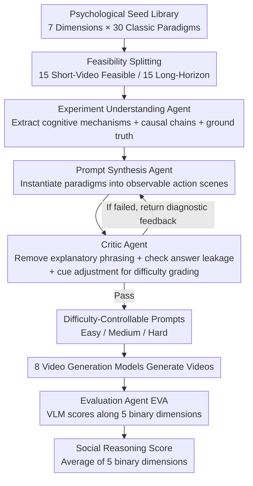

# SVBench: Evaluation of Video Generation Models on Social Reasoning

**Conference**: CVPR 2026  
**Paper**: [CVF Open Access](https://openaccess.thecvf.com/content/CVPR2026/html/Peng_SVBench_Evaluation_of_Video_Generation_Models_on_Social_Reasoning_CVPR_2026_paper.html)  
**Code**: https://github.com/Gloria2tt/SVBench-Evaluation  
**Area**: Video Generation / Benchmark / Social Reasoning Evaluation  
**Keywords**: Text-to-Video, Social Reasoning, Theory of Mind, Multi-Agent Pipeline, VLM Evaluator

## TL;DR
SVBench is the first evaluation benchmark targeting the "social reasoning capabilities of video generation models." The authors distill 30 classic experimental paradigms from developmental and social psychology into 7 social cognitive dimensions. Using a training-free, four-agent pipeline, they automatically convert abstract paradigms into video prompts with controllable difficulty and zero answer leakage. Then, a highly capable VLM evaluates the generated videos along 5 binary dimensions to conduct the first systematic evaluation of 8 mainstream text-to-video models. They find that while the models "look correct visually, they generally lack social logic."

## Background & Motivation

**Background**: Text-to-video models have advanced rapidly in visual realism, motion fidelity, and text-to-video alignment. Diffusion/Transformer architectures can now synthesize dynamic scenes featuring exquisite lighting and multi-agent interactions. Complementary evaluation benchmarks (such as VBench, EvalCrafter, T2V-CompBench, Morpheus, and PhyCoBench) have also evolved from simple image quality metrics to dimension-disintegrated, fine-grained diagnosis, and have even begun testing physical plausibility.

**Limitations of Prior Work**: Almost all of these benchmarks focus HTML-wise on the **perceptual/physical levels**—motion smoothness, visual quality, physical conservation, and action consistency. While they can answer whether a scene "looks plausible," they cannot address a deeper question: when the prompt **does not explicitly state** the target outcome, do the model-generated behaviors make sense **socially and causally**? The paper provides two examples: a girl crying on a park bench next to a dropped ice cream with a lady sitting nearby—humans instantly infer the causal chain and expect the lady to comfort her; an adult drops a clip, cannot reach it, looks at a nearby toddler and points to the clip—humans immediately interpret this as a "cry for help" and expect the toddler to assist (developmental psychology shows infants aged 14–18 months understand such unfulfilled intentions). Will a model generate these social reasoning behaviors like "comforting, causal association, or helping," or will it merely render a literal scene?

**Key Challenge**: **Physical reasoning determines how events unfold visually, whereas social reasoning determines whether agent behaviors are socially and causally appropriate**. Current systems excel at the former but are constrained in the latter. Furthermore, prior work in the video domain has only treated social intelligence as an "analytical/discriminative" problem (e.g., Social-IQ and R3-VQA perform QA on existing videos); none have evaluated whether models can **generate** socially coherent multi-agent interactions from scratch.

**Goal**: To build a theoretically grounded, interpretable, and scalable benchmark specifically for evaluating the social reasoning of video generation models. Simultaneously, two engineering challenges must be addressed: (1) how to automatically translate abstract psychological paradigms into video prompts that are "answer-leakage-free and difficulty-controllable"; and (2) how to automatically evaluate social behaviors when there is no unique correct answer.

**Key Insight**: To **anchor the benchmark in mature findings from developmental and social psychology**—disciplines that have converged on 7 core components of social cognition, which naturally map to the essence of videos "causally unfolding over time."

**Core Idea**: Utilizing a toolkit comprising "a psychology paradigm seed library + a training-free four-agent pipeline + a five-dimensional binary VLM evaluation" to **automatically** import social cognitive experiments into video generation evaluation, enabling large-scale evaluation without manual annotations.

## Method

### Overall Architecture
SVBench's input is a set of 30 classic psychology experimental paradigms (seed library), and the output is the fine-grained social reasoning scores of 8 text-to-video models. In between sits a **two-stage, entirely training-free** agent pipeline: on the **generation side**, 3 agents progressively transform abstract paradigms into concrete, neutral, and difficulty-graded video prompts; on the **evaluation side**, 1 VLM agent (EVA) scores the generated videos along 5 binary dimensions. The entire pipeline requires no model training or manual annotating, making it highly scalable.

Since current video models can only produce short clips of 5–10 seconds containing 1–2 salient actions, the authors partition the 30 paradigms into two groups: 15 **short-video feasible** paradigms (single-scene, few agents, reliance on visual cues like gaze, gesture, posture, or spatial layout) serve as the primary benchmark; the other 15 **long-horizon** paradigms (e.g., delayed gratification, multi-step deception, multi-stage joint planning) represent inference structures unfolding across multiple events and are deferred to the appendix for future long-video models.

### Key Designs

**1. Seven-Dimensional Social Cognitive Seed Library: Translating Psychology Paradigms into Video-Evaluable Tasks**

The essence of a benchmark lies in the theoretical foundation of "what to evaluate," rather than arbitrarily designed scenarios. The authors distill 7 core dimensions of social cognition from developmental and social psychology—Mental State Reasoning, Goal-Directed Action, Joint Attention and Perspective, Social Coordination, Emotion and Prosocial Behavior, Social Norms and Spacing, and Multi-Agent Social Strategy. Each dimension corresponds to well-documented classic experimental paradigms (such as the Sally-Anne test for Theory of Mind, detour navigation, gaze following, pointing comprehension, instrumental helping, and personal space proxemics), selecting a total of 30 paradigms as seeds to ensure **strong theoretical anchoring and interpretability**. A critical engineering decision is the "feasibility splitting": considering that short videos can only depict single scenes with few actions, the 30 paradigms are bifurcated based on "whether the core social cues can be adequately expressed within a 5–10 second single shot." 15 paradigms enter the main benchmark, while 15 long-horizon paradigms (requiring reasoning across multiple events) are sent to the appendix. This step ensures that the benchmark is both theoretically complete and compatible with the true capability boundaries of current models.

**2. Three-Agent Generation Pipeline: From Abstract Paradigms to "Leakage-Free and Difficulty-Controllable" Video Prompts**

Directly feeding psychological experimental descriptions into video models is ineffective—descriptions often contain explanatory phrasing like "she realizes... and decides to help" which explicitly reveals the answers, turning the evaluation into "teaching the model to cheat" and compromising validity. The authors use three pipeline agents to progressively refine the prompts: The **Experiment Understanding Agent** first generates a structured comprehension for each seed, containing four components—formal description (formally describing the tested psychological phenomenon), key concepts (relevant cognitive mechanisms), test point (specific evaluated reasoning ability), and ground truth (expected behavioral outcome), forcing the model to "think through the experimental design before generating scenes" to reduce conceptual drift and provide interpretable intermediate representations; the **Prompt Synthesis Agent** maps abstract concepts into observable action sequences based on four principles—action-oriented (describing only visible behaviors, excluding inner states and expected outcomes), temporally feasible (adapted to 5–10 seconds), concrete instantiation (using concrete age/gender/species instead of abstract placeholders), and evaluation-ready (separating action description from expected outcome); the **Critic Agent** performs three actions: ① removing explanatory phrasing like "realizes/feels sad/decides to help"—rewriting "a woman realizes the man cannot reach the book and decides to help" into "a man reaches for a book on a high shelf but cannot reach it; a woman notices and walks to the bookshelf" to retain only behavioral cues; ② detecting ground-truth leakage against the test point, **returning structured error-correction instructions** to the synthesis agent if answers are explicitly stated; ③ grading the difficulty by adjusting psychological cues (gaze, expression), behavioral cues (reaching, pointing), and contextual cues (object placement, affordance)—the easy level contains redundant cues, the medium level retains only the minimum necessary for reasoning, and the hard level removes or obscures core cues to elicit more subtle reasoning. Uniquely, the Critic does not simply reject drafts; instead, it **returns diagnostic feedback (error type + revision suggestions) to allow the synthesis agent to regenerate, iterating until the requirements of neutrality, leakage-free, and proper difficulty are simultaneously met**, thereby outputting a verified pool of difficulty-controllable prompts.

**3. EVA Five-Dimensional Binary Evaluation: Using a VLM as a Structured Referee to Convert "No Unique Correct Target" Social Behaviors into Decidable Factual Queries**

Unlike deterministic tasks, social interactions do not have a unique ground truth—a "helping" scene can be accomplished by countless rational actions. Therefore, evaluation must shift from "measuring fidelity against a reference video" to "determining whether the expected social logic of the experimental paradigm correctly emerges." The authors purposely **refrained from using continuous scores**, as VLMs struggle to calibrate fine-grained numerical scales across diverse prompts, yielding high noise and instability. Instead, they employ 5 **binary** dimensions, framing the evaluation as a series of unambiguous factual questions (e.g., "Does the agent react based on what they can see?"), which aligns closer to human categorical judgment and significantly reduces the cross-turn variance of VLM grading. The five dimensions are: D1 Core Paradigm Replication (whether the core psychological phenomenon is correctly instantiated), D2 Prompt Faithfulness (whether specified agents/objects/scenes are adhered to, preventing semantic bypasses), D3 Social Coherence (whether behaviors are causally and socially plausible), D4 Social Cue Validity (presentation of critical perceptual cues like gaze and gestures), and D5 Video Rationality (a baseline for visual stability, decoupling generation failures from reasoning errors). Each dimension $D_k \in \{0,1\}$, and the overall score is the average:

$$S_{overall} = \frac{1}{5}\sum_{k=1}^{5} D_k$$

This binary design brings three benefits: it enables the **decoupling of failure modes** (distinguishing "generation failure" from "reasoning failure"—for example, if a video is visually stable but fails the core experiment, violates prompt constraints, and lacks gaze cues, D5=1 while the remaining four dimensions are 0), ensures **robustness** by reducing VLM calibration noise, and provides **scalability** for more complex future scenarios. Before evaluating, EVA reconstructs the expected logic of the experiment and then judges whether the video displays appropriate causal structures, social cues, and behavioral consistency.

### Loss & Training
This paper presents an evaluation benchmark that is entirely **training-free**. The three generation-side agents and the evaluation agent (EVA) are all based on off-the-shelf large models (with Gemini 2.5 Pro serving as the VLM referee for evaluation) without updating any parameters, and hence have no loss functions or training procedures.

## Key Experimental Results

The main experiments focus on 15 short-video feasible tasks, with 3 difficulties per task × 3 prompts per difficulty = **135 evaluation prompts**; results for long-horizon tasks are placed in the supplementary materials. A total of 8 models are evaluated: 4 closed-source (Sora2pro, Kling2.5-turbo, Veo-3.1, Hailuo02-S) and 3 open-source (HunyuanVideo, LTX-1.0, Longcat-Video), with Table 2 also including Wan2.2, totaling 8 columns. ⚠️ The abstract reads "seven state-of-the-art", but the main text and tables show "eight"; this model count contradiction exists in the original paper, so **the original text's figures are kept**.

### Main Results: Overall Performance of 8 Models on 15 Social Reasoning Tasks (Table 2, in %, higher is better)

| Model | Type | Overall | Representative Strengths / Weaknesses |
|------|------|---------|------|
| Sora2pro | Closed-source | **79.6** | Empathic Concern 100, Turn Taking 94.3, leading across the board |
| Veo-3.1 | Closed-source | 72.4 | Empathic Concern 100, Pointing 82.5, close behind |
| Hailuo02-S | Closed-source | 56.4 | Dominance/Empathic 80, relatively weak in multi-agent coordination |
| Kling2.5-turbo | Closed-source | 52.2 | Relies on explicit cues, weak in abstract social inference |
| Wan2.2 | Open-source | 48.3 | Emotion Contagion 88.9, but overall performance highly volatile |
| Longcat-Video | Open-source | 39.2 | Relatively strongest among open-source but still limited |
| HunyuanVideo | Open-source | 30.8 | Commonly fails in causal/belief reasoning tasks |
| LTX-1.0 | Open-source | 27.6 | Bottom tier, virtually incapable of complex social reasoning |

Key Conclusions: Sora2-Pro and Veo-3.1 lead significantly in almost all categories, with scores $>80\%$ in most subtasks under goal understanding, joint attention, and prosocial behavior, implying that top-tier closed-source systems **possess strong implicit priors of human action causality, gaze direction, and intent-driven interactions even without explicit cue engineering**; Hailuo02-S/Kling2.5-Turbo fail $>50\%$ of the time on tasks requiring multi-agent coordination (Leader-Follower) or abstract social inference (perspective-based helping), but recover considerably on tasks with explicit cues like Pointing Comprehension, demonstrating a **heavy reliance on surface-level visual signals**; open-source models perform at a significantly lower level across almost all dimensions, highlighting a massive gap between closed-source and open-source ecosystems in complex social reasoning.

### Ablation Study 1: Step-by-Step Ablation of the Generation Pipeline (Table 3, Manual Prompt Validation Rate %)

| Dimension | No Understanding | +Synthesis | Full (with Critic) |
|------|------|------|------|
| Goal Directed Action | 68.1 | 76.5 | 87.5 |
| Joint Attention & Perspective | 66.5 | 75.2 | 86.3 |
| Social Coordination | 67.2 | 74.5 | 86.5 |
| Emotion & Prosocial | 68.3 | 78.3 | 88.2 |
| Social Norms & Spacing | 66.4 | 77.2 | 87.2 |
| Multi-Agent Strategy | 65.6 | 73.5 | 85.6 |
| Mental State Reasoning | 65.8 | 76.1 | 87.2 |
| **Average** | **66.8** | **75.9** | **86.9** |

The prompt validation rate rises from 66.8% under "No Understanding" $\rightarrow$ 75.9% after adding experimental understanding and synthesis $\rightarrow$ 86.9% after incorporating Critic refinement, proving that **both the reasoning-aware generation phase and the Critic-driven error correction are indispensable**.

### Ablation Study 2: Effectiveness of Difficulty Grading (Table 4, Average Pass Rate of 4 Closed-Source Models on Easy/Mid/Hard %)

| Model | Easy | Mid | Hard |
|------|------|------|------|
| Sora2pro | 73.8 | **84.8** | 79.4 |
| Veo3.1 | 66.6 | 74.4 | **75.8** |
| Hailuo02-S | 62.6 | 56.8 | 49.8 |
| Kling2.5turbo | 58.0 | 54.0 | 44.6 |

Weaker models (Hailuo02-S, Kling2.5-Turbo) display a clear, monotonic decrease of Easy > Medium > Hard, demonstrating that **richer social cues indeed aid models with weaker reasoning capabilities**; however, Sora2-Pro/Veo3.1 exhibit a reverse trend, peaking at Medium/Hard (less cues). The authors attribute this to their strong intrinsic social reasoning, allowing them to infer social intent with minimal information, whereas extra cues introduce redundant/conflicting signals that cannot be perfectly rendered in 5–10 seconds, leading to penalties in other dimensions like Prompt Faithfulness. This indicates that cue-based difficulty design not only controls reasoning complexity but also reveals **different reasoning regimes across models** (higher-tier systems are robust to cue sparsity, while lower-tier systems rely heavily on external cue supplementation).

### Key Findings
- **Visually plausible $\ne$ Socially plausible**: All models exhibit a "conspicuous gap between surface-level plausibility and deeper social reasoning." Even the strongest models systematically fail on belief-based inference, subtle cue integration, and multi-agent coordination.
- **EVA aligns highly with humans but displays different thresholds**: stratified sampling of 8 models × 20 = 160 videos was re-evaluated by 10 human annotators, showing that the VLM referee aligned well with humans on relative trends across dimensions. However, humans were more forgiving in perceptual dimensions (D2/D4/D5, where the pass rate was near-ceiling) and stricter on reasoning-intensive dimensions (D1/D3)—essentially "tolerating surface flaws but refusing to tolerate logical errors."
- **Typical Failure Case**: In the gaze-following experiment, models generated "visually plausible but socially illogical" dialogue scenes (e.g., characters staring at each other instead of the female character's gaze guiding the male character to look at a drawer). EVA correctly scored D5=1 but 0 for the other four dimensions, pinpointing "unexecuted core experiment."

## Highlights & Insights
- **Psychology experiments as "seeds for an automated prompt factory"**: Distilling paradigms into machine-consumable intermediate representations via structured four-element summaries (description/key concepts/test point/ground truth) is a critical leap from "theoretical grounding" to "scalable data." This approach can be generalized to build benchmarks for any "abstract concept $\rightarrow$ evaluation sample" tasks.
- **The Critic Agent's "leakage prevention" is highly rigorous**: Rewriting "she realizes... and decides to help" into pure behavioral descriptions prevents prompt-induced evaluation contamination—a critical problem that is often ignored in discriminative benchmarks but is fatal in generative ones.
- **Binary dimensions replacing continuous scores**: Using "a series of unambiguous factual questions" counters VLM scale calibration noise and decouples "generation failure vs. reasoning failure," a highly practical and robust trick when employing VLMs as evaluators.
- **The difficulty reversal phenomenon offers strong diagnostic value**: The fact that stronger models perform better on hard conditions reveals the counterintuitive insight that "cue redundancy is a distractor for stronger models," offering warnings for future prompt designs.

## Limitations & Future Work
- **The main benchmark only covers 15 short-video feasible paradigms**: The remaining 15 long-horizon paradigms (delayed gratification, multi-step deception, multi-stage planning) were excluded due to current models' 5–10 second generation limits. Consequently, the most challenging aspect of social reasoning—"time-series belief tracking"—remains untouched by the primary benchmark.
- **Heavy reliance on a single VLM referee (Gemini 2.5 Pro)**: Although aligned with human trends, any inherent social reasoning bias in the VLM directly propagates into the scores. Furthermore, human validation was performed on a relatively small stratified subset of 160 clips.
- **Inconsistencies in the original paper's model count**: The abstract states "seven" while the body/tables show "eight", requiring keeping the original text's discrepancy. Additionally, Wan2.2 appears in Table 2 but is not explicitly named in the open-source selection in the setup section.
- **Binary scoring sacrifices fine-grained resolution**: Crushing each dimension into 0/1 swaps granularity for robustness, losing "partially correct" information and potentially proving too coarse for borderline cases near thresholds.
- **Future Directions**: Incorporating the 15 long-horizon paradigms as long-video generation matures, employing multi-VLM ensembles or hybrid human-AI refereeing to mitigate individual model biases, and combining binary scores with confidence metrics for more granular failure attribution.

## Related Work & Insights
- **vs. VBench / EvalCrafter / VBench-2.0**: They evaluate perceptual and physical layers (image quality, motion smoothness, physical consistency, commonsense), whereas SVBench targets the social and causal layers—answering whether behavior is socially appropriate when the goal is not explicitly stated. They are orthogonal complements rather than replacements.
- **vs. Morpheus / PhyCoBench**: Those two use physical experiments/conservation law probes to evaluate physical reasoning, whereas SVBench uses psychological paradigms to evaluate social reasoning. Both adapt standard experiments from other fields to video evaluation, but the target shifts from physics to cognition.
- **vs. Social-IQ / R3-VQA**: They perform social reasoning QA (discriminative) on **existing** human-made videos, whereas SVBench evaluates whether models can **generate** socially coherent interactions from scratch—a vital gap emphasized repeatedly in this paper.
- **vs. LLM Theory of Mind (ToM) Benchmarks**: LLM social reasoning benchmarks (ToM/multi-agent belief tracking) show that LLMs handle simple first-order beliefs adequately but fail on high-order/counterfactual ones. SVBench ports this diagnostic angle from text to video generation, uncovering a similar "capable on the surface, incapable in depth" phenomenon.

## Rating
- Novelty: ⭐⭐⭐⭐⭐ The first video generation social reasoning benchmark, pioneering the automated translation of psychological paradigms into generative evaluations.
- Experimental Thoroughness: ⭐⭐⭐⭐ Solid overall with 8 models × 135 prompts + step-by-step/difficulty ablation + human alignment validation; however, the main benchmark only covers short videos and the human validation subset is relatively small.
- Writing Quality: ⭐⭐⭐⭐ The motivation is exceptionally clear and the pipeline is reproducible; points deducted for minor self-contradictions in model counts.
- Value: ⭐⭐⭐⭐⭐ Provides an interpretable and scalable yardstick for whether "video models understand society," serving as a powerful guide for both evaluation and model improvement.

<!-- RELATED:START -->

## Related Papers

- [\[CVPR 2026\] TiViBench: Benchmarking Think-in-Video Reasoning for Video Generation](tivibench_benchmarking_think-in-video_reasoning_for_video_generation.md)
- [\[CVPR 2026\] Thinking with Video: Video Generation as a Promising Multimodal Reasoning Paradigm](thinking_with_video_video_generation_as_a_promising_multimodal_reasoning_paradig.md)
- [\[CVPR 2026\] Ref4D-VideoBench: Four-Dimensional Reference-Based Evaluation of Text-to-Video Generative Models](ref4d-videobench_four-dimensional_reference-based_evaluation_of_text-to-video_ge.md)
- [\[CVPR 2026\] SLVMEval: Synthetic Meta Evaluation Benchmark for Text-to-Long Video Generation](slvmeval_synthetic_meta_evaluation_benchmark_for_text-to-long_video_generation.md)
- [\[CVPR 2026\] EffectMaker: Unifying Reasoning and Generation for Customized Visual Effect Creation](effectmaker_unifying_reasoning_and_generation_for_customized_visual_effect_creat.md)

<!-- RELATED:END -->
