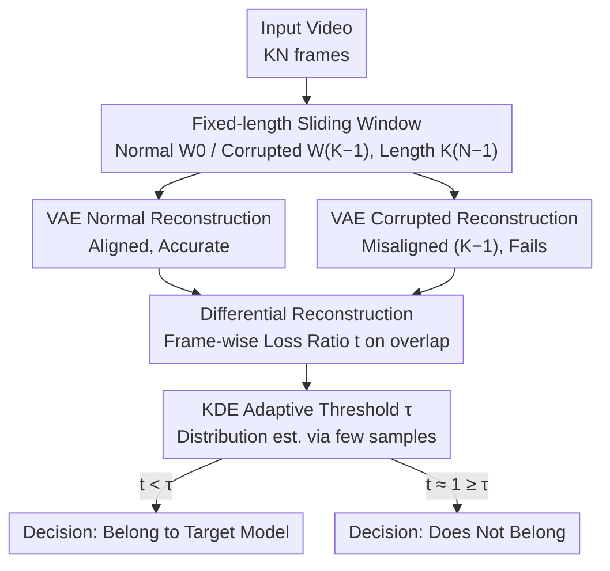

# SWIFT: Sliding Window Reconstruction for Few-Shot Training-Free Generated Video Attribution

**Conference**: CVPR 2026  
**arXiv**: [2603.08536](https://arxiv.org/abs/2603.08536)  
**Code**: [GitHub](https://github.com/wangchao0708/SWIFT)  
**Area**: Video Generation  
**Keywords**: Generated video attribution, 3D VAE, Sliding window reconstruction, Training-free, Temporal consistency

## TL;DR

SWIFT defines the "few-shot training-free generated video attribution" task for the first time. By leveraging the "multi-frame pixel $\leftrightarrow$ single-frame latent" temporal mapping in 3D VAEs, it performs normal and corrupted reconstructions via fixed-length sliding windows. The ratio of reconstruction losses on overlapping frames serves as the attribution signal. It achieves over 90% average attribution accuracy with only 20 samples, and 94% across five models.

## Background & Motivation

1. **Background**: Video generation technologies (HunyuanVideo, Wan2.1/2.2, EasyAnimate, etc.) are developing rapidly, all adopting 3D VAE + DiT architectures. Generated videos may be misused for spreading misinformation or infringing intellectual property.
2. **Limitations of Prior Work**: Existing attribution methods fall into two categories: (1) Active attribution via watermarking, which requires embedding and may degrade video quality; (2) Training-based passive attribution, which requires large training sets and retraining for new models. Image attribution methods (RONAN/LatentTracer/AEDR) see significant accuracy drops when migrated to video.
3. **Key Challenge**: Image attribution methods only focus on spatial consistency, ignoring the inherent temporal consistency constraints of video data, and cannot effectively handle sequence-related perturbations.
4. **Goal**: How to achieve reliable generated video attribution under training-free conditions with only a few samples by utilizing temporal characteristics?
5. **Key Insight**: The 3D VAE of SOTA video generation models performs downsampling in the temporal dimension (compression ratio $K$ is typically 4 or 8), naturally forming a "K-frame pixel $\leftrightarrow$ 1-frame latent" temporal mapping. A video belonging to a specific model satisfies that model's VAE distribution when chunk-aligned, whereas non-belonging videos do not.
6. **Core Idea**: "Corrupt" reconstruction by breaking temporal alignment using sliding windows. Videos belonging to the target model show significant loss differences between normal and corrupted reconstructions, while others do not.

## Method

### Overall Architecture

SWIFT addresses the specific question: Given a video, was it generated by a target model? The mechanism hinges on the temporal compression of 3D VAEs—these VAEs downsample the temporal dimension by a ratio $K$ (usually 4 or 8), where every $K$ pixel frames are mapped to 1 latent frame. For a video belonging to the model, as long as it is aligned in groups of $K$ frames (chunks), encoding and decoding fall within the VAE's familiar distribution, resulting in accurate reconstruction. Once frames are misaligned or chunk alignment is disrupted, reconstruction fails. SWIFT creates this "alignment vs. misalignment" contrast: two sliding windows are taken from the same video, one keeping temporal alignment and the other intentionally misaligned. Each is reconstructed to compare the loss difference. Videos from the target model reveal large differences, while others show little. The pipeline requires only white-box access to the target VAE codec without training any models.

### Key Designs

**1. Fixed-length Sliding Window: Breaking the "Temporal Alignment" assumption with a shifted window**

Differential comparison requires two windows of the same length but opposite alignment states. Given a video of $KN$ frames ($N$ is the number of chunks), the window length is set to $K(N-1)$ frames. The normal window $W_0$ starts from the 1st frame, satisfying the VAE temporal mapping for each chunk. The corrupted window $W_{K-1}$ is shifted backward by $K-1$ frames, pushing each frame into the wrong chunk slot and maximizing the destruction of temporal consistency. Generally, a window starting at $j$ is normal if $j \bmod K = 0$ and corrupted if $j \bmod K \neq 0$. $W_{K-1}$ is chosen as the counterpart to $W_0$ because a $K-1$ offset simultaneously alters "intra-chunk frame composition" and "frame-to-latent position mapping," causing the most thorough misalignment. For example, with $K=4$, $W_0$ takes frames 1 to $4(N-1)$, and $W_3$ takes frames 4 to $(4N-1)$; they overlap significantly in the middle but have opposite alignment states for frame-wise comparison. For VAEs with denoising steps (e.g., LTX), misalignment damage may be partially "repaired," requiring quantitative evaluation to select the most effective window pair.

**2. Differential Reconstruction: Using loss ratio instead of absolute error to cancel content bias**

Both windows pass through the VAE: normal reconstruction yields $W_0^* = \mathcal{R}(W_0)$, and corrupted reconstruction yields $W_{K-1}^{**} = \mathcal{R}(W_{K-1})$. The attribution signal $t$ is calculated as the mean of the frame-wise loss ratios on overlapping frames:

$$
t = \frac{1}{K(N-1)-K+1} \sum_{i=K}^{K(N-1)} \frac{\mathcal{L}(F_i^*, F_i)}{\mathcal{L}(F_i^{**}, F_i)}
$$

where $\mathcal{L}$ is MSE and $F_i$ is the $i$-th original frame. If the video originates from the target model, the normal reconstruction is nearly lossless (small numerator) while the misaligned reconstruction is distorted (large denominator), resulting in $t \ll 1$. If not, the VAE is unfamiliar with the data, leading to mediocre reconstruction for both alignment states and $t \approx 1$. The key is the relative change under "alignment/misalignment" rather than absolute error, which cancels out video content complexity (e.g., high-texture videos are naturally harder to reconstruct) and leaves only the VAE temporal alignment signal.

**3. KDE Adaptive Threshold: Non-parametric density estimation for thresholding**

A decision threshold $\tau$ is needed: $t < \tau$ indicates attribution. Since the distribution of $t$ varies across models and often contains outliers, parametric distributions like Gaussian are unstable. SWIFT uses Kernel Density Estimation (KDE, Gaussian kernel + Scott's bandwidth) to estimate the threshold from the $t$ distribution of a few known attribution videos, setting $\tau$ at the point where the cumulative distribution reaches $1-\alpha$ ($\alpha=0.05$). KDE is distribution-agnostic and robust to outliers, allowing the same process to work for diverse models with only a few dozen samples.

### Loss & Training

SWIFT is entirely training-free. The only "metric selection" involves the type of reconstruction loss for $t$. Ablations show MSE best amplifies alignment/misalignment differences (98.4%), slightly better than MAE (97.8%), while PSNR (47.8%) and SSIM (47.1%) largely fail. These latter metrics measure structural similarity rather than pixel-wise differences and fail to capture subtle VAE distribution disruptions, flattening the contrast signal.

## Key Experimental Results

### Main Results

Evaluation on the self-constructed S-Video dataset (4000 videos: 500 real + 3500 generated from 5 SOTA models):

| Target Model | SWIFT Avg Accuracy | AEDR Avg Accuracy | Gain |
|---------|----------------|----------------|------|
| HunyuanVideo | 90.7% | 60.5% | +30.2% |
| Wan2.1 | 98.4% | 89.3% | +9.1% |
| EasyAnimate | 97.8% | 63.1% | +34.7% |
| LTX-Video | 85.3% | 79.3% | +6.0% |
| Wan2.2 | 97.9% | 78.5% | +19.4% |
| **Overall Avg** | **94.0%** | **73.6%** | **+20.4%** |

### Ablation Study

Few-shot capability (number of samples $S$ for thresholding):

| Samples S | Avg Accuracy | Note |
|---------|-----------|------|
| 0 (Zero-shot) | 85.1% | Direct $\tau=1$ |
| 20 | 90.2% | 90% reached with few-shot |
| 50 | 92.5% | Performance nears saturation |
| 200 | 94.0% | Optimal |

Window selection ablation (HunyuanVideo, $K=4$):

| Normal Window | Corrupted Window | Accuracy |
|---------|---------|--------|
| $W_0$ | $W_1$ | 82.3% |
| $W_0$ | $W_2$ | 82.3% |
| $W_0$ | $W_3$ | **90.7%** |

### Key Findings

- **Excellent performance on Wan2.1/EA/Wan2.2** (97-98%), as these VAEs are pure codecs, preserving complete VAE distribution features.
- **Lowest performance on LTX-Video** (85.3%) due to its VAE decoder's additional denoising step, which weakens the reconstruction difference signal, yet it still significantly outperforms the baseline.
- **Zero-shot feasibility**: Setting a threshold of 1 directly achieves approximately 90% accuracy for HunyuanVideo, EasyAnimate, and Wan2.2.
- **Efficiency advantage**: 4-32% faster than AEDR, as SWIFT only reconstructs windows rather than the full video.
- **MSE as optimal loss metric**: MSE amplifies differences more effectively than MAE (98.4% vs 97.8%).

## Highlights & Insights

- **Clever utilization of 3D VAE temporal compression**: Effectively converting the inherent temporal mapping of 3D VAEs into an attribution signal. This "forensics by model architecture features" paradigm can be extended to other tasks leveraging specific components.
- **Differential reconstruction eliminates content bias**: By using the ratio of normal/corrupted reconstruction rather than absolute error, the signal relies solely on VAE distribution matching, significantly enhancing robustness.
- **Practicality of few-shot and training-free approach**: Reaching 90% accuracy with only 20 samples without training models is highly practical in an era where new models emerge constantly.

## Limitations & Future Work

- Accuracy drops to 85.3% on LTX-Video due to decoder denoising; adaptation may be required for future models with more complex VAE designs.
- Currently only supports white-box access to the VAE, making it difficult for third parties other than model owners to use.
- Robustness after video compression (e.g., H.264/H.265) has not been discussed.
- Attribution might fail when multiple models share the same VAE (e.g., fine-tuning based on the same foundation model).
- Future directions: Exploring attribution under black-box settings and integrating frequency domain analysis to enhance detection for complex VAEs.

## Related Work & Insights

- **vs AEDR**: An image attribution method using VAE reconstruction consistency. SWIFT extends this to video, with the key innovation being the use of temporal differential reconstruction rather than pure spatial reconstruction, improving accuracy from 73.6% to 94.0%.
- **vs RONAN/LatentTracer**: Gradient optimization-based image attribution methods with high computational overhead. SWIFT requires no gradient optimization, only forward encoding/decoding.
- **vs Watermarking**: Watermarking requires modifying the generation pipeline, whereas SWIFT is entirely passive and transparent to the generation process.

## Rating

- Novelty: ⭐⭐⭐⭐⭐ First to define this task, clever use of 3D VAE temporal features, unique differential reconstruction approach.
- Experimental Thoroughness: ⭐⭐⭐⭐ Extensive evaluation across 5 models with detailed ablations, though lacking video compression robustness tests.
- Writing Quality: ⭐⭐⭐⭐ Clear formal definitions, though some notation is slightly redundant.
- Value: ⭐⭐⭐⭐⭐ Highly practical; the few-shot training-free paradigm has significant application prospects in AI safety.

<!-- RELATED:START -->

## Related Papers

- [\[CVPR 2026\] FlowDirector: Training-Free Flow Steering for Precise Text-to-Video Editing](flowdirector_training-free_flow_steering_for_precise_text-to-video_editing.md)
- [\[CVPR 2026\] FlowPortal: Residual-Corrected Flow for Training-Free Video Relighting and Background Replacement](flowportal_residual-corrected_flow_for_training-free_video_relighting_and_backgr.md)
- [\[ICCV 2025\] D3: Training-Free AI-Generated Video Detection Using Second-Order Features](../../ICCV2025/video_generation/d3_training-free_ai-generated_video_detection_using_second-order_features.md)
- [\[CVPR 2026\] FlowMotion: Training-Free Flow Guidance for Video Motion Transfer](flowmotion_training-free_flow_guidance_for_video_motion_transfer.md)
- [\[CVPR 2026\] FlashLips: 100-FPS Mask-Free Latent Lip-Sync using Reconstruction Instead of Diffusion or GANs](flashlips_100-fps_mask-free_latent_lip-sync_using_reconstruction_instead_of_diff.md)

<!-- RELATED:END -->
