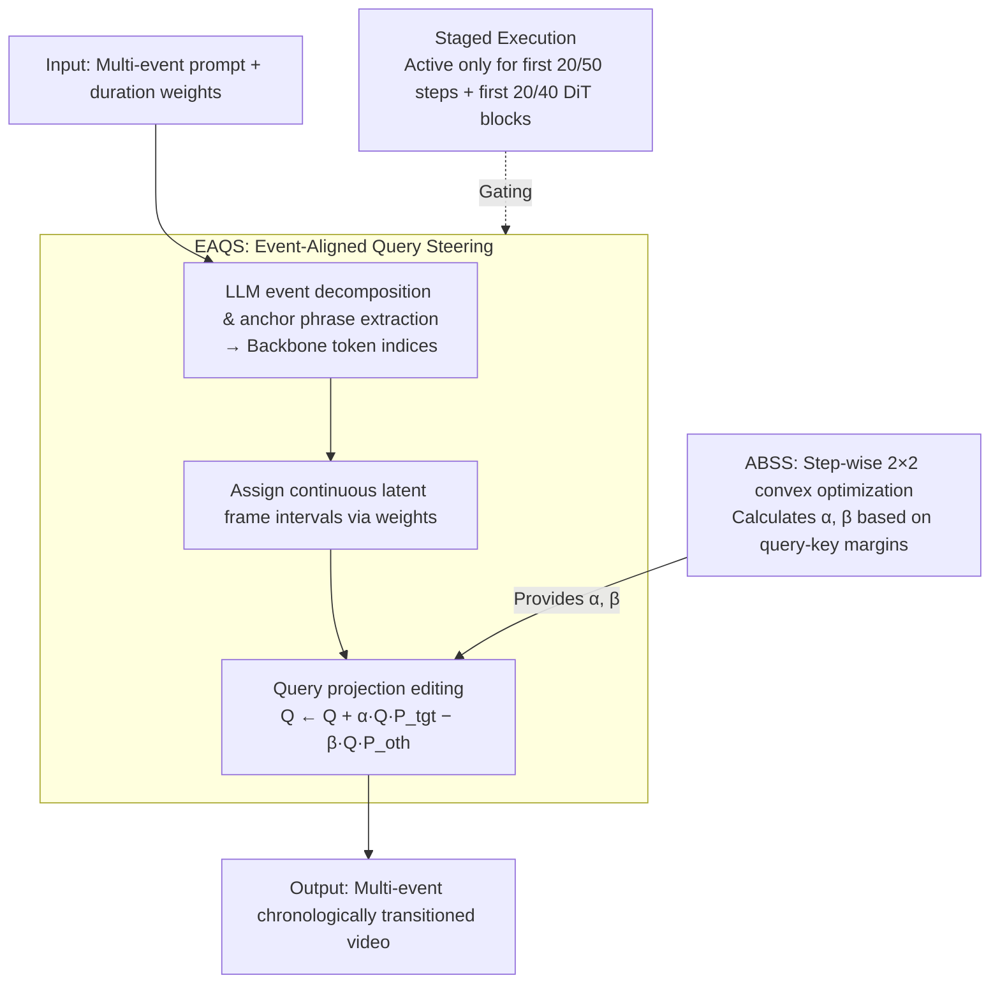

# SwitchCraft: Training-Free Multi-Event Video Generation with Attention Controls

**Conference**: CVPR 2026  
**arXiv**: [2602.23956](https://arxiv.org/abs/2602.23956)  
**Code**: Available (To be released)  
**Area**: Video Generation  
**Keywords**: Multi-Event Video Generation, Attention Control, Training-Free Framework, Diffusion Models, Temporal Alignment

## TL;DR

SwitchCraft is a training-free multi-event video generation framework that achieves clear temporal transitions and scene consistency without modifying model weights. It introduces Event-Aligned Query Steering (EAQS) to align frame-level attention with corresponding event prompts and an Auto-Balance Strength Solver (ABSS) to adaptively balance guidance intensity.

## Background & Motivation

Mainstream Text-to-Video (T2V) diffusion models (e.g., Wan 2.1) excel at single-event generation but struggle with prompts containing multiple sequential events. The core issue is that existing models inject the same text representation uniformly across all frames via cross-attention. Consequently, the model interprets the entire description as a global context rather than a chronologically ordered sequence, leading to event bleeding, blurred transitions, or missing events.

Current solutions face two main limitations:

**Training/Fine-tuning approaches** (e.g., MinT): Require densely annotated temporal data, involve high computational costs, and lack generalization.

**Stitching approaches** (e.g., MEVG, LongLive): Generate segments sequentially and fuse them. These lack global context and cannot "foresee" subsequent events during early segment generation, causing discontinuous transitions and temporal drift.

The key insight of SwitchCraft is that uniform prompt injection ignores the mapping between events and frames. Therefore, a mechanism is needed to precisely steer the attention of each frame toward its specific event description.

## Method

### Overall Architecture

SwitchCraft enables a pre-trained T2V model—which natively treats entire descriptions as unified context—to decompose and execute multiple events chronologically without retraining. It modifies the query vectors in the cross-attention mechanism during inference only, leaving model weights untouched.

The pipeline operates as follows: an LLM first decomposes the multi-event prompt into individual events and extracts "anchor phrases" for each. These events are assigned to continuous latent frame intervals based on user-defined duration weights. During denoising, EAQS rewrites the queries of frames within each interval to align more closely with the target event while moving away from others. The steering intensities $\alpha$ and $\beta$ are adaptively calculated by ABSS via a small convex optimization problem at each step. This intervention is restricted to the first 20 denoising steps (out of 50) and the first 20 DiT blocks (out of 40), as early stages and shallow blocks determine scene layout and large-scale motion.

### Key Designs

**1. Event-Aligned Query Steering (EAQS): Steering queries toward target events**

Uniform injection causes every frame to distribute attention across all events. EAQS ensures each frame is sensitized only to its corresponding event. First, an LLM (e.g., ChatGPT) extracts discriminative anchor phrases (e.g., "sunny desert" for scene changes or "walking forward" for action changes) and maps them to backbone token indices. Second, events are mapped to the timeline using relative weights $w_i$ over $F'$ latent frames:

$$N_i \approx F' \cdot \frac{w_i}{\sum_{j=1}^{A} w_j}$$

The actual steering occurs in the key subspace. For an attention head, let the text key matrix be $K \in \mathbb{R}^{L_k \times D}$ and the query for the current event interval be $Q^* \in \mathbb{R}^{R \times D}$. Using anchor indices, target event keys $K_{\text{tgt}}$ and competing event keys $K_{\text{oth}}$ are extracted to construct regularized right projection operators:

$$P_{\text{tgt}} = K_{\text{tgt}}^\top (K_{\text{tgt}} K_{\text{tgt}}^\top + \epsilon I)^{-1} K_{\text{tgt}}$$

These projectors map queries into the target subspace $\mathcal{T}$ and competing subspace $\mathcal{O}$. The query update follows an "enhance target, suppress competition" logic:

$$Q^* \leftarrow Q^* + \alpha \cdot Q^* P_{\text{tgt}} - \beta \cdot Q^* P_{\text{oth}}$$

This increases the dot product with target keys and suppresses components in competing subspaces. By modifying only queries (local to frames) rather than shared keys/values or post-softmax weights, SwitchCraft avoids disrupting pre-trained priors while enabling per-frame guidance.

**2. Auto-Balance Strength Solver (ABSS): Adaptive optimization of steering intensity**

Manually tuning $\alpha$ and $\beta$ is impractical as optimal values vary by prompt and denoising step. ABSS treats this as an optimization problem. It reduces dimensionality via SVD on normalized keys to obtain a principal direction $k_{\text{tgt}} \in \mathbb{R}^D$ and competing directions $k_{\text{oth},j} \in \mathbb{R}^D$.

The frame's alignment is quantified by computing scores:

$$S_{\text{tgt}} = Q^* k_{\text{tgt}}, \quad S_{\text{oth}} = Q^* k_{\text{oth}}$$

A margin deficit is defined as $d = S_{\text{oth}}^{\max} - S_{\text{tgt}} + \varepsilon$. If $d > 0$, the competing event dominates, requiring guidance. ABSS solves:

$$\min_{x \geq 0} \frac{1}{2} x^\top M x + \frac{1}{2} \|\max(0, d - Cx)\|_2^2$$

where $x = [\alpha, \beta]^\top$ and $M$ is a scale-aware damping matrix. This quadratic program has a closed-form solution:

$$(M + C^\top C) x = C^\top d, \quad x \leftarrow \max(x, 0)$$

The solver automatically yields $x=0$ when the target is already dominant, eliminating manual hyperparameter tuning.

**3. Staged Execution: Minimizing side effects**

EAQS and ABSS are active only during the first 20/50 denoising steps and the first 20/40 DiT blocks. This exploits the hierarchical nature of Diffusion Transformers, where early steps/shallow blocks establish layout and motion, while later stages/deeper blocks refine texture and identity. This preserves image quality while ensuring temporal alignment.

### Loss & Training

Ours is entirely training-free. It requires no additional data or fine-tuning. The backbone uses the original Wan 2.1 velocity prediction objective. Inference utilizes the UniPC sampler with 50 steps and a guidance scale of 5.0.

## Key Experimental Results

### Main Results

Experiments were conducted on the Wan 2.1 T2V 14B backbone at 832x480 resolution (81 frames).

| Method | CLIP-T | CLIP-F | Visual Quality | T2V Align | Phys. Consist. | Motion Smooth. | Subj. Consist. | Bg. Consist. | Aesthetic | Imaging |
|------|--------|--------|---------|--------|---------|---------|---------|---------|------|------|
| MEVG | 0.244 | 0.915 | 2.13 | 2.33 | 1.73 | 0.953 | 0.701 | 0.841 | 0.346 | 0.525 |
| DiTCtrl | 0.246 | 0.959 | 3.20 | 3.27 | 2.93 | 0.981 | 0.764 | 0.876 | 0.511 | 0.702 |
| LongLive | 0.252 | 0.984 | 4.27 | 3.13 | 3.97 | 0.984 | 0.898 | 0.908 | 0.627 | 0.725 |
| Wan 2.1 | 0.256 | 0.980 | 4.30 | 3.47 | 4.12 | 0.987 | 0.947 | 0.924 | 0.645 | 0.738 |
| Stitch | 0.257 | 0.963 | 3.73 | 3.67 | 3.80 | 0.983 | 0.926 | 0.910 | 0.608 | 0.711 |
| **Ours** | **0.275** | 0.980 | **4.33** | **4.30** | **4.13** | **0.989** | 0.945 | 0.921 | **0.648** | **0.741** |

Ours significantly leads in text alignment (CLIP-T +7.4%, T2V Align +24%) while maintaining backbone-level visual quality.

### Ablation Study

| Variant | CLIP-T | CLIP-F | Visual Quality | T2V Align | Phys. Consist. | Motion Smooth. |
|------|--------|--------|---------|--------|---------|---------|
| Full Model | **0.275** | 0.980 | **4.33** | **4.30** | **4.13** | **0.989** |
| Random Strength | 0.253 | 0.974 | 4.15 | 3.62 | 3.98 | 0.987 |
| Fixed Strength=1 | 0.264 | 0.967 | 3.97 | 3.75 | 3.95 | 0.985 |
| W/O SVD | 0.255 | 0.978 | 4.30 | 3.67 | 4.08 | 0.988 |
| Enhance Only | 0.262 | 0.980 | 4.35 | 3.78 | 4.13 | 0.989 |
| Suppress Only | 0.261 | 0.978 | 4.28 | 3.73 | 4.05 | 0.986 |

### Key Findings

1. **ABSS is crucial**: Random strength leads to event omission; fixed strength causes visual degradation. ABSS adaptive solving is superior.
2. **Dual Action**: Both enhancement and suppression are needed to isolate intervals and actively drive query direction.
3. **SVD Efficiency**: Removing SVD reduces event separation (CLIP-T drops from 0.275 to 0.255).
4. **Computational Overhead**: Inference time increases by ~16% for 2 events and ~47% for 4 events due to SVD and optimization steps.
5. **Creative Transitions**: SwitchCraft enables creative transitions through occlusion descriptions within a single diffusion trajectory.

## Highlights & Insights

1. **Query-only editing**: Precise per-frame guidance without polluting the global information flow of shared keys/values.
2. **Subspace Perspective**: Formulates event alignment as subspace projection using regularized pseudo-inverses for stability.
3. **Closed-form ABSS**: Efficient $2 \times 2$ system that eliminates manual hyperparameter tuning across different scenes.
4. **Leveraging Hierarchical Generation**: Intervening only during the "layout-fixing" stage maximizes effect with minimal side effects.

## Limitations & Future Work

1. **Backbone dependency**: Limited by the underlying model's ability to generate specific complex motions.
2. **Lack of spatial constraints**: Action confusion may occur between multiple subjects.
3. **Linearity assumption**: Only supports sequential events, not parallel or non-linear narratives.

## Rating

| Dimension | Score | Explanation |
|------|------|------|
| Novelty | ★★★★☆ | First training-free method using query subspace projection for multi-event T2V. |
| Technical Depth | ★★★★☆ | Solid theoretical grounding in EAQS projection and ABSS optimization. |
| Experimental Thoroughness | ★★★★☆ | Extensive comparisons against 6 baselines and multiple ablation variants. |
| Practicality | ★★★★★ | Training-free, compatible with DiT architectures, manageable overhead. |
| Writing Quality | ★★★★☆ | Clear structure with comprehensive mathematical derivations. |

<!-- RELATED:START -->

## Related Papers

- [\[ICLR 2026\] TS-Attn: Temporal-wise Separable Attention for Multi-Event Video Generation](../../ICLR2026/video_generation/ts-attn_temporal-wise_separable_attention_for_multi-event_video_generation.md)
- [\[CVPR 2026\] FlowDirector: Training-Free Flow Steering for Precise Text-to-Video Editing](flowdirector_training-free_flow_steering_for_precise_text-to-video_editing.md)
- [\[CVPR 2026\] FlowPortal: Residual-Corrected Flow for Training-Free Video Relighting and Background Replacement](flowportal_residual-corrected_flow_for_training-free_video_relighting_and_backgr.md)
- [\[CVPR 2026\] LinVideo: A Post-Training Framework towards O(n) Attention in Efficient Video Generation](linvideo_a_post-training_framework_towards_on_attention_in_efficient_video_gener.md)
- [\[CVPR 2025\] Mind the Time: Temporally-Controlled Multi-Event Video Generation](../../CVPR2025/video_generation/mind_the_time_temporally-controlled_multi-event_video_generation.md)

<!-- RELATED:END -->
