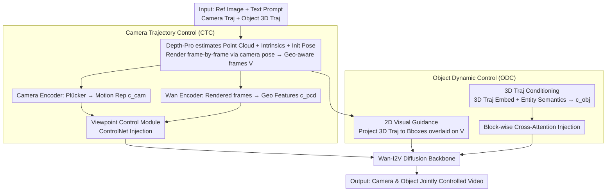

# SymphoMotion: Joint Control of Camera Motion and Object Dynamics for Coherent Video Generation

**Conference**: CVPR 2026  
**arXiv**: [2604.03723](https://arxiv.org/abs/2604.03723)  
**Code**: [Project Page](https://grenoble-zhang.github.io/SymphoMotion/)  
**Area**: Video Generation / Motion Control  
**Keywords**: Video Diffusion Models, Camera Control, Object Motion Control, 3D Perception, Motion Decoupling

## TL;DR

Ours proposes SymphoMotion, a unified motion control framework that simultaneously and precisely controls camera motion and object 3D trajectories in videos through Camera Trajectory Control (CTC) and Object Dynamic Control (ODC) mechanisms. Furthermore, a large-scale real-world joint-annotated dataset, RealCOD-25K (25K samples), is constructed.

## Background & Motivation

**Background**: Precise control of motion dynamics in video generation is receiving increasing attention. Camera control methods (CameraCtrl, Uni3C, etc.) regulate viewpoint changes by injecting camera parameters but primarily handle static or quasi-static scenes. Object control methods (TrackGo, MagicMotion, etc.) rely on 2D motion cues (bounding boxes, optical flow, keypoints), yet these image-plane representations cannot distinguish true object motion from camera-induced parallax.

**Limitations of Prior Work**: (1) Control of a single motion type is often incompatible—camera control methods degrade when foreground dynamics are significant, while object control methods become unreliable under camera motion; (2) Recent joint control methods (e.g., MotionPrompting, ATI) mix camera parallax and object motion in the same 2D motion field, leading to supervisory ambiguity—different 3D motions can produce similar projections on the image plane, especially in scenes with large depth variations; (3) Although MotionCtrl separates the processing branches for both motions, object control is still confined to 2D image space; (4) FMC uses a 6D pose representation but depends on synthetic data and requires complete 6DoF input, limiting practical utility.

**Key Challenge**: Camera motion generates global parallax and viewpoint changes, while objects follow independent 3D paths—the manifestations of both on the 2D image plane are highly coupled and difficult to disentangle.

**Goal**: How to unify and decouple the control of camera trajectories and object 3D dynamics within a single model so that both are spatially consistent and do not interfere with each other?

**Key Insight**: The authors argue that the key lies in introducing 3D perception: using Plücker embeddings combined with point cloud geometric priors to enhance the structural awareness of camera control, and using 2D visual guidance combined with 3D trajectory embeddings to provide depth-aware perception for object control. Simultaneously, the first large-scale real-world dataset with joint annotations for camera poses and object 3D trajectories is constructed.

**Core Idea**: 2D visual guidance provides image-plane anchors while 3D trajectory embeddings provide depth-aware motion supervision, achieving decoupled joint control of camera and object motion in a unified framework.

## Method

### Overall Architecture

This paper addresses the problem of enabling a video generation model to simultaneously follow "how the camera moves" and "how the object moves" commands without conflict. The difficulty lies in the fact that camera and object motions are highly entangled in 2D—the same displacement in a frame could be caused by camera translation or the object moving itself. SymphoMotion breaks this by moving control signals into 3D space: the camera path relies on point cloud geometric priors to supplement structural awareness, while the object path uses 3D trajectory embeddings to provide depth awareness.

The overall pipeline is built upon the pretrained Wan-I2V image-to-video diffusion model. During inference, the model takes four inputs: a reference image, a text prompt, a camera trajectory, and 3D motion trajectories for several objects. Two control branches operate in parallel: Camera Trajectory Control (CTC) injects camera poses and geometric priors via a Viewpoint Control Module, while Object Dynamic Control (ODC) inputs 2D visual anchors and 3D trajectory conditions together. The two branches use different injection methods into the diffusion backbone—CTC uses ControlNet, while ODC uses cross-attention—allowing them to manage their respective tasks while sharing the same backbone, which is the source of being "decoupled yet unified."

### Key Designs

**1. Camera Trajectory Control (CTC): Using Point Cloud Rendered Frames to Supplement 3D Structural Awareness**

When controlling viewpoint transformations precisely, the most common camera condition is Plücker embedding (encoding each pixel ray as position + direction). However, Plücker only describes where the camera is and where it looks, remaining oblivious to the 3D structure of the scene itself, which leads to instability in scenes with large depth changes. SymphoMotion's approach is to provide the camera control with extra scene geometry: it first uses Depth-Pro to estimate the point cloud, camera intrinsics, and initial pose $C^f$ from the reference image, then re-renders this point cloud frame-by-frame according to the target camera pose sequence $\{C^1,\dots,C^N\}$ to obtain a set of "geometry-aware frames" $\mathcal{V}$. Two encoders take what they need—the camera encoder transforms Plücker embeddings into a motion representation $c_{cam}$, and the Wan encoder extracts geometric features $c_{pcd}$ from rendered frames. $c_{pcd}$ is concatenated with the noise latent $z_t$, and combined with $c_{cam}$, they are sent into the Viewpoint Control Module implemented by ControlNet. The spatial structure cues from rendered frames and the pose information from Plücker complement each other, allowing the model to maintain geometric consistency during rotation instead of just mechanically moving pixels.

**2. 2D Visual Guidance for Object Dynamic Control (ODC): Mapping 3D Trajectories as In-frame Boxes for Visible Anchors**

Providing a 3D trajectory alone is insufficient—once the trajectory is projected onto the frame, the model might not precisely align it with the pixel location where the object should appear. The first strategy of ODC is to draw constraints explicitly on the frame: project the 3D trajectory $P_i$ of each object to the image plane using target camera poses to get the 2D trajectory $P_{2D_i}$. Frame-by-frame bounding boxes are fitted based on these projected points, then these boxes are directly rendered and overlaid onto the point cloud frames $\mathcal{V}$. The key is that these boxes are overlaid in the rendered input rather than just being encoded in the latent space—this acts as a visible marker for the model that "this object should appear in this region in this frame," helping the model track the motion path of each object on the image plane and stabilizing training.

**3. 3D Trajectory Conditioning for Object Dynamic Control (ODC): Binding Object Motion to Real-world Paths**

While 2D boxes solve "where in the frame," they do not solve "at what depth and along what 3D path"—this is where object control most easily distorts under camera motion. The second strategy of ODC is to encode the 3D trajectory itself as a conditional signal. Each object's trajectory $P_i \in \mathbb{R}^{N \times N_p \times 3}$ is first transformed into the reference camera coordinate system and encoded into latent embeddings via linear projection and temporal downsampling. Simultaneously, a frozen language encoder encodes the object's entity prompt $y_i$ into a semantic embedding. Both embeddings are added element-wise to obtain a motion-aware representation $c_{obj}$. This is injected via a new cross-attention layer to $c_{obj}$ in each transformer block:

$$Z_i' = Z_i + \text{CrossAttn}(Q=Z_i,\; K=c_{obj},\; V=c_{obj})$$

Because 3D trajectories describe the object's motion in real-world space independent of the camera viewpoint, object motion remains spatially consistent even when the camera is moving—this is the fundamental reason ODC and CTC can coexist without conflict.

### Loss & Training

Training utilizes a Flow Matching objective, aligning the velocity field predicted by the network with the ground truth velocity field:

$$\min_\theta \mathbb{E}\big[\|v_\theta(z_t, t, c_y, c_f, \phi_\theta(c_{cam}, c_{pcd}), \psi_\theta(P, y)) - v_t\|^2\big]$$

A two-stage curriculum is adopted: first, CTC is trained independently to learn camera control; then CTC is frozen while ODC is trained for object motion. The base model Wan-I2V is frozen throughout, with only the two lightweight control branches being learned. The configuration includes 32 H100 GPUs, batch size 32, 81-frame video sequences at 832×480 resolution, utilizing the AdamW optimizer with a linear warm-up to a learning rate of $1 \times 10^{-5}$ over the first 400 steps.

## Key Experimental Results

### Main Results

| Method | FID↓ | FVD↓ | CLIPSIM↑ | CamTransErr↓ | CamRotErr↓ | Box-IoU↑ |
|------|------|------|----------|-------------|-----------|----------|
| CameraCtrl | 196.84 | 1019.49 | 0.29 | 0.68 | 0.12 | – |
| ViewCrafter | 303.83 | 1690.73 | 0.28 | 0.80 | 0.21 | – |
| Uni3C | 86.66 | 404.21 | 0.31 | 0.44 | 0.06 | – |
| MotionCtrl | 182.15 | 738.41 | 0.30 | 0.83 | 0.23 | 31.42 |
| **Ours** | **70.47** | **332.50** | **0.31** | **0.37** | **0.05** | **61.88** |

### Ablation Study

| Setting | FVD↓ | CamTransErr↓ | CamRotErr↓ | Box-IoU↑ |
|------|------|-------------|-----------|----------|
| w/o Point Cloud Prior | 330.64 | 0.46 | 0.07 | 56.74 |
| w/o 2D Bboxes | 337.14 | 0.36 | 0.06 | 54.32 |
| w/o 3D Trajectory | 343.80 | 0.36 | 0.06 | 52.16 |
| **Ours** | **332.50** | **0.37** | **0.05** | **61.88** |

### Key Findings

- FID of 70.47 vs. Prev. SOTA Uni3C's 86.66 shows leading visual quality; FVD of 332.50 vs. Uni3C's 404.21 indicates better temporal consistency.
- Box-IoU of 61.88 vs. MotionCtrl's 31.42 shows nearly doubled accuracy in object trajectories.
- Camera control precision is comparable to dedicated camera control methods like Uni3C (CamTransErr 0.37 vs. 0.44, CamRotErr 0.05 vs. 0.06).
- Ablations show that 3D trajectories contribute most to Box-IoU (+9.72), while 2D boxes and point cloud priors also have significant effects.
- User studies show SymphoMotion leads across all dimensions: visual quality (4.87/5), object motion (4.58/5), etc.

## Highlights & Insights

- **Balance of Decoupling and Unity**: CTC and ODC interact with the diffusion model as independent mechanisms via different injection methods (ControlNet vs. cross-attention), achieving decoupled control while sharing a backbone to ensure overall consistency.
- **Exquisite 2D+3D Complementary Design**: In object control, 2D bounding boxes provide image-plane anchors to constrain positioning, while 3D trajectories provide depth-aware spatial guidance—solving "where" and "at what distance" respectively.
- **Complete Dataset Construction Pipeline**: From millions of videos, following a pipeline of aesthetic filtering → motion filtering → VLM denoising → 120 person-hours of manual audit → automatic annotation, the process is highly reproducible.
- **User-friendly Interaction System**: Users select objects via SAM2 → automatic 3D detection boxes → drag-and-drop editing of 3D trajectories, lowering the threshold for specifying 3D motion.

## Limitations & Future Work

- The two-stage training strategy might lead to less tight coordination between CTC and ODC; end-to-end joint training might offer further improvements.
- RealCOD-25K annotations rely on multiple perception models (SegAnyMo, SpatialTrackerV2, Depth Anything V2, etc.), and thus the accuracy ceiling is limited by these models' performance.
- Training and evaluation were conducted only at 832×480 resolution for 81 frames; the capability for higher resolutions and longer videos remains unverified.
- Object 3D trajectories are represented as position sequences of sampled points, which cannot express object rotation or deformation.
- Compared to MotionCtrl's plug-and-play design, the reliance on Depth-Pro for point cloud reconstruction increases computational overhead during inference.

## Related Work & Insights

- CameraCtrl [He et al.] pioneered the camera control injection paradigm for video diffusion models; ours introduces 3D geometric priors on top of this.
- MotionCtrl [Wang et al.] first attempted to decouple camera and object motion control, but object control was limited to 2D—SymphoMotion extends this to 3D.
- The concept of using point clouds as 3D priors from ViewCrafter [Yu et al.] was adopted and improved in the CTC module of this work.
- RealCOD-25K fills the gap for real-world datasets with joint camera + object motion annotations, providing lasting value for future unified motion control research.

## Rating

- **Novelty**: ⭐⭐⭐⭐ — The unified framework and 2D+3D complementary object control design are novel, though components (ControlNet, cross-attention) use mature techniques.
- **Experimental Thoroughness**: ⭐⭐⭐⭐⭐ — Quantitative comparisons are comprehensive (6 metrics), ablations verify every component, and user studies are complete.
- **Writing Quality**: ⭐⭐⭐⭐⭐ — Clearly structured with high-quality illustrations and a tight logical chain from motivation to method.
- **Value**: ⭐⭐⭐⭐⭐ — Comprehensive contribution across dataset, method, and interaction system, setting a new standard for controllable video generation.

<!-- RELATED:START -->

## Related Papers

- [\[CVPR 2026\] Phantom: Physics-Infused Video Generation via Joint Modeling of Visual and Latent Physical Dynamics](phantom_physics-infused_video_generation_via_joint_modeling_of_visual_and_latent.md)
- [\[CVPR 2026\] Let Your Image Move with Your Motion! – Implicit Multi-Object Multi-Motion Transfer](let_your_image_move_with_your_motion_--_implicit_multi-object_multi-motion_trans.md)
- [\[ICLR 2026\] MoCa: Modeling Object Consistency for 3D Camera Control in Video Generation](../../ICLR2026/video_generation/moca_modeling_object_consistency_for_3d_camera_control_in_video_generation.md)
- [\[CVPR 2026\] BulletTime: Decoupled Control of Time and Camera Pose for Video Generation](bullettime_decoupled_control_of_time_and_camera_pose_for_video_generation.md)
- [\[CVPR 2026\] FaceCam: Portrait Video Camera Control via Scale-Aware Conditioning](facecam_portrait_video_camera_control_via_scale-aware_conditioning.md)

<!-- RELATED:END -->
