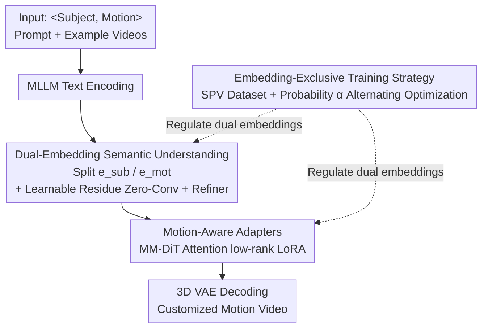

# SynMotion: Semantic-Visual Adaptation for Motion Customized Video Generation

**Conference**: CVPR 2026  
**Paper**: [CVF Open Access](https://openaccess.thecvf.com/content/CVPR2026/html/Tan_SynMotion_Semantic-Visual_Adaptation_for_Motion_Customized_Video_Generation_CVPR_2026_paper.html)  
**Code**: [lucariaacademy.github.io/SynMotion](https://lucariaacademy.github.io/SynMotion/) (Project page, weights to be open-sourced)  
**Area**: Video Generation / Diffusion Models  
**Keywords**: Motion Customization, Video Generation, Semantic Decoupling, Parameter-Efficient Adaptation, Diffusion Models

## TL;DR
SynMotion performs "motion customized video generation" by adapting at both the semantic level (decoupling text embeddings into subject/motion paths with learnable residues) and the visual level (inserting lightweight motion LoRA adapters into MM-DiT). Combined with an alternating optimization strategy for subject and motion embeddings, it enables motions learned from a few example videos to be transferred to arbitrary subjects, such as a "crocodile doing a handstand" or "Marilyn Monroe punching," outperforming SOTA in both T2V and I2V settings.

## Background & Motivation
**Background**: Video generation based on diffusion models has achieved high-quality T2V/I2V, but it fails to learn or generalize rare or specialized motions (e.g., "handstand"). This has led to the task of "motion customized video generation": extracting motions from a few example videos and transferring them to any subject specified by text. Existing approaches fall into two categories: semantic-level (injecting new concept tokens into pretrained T2V, e.g., ADI, ReVersion) and visual-level (optimizing motion latent representations directly in the video feature space, e.g., Motion Inversion, DMT).

**Limitations of Prior Work**: Both categories have significant drawbacks. Semantic-level methods adapt image-based textual inversion to video, but video requires stronger temporal semantic understanding; single-token embeddings fail to capture motion concepts, and the high temporal parameter complexity makes training difficult and frame consistency poor. Visual-level methods excel at replicating actions but often overfit to instance-specific trajectories, even preserving the spatial layout or background of the reference video. This results in poor subject transfer and a lack of diversity—for instance, generating a rabbit from a human example using DMT might result in the rabbit having human-like arms.

**Key Challenge**: There is a tension between motion expressivity, subject generalization, and video diversity. Relying solely on either semantic or visual adaptation fails to balance these—semantic methods provide generalization without precision, while visual methods provide precision without generalization.

**Goal**: To build a unified framework that can accurately replicate motions, transfer them to semantically distant subjects, and maintain visual diversity, supporting both T2V and I2V.

**Key Insight**: The authors argue that motion customization inherently requires joint modeling of semantic understanding and visual adaptation. The semantic layer handles high-level control of "what motion for which subject," while the visual layer renders the dynamic details of the motion.

**Core Idea**: Based on HunyuanVideo, which uses an LLM as the text encoder, the framework decouples text embeddings into subject and motion paths (semantic decoupling) based on prompt roles. Simultaneously, it inserts lightweight motion adapters into the frozen backbone (visual adaptation) and employs an alternating optimization strategy to prevent interference between the two sets of embeddings.

## Method

### Overall Architecture
SynMotion is built on HunyuanVideo (utilizing a decoder-only LLM/MLLM for text encoding, MM-DiT for denoising, and a 3D Causal VAE for video compression). The input consists of a prompt in the form of `<subject, motion>` and several example videos, with the output being a video of the specified subject performing the specified motion. The pipeline features two adaptation paths and a training strategy: the semantic path uses an MLLM to encode prompts, splits them into subject embeddings $e_{sub}$ and motion embeddings $e_{mot}$ based on semantic roles, adds learnable residues via Zero-initialized Convolution (Zero-Conv), and fuses them through an Embedding Refiner. The visual path inserts low-rank motion adapters into the attention layers of the MM-DiT blocks. Training employs an "embedding-exclusive" alternating sampling strategy with a synthetic Subject Prior Video (SPV) dataset to ensure the two paths function correctly.

### Key Designs

**1. Dual-Embedding Semantic Understanding: Decoupled Learning in Embedding Space**

To address the failure of single-token inversion in capturing video motion, the authors perform structured decomposition within the embedding space. Given a `<subject, motion>` prompt, the MLLM generates a text embedding, which is then split into $e_{sub}$ and $e_{mot}$ via prompt-aware decomposition. To make these learnable without damaging the original language understanding, learnable residues $e^l_{mot}$ and $e^l_{sub}$ are injected via Zero-Conv layers $Z$ and fused through an Embedding Refiner $R$. The final result is added back to the original embedding:

$$e = [\,e_{mot}+Z(e^l_{mot}),\; e_{sub}+Z(e^l_{sub})\,], \quad e' = e + Z(R(e))$$

The residues use different initialization strategies: the motion residue $e^l_{mot}$ is initialized with the embedding of the corresponding verb to accelerate convergence. Since the decoder-only MLLM is causal, the authors use the embedding of the full phrase (e.g., "a person claps") rather than the single word "clap." The subject residue $e^l_{sub}$ is randomly initialized to maintain generalization toward arbitrary subjects, preventing it from being biased by existing text semantics.

**2. Motion-Aware Adapters: Capturing Dynamic Details in the Frozen Backbone**

Semantic customization alone is insufficient, as the parameter complexity of temporal modeling in video is high. The authors insert lightweight low-rank adapters $A$ into the $\{Q,K,V\}$ projections of the attention layers in MM-DiT blocks. This modifies the weights via low-rank residues: $\tilde{W}_* = W_* + \Delta W_* = W_* + B_* A_*$, where $A_*\in\mathbb{R}^{r\times d}$, $B_*\in\mathbb{R}^{d\times r}$, and the rank $r\ll d$. The original weights $W_*$ are frozen. This setup enhances motion perception and temporal consistency with minimal learnable parameters.

**3. Embedding-Exclusive Training Strategy: Preventing Interference via SPV and Alternating Optimization**

Simultaneous optimization of both embeddings can lead to semantic contamination. The authors introduce the Subject Prior Video (SPV) dataset, consisting of common animals (cat, zebra, etc.) performing common actions (run, walk, etc.) synthesized by the frozen base model. During training, a sampling probability $\alpha \in [0, 1]$ is defined: with probability $\alpha$, the model samples user-provided example videos and optimizes both embedding paths. With probability $1-\alpha$, it samples SPV videos; since the actions are irrelevant to the target customized motion, the motion embedding is frozen, and only the subject embedding is updated to regularize it toward broad entity generalization. In experiments, $\alpha=0.75$.

## Key Experimental Results

Experiments utilized the self-constructed MotionBench (26 motion categories with 20 real example videos each) and the FlexiACT dataset. The base model was HunyuanVideo, trained for 2000 steps per motion using AdamW with a learning rate of 2e-5 on 8×H20 GPUs. Evaluation used QwenVL for yes/no VQA to calculate motion/subject accuracy, along with VBench metrics, FVD, CLIP-T, and Flow Score.

### Main Results

| Method | Type | Motion Acc↑ | Subject Acc↑ | Dynamics↑ | CLIP-T↑ | FVD(3DRN50)↓ |
|------|------|------|------|------|------|------|
| VMC | Visual | 53.64% | 38.43% | 20.60% | 0.293 | 395.32 |
| DMT | Visual | 51.16% | 34.88% | 12.50% | 0.291 | 390.06 |
| MotionDirector | Visual | 41.67% | 71.93% | 3.51% | 0.299 | 465.60 |
| MotionInversion| Visual | 59.31% | 73.21% | 3.57% | 0.295 | 213.04 |
| Textual Inversion| Semantic | 21.43% | 62.94% | 47.06% | 0.277 | 456.23 |
| DreamBooth | Semantic | 37.56% | 69.76% | 69.77% | 0.278 | 385.82 |
| **Ours** | Joint | **68.60%** | **97.67%** | **88.24%** | **0.322** | **212.05** |

Visual-level baselines (VMC/DMT) show acceptable motion accuracy but extremely low subject accuracy and dynamics (frozen subjects). Semantic-level methods (Textual Inversion/DreamBooth) show high dynamics but poor motion accuracy. SynMotion achieves the best performance across all metrics.

### Ablation Study

Starting from the HunyuanVideo baseline, components were added progressively:

| Configuration | Qualitative Observation | Note |
|------|------|------|
| Baseline | Cartoonish fox, incorrect motion | Base model cannot learn custom motion |
| + $e^l_{mot}$ | Correct motion, but fox has human hands | Motion embedding brings correct action |
| + $e^l_{sub}$ | Subject appearance restored | Subject embedding fixes consistency |
| + $R$ (Refiner) | Smoother semantic fusion | Improved subject-motion interaction |
| + $A$ (Adapter) | Sufficient motion magnitude | Visual adaptation adds detail |

### Key Findings
- The motion residue $e^l_{mot}$ acts as a switch for the action, while the subject residue $e^l_{sub}$ is essential to prevent subject contamination (e.g., foxes with human hands).
- Even with semantic alignment, motion magnitude remains small without the visual-layer Adapter $A$, proving the two levels are complementary.
- Robustness was verified by applying the framework to HunyuanVideo-I2V.

## Highlights & Insights
- **Smart Decoupling**: Splitting embeddings by role and using differential initialization (phrase-based for motion, random for subject) cleanly separates the goals of learning new actions versus preserving general knowledge.
- **Data-Driven Regularization**: The SPV dataset and selective update strategy act as a procedural implementation of decoupling, a strategy applicable to other multi-concept customization tasks.
- **Zero-Conv Integration**: Utilizing zero-initialized convolutions allows learnable embeddings to take over smoothly from the frozen base, preserving pretrained semantics.

## Limitations & Future Work
- The methodology depends on a strong base model like HunyuanVideo (with a decoder-only LLM). Its effectiveness with CLIP/T5-based encoders is unverified.
- MotionBench is relatively small (26 categories), and the evaluation relies heavily on VLM-based VQA scoring, which may introduce bias.
- The $\alpha=0.75$ setting is empirical; its robustness across categories and the impact of using only animal subjects in SPV for non-animal generalization require further study.

## Related Work & Insights
- **vs. Motion Inversion / DMT (Visual)**: These methods overfit to instance trajectories and spatial layouts. SynMotion improves subject accuracy from ~35-73% to 97.67%.
- **vs. Textual Inversion / DreamBooth (Semantic)**: These methods struggle with motion precision (21-38% accuracy). SynMotion reaches 68.60% by adding visual adaptation.
- **vs. ADI / ReVersion**: While similar in token injection, SynMotion specifically addresses temporal consistency and parameter complexity in video via dual-embedding and visual adapters.

## Rating
- Novelty: ⭐⭐⭐⭐ Joint semantic-visual modeling and tailored SPV strategy are well-targeted.
- Experimental Thoroughness: ⭐⭐⭐⭐ Comprehensive results and user studies, though benchmark scale is modest.
- Writing Quality: ⭐⭐⭐⭐ Clear logical chain from motivation to methodology.
- Value: ⭐⭐⭐⭐ Practical framework for T2V/I2V motion customization.

<!-- RELATED:START -->

## Related Papers

- [\[CVPR 2026\] SMRABooth: Subject and Motion Representation Alignment for Customized Video Generation](smrabooth_subject_and_motion_representation_alignment_for_customized_video_gener.md)
- [\[CVPR 2026\] P-Flow: Prompting Visual Effects Generation](p-flow_prompting_visual_effects_generation.md)
- [\[ICML 2026\] MotiMotion: Motion-Controlled Video Generation with Visual Reasoning](../../ICML2026/video_generation/motimotion_motion-controlled_video_generation_with_visual_reasoning.md)
- [\[CVPR 2026\] Less is More: Data-Efficient Adaptation for Controllable Text-to-Video Generation](less_is_more_data-efficient_adaptation_for_controllable_text-to-video_generation.md)
- [\[CVPR 2026\] StoryTailor: A Zero-Shot Pipeline for Action-Rich Multi-Subject Visual Narratives](storytailora_zero-shot_pipeline_for_action-rich_multi-subject_visual_narratives.md)

<!-- RELATED:END -->
