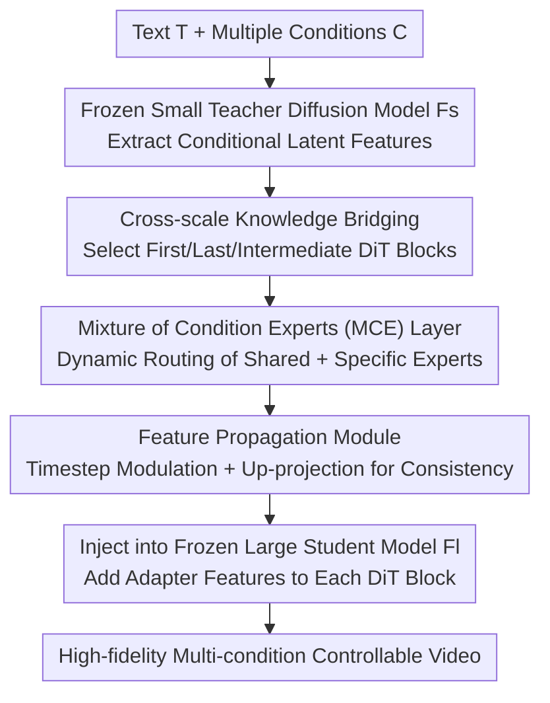

# Tea-Adapter: Teacher Adapter for Efficient Conditional Generation

**Conference**: CVPR 2026  
**Paper**: [CVF Open Access](https://openaccess.thecvf.com/content/CVPR2026/html/Zhang_Tea-Adapter_Teacher_Adapter_for_Efficient_Conditional_Generation_CVPR_2026_paper.html)  
**Code**: To be confirmed  
**Area**: Video Generation / Controllable Generation  
**Keywords**: Video Diffusion, Controllable Generation, Inverse Distillation, Mixture of Condition Experts (MCE), Plug-and-play Adapter

## TL;DR
Tea-Adapter is a plug-and-play adapter that employs "inverse distillation" to transfer control knowledge from a small, efficiently fine-tuned teacher video diffusion model with multi-condition control capabilities into a frozen large student video diffusion model. It utilizes a "Mixture of Condition Experts (MCE)" layer for dynamic routing of multiple conditions within a unified architecture and a "Feature Propagation Module" to ensure cross-frame temporal consistency, achieving high-fidelity, composable multi-condition controllable video generation with low VRAM requirements.

## Background & Motivation
**Background**: Diffusion Transformer (DiT) has advanced high-fidelity video synthesis to new heights. However, pure text fails to provide fine-grained structural control such as object layouts and motion trajectories. Consequently, the community has introduced condition signals like depth maps, Canny edges, and human poses into diffusion frameworks. ControlNet and T2I-Adapter are the mainstream solutions, involving freezing the main generation network and introducing extra trainable branches for condition injection. For multiple conditions, the common practice is adding one ControlNet per condition.

**Limitations of Prior Work**: The authors identify three specific flaws: (1) **High training costs**—fine-tuning a ControlNet for a DiT video model typically requires ~500M parameters and 48+ GPU hours for a single high-quality condition dataset, and SOTA video models exceeding 14B parameters multiply this burden; (2) **Rigid multi-condition fusion**—porting image ControlNet architectures to video fails to handle video-specific controls like camera motion, background, and character features; cascading specialized ControlNets leads to isolated conditions that cannot be dynamically combined; (3) **Poor temporal consistency**—image condition adapters lose temporal and conditional coherence when applied to video, leading to frame flickering and jittering of characters/backgrounds, even when temporal convolutions are added without explicit spatial correspondence and timestep alignment.

**Key Challenge**: There is a sharp conflict between "control capability" and "training/parameter cost + temporal consistency" in controllable video generation—full fine-tuning of large models is too expensive, cascading ControlNets leads to linear parameter expansion and rigid combinations, and lightweight image adapters fail to maintain video temporal consistency.

**Goal**: To equip large T2V models with flexibly composable multi-condition control without fine-tuning the large models or training new ControlNets, while maintaining cross-frame consistency and keeping training feasible on low-resource (single-card) setups.

**Key Insight**: The authors observe two key phenomena: **small and large models within the same architecture family exhibit highly similar features in the latent space**, allowing control knowledge (especially in the latent space) to be efficiently transferred from a fine-tuned small model to a large base; furthermore, **fine-tuning a small model under low-resource conditions enables it to possess richer and more diverse control capabilities than a single-condition ControlNet**.

**Core Idea**: Use **inverse distillation** with "Teacher = Small Model, Student = Large Model"—first, a small video diffusion model is efficiently fine-tuned to gain multi-condition control capabilities as a teacher; then, a Tea-Adapter is trained to "bridge" control signals from the teacher to the frozen large student model. Internally, the adapter uses MCE layers to handle heterogeneous conditions uniformly and a Feature Propagation Module to ensure temporal consistency.

## Method

### Overall Architecture
Given text $T$, diverse visual conditions $C$, a large T2V diffusion model $F_l$, and a conditional small video diffusion model $F_s$, the goal of Tea-Adapter $S$ is to migrate the condition-guided generation capabilities of $F_s$ into $F_l$ **without training new ControlNets**. The final output is $V_{\text{gen}}=F_l(T, S(F_s(C)))$, requiring alignment with both text $T$ and conditions $C$.

The workflow is: conditions are fed into the **frozen small conditional diffusion model** (teacher, already adapted via fine-tuning or LoRA), and its latent features are injected into the Tea-Adapter. Since the number of DiT blocks differs between the small and large models, the authors **select the first, last, and several intermediate blocks** for feature bridging. Inside the adapter, MCE layers dynamically route multiple conditions, and the Feature Propagation Module aligns and injects control features into every DiT block of the large model. Both pre-trained models remain frozen, and **only the Tea-Adapter is trained**, making it significantly more efficient than fine-tuning the large model itself.

### Key Designs

**1. Inverse Distillation + Cross-scale Knowledge Bridging: Inheriting Control from Small Models**

The costliest pain point is that "training ControlNets for large models is too expensive." Tea-Adapter reverses this logic: **low-cost fine-tuning of a small video diffusion model** allows it to learn multi-condition control as a teacher, and then an adapter "distills" this capability into the frozen large student. This is feasible because latent space features of same-family models are highly similar (Fig. 2), making control signals essentially an "efficient transfer of latent features." Specifically, borrowing from ControlNet, condition information is injected via trainable copies of diffusion blocks and zero-initialized linear layers. Since the DiT architectures differ in depth, only the first, last, and a few intermediate blocks are bridged, ensuring only the Tea-Adapter needs training. Empirically, this reduces trainable parameters by ~70% compared to DiT-ControlNet (when excluding MCE layers) while maintaining comparable performance.

**2. Mixture of Condition Experts (MCE) Layer: Dynamic Routing and Zero-shot Expansion**

The second pain point is the "rigid fusion of multiple conditions where each requires a separate ControlNet." The authors observe intrinsic correlations between different condition signals (e.g., Canny edges and depth maps). Thus, the MCE layer is designed to process heterogeneous conditions concurrently in a single forward pass. Given $K$ condition tokens $\{c_1,\dots,c_K\}$, the condition output at timestep $t$ is $h^{mce}_t=\sum_{k=1}^{K} g_k(c_k,t)\cdot \mathcal{E}_{c_k}(x^a_t,t)$, where the gating $g_k(c_k,t)=\mathrm{Softmax}(\mathrm{MLP}_g([c_k;t]))$ assigns weights berdasarkan input conditions. Experts are split into **shared experts** $\mathcal{E}_s$ and **condition-specific experts** $\mathcal{E}_c$, combined as $\mathcal{E}_{c_k}(x^a_t,t)=\mathcal{E}_s(x^a_t,t)+\Delta\mathcal{E}_{c_k}(x^a_t,t)$. Shared experts capture cross-condition commonalities, while $\Delta\mathcal{E}_{c_k}$ learns condition-specific increments. During inference, sparse routing activates only relevant experts, saving computation. New conditions can be added by introducing new experts initialized with existing weights for fast convergence. This design supports single/multiple conditions and zero-shot generalization to unseen conditions via shared knowledge, with fewer parameters than Multi-ControlNet.

**3. Feature Propagation Module: Temporal Alignment and Injection**

The third pain point is that "image-style condition injection fails video temporal consistency." The module includes a learnable modulation factor, a time projection layer, and an up-projection layer. The up-projection maps the small model's condition information into the large model's latent space, while learnable scaling modulation paired with time projection adaptively adjusts the intensity of condition features according to the denoising stage. Given the adapter's latent feature $x^a_t$ at timestep $t$, cross-attention with text embedding $c_{txt}$ is calculated. Then, following $\alpha_{\text{scale}}=\mathrm{Modulation}+\mathrm{Time\_Proj}(t)$ and $x^{a'}_t=\mathrm{Up\_Proj}(x^a_t)\cdot\alpha_{\text{scale}}+\mathrm{Up\_Proj}(h^{mce}_t)$, the adapter output is obtained and injected into the large model's latent space via **additive integration** $x_t=x_t+x^{a'}_t$. This augments the large model's prior without compromising its structural integrity. Aligning scaling with denoising stages and timesteps is key to overcoming the temporal shortcomings of image adapters.

### Loss & Training
Both pre-trained diffusion models are **frozen** throughout. Only the Tea-Adapter is trained. The backbones utilize two sets of open-source T2V models: Wan2.1-1.3B / Wan2.1-14B and CogVideoX-2B / CogVideoX-5B (small as teacher, large as student). 15K videos sampled from Koala-36M with grayscale/low-res degradation are used, with pre-extracted pose, depth, and Canny conditions. Training takes approximately 2 days on 1×H100 80GB. Evaluation uses 100 hand-picked high-quality multi-category videos, with metrics including LPIPS, SSIM, CLIP Score, and FVD.

## Key Experimental Results

### Main Results
Deployed on the 14B T2V base, compared with ControlNet and Adapter-type SOTA across Canny, Depth, and Pose conditions (FVD↓, CLIP↑, LPIPS↓, SSIM↑, plus Temporal Consistency↑).

| Method | Canny FVD↓ | Canny CLIP↑ | Depth FVD↓ | Pose FVD↓ | Temp. Consist.↑ |
|------|------|------|------|------|------|
| X-Adapter | — | 0.545 | — | — | 0.754 |
| Uni-ControlNet | — | 0.642 | — | — | 0.763 |
| UniControl | — | 0.584 | — | — | 0.876 |
| Ctrl-Adapter | 427.06 | 0.757 | 448.29 | 487.43 | 0.981 |
| DiT-ControlNet | 425.25 | 0.781 | 540.57 | 537.12 | 0.978 |
| Wan2.1-14B (Full FT, Upper Bound) | **229.19** | **0.919** | **254.24** | **200.91** | 0.979 |
| **Tea-Adapter (Ours)** | 289.57 | 0.918 | 292.34 | 300.58 | **0.984** |

Key Takeaways: Tea-Adapter comprehensively outperforms X-Adapter and Ctrl-Adapter in the adapter category, matching full fine-tuning in CLIP Score (e.g., Canny 0.918 vs 0.919) and achieving the **highest temporal consistency (0.984)**. It used only ~10K videos for training, whereas baselines often use 100K+ videos and more GPUs. FVD is second only to the "Full Fine-tuning 14B" resource upper bound, but Tea-Adapter avoids training the large model or new ControlNets.

### Ablation Study

| Config | FVD↓ | LPIPS↓ | SSIM↑ | CLIP↑ | Description |
|------|------|------|------|------|------|
| Full Model | **292.34** | **0.251** | **0.591** | **0.913** | Complete model |
| w/o MCE | 303.20 | 0.268 | 0.573 | 0.904 | Removing MCE drops motion coherence |
| w/o Half Adapters | 398.01 | 0.355 | 0.567 | 0.875 | Significant degradation in motion and quality |

### Key Findings
- **MCE layer is critical for multi-condition fusion**: Removing it degrades all metrics (FVD 292→303) and weakens control over individual motions and interactions in multi-character scenes—the gains come from intrinsic relationships learned via joint multi-condition training.
- **Redundancy in adapter count**: Metrics do not significantly degrade when reducing adapters from 12 to 7, suggesting the Feature Propagation and MCE combo can maintain performance with fewer parameters; however, **reducing by half leads to a collapse** (FVD spikes to 398), indicating a lower bound.
- **Cross-scale transfer is valid**: Comparisons within the same architecture verify that "Small Teacher → Large Student" inverse distillation efficiently transfers control capabilities.

## Highlights & Insights
- **"Inverse Distillation" flips the conventional direction**: Using low-cost fine-tuned small models as teachers to distill control into frozen large models bypasses the high cost of training ControlNets for 14B models. The underlying observation of latent similarity between same-family models is highly valuable for transfer learning.
- **MCE uses "Shared Experts + Condition-specific Increments"** ($\mathcal{E}_s+\Delta\mathcal{E}_{c_k}$) to unify multiple conditions. New conditions only require adding experts, which can be initialized from old ones, naturally supporting zero-shot expansion. This applies the MoE concept at the "condition" granularity.
- **Feature propagation with adaptive denoising timestep modulation** explicitly addresses the temporal weakness of image-based adapters for video, with temporal consistency even surpassing full fine-tuning (0.984 vs 0.979).

## Limitations & Future Work
- **Dependency on a multi-condition teacher**: The teacher must be pre-trained via fine-tuning/LoRA. If the small model's control capability is weak, it limits the ceiling of inverse distillation.
- **FVD still lags behind full fine-tuning**: There is a visible gap in visual fidelity (FVD) compared to "Full Fine-tuning 14B" (e.g., Canny 289.6 vs 229.2). This is a trade-off for efficiency and bypassing large model training.
- **Small-scale evaluation**: Quantitative results rely on 100 hand-picked videos; category coverage and scale are limited. The collapse when halving adapters also indicates a lower bound on compression (⚠️ specific bridging block selection and expert counts should refer to the original paper and supplements).

## Related Work & Insights
- **vs Multi-ControlNet**: The latter relies on cascading isolated ControlNets, leading to parameter explosion and rigid combinations; Tea-Adapter uses a single MCE layer for dynamic routing with fewer parameters and zero-shot extensibility.
- **vs Ctrl-Adapter / X-Adapter**: These inject image ControlNet features into video models but fail at cross-frame consistency (e.g., identity flickering in X-Adapter); Tea-Adapter achieves the highest temporal consistency via its propagation module.
- **vs DiT-ControlNet**: While DiT-ControlNet inserts zero-modules to learn conditions without training the backbone, training remains expensive. Tea-Adapter reduces trainable parameters by ~70% (excluding MCE) with comparable performance via inverse distillation.

## Rating
- Novelty: ⭐⭐⭐⭐⭐ The combination of inverse distillation and MCE routing for controllable video generation is novel and self-consistent.
- Experimental Thoroughness: ⭐⭐⭐⭐ Complete three-condition quantitative results, ablations, and cross-scale validation, though evaluation set size is limited to 100 samples.
- Writing Quality: ⭐⭐⭐⭐ Clear motivation on the three challenges and distinct module functions.
- Value: ⭐⭐⭐⭐⭐ Enables 14B-level controllable video generation on single-GPU low-resource setups, balancing efficiency and flexibility.

<!-- RELATED:START -->

## Related Papers

- [\[CVPR 2026\] FrameDiT: Diffusion Transformer with Matrix Attention for Efficient Video Generation](framedit_diffusion_transformer_with_matrix_attention_for_efficient_video_generat.md)
- [\[CVPR 2026\] Less is More: Data-Efficient Adaptation for Controllable Text-to-Video Generation](less_is_more_data-efficient_adaptation_for_controllable_text-to-video_generation.md)
- [\[CVPR 2026\] HVG-3D: Bridging Real and Simulation Domains for 3D-Conditional Hand-Object Interaction Video Synthesis](hvg-3d_bridging_real_and_simulation_domains_for_3d-conditional_hand-object_inter.md)
- [\[CVPR 2026\] Dual-Granularity Memory for Efficient Video Generation](dual-granularity_memory_for_efficient_video_generation.md)
- [\[CVPR 2026\] Content-Aware Dynamic Patchification for Efficient Video Diffusion](content-aware_dynamic_patchification_for_efficient_video_diffusion.md)

<!-- RELATED:END -->
