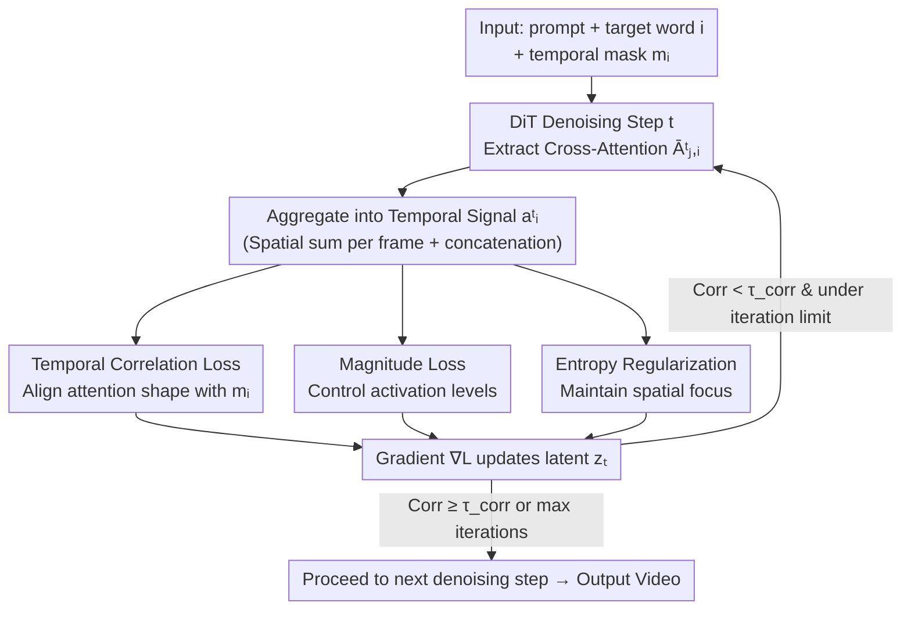

# TempoControl: Temporal Attention Guidance for Text-to-Video Models

**Conference**: CVPR 2026  
**Paper**: [CVF Open Access](https://openaccess.thecvf.com/content/CVPR2026/html/Schiber_TempoControl_Temporal_Attention_Guidance_for_Text-to-Video_Models_CVPR_2026_paper.html)  
**Code**: None (Project page only: https://shiraschiber.github.io/TempoControl/)  
**Area**: Video Generation / Diffusion Models  
**Keywords**: Text-to-Video, Temporal Control, Cross-Attention, Inference-time Optimization, Training-free

## TL;DR
TempoControl performs gradient optimization on cross-attention maps during the denoising process of T2V diffusion models. By using a "Correlation + Magnitude + Entropy" loss to align the temporal attention of specific keywords with user-provided masks, it achieves fine-grained temporal control (e.g., "making an object appear at a specific second") without re-training or annotated data.

## Background & Motivation
**Background**: Text-to-video (T2V) diffusion models like Wan 2.1, CogVideoX, and LTX generate high-quality, spatially consistent videos. Research on controllable generation is active, with various methods for spatial/motion control such as camera trajectories, object masks, layout conditions, and motion transfer.

**Limitations of Prior Work**: However, "**temporal control**" remains largely unexplored. When users want to precisely specify that "a dog appears only in the second half of the video" or "the sky brightens exactly when thunder strikes," existing models struggle. The authors find a counter-intuitive fact: adding explicit temporal prompts ("in the fourth second…") not only fails but actually **degrades image quality**. For instance, Wan 2.1's Imaging Quality drops from 59.99% to 53.76% with temporal prompts, while temporal accuracy remains unchanged. This suggests that **temporal control is not a prompt engineering problem**, as the models do not correctly represent temporal information internally.

**Key Challenge**: A conventional approach for temporal control is fine-tuning with "time-annotated video-text pairs" (e.g., MinT). However, video data is scarce, and labeling exactly when concepts appear is extremely costly and difficult to scale. Synthesizing such precise data, especially for abstract motion concepts, is also challenging. Thus, a contradiction exists between the need for temporal control and the desire to avoid high annotation/training costs.

**Key Insight**: The authors observe that **cross-attention maps in diffusion models already encode strong signals of "which word is realized in which frame."** The attention intensity of a word on a specific frame's latent naturally reflects whether the concept is "present." Since the signal already exists, there is no need for training; one can simply **guide this attention signal into the desired temporal shape during inference**.

**Core Idea**: Aggregate the "frame-wise attention intensity of a specific word" into a temporal vector and use gradient descent in the early denoising steps to align it with a user-provided temporal mask. This is a pure inference-time optimization that does not modify model parameters or require additional data.

## Method

### Overall Architecture
TempoControl is an **inference-time optimizer overlaid on a frozen T2V diffusion model**. It uses Wan 2.1 as the backbone: videos are encoded by a 3D Causal VAE into latents $z\in\mathbb{R}^{T'\times H'\times W'\times C}$, then flattened into $n_v=T'\cdot H'\cdot W'$ video tokens. Prompts are processed by a text encoder, and a DiT denoises the latent space step-by-step.

The control signal is a **binary temporal mask** $m_i=[m_{i,1},\dots,m_{i,T'}]$, where $m_{i,j}\in\{0,1\}$ indicates whether word $p_i$ should appear at frame $j$. The mask can also take continuous values to represent intensity (e.g., for audio alignment).

The process is a feedback loop: in the **first $k$ denoising steps**, cross-attention is extracted. The attention for target word $i$ is **summed spatially and concatenated across frames** into a temporal vector $a^t_i$. Three losses measure the discrepancy between $a^t_i$ and mask $m_i$, and the gradient $\nabla_{z_t}\mathcal{L}_t$ is backpropagated to update the current latent $z_t$ (using AdamW with up to $l$ iterations: $z'_t = z_t - \alpha\nabla_{z_t}\mathcal{L}_t$). This continues until alignment is sufficient or the iteration limit is reached, followed by the next denoising step. Model weights remain unchanged.

### Key Designs

**1. Temporal Correlation Loss: Shaping Attention over Time**

This is the primary loss for aligning the timing of concepts. Scalar attention for word $i$ at frame $j$ is defined as $\hat{A}^t_{j,i}=\langle\bar{A}^t_{j,i}\rangle_{x,y}$ (summed over space). Frame values are concatenated into $a^t_i=[\hat{A}^t_{1,i},\dots, \hat{A}^t_{T',i}]$ (ignoring the first frame due to instability). **Pearson Correlation** measures the consistency between $a^t_i$ and $m_i$:

$$\mathcal{L}^t_{corr} = -\frac{\mathrm{Cov}(m_i, \tilde{a}^t_i)}{\sigma_{m_i}\sigma_{\tilde{a}^t_i}}$$

where $\tilde{a}^t_i$ is a min–max normalized version of $a^t_i$. Minimizing the negative correlation encourages the attention waveform to match the mask. While effective for most cases, Pearson is **scale-invariant**, meaning it might yield a high score even if attention values are too low for the object to be visible. This necessitates the magnitude term. (Note: If mask variance is 0, such as for constant presence, the correlation term is omitted.)

**2. Magnitude Loss: Restoring Scale Sensitivity**

To address the blindness of correlation to absolute values, the magnitude term regulates the **absolute intensity** of attention. It consists of two parts: encouraging higher attention at mask activations ($m_{i,j}>\tau$) via $\mathcal{L}^t_\oplus=\frac{1}{T'}\sum_j \mathbb{1}\{m_{i,j}>\tau\}\cdot a^t_{i,j}$, and suppressing it elsewhere via $\mathcal{L}^t_\ominus=\frac{1}{T'}\sum_j \mathbb{1}\{m_{i,j}\le\tau\}\cdot a^t_{i,j}$. The total loss is $\mathcal{L}^t_{mag}=\mathcal{L}^t_\ominus-\mathcal{L}^t_\oplus$. This term is crucial for "lighting up" initially invisible words or "extinguishing" unwanted ones.

**3. Attention Entropy Regularization: Preserving Spatial Semantics**

Optimizing only for temporal alignment can scatter attention spatially, damaging object semantics (e.g., a phone might look like a distorted tablet). Entropy regularization constrains the **Shannon entropy of the spatial attention map** on frames where the word should appear:

$$\mathcal{L}^t_{entropy} = \frac{1}{T'}\sum_{j=1}^{T'}\mathbb{1}\{m_{i,j}>\tau\}\cdot H(\bar{A}^t_{j,i})$$

Lowering entropy forces attention to focus into a coherent cluster. Interestingly, this term not only restores spatial consistency but also **improves overall image quality**—the Imaging Quality for the entropy-only ablation (59.52%) exceeds the text baseline. The total loss is $\mathcal{L}^t=\mathcal{L}^t_{corr}+\lambda_1\mathcal{L}^t_{mag}+\lambda_2\mathcal{L}^t_{entropy}$, with $\lambda_1=0.3, \lambda_2=10$.

**4. Correlation-based Early Stopping: Adaptive Compute Allocation**

In cases where the generated video naturally fits the target timing, there is no need to exhaust all $l$ iterations. The authors use $\mathcal{L}^t_{corr}$ as an early stopping signal. Within each denoising step, optimization halts as soon as the correlation exceeds threshold $\tau_{corr}$. This makes the inference time adaptive to the complexity of the task.

### Loss & Training
No model training is required. Optimization is applied only to the latents during the **first 5 denoising steps**. Each step allows a maximum of 10 gradient iterations with a learning rate of $5\times10^{-4}$ ($1\times10^{-3}$ for dual-object setups) using the AdamW optimizer. This is a zero-data, zero-fine-tuning pipeline.

## Key Experimental Results

### Main Results
The authors established a temporal control benchmark (80 YOLOv10 classes for single-object, 82 pairs for dual-object, 100 motion classes) and proposed the **Temporal Accuracy** metric. Baselines consist of the same backbone model provided with explicit temporal prompts. Comparison on Wan2.1-S (1.3B):

| Setting | Method | Temporal Acc ↑ | Absence ↑ | Presence ↑ | Img Quality ↑ |
|------|------|----------------|-----------|------------|---------------|
| Single Object | Wan2.1-S baseline | 63.94 | 67.38 | 60.50 | 53.76 |
| Single Object | **Ours (Wan2.1-S)** | **83.56** | **87.38** | **79.75** | **56.92** |
| Dual Object | Wan2.1-S baseline | 37.50 | 45.85 | 29.15 | 68.56 |
| Dual Object | **Ours (Wan2.1-S)** | **53.17** | **57.32** | **49.02** | **70.82** |
| Motion | Wan2.1-S baseline | 19.00 | – | – | 60.46 |
| Motion | **Ours (Wan2.1-S)** | **54.00** | – | – | **63.24** |

Single-object temporal accuracy improved by +19.62%, dual-object by +15.67%, and motion by +35%, while image quality also improved. Notably, on the motion benchmark, all baselines (including 14B/19B models) achieved only 18-28%, whereas this method reached 54% using only a 1.3B model.

### Ablation Study
Breakdown of the three losses on the single-object benchmark (C=Pearson Correlation, E=Entropy):

| Config | Temporal Acc ↑ | Absence ↑ | Presence ↑ | Img Quality ↑ | Description |
|------|----------------|-----------|------------|---------------|------|
| Text (baseline) | 63.94 | 67.38 | 60.50 | 53.76 | Text prompt only |
| Only C | 81.19 | 91.50 | 70.88 | 50.96 | Strong alignment, but lower quality |
| Only E | 72.94 | 66.88 | 79.00 | 59.52 | Improved presence + quality |
| C + E | 78.38 | 77.38 | 79.38 | 57.60 | Compromise between the two |
| Ours (C+E+Mag) | **82.50** | **83.25** | **81.75** | 56.51 | Full model, best overall |

### Key Findings
- **Correlation is the driver for timing**: Using C alone achieves 81% Temporal Acc, but it can inflate absence scores and degrade image quality, confirming the Pearson scale-invariance gap.
- **Entropy provides universal gains**: Only using entropy regularization resulted in higher Imaging Quality (59.52%) than the text baseline, suggesting that "preventing scattered attention" benefits video quality generally.
- **User Study Support**: In a blind test of 16 video pairs by 50 students, 61.51% chose Ours for temporal accuracy (vs. 16.94% for Wan2.1), and 62.66% favored Ours for visual quality (vs. 25.99%).
- **Zero-shot Audio-Video Alignment**: By feeding normalized audio onset-strength envelopes as masks, the method aligns video motion with audio events (e.g., thunder) without any paired training data.

## Highlights & Insights
- **"Temporal control is not a prompt problem"**: The observation that adding time-related keywords degrades quality without improving timing effectively justifies the need for explicit internal control mechanisms.
- **Reusing existing signals**: Cross-attention maps already encode word-to-frame correspondence. The method simply "bends" this signal, making it zero-data, zero-training, and easy to port to any T2V backbone with cross-attention.
- **Complementary loss design**: Correlation handles shape, magnitude handles scale, and entropy handles spatial focus. Each corresponds to one observed failure mode.
- **Broad utility of Entropy Regularization**: The finding that spatial entropy regularization improves image quality might be applicable to other attention-guided generation tasks.

## Limitations & Future Work
- **Inference time overhead**: Although it avoids re-training, the iterative optimization increases per-video computation.
- **Attribute drift**: Slight changes in properties (e.g., color) may occur as current objectives do not explicitly constrain semantic identity.
- **Proxy metric dependency**: Absence scores are sensitive to detection failures/quality drops, potentially inflating the "Absence" metric. 
- **Complexity of Audio Alignment**: Currently validated on single clear audio events; performance on multi-event audio is unknown.
- **Backbone Scale**: Experiments were primarily conducted on 1.3B models; results on 14B+ models are not fully explored.

## Related Work & Insights
- **vs. MinT**: MinT fine-tunes on time-annotated captions but only supports coarse event ordering and relies on specific annotated data. Ours allows fine-grained timing for individual concepts in a zero-shot, training-free manner.
- **vs. Attend-and-Excite / Prompt-to-Prompt**: These methods perform inference-time attention optimization in T2I to ensure entities are rendered or edited. Ours extends this concept from the spatial/semantic dimension to the **temporal** dimension.
- **vs. MotionClone / DiTFlow**: These methods transfer motion from reference videos or trajectories but cannot specify **when** a concept appears or disappears. Ours uses temporal masks for direct timing control.

## Rating
- Novelty: ⭐⭐⭐⭐⭐ First fine-grained inference-time temporal control for T2V with solid motivation.
- Experimental Thoroughness: ⭐⭐⭐⭐ Multiple backbones and custom benchmarks, though Absence metrics have limitations and large-scale backbone tests are few.
- Writing Quality: ⭐⭐⭐⭐⭐ Very clear derivation of losses mapped to specific failure modes.
- Value: ⭐⭐⭐⭐ Training-free and backbone-agnostic; audio-video alignment shows strong potential.

<!-- RELATED:START -->

<!-- RELATED:END -->

## Related Papers

- [\[CVPR 2026\] TEAR: Temporal-aware Automated Red-teaming for Text-to-Video Models](tear_temporal-aware_automated_red-teaming_for_text-to-video_models.md)
- [\[CVPR 2026\] Improving Motion in Image-to-Video Models via Adaptive Low-Pass Guidance](improving_motion_in_image-to-video_models_via_adaptive_low-pass_guidance.md)
- [\[CVPR 2026\] When Numbers Speak: Aligning Textual Numerals and Visual Instances in Text-to-Video Diffusion Models](when_numbers_speak_aligning_textual_numerals_and_visual_instances_in_text-to-vid.md)
- [\[ICCV 2025\] EfficientMT: Efficient Temporal Adaptation for Motion Transfer in Text-to-Video Diffusion Models](../../ICCV2025/video_generation/efficientmt_efficient_temporal_adaptation_for_motion_transfer_in_text-to-video_d.md)
- [\[CVPR 2026\] Efficient Long-Context Modeling in Diffusion Language Models via Block Approximate Sparse Attention](efficient_long-context_modeling_in_diffusion_language_models_via_block_approxima.md)

<!-- RELATED:END -->
