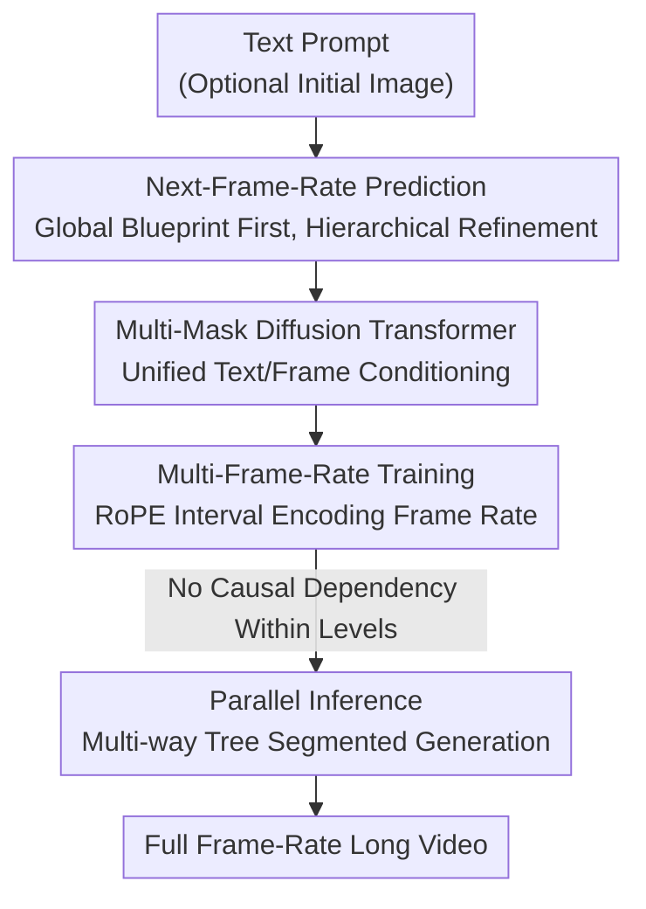

# TempoMaster: Efficient Long Video Generation via Next-Frame-Rate Prediction

**Conference**: CVPR 2026  
**Paper**: [CVF Open Access](https://openaccess.thecvf.com/content/CVPR2026/html/Ma_TempoMaster_Efficient_Long_Video_Generation_via_Next_Frame_Rate_Prediction_CVPR_2026_paper.html)  
**Code**: None  
**Area**: Video Generation / Diffusion Models  
**Keywords**: Long Video Generation, Next-Frame-Rate Prediction, Diffusion Transformer, Parallel Inference, Multi-Mask Conditioning

## TL;DR
TempoMaster reformulates long video generation as "next-frame-rate prediction"—generating a low-frame-rate global blueprint first via bidirectional attention, followed by hierarchical frame rate enhancement for details. Since segments within each level can be generated in parallel, it achieves both long-range temporal consistency and inference efficiency, reaching SOTA on Vbench-Long and human evaluations.

## Background & Motivation
**Background**: Long video generation currently follows two main paradigms. One treats the entire video as a spatio-temporal volume using bidirectional attention (e.g., DiT-based), which models long-range consistency well. The other is autoregressive (next-frame prediction), which naturally supports arbitrary extension.

**Limitations of Prior Work**: Bidirectional methods incur a **quadratic growth** in computation/memory relative to sequence length, making long video generation prohibitively expensive. Autoregressive methods must maintain increasing history; to avoid memory overflow, they truncate or compress past frames, causing the model to "forget" early content. Minor prediction errors **accumulate step-by-step**, leading to appearance drift and motion incoherence. Recent anchor-frame methods (e.g., NUWA-XL) generate sparse keyframes before interpolation, but they require separate reference generators and specialized planning, complicating training and inference.

**Key Challenge**: There is a trade-off between long-range temporal consistency and inference efficiency—bidirectional methods are consistent but expensive, while autoregressive methods are cheap but prone to drift and forgetting.

**Key Insight**: The authors observe substantial **redundancy** in the temporal dimension. A coherent dynamic structure can be determined by sparse keyframes, and intermediate frames can be efficiently "filled" based on learned temporal dynamics. Consequently, the generation of high-level temporal semantics is **decoupled** from low-level visual details.

**Core Idea**: Long video generation is shifted from "next-frame prediction" to "**next-frame-rate prediction**." A low-frame-rate global blueprint is generated first to establish overall dynamics, followed by hierarchical frame rate increases to refine local details. Segments within the same level can be generated in parallel because their content is constrained by the parent level, removing causal dependencies.

## Method

### Overall Architecture
TempoMaster takes a text prompt (optionally with an initial image) and outputs a long video. Instead of autoregressive left-to-right generation, it uses a **coarse-to-fine, hierarchical frame-rate** approach. A video is downsampled temporally by step $m=2^i$ into $K$ sequences $V^0, V^1, \dots, V^{K-1}$ with different frame rates ($V^{K-1}$ is the sparsest, $V^0$ is full frame rate). Generation starts with the lowest frame rate $V^{K-1}$ to fix global dynamics, then uses generated frames as "anchors" to refine intermediate motion level-by-level until full frame rate is achieved.

The likelihood of the entire video is decomposed as:

$$p(V) = p(V^{K-1}) \prod_{i=0}^{K-2} p(V^i \mid V^{i+1}, V^{i+2}, \dots, V^{K-2})$$

Each frame-rate level is conditioned on **all sparser levels**. Since the low-frame-rate levels fix the global content, each refinement level can segment the frames to be generated into multiple short chunks for **parallel** processing, allowing for increasing frame counts without sacrificing quality. All levels share a single DiT, switching tasks via a unified "multi-mask" conditioning interface and frame-rate-aware positional embeddings.

### Key Designs

**1. Next-Frame-Rate Prediction: Replacing "Step-by-Step Extrapolation" with "Coarse-to-Fine Refinement"**

This is the central paradigm shift addressing error accumulation and forgetting in autoregressive next-frame prediction. Traditional autoregression decomposes likelihood as $p(V)=\prod_t p(x_t \mid x_0,\dots,x_{t-1})$, where every step relies on previous outputs, allowing errors to propagate. TempoMaster replaces this with a hierarchical decomposition: $V^{K-1}$ is generated first (one-shot, establishing global structure via bidirectional attention), and then each denser level interpolates intermediate frames conditioned on all sparser levels. Because global dynamics are fixed in the first step, subsequent levels refine details onto a "known skeleton" rather than "guessing on an uncertain history." Temporal redundancy is used to **offset** error accumulation—the global constraints of sparser levels act as anchors to prevent drift. Unlike anchor methods like NUWA-XL, it does not rely on fixed-scale keyframes or separate generators; it captures **dense global dynamics** within a single hierarchical architecture.

**2. Multi-Mask Diffusion Transformer (Multi-Mask DiT): A Unified Interface for T2V/I2V/Extension**

This paradigm requires the model to handle "text (+ image)" conditions for initial layers and "multi-frame (video)" conditions for refinement. Unlike standard adapters or in-context methods that require specialized training, **Multi-Mask** places any number of condition frames at their true temporal positions in a sequence **zero-padded** to the target length. These are encoded as latents and concatenated along the **channel dimension** with the noisy latent, ensuring latent-level temporal alignment. A **per-frame mask** is also concatenated to provide precise timestep information, mitigating temporal ambiguity from VAE compression. This approach introduces no extra parameters or context length while unifying T2V, I2V, FLF2V (first/last frame to video), and video continuation as special cases of Multi-Mask conditioning.

**3. Multi-Frame-Rate Training + Randomized Temporal Position Indexing**

To make a single DiT switch between frame rates, the model must understand the "current frame rate." Frame rate control is treated as the **manipulation of inter-frame intervals**, injected via modified RoPE. For frame-rate level $V^i$, the temporal position indexing interval between adjacent frames is set to $2^i$, aligning the index sequence with the real-time axis. The position index for the $j$-th frame is:

$$t_j = t_{\text{start}} + j \cdot 2^i, \quad t_{\text{start}} \sim \mathcal{U}[0, T_{max}]$$

By randomly sampling $t_{\text{start}}$ and taking position encodings from a **continuous wide range**, the model is prevented from overfitting to fixed temporal indices. This forces it to learn a **continuous** position function, granting strong temporal extrapolation capabilities (this consistently improves performance in abridgements). Training occurs in two stages: the first learns the full denoising trajectory under Multi-Mask conditions (121 frames @ 24fps) with 0%–15% random condition frames; the second learns next-frame-rate prediction on 6/12/24 fps data. Both stages use flow matching loss $\mathcal{L}_{\text{FM}}(\theta)=\mathbb{E}_{t,p_t(\mathbf{z}_0)}\big[\lVert \mathbf{v}_\theta(\mathbf{z}_t,t)-(\mathbf{z}_1-\mathbf{z}_0)\rVert_2^2\big]$, where $\mathbf{z}_t=(1-t)\mathbf{z}_0+t\mathbf{z}_1$.

**4. Parallel Inference: Organizing Hierarchical Generation as a Multi-Way Tree**

Hierarchical generation enables acceleration. Inference is modeled as a multi-way tree where each node corresponds to a time interval and its frames. Since content in an interval is pre-determined by its **parent node**, child nodes at the same level have **no causal dependencies** and can generate segments in parallel. For $N$ frames with $W$ children per parent ($W$-way tree), level $i$ operates on segments of $\frac{N}{2^{K-i}\cdot W^i}$ frames. The total complexity follows a geometric series:

$$\frac{N^2}{4^K}\cdot \sum_{i=0}^{K-1}\Big(\frac{4}{W}\Big)^i$$

As long as $W\ge 4$, the series converges to a constant, reducing overall complexity to $O(N^2/4^K)$, an exponential speedup over $O(N^2)$ bidirectional attention. accounting for intra-level parallelism, complexity becomes $\frac{N^2}{4^K}\sum_i (4/W^2)^i$, allowing convergence for $W\ge 2$. Experiments use $W=2$ with 6/12/24 fps levels by default.

### Loss & Training
Two-stage training uses flow matching loss. Stage one (single frame rate): 15,000 steps, LR 5e-4. Stage two (multi-frame rate): 45,000 steps, LR 2e-5. Uses AdamW with 1e-4 weight decay. The base model is Wan2.2 MoE (high-noise expert), trained on ~3M high-quality video clips.

## Key Experimental Results

### Main Results
Vbench Evaluation (500 frames): Ours achieves the highest total score compared to SOTA models of similar or larger scale. Autoregressive methods (MAGI, SkyReels-V2) show significant performance drops on long videos compared to short ones due to error accumulation.

| Model | #Params | Total ↑ | Subject Consistency | Background Consistency | Motion Smoothness | Dynamic Degree | Imaging Quality | Aesthetic Quality |
|------|---------|--------|-----------|-----------|---------|---------|---------|---------|
| MAGI-1 | 24B | 78.50 | 98.26 | 97.29 | 99.41 | 21.38 | 66.36 | 55.91 |
| FramePack | 13B | 79.52 | 98.68 | 99.20 | 99.54 | 16.82 | 70.90 | 61.34 |
| SkyReels-V2 | 14B | 79.17 | 96.04 | 96.01 | 99.07 | 53.28 | 64.85 | 56.28 |
| MMPL | 14B | 78.80 | 96.25 | 95.36 | 98.82 | 49.26 | 66.48 | 55.80 |
| **Ours** | 14B | **80.30** | 97.41 | 97.87 | 98.94 | 41.10 | 70.20 | 59.62 |

Human Evaluation (500 frames, 1–5 scale): Since Vbench bias favors low-motion videos for consistency, human evaluation is the primary perceptual baseline. Ours leads in total score, specifically in semantic alignment, motion quality, and content consistency.

| Model | Total ↑ | Aesthetic | Semantic Alignment | Motion Quality | Content Consistency |
|------|--------|------|---------|---------|-----------|
| FramePack | 3.39 | 3.73 | 3.28 | 2.88 | 3.67 |
| LongCat | 3.58 | 3.72 | 3.83 | 3.43 | 3.34 |
| SkyReels-V2 | 3.11 | 3.24 | 3.53 | 3.02 | 2.64 |
| MMPL | 2.93 | 3.19 | 3.43 | 2.65 | 2.44 |
| **Ours** | **3.69** | 3.71 | **3.92** | **3.45** | **3.68** |

### Ablation Study
Parallel Configuration (121 frames): The three-level parallel configuration `f(6,12,24)m(1,2,4)` strikes the best balance between quality and PFLOPs, reaching the highest total score while being significantly more efficient than two-level settings.

| Config | PFLOPs | Total ↑ | Note |
|------|--------|--------|------|
| f(6,24)m(1,4) | 74.05 | 80.55 | 2 levels, skips 12fps |
| f(6,24)m(1,8) | 66.91 | 80.46 | 2 levels, higher parallelism |
| **f(6,12,24)m(1,2,4)** | 108.89 | **80.76** | Default 3-level config |
| f(6,12,24)m(1,4,8) | 96.99 | 80.26 | 3 levels, higher parallelism |
| f(6,12,24)m(1,8,8) | 95.13 | 80.30 | 3 levels, highest parallelism |

Randomized Temporal Indexing: Adding randomization consistently improves Vbench metrics compared to fixed indexing under the same training budget.

| Config | Total ↑ | Dynamic Degree | Aesthetic |
|------|---------|---------|------|
| w/o random | 80.00 | 37.70 | 59.62 |
| w/ random | 80.19 | 39.09 | 59.74 |

### Key Findings
- **Quality Preservation in Parallelism**: Performance is robust across different parallel configurations, indicating that segmenting generation hardly degrades quality—a valuable engineering advantage over autoregression.
- **Metric vs. Perception Discrepancy**: Vbench consistency/smoothness metrics favor static videos (FramePack has high consistency but lowest dynamic degree). Human evaluation highlights Ours' superiority in maintaining consistency while preserving motion.
- **Long-range Stability**: Using the Multi-Mask continuation strategy (5s context, generating 480 frames per step), the model maintains temporal coherence for over 1500 frames (minute-long) without significant degradation.

## Highlights & Insights
- **Shifting Dimensions to "Next-Frame-Rate"**: Moving autoregression from the "time axis" to the "frame rate/temporal resolution axis" is a clever paradigm shift. It combines global consistency (bidirectional) with extensibility (autoregressive) and suppresses error accumulation via global constraints.
- **Causal Independence ⇒ Natural Parallelism**: The observation that content is pre-determined by parent nodes reduces $O(N^2)$ to $O(N^2/4^K)$. Parallelism is a native property of the coarse-to-fine paradigm, not an afterthought.
- **Multi-Mask as a Unified Interface**: Zero-padding, channel concatenation, and per-frame masks allow a single model to handle T2V/I2V/FLF2V/Extension. This technique for expressing arbitrary temporal conditions is highly reusable for other controllable generation tasks.

## Limitations & Future Work
- Training relies on ~3M private video clips and the Wan2.2 MoE base, posing a high barrier for reproducibility.
- If the global blueprint at the lowest frame rate involves semantic errors, refinement layers cannot correct them—global errors may be amplified.
- Vbench and human evaluation yield conflicting conclusions on some dimensions, suggesting that current automatic metrics are insufficient for evaluating "consistently dynamic" long videos.
- Parameters like $K$, $W$, and denoising steps are manual trade-offs; the paper lacks an automated strategy to optimize these for varying lengths.

## Related Work & Insights
- **vs. Bidirectional DiT (Wan, CogVideoX)**: These use bidirectional attention across the whole sequence. While consistent, $O(N^2)$ complexity is hard to scale. TempoMaster uses full BID only at the sparsest level, then parallels short segments, achieving exponential complexity reduction.
- **vs. Autoregressive Methods (MAGI, SkyReels-V2, FramePack)**: These extrapolate segments by truncating/compressing history, leading to drift in long videos. TempoMaster uses low-frame-rate blueprints to constrain all refinements, preventing the metric drop observed in autoregressive approaches.
- **vs. Anchor-frame Methods (NUWA-XL)**: NUWA-XL uses fixed-scale keyframes and separate generators. TempoMaster establishes dense global dynamics within a unified hierarchical architecture with a single model.

## Rating
- Novelty: ⭐⭐⭐⭐⭐ "Next-frame-rate prediction" is a fundamental rethinking of long video paradigms with triple gains in consistency, efficiency, and parallelism.
- Experimental Thoroughness: ⭐⭐⭐⭐ Extensive Vbench/Human evaluations and 1500nd-frame stress tests, though data is private and failure modes of the global blueprint aren't deeply analyzed.
- Writing Quality: ⭐⭐⭐⭐⭐ Clear motivation with effective use of formulas and diagrams (hierarchical levels/multi-way tree).
- Value: ⭐⭐⭐⭐⭐ The paradigm is simple yet effective, and the parallelization benefit is highly attractive for real-world long video systems.

<!-- RELATED:START -->

## Related Papers

- [\[ICML 2026\] Enhancing Train-Free Infinite-Frame Generation for Consistent Long Videos](../../ICML2026/video_generation/enhancing_train-free_infinite-frame_generation_for_consistent_long_videos.md)
- [\[CVPR 2026\] A Frame is Worth One Token: Efficient Generative World Modeling with Delta Tokens](a_frame_is_worth_one_token_efficient_generative_world_modeling_with_delta_tokens.md)
- [\[CVPR 2026\] Free-Lunch Long Video Generation via Layer-Adaptive O.O.D Correction](free-lunch_long_video_generation_via_layer-adaptive_ood_correction.md)
- [\[CVPR 2026\] Video-as-Answer: Predict and Generate Next Video Event with Joint-GRPO](video-as-answer_predict_and_generate_next_video_event_with_joint-grpo.md)
- [\[CVPR 2026\] Endless World: Real-Time 3D-Aware Long Video Generation](endless_world_real-time_3d-aware_long_video_generation.md)

<!-- RELATED:END -->
