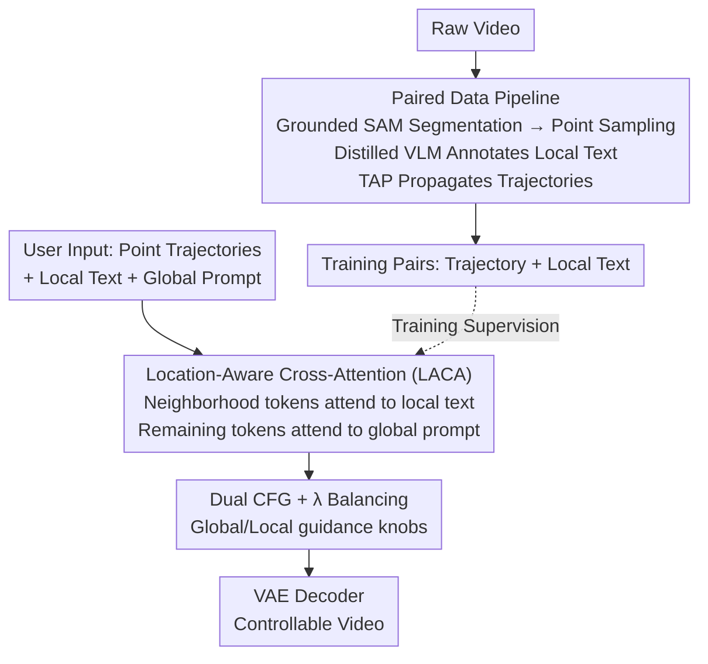

# TGT: Text-Grounded Trajectories for Locally Controlled Video Generation

**Conference**: CVPR 2026  
**Paper**: [CVF Open Access](https://openaccess.thecvf.com/content/CVPR2026/html/Zhang_TGT_Text-Grounded_Trajectories_for_Locally_Controlled_Video_Generation_CVPR_2026_paper.html)  
**Code**: None  
**Area**: Video Generation  
**Keywords**: Controllable Video Generation, Trajectory Control, Local Text, Cross-Attention, Text-to-Video

## TL;DR
TGT associates each point trajectory in text-to-video generation with a segment of local text. It utilizes a plug-and-play "Location-Aware Cross-Attention (LACA)" to align "which object, appearance, and motion" to the trajectory neighborhood. Combined with a Dual CFG strategy for global/local guidance control, it reduces trajectory error (EPE) by nearly half compared to the strongest baseline while maintaining the visual quality of the foundation model.

## Background & Motivation

**Background**: The visual quality and text alignment of Text-to-Video (T2V) models have improved significantly. However, pure text prompts remain a "blunt instrument"—it is difficult to precisely specify "which object appears where, at what speed, and along what path." To introduce fine-grained control, two paths exist: **Structured Control** (bounding box / blob / edge maps), which provides precise geometric alignment but uses rigid signals and requires dense frame-by-frame labeling, making it nearly impossible for manual editing of long sequences; and **Point Trajectory Control**, where users provide sparse 2D points evolving over time, which is lightweight and intuitive.

**Limitations of Prior Work**: Point trajectories work well in **Image-to-Video (I2V)** because the source image fixes the identity and appearance of objects. However, they struggle in **T2V** because the "entity" corresponding to each trajectory is not predetermined, forcing the model to guess from the global caption. In multi-object scenes, this leads to **grounding ambiguity, identity swap, and motion drift**: a trajectory intended for a "cat" might be followed by a "dog."

**Key Challenge**: As the number of controllable objects increases, there is a **lack of explicit correspondence between a single trajectory and a single visual entity**. Structured methods maintain correspondence through heavy supervision but are expensive; point trajectory methods are lightweight but "under-determined" in T2V.

**Goal**: To retain the "lightweight and draggable" advantages of point trajectories while fixing the entity identity and appearance for each trajectory, achieving **decoupled control** of motion and appearance without damaging the visual quality and temporal consistency of pre-trained large models.

**Key Insight**: Since trajectory "entity ownership" is lost in T2V, **Ours directly pair each trajectory with a segment of local text description** ("Red: a cat"), re-grounding semantics to the trajectory. Since this "trajectory + local text" paired supervision did not previously exist, a custom data generation pipeline is required.

**Core Idea**: Utilize "Text-Grounded Trajectories"—associating each point trajectory with local text. Through Location-Aware Cross-Attention, visual tokens in the trajectory neighborhood focus only on their local text while other tokens attend to the global prompt, using Dual CFG to regulate the strength of both guidance paths.

## Method

### Overall Architecture

TGT is built upon a pre-trained DiT text-to-video backbone (Wan2.1 14B). The architecture consists of three components: an **offline data pipeline** for generating "trajectory ↔ local text" paired supervision from raw videos; a **plug-in LACA branch** that injects local text into visual tokens near trajectories within each DiT block; and a **Dual CFG + $\lambda$ balancing** inference strategy providing separate knobs for global semantics and local control. During training, **only the LACA branch is fine-tuned**, while all other backbone parameters remain frozen, allowing seamless integration into existing large models.

Inputs consist of several point trajectories (each with 2D coordinates and visibility flags) + local text for each trajectory + a global prompt; the output is a video matching the global description with entities moving along their respective trajectories.

### Key Designs

**1. Paired Data Pipeline: Generating "Trajectory ↔ Local Text" Supervision**

The primary obstacle is the **lack of existing data** labeling "what object corresponds to this trajectory." TGT uses a two-step automated pipeline. To determine the entity at a coordinate point: COCO images are used where a small circle is drawn at $(x,y)$, and GPT-4o describes the entity ("a man riding a bike"), creating (Image, Point, Text) triplets. These are used to **distill and fine-tune Qwen2.5VL-3B**, enabling the model to output local descriptions given an image and coordinates without visual markers. This annotator is applied to raw video frames: Grounded SAM segments entity masks, representative points are sampled based on mask size and fed to the fine-tuned Qwen2.5VL-3B for local text. Tracking-Any-Point (TAP) propagates these points across frames into full trajectories with visibility flags. Global captions are generated by Qwen2.5-VL. Finally, **2.4 million** motion-heavy clips are filtered from 5 million samples for the training set.

**2. Location-Aware Cross-Attention (LACA): Localized Token Attention**

Global cross-attention spreads the entire prompt across all visual tokens, blurring spatial ownership. LACA adds an extra cross-attention branch in each DiT block performing masked attention. A trajectory is denoted as $T=\{(p_t,m)\}$, where $p_t=(x_t,y_t,v_t)$ includes coordinates and visibility, and $m$ is the local text. Local text features $F_m=\Phi(m)$ are broadcast to the neighborhood $B_r(x_t,y_t)$ and weighted by a Gaussian kernel: $G_t(i,j)=\exp\!\big(-\frac{(i-x_t)^2+(j-y_t)^2}{2\sigma^2}\big)$, resulting in $F_t(i,j)=G_t(i,j)\,F_m$. The "source selection" rule is:

$$h_{t,ij}=\begin{cases}F_t(i,j), & v_t=1 \text{ and } (i,j)\in B_r(x_t,y_t)\\ F_{glob}, & \text{otherwise}\end{cases}$$

When a point is visible and a token falls within the Gaussian neighborhood, it attends to the **local text**; otherwise, it attends to the **global prompt**. This is followed by a standard attention update $H(z_{t,ij})=\sigma\big(\frac{Q'(z_{t,ij})K'(h_{t,ij})^\top}{\sqrt D}\big)V'(h_{t,ij})$. Gaussian weighting ensures tokens closer to the trajectory center are more influenced by local text, avoiding hard-boundary artifacts.

**3. Dual CFG + λ Balancing: Independent Control Knobs**

Using a single guidance scale for global and local paths forces a trade-off between "overall fidelity" and "precise control." TGT decouples these: global prompts and local text undergo **independent dropout** during training (Global 0.8, Local 0.1). During inference, four predictions (unconditional, global only, local only, both) are combined for guided output:

$$\hat\epsilon=\epsilon_{none}+s_{glob}\big(\epsilon_{both}-\epsilon_{glob}\big)+s_{loc}\big(\epsilon_{both}-\epsilon_{loc}\big)$$

$s_{glob}$ and $s_{loc}$ regulate global semantic adherence and local trajectory control (values 5 and 4 used in experiments). Additionally, as global attention and LACA are independent branches, explicit weighting is added at the hidden state level: $Z_{next}=(1-\lambda)\cdot\text{CrossAttn}+\lambda\cdot\text{LACA}$. These knobs allow a continuous trade-off between visual quality and motion precision.

### Loss & Training
The model uses a **flow-matching velocity prediction** objective, optimizing only LACA while freezing the backbone. Given video latents $X_1$ and Gaussian noise $X_0$, $X_t=tX_1+(1-t)X_0$. The model $v_\theta$ predicts velocity $V_t=X_1-X_0$ with objective $L(\theta)=\mathbb{E}\big[\lVert V_t-v_\theta(X_t,t\mid C)\rVert_2^2\big]$. Training occurs in two stages: coarse tuning with **dense trajectories** (~40/video, no Gaussian constraints), followed by fine-tuning for 200K steps with **sparse trajectories** ($\le 5$, $\sigma=1$, $r=2$). Training used 48 H100 GPUs, AdamW (lr $1\times10^{-5}$), at 832x480 resolution.

## Key Experimental Results

### Main Results
Evaluated on the DAVIS dataset using the first frame + ground truth masks for trajectories/bboxes. Metrics: Global/Local CLIP-T (semantic alignment) and EPE (End-point Error).

| Method | CLIP-T (Global)↑ | CLIP-T (Local)↑ | EPE↓ |
|------|------|------|------|
| Wan2.2 14B (Global Only) | **0.3408** | 0.2308 | 265.03 |
| Wan2.2 (Global + Local Prompt) | 0.3309 | 0.2394 | 180.36 |
| MotionCtrl | 0.3186 | 0.2291 | 74.33 |
| TrailBlazer (bbox) | 0.3145 | 0.2408 | 65.15 |
| Tora | 0.3288 | 0.2423 | 47.41 |
| **Ours (TGT)** | 0.3314 | **0.2531** | **25.11** |

Ours (TGT) reduces EPE from Tora's 47.41 to 25.11 (nearly half), while achieving the highest local CLIP-T. Global CLIP-T remains comparable to the foundation model, significantly improving motion controllability without sacrificing visual quality.

Human Preference GSB (positive = preference for TGT, range [-100, 100]):

| Baseline | Visual Quality | Motion Control | Prompt Control |
|------|------|------|------|
| Wan (Global+Local) | -35.0 | 65.0 | 51.7 |
| MotionCtrl | 96.7 | 61.7 | 68.3 |
| TrailBlazer | 98.3 | 78.3 | 81.7 |
| Tora | 73.3 | 38.3 | 38.3 |

### Ablation Study

LACA Component Ablation (Table 3):

| Configuration | CLIP-T (Global)↑ | CLIP-T (Local)↑ | EPE↓ |
|------|------|------|------|
| Dense Trajectories Only | 0.3307 | 0.2394 | 58.01 |
| + Sparse Trajectory FT | 0.3312 | 0.2447 | 45.28 |
| + Gaussian Mask | 0.3314 | **0.2527** | **25.11** |

CFG Strategy Ablation (Table 4):

| Configuration | CLIP-T (Global)↑ | CLIP-T (Local)↑ | EPE↓ |
|------|------|------|------|
| Global CFG Only | 0.3297 | 0.2480 | 91.38 |
| Local CFG Only | 0.3117 | 0.2493 | 43.29 |
| Combined Condition | 0.3307 | 0.2491 | 53.30 |
| **Dual CFG (Ours)** | **0.3314** | **0.2527** | **25.11** |

### Key Findings
- **Gaussian masking provides the largest contribution**: Moving from sparse FT to Gaussian masking dropped EPE from 45.28 to 25.11, proving smooth neighborhood weighting is critical for motion precision.
- **Dual CFG is the key to balancing quality and control**: Global-only CFG has good quality but high EPE (91.38); local-only CFG drops EPE to 43.29 but hurts global semantics (0.3117). Dual CFG achieves the best of both.
- **Two-stage training is effective**: Coarse dense tuning followed by sparse refinement results in steady improvements across all metrics.
- TGT supports **video-to-video replication** through dense trajectory extraction and **text-driven local editing** (e.g., changing "man" to "werewolf" while preserving motion).

## Highlights & Insights
- **Pairing text with trajectories addresses a T2V core pain point**: Unlike I2V, T2V lacks source images to fix identity. Local text re-grounds entity ownership to trajectories simply and effectively.
- **LACA "source selection" is clever**: Instead of flooding all tokens with local text, it uses visibility and Gaussian neighborhoods to decide which source a token should follow, naturally preventing identity swaps in multi-object scenes.
- **Dual CFG turns trade-offs into knobs**: Decoupling guidance scales can be transferred to any "global + local" controllable generation task.
- **Distillation as a data recipe**: Using a strong VLM (GPT-4o) to generate triplets for distilling a smaller VLM enables large-scale, low-cost "point-level semantic labeling."

## Limitations & Future Work
- The training set relies on 2.4 million **internal samples** and significant compute (48xH100), posing a high barrier for reproduction.
- Data quality is bound by an error chain from off-the-shelf models (SAM / VLM / TAP); noise from segmentation misses or tracking drift affects supervision.
- Control is limited to **2D screen space**; it does not explicitly handle 3D depth or decouple camera vs. object motion. 
- Future work may involve explicit occlusion modeling, 3D or instance mask trajectories, and adaptive Gaussian parameters based on object scale.

## Related Work & Insights
- **vs. Structured Control (TrailBlazer, etc.)**: These provide better geometric alignment but often result in visual artifacts or broken objects (Global CLIP-T ~0.3145). TGT maintains the visual quality of the base model.
- **vs. Point Trajectory Methods (MotionCtrl, Tora)**: These lack entity grounding in T2V, leading to identity swaps (EPE 47–74). TGT's local text reduces EPE to 25.11.
- **vs. Motion Text Expansion (Wan)**: Text expanded motion descriptions still fail to capture precise movement, with EPE remaining as high as 180.36.

## Rating
- Novelty: ⭐⭐⭐⭐⭐ First paradigm to pair local text with trajectories for T2V; consistent three-part solution.
- Experimental Thoroughness: ⭐⭐⭐⭐ Comprehensive results and human evaluation, though largely limited to DAVIS with few trajectories per video.
- Writing Quality: ⭐⭐⭐⭐ Logical progression and clear methodology.
- Value: ⭐⭐⭐⭐⭐ High practical value for controllable generation due to its plug-and-play, decoupled nature.

<!-- RELATED:START -->

## Related Papers

- [\[CVPR 2026\] Yume1.5: A Text-Controlled Interactive World Generation Model](yume15_a_text-controlled_interactive_world_generation_model.md)
- [\[CVPR 2026\] TempoControl: Temporal Attention Guidance for Text-to-Video Models](tempocontrol_temporal_attention_guidance_for_text-to-video_models.md)
- [\[CVPR 2026\] Unified Camera Positional Encoding for Controlled Video Generation](unified_camera_positional_encoding_for_controlled_video_generation.md)
- [\[CVPR 2026\] ID-Crafter: VLM-Grounded Online RL for Compositional Multi-Subject Video Generation](id-crafter_vlm-grounded_online_rl_for_compositional_multi-subject_video_generati.md)
- [\[CVPR 2026\] M4V: Multimodal Mamba for Efficient Text-to-Video Generation](m4v_multimodal_mamba_for_efficient_text-to-video_generation.md)

<!-- RELATED:END -->
