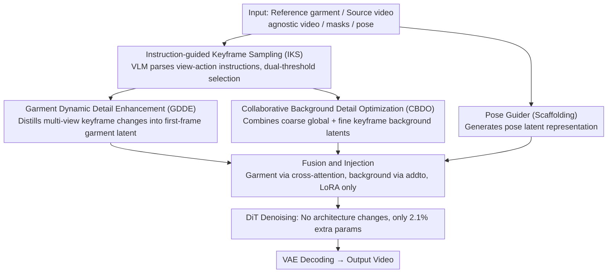

# The Devil is in the Details: Enhancing Video Virtual Try-On via Keyframe-Driven Details Injection

**Conference**: CVPR2026  
**arXiv**: [2512.20340](https://arxiv.org/abs/2512.20340)  
**Code**: [ViT-HD Dataset](https://huggingface.co/datasets/zijiyingcai/ViT-HD)  
**Area**: Video Generation  
**Keywords**: video virtual try-on, diffusion transformer, keyframe injection, garment fidelity, background integrity

## TL;DR

The KeyTailor framework is proposed, which utilizes a keyframe-driven detail injection strategy (garment dynamic enhancement + collaborative background optimization) to significantly improve garment fidelity and background integrity in video virtual try-on without altering the DiT architecture. The study also introduces ViT-HD, a high-definition dataset containing 15K samples.

## Background & Motivation

1.  **Strong demand for Video Virtual Try-On (VVT)**: E-commerce and short-video platforms require high-fidelity garment replacement in videos, demanding cross-frame motion consistency and visual realism.
2.  **Trend of DiT replacing U-Net**: U-Net-based methods lack representational power for complex textures and human motion. Recent research has shifted toward large-scale video DiTs (e.g., Wan2.1-14B) for joint spatio-temporal modeling.
3.  **Insufficient garment dynamic details**: Existing DiT methods introduce extra encoding components to learn garment appearance but fail to capture fine-grained dynamics across frames (back textures, motion-induced wrinkles, lighting changes), leading to over-smoothed results.
4.  **Inconsistent background regions**: Current methods rely solely on garment-agnostic videos for background conditioning, causing detail loss (blurred textures), temporal inconsistency (inter-frame artifacts), and environmental structural shifts.
5.  **High model complexity**: To enhance generation conditions, existing methods insert additional interaction modules inside the DiT, leading to a sharp increase in parameter count and computational overhead (e.g., MagicTryOn introduces 15.11% extra parameters).
6.  **Limited dataset scale and quality**: Public datasets like VVT (791 samples, 192×256) and ViViD (9700 samples, 632×824) suffer from low resolution, monotonous scenes, and insufficient scale, restricting the generalization of DiTs.

## Method

### Overall Architecture

KeyTailor is based on Wan2.1-I2V-14B pre-trained weights. The core idea is **keyframe-driven detail injection**: instead of inserting interaction modules inside the DiT, it leverages multi-view garment dynamics and background details naturally contained in keyframes. Inputs include a reference garment image $I_{ref}$, source video $V_{in}$, agnostic video $V_{agn}$, agnostic masks $M_{agn}$, and poses $P$. The pipeline first uses IKS to select keyframes, then employs GDDE and CBDO to distill garment and background details into latent representations. Finally, these latents are fed back into the DiT via fusion and injection, completing denoising using only LoRA fine-tuning without changing the architecture.

### Key Designs

**1. Instruction-guided Keyframe Sampling (IKS): Selecting frames with multi-view coverage and temporal uniformity**

Dynamic details like back textures or wrinkles are hidden in specific frames. IKS uses a Vision-Language Model (QWen) to parse predefined view-action instructions, extracting target views $\mathcal{V}_{tar}$ and actions $\mathcal{A}_{tar}$, followed by HumanParsing to generate standardized multi-anchor pose frames $F_{anc}$. For each frame, it calculates a motion difference score $S_m(f)$ and a garment area ratio score $S_r(f)$. The total score is $S_f(f) = 1 - S_m(f) + \lambda \cdot S_r(f)$. Selection is performed using dual thresholds (constraining score variance and temporal intervals) to ensure temporal coverage while avoiding redundancy.

**2. Garment Dynamic Detail Enhancement (GDDE): Distilling keyframe changes into the first-frame latent**

Single-image try-on provides only one view, causing fine-grained dynamics in sequences to be over-smoothed. GDDE first applies a pre-trained single-image try-on model with LoRA to fit the garment onto the first agnostic frame, encoded by VAE into garment latent $L_g$. Then, multi-view features $L_{key}^{gar}$ (back textures, wrinkles) are extracted from keyframe garment regions. A lightweight distillation component $\mathcal{D}$ (two 1×1 conv layers + LayerNorm) injects these changes into $L_g$: $\bar{L}_g = \mathcal{D}(\text{Concat}(L_g, \frac{1}{|F_{key}|}\sum L_k))$. Removing $\mathcal{D}$ causes VFID to jump from 7.53 to 22.52, highlighting its importance for fidelity.

**3. Collaborative Background Detail Optimization (CBDO): Dual-branch background restoration**

Relying solely on agnostic videos causes blurred textures and structural drift. CBDO uses two branches: a coarse-grained global branch uses a Mask Guider $\mathcal{E}_{BG}$ (four 3D conv layers, channels 32→96→192→256, zero-initialized linear layers) to encode $V_{agn}$ into global background latent $L_{bg}$. A fine-grained keyframe branch crops keyframe backgrounds using inverse human masks, encoded into $L_{key}^{bg}$, selecting the frame with the most complete background. The two are fused as $\bar{L}_{bg} = \alpha \cdot L_{bg} + (1-\alpha) L_{key}^{max}$, where $\alpha=0.3$.

**4. Fusion and Injection: Cross-attention for garments, addto for background, LoRA only**

The details are fed back into the DiT: pose latent $L_p$ and mask $L_m$ are concatenated and patchified, then fused with $\bar{L}_g$ via a projection layer into $L$, and concatenated with patchified noise $\epsilon$ to form $\bar{L}$. The background $\bar{L}_{bg}$ guides denoising via "addto" injection, while $\bar{L}_g$ replaces text tokens in cross-attention to anchor garment details. LoRA is applied only to self-/cross-attention layers, adding only 2.1% parameters without modifying the DiT architecture.

### Loss & Training

Standard diffusion training loss (denoising objective) is used. LoRA is applied to the self-attention and cross-attention of the DiT backbone. Learning rate is 1e-4, using the AdamW optimizer with 14,500 iterations, batch size = 1, and 81 frames per sample.

## Key Experimental Results

### Video Virtual Try-On — ViT-HD Dataset

| Method | VFID_I^p ↓ | VFID_R^p ↓ | SSIM ↑ | LPIPS ↓ | VFID_I^u ↓ | VFID_R^u ↓ |
| :--- | :--- | :--- | :--- | :--- | :--- | :--- |
| MagicTryOn | 14.06 | 0.246 | 0.862 | 0.083 | 19.23 | 0.559 |
| CatV2TON | 15.87 | 0.290 | 0.855 | 0.098 | 20.02 | 0.576 |
| **Ours** | **7.53** | **0.163** | **0.907** | **0.040** | **13.66** | **0.352** |

### Video Virtual Try-On — VVT Dataset

| Method | VFID_I^p ↓ | SSIM ↑ | LPIPS ↓ |
| :--- | :--- | :--- | :--- |
| MagicTryOn | 1.991 | 0.958 | 0.024 |
| CatV2TON | 1.778 | 0.900 | 0.039 |
| **Ours** | **1.226** | **0.968** | **0.016** |

### Image Virtual Try-On — VITON-HD

| Method | FID_p ↓ | SSIM ↑ | LPIPS ↓ |
| :--- | :--- | :--- | :--- |
| CatVTON | 6.139 | 0.869 | 0.097 |
| MagicTryOn | 8.036 | 0.894 | 0.048 |
| **Ours** | **5.293** | **0.920** | **0.057** |

### Efficiency Comparison

| Method | Trainable Params (B) | FLOPs (G) | Inference Time (s) |
| :--- | :--- | :--- | :--- |
| MagicTryOn | 16.446 | 206,935 | 345.27 |
| **Ours** | **0.206** | **194,607** | **281.65** |

Ours adds only 2.10% parameters relative to the backbone, significantly lower than MagicTryOn's 15.11%.

### Ablation Study

| Variant | VFID_I^p ↓ | SSIM ↑ | LPIPS ↓ |
| :--- | :--- | :--- | :--- |
| w/o GDDE | 19.90 | 0.843 | 0.114 |
| w/o CBDO | 17.21 | 0.852 | 0.098 |
| w/o Distillation $\mathcal{D}$ | 22.52 | 0.766 | 0.211 |
| w/o IKS | 16.26 | 0.804 | 0.102 |
| $F_{key}=1$ | 16.39 | 0.817 | 0.099 |
| **KeyTailor (full)** | **7.53** | **0.907** | **0.040** |

Removing the distillation component $\mathcal{D}$ had the largest impact (VFID 7.53 → 22.52), validating the core role of keyframe garment distillation.

## Highlights & Insights

-   **Zero DiT Architecture Modification**: High-quality video try-on is achieved solely through external detail injection and LoRA fine-tuning, with only 0.2B trainable parameters, making it highly practical for engineering.
-   **Novel Keyframe-Driven Strategy**: IKS combines VLMs to select keyframes based on view/action instructions, balancing multi-view garment dynamics and background consistency.
-   **GDDE + CBDO Dual-Module Design**: Targeted optimization for both garment detail and background integrity, with ablation studies proving both are essential.
-   **Large-Scale HD Dataset ViT-HD**: 15,070 samples at 810×1080 covering various garment types, significantly outperforming existing public datasets.
-   **Comprehensive Evaluation**: Evaluations across 3 video datasets and 2 image datasets, including user studies and extensive ablations.

## Limitations & Future Work

-   Keyframe sampling depends on LLM (e.g., QWen) inference, increasing deployment complexity and latency.
-   Background optimization selects the single most complete keyframe, which may be insufficient for complex dynamic backgrounds (e.g., moving cameras).
-   Inference still requires 281.65s (25 steps, 81 frames), posing a gap for real-time applications.
-   Dataset is sourced from e-commerce platforms with mostly indoor scenes; generalization to in-the-wild scenarios needs verification.
-   The first frame relies on the quality of the single-image try-on model (FiTDiT); errors in the first frame may propagate.

## Related Work & Insights

| Method | Backbone | Extra Param Ratio | Features |
| :--- | :--- | :--- | :--- |
| ViViD | SD1.5 | +157% | Reference branch + temporal attention, high complexity |
| CatV2TON | SD1.5 Modified | - | Removes text attention, concatenates conditions |
| MagicTryOn | Wan2.1 | +15.1% | Internal interaction modules, large parameter count |
| DreamVVT | DiT | - | Fine-tuned on private data, limited gains on ViViD |
| **KeyTailor** | Wan2.1 | **+2.1%** | External injection + LoRA, lightweight and efficient |

## Rating

-   Novelty: ⭐⭐⭐⭐ — The keyframe-driven injection and "no-architecture-change" philosophy are novel; GDDE/CBDO are effective.
-   Experimental Thoroughness: ⭐⭐⭐⭐⭐ — 5 datasets + user studies + 9 ablation groups + efficiency analysis.
-   Writing Quality: ⭐⭐⭐⭐ — Problem definition is clear with rich visuals, though some mathematical notation could be more unified.
-   Value: ⭐⭐⭐⭐ — ViT-HD dataset is highly valuable to the community; the lightweight scheme is industry-friendly.

<!-- RELATED:START -->

## Related Papers

- [\[CVPR 2026\] Vanast: Virtual Try-On with Human Image Animation via Synthetic Triplet Supervision](vanast_virtual_try-on_with_human_image_animation_via_synthetic_triplet_supervisi.md)
- [\[ICML 2026\] iTryOn: Mastering Interactive Video Virtual Try-On with Spatial-Semantic Guidance](../../ICML2026/video_generation/itryon_mastering_interactive_video_virtual_try-on_with_spatial-semantic_guidance.md)
- [\[CVPR 2026\] UnityVideo: Unified Multi-Modal Multi-Task Learning for Enhancing World-Aware Video Generation](unityvideo_unified_multi-modal_multi-task_learning_for_enhancing_world-aware_vid.md)
- [\[CVPR 2026\] InfinityHuman: Towards Long-Term Audio-Driven Human Animation](infinityhuman_towards_long-term_audio-driven_human_animation.md)
- [\[CVPR 2026\] Goal-Driven Reward by Video Diffusion Models for Reinforcement Learning](goal-driven_reward_by_video_diffusion_models_for_reinforcement_learning.md)

<!-- RELATED:END -->
