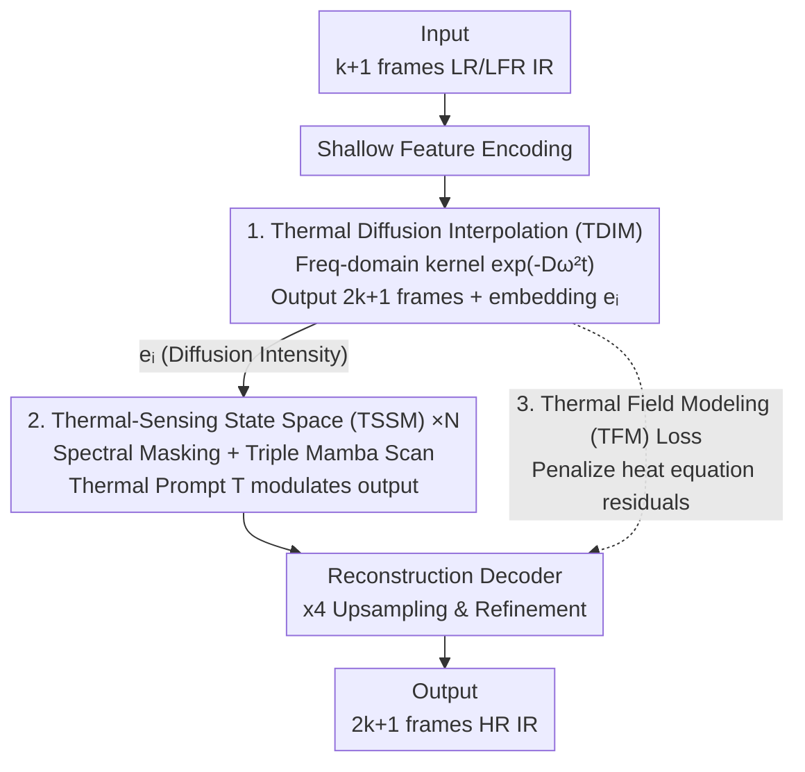

# Thermal Diffusion Matters: Infrared Spatial-Temporal Video Super-Resolution through Heat Conduction Priors

**Conference**: CVPR 2026  
**Paper**: [CVF Open Access](https://openaccess.thecvf.com/content/CVPR2026/html/Zhou_Thermal_Diffusion_Matters_Infrared_Spatial-Temporal_Video_Super-Resolution_through_Heat_Conduction_CVPR_2026_paper.html)  
**Code**: None  
**Area**: Video Super-Resolution / Image Restoration  
**Keywords**: Infrared Video, Spatial-Temporal Super-Resolution, Heat Conduction Prior, State Space Models, Frequency Domain Diffusion

## TL;DR
THERIS treats pixel-wise grayscale sequences of infrared videos as temperature fields satisfying the heat conduction equation. It utilizes frequency-domain thermal diffusion kernels for frame interpolation (TDIM), Mamba modules modulated by "thermal prompts" for spatial-temporal detail recovery (TSSM), and a loss function (TFM Loss) that enforces discrete heat equations to achieve SOTA in infrared spatial-temporal video super-resolution.

## Background & Motivation
**Background**: Infrared (TIR) imaging is limited by sensor physics, generally resulting in Low spatial Resolution (LR) and Low Frame Rate (LFR). Simultaneously restoring spatial details and temporal continuity corresponds to the Spatial-Temporal Video Super-Resolution (STVSR) task—combining Video Super-Resolution (VSR, aggregating neighbor frames) and Video Frame Interpolation (VFI, modeling motion trajectories). Representative works include ZoomingSlowMo, TMNet, and continuous-scale methods like VideoINR, MoTIF, and BF-STVSR.

**Limitations of Prior Work**: Almost all STVSR methods are designed for visible light videos. When directly applied to infrared, performance degrades significantly—experiments show the visible light SOTA, BF-STVSR, is only sub-optimal on infrared data. This occurs because infrared images encode thermal radiation from object surfaces rather than visible textures; networks trained purely on visual patterns generate frames that "look reasonable" but violate underlying thermal physics, leading to jitter and structural breaks in the temporal profile.

**Key Challenge**: Since infrared pixel intensity and surface temperature have a one-to-one mapping (radiation intensity $\leftrightarrow$ gray level), the temporal evolution of grayscale is essentially the evolution of a temperature field governed by the heat conduction equation. Existing methods fail to utilize this physical constraint, treating infrared as ordinary grayscale video, which prevents models from ensuring "thermal changes" between generated frames are physically consistent.

**Goal + Key Insight**: The authors observe that since infrared video evolution naturally follows heat conduction dynamics, the network should not learn a spatial-temporal mapping from scratch but should embed heat conduction priors directly. This is realized through three strategies: frame interpolation following frequency decay laws of thermal diffusion, detail recovery constrained by the same diffusion intensity, and a training objective that explicitly penalizes violations of the heat equation.

**Core Idea**: Treat the feature sequence along the time axis as a 1D thermal field and use the "frequency-domain thermal diffusion kernel $\exp(-D\omega^2 t)$" for frame interpolation throughout the pipeline to ensure physical consistency.

## Method

### Overall Architecture
THERIS is an end-to-end pipeline. The input is $k+1$ frames of LR+LFR infrared video $\{I^L_{2t-1}\}_{t=1}^{k+1}$ (size $H\times W\times C$), and the output is $2k+1$ frames of HR video $\{I^H_t\}_{t=1}^{2k+1}$ (size $4H\times 4W\times C$, i.e., spatial $\times 4$, temporal $\times 2$). Output frames at odd timestamps have corresponding LR inputs, while even timestamps are newly interpolated.

The pipeline consists of four steps: ① Shallow feature encoder extracts features frame-by-frame; ② **TDIM** interpolates $k+1$ input timestamps in the frequency domain using a thermal diffusion kernel into $2k+1$ time-aligned feature maps, while generating a learnable temporal embedding $e_i$ for each output timestamp; ③ A series of **TSSM** modules perform frequency-domain enhancement and selective state-space scanning on TDIM features, modulated by $e_i$ (carrying diffusion intensity info) to recover high-frequency textures while maintaining global temporal consistency; ④ Reconstruction decoder performs upsampling and refinement. During training, **TFM Loss** integrates heat equation constraints into the supervision signals. Crucially, the "diffusion intensity/time embedding" learned by TDIM is passed to TSSM, tightly coupling interpolation and detail recovery via shared physical priors.

### Key Designs

**1. TDIM Thermal Diffusion Interpolation Module: Treating frame sequences as 1D thermal fields using frequency-domain kernel decay**

Designed to address temporally inconsistent intermediate frames in existing interpolation methods. The 1D heat conduction equation $\frac{\partial u(x,t)}{\partial t}=D\frac{\partial^2 u(x,t)}{\partial x^2}$ decoupled in the spatial Fourier domain yields $\tilde u(\omega,t)=\tilde f(\omega)\exp(-D\omega^2 t)$—where high-frequency components decay exponentially faster over time. The authors treat $k+1$ video feature frames as samples along a "spatial axis" $x=0,\dots,k$ (setting $X=k+1$), making interpolation equivalent to solving the heat equation along this axis.

Specifically, Discrete Cosine Transform (DCT) is applied along the temporal axis of input features. For each target interpolation timestamp $\tau_i$, a lightweight network $\Theta$ generates a learnable time embedding $e_i$, which an MLP maps to decay coefficients $\kappa(n;e_i)$ (Softplus ensures $\geq 0$). This constructs the discrete thermal diffusion kernel:

$$W(n,e_i)=\exp\!\big(-\kappa(n;e_i)\,\omega_n^2\,\Delta t\big),\quad \omega_n=\frac{n\pi}{k+1}.$$

Spectrum coefficients $\hat F_n$ are multiplied by $W(n,e_i)$ followed by inverse DCT to obtain features for all timestamps. Unlike VideoINR (implicit coordinate mapping) or MoTIF (optical flow warping), TDIM learns "thermal diffusion dynamics," resulting in frames that naturally satisfy frequency decay laws for smoother temporal profiles.

**2. TSSM Thermal-Sensing State Space Module: High-frequency frequency-domain recovery + Triple Mamba scan with thermal prompts**

Designed to address the loss of IR high-frequency details and temporal complexity. Each TSSM uses FFT to transform features to the frequency domain, applying a learnable spectral mask $W$ to selectively enhance suppressed high-frequency components before IFFT—specifically targeting the significant high-frequency loss typical of IR sensors. This is followed by multiple selective state-space blocks (Mamba-based) using spatial-first (SMB), temporal-first (TMB), and Hilbert curve local scanning (HMB) orders.

The key innovation is the "Thermal Prompt": Standard Mamba uses a fixed output mapping matrix $C$. The authors use the time embedding $e_i$ from TDIM, converted via an adapter $\Psi$ into a thermal prompt $T$, to modulate the output mapping:

$$h_t=\bar A h_{t-1}+\bar B x_t,\qquad y_t=(C+T)h_t+D x_t.$$

This synchronizes TSSM's latent dynamics with TDIM's physical interpolation schedule and frequency diffusion intensity.

**3. TFM Thermal Field Modeling Loss: Discrete heat equation residuals as physical regularization**

Designed to address temporal instability caused by pure L1 losses. The authors extend the 1D heat equation to 2D $\frac{\partial u}{\partial t}=D\nabla^2 u$, where the diffusion coefficient $D$ is initialized empirically and updated during training. For predicted sequences, temporal derivatives are estimated via central difference $\frac{\tilde I^H_{t+1}-\tilde I^H_{t-1}}{2\Delta t}$, and the spatial Laplacian is approximated by a 5-point convolution kernel. The physical residual is:

$$r(x,y,t)=\frac{\tilde I^H_{t+1}-\tilde I^H_{t-1}}{2\Delta t}-D\nabla^2 u(x,y,t).$$

An edge-aware weight $w_{x,y,t}=\exp(-\alpha|\nabla I^H_t(x,y)|^2)$ focuses regularization on smooth areas while preserving sharp edges. The final objective $L=L_1+\lambda L_{TFM}$ optimizes pixel reconstruction alongside physical constraints.

## Key Experimental Results

### Main Results
Task: Spatial $\times 4$, Temporal $\times 2$ super-resolution. Evaluated on the self-built IRVAL dataset, with validation on LLVIP (pedestrians) and SGMP (maritime). Metrics include PSNR/SSIM and perception-based MUSIQ/DOVER.

| Dataset | Method | PSNR↑ | SSIM↑ | MUSIQ↑ | DOVER↑ |
|--------|------|-------|-------|--------|--------|
| IRVAL | DAIN+RealBasicVSR | 20.47 | 0.7177 | 53.00 | 0.2844 |
| IRVAL | TMNet | 19.78 | 0.7684 | 50.98 | 0.2588 |
| IRVAL | BF-STVSR (Visible SOTA) | 20.18 | 0.7634 | 45.41 | 0.1636 |
| IRVAL | **Ours (THERIS)** | **21.37** | **0.7872** | **55.59** | **0.2990** |

THERIS outperforms others across all IRVAL metrics. Visible SOTA (BF-STVSR) lags significantly, confirming the unique nature of the infrared domain.

### Ablation Study
On the IRVAL dataset:

| Config | PSNR↑ | SSIM↑ | MUSIQ↑ | Note |
|------|-------|-------|--------|------|
| w/o Spectral Mask | 19.86 | 0.7674 | 49.89 | Removing freq enhancement causes largest drop (PSNR −1.51) |
| w/o Thermal Prompt | 20.54 | 0.7759 | 48.31 | TSSM reverts to fixed $C$, causing temporal misalignment |
| w/o TFM Loss | 20.81 | 0.7702 | 53.99 | L1 alone lacks physical constraints |
| Full (THERIS) | **21.37** | **0.7872** | **55.59** | Complete model |

Downstream IR object detection (LLVIP, YOLO, mAP@0.5:0.95):

| Method | Upsampled LR | VideoINR | MoTIF | BF-STVSR | THERIS |
|------|------|------|------|------|------|
| mAP | 43.8 | 45.8 | 45.5 | 47.4 | **50.7** |

### Key Findings
- **Spectral Masking is critical**: Removing it drops PSNR from 21.37 to 19.86, showing that IR SR bottlenecks lie in high-frequency retrieval.
- **TDIM efficacy**: Even without TSSM, TDIM provides a strong initialization with spatial detail and temporal consistency through thermal diffusion interpolation.
- **Downstream benefits**: THERIS improves IR pedestrian detection mAP from 43.8 to 50.7 (+6.9), outperforming other STVSR methods.

## Highlights & Insights
- **Translating Physical Equations into Network Operators**: The frequency-domain analytical solution $\exp(-D\omega^2 t)$ is directly implemented as a learnable diffusion operator. This "analytical solution as operator" approach is transferable to other signals with PDE priors (e.g., fluid dynamics).
- **Physical Consistency via Shared Embeddings**: TDIM's temporal embedding $e_i$ drives both frequency decay in interpolation and the thermal prompt $T$ in TSSM, preventing conflicts between interpolation and refinement modules.
- **IRVAL Dataset Contribution**: 108,512 frames of 512×512 LWIR video across multiple scenes (vehicle/surveillance) fills a significant gap in open IR video SR datasets.

## Limitations & Future Work
- The physical prior assumes IR intensity maps strictly to temperature and that thermal diffusion is the dominant dynamic; the validity of the heat equation approximation in scenes with strong external heat source transients or violent heat exchange at moving boundaries remains unverified. ⚠️
- Sensitivity analysis for the diffusion coefficient $D$, $\lambda$, and edge weight $\alpha$ is missing.
- The method is specifically tailored for IR thermal physics; its performance on visible light videos (where the "Gray = Temp" assumption fails) is likely limited.

## Related Work & Insights
- **vs. BF-STVSR / VideoINR / MoTIF**: These methods use B-splines, implicit neural representations, or optical flow for continuous interpolation based on data-driven motion modeling. THERIS replaces motion trajectories with thermal diffusion dynamics, leading to superior IR performance (PSNR 21.37 vs 20.18).
- **vs. Mamba for Low-Level Vision**: While standard Mamba uses fixed $C$ and causal scanning, THERIS modifies $C$ to $C+T$ using thermal prompts to align state evolution with physical schedules.

## Rating
- Novelty: ⭐⭐⭐⭐⭐ 
- Experimental Thoroughness: ⭐⭐⭐⭐ 
- Writing Quality: ⭐⭐⭐⭐ 
- Value: ⭐⭐⭐⭐ 

<!-- RELATED:START -->

## Related Papers

- [\[CVPR 2026\] Compressed-Domain-Aware Online Video Super-Resolution](compressed-domain-aware_online_video_super-resolution.md)
- [\[CVPR 2026\] VSRELL: A Simple Baseline for Video Super-Resolution and Enhancement in Low-Light Environment](vsrell_a_simple_baseline_for_video_super-resolution_and_enhancement_in_low-light.md)
- [\[CVPR 2025\] BF-STVSR: B-Splines and Fourier—Best Friends for High Fidelity Spatial-Temporal Video Super-Resolution](../../CVPR2025/video_generation/bf-stvsr_b-splines_and_fourier---best_friends_for_high_fidelity_spatia.md)
- [\[CVPR 2026\] Spatia: Video Generation with Updatable Spatial Memory](spatia_video_generation_with_updatable_spatial_memory.md)
- [\[CVPR 2025\] PatchVSR: Breaking Video Diffusion Resolution Limits with Patch-Wise Video Super-Resolution](../../CVPR2025/video_generation/patchvsr_breaking_video_diffusion_resolution_limits_with_patch-wise_video_super-.md)

<!-- RELATED:END -->
