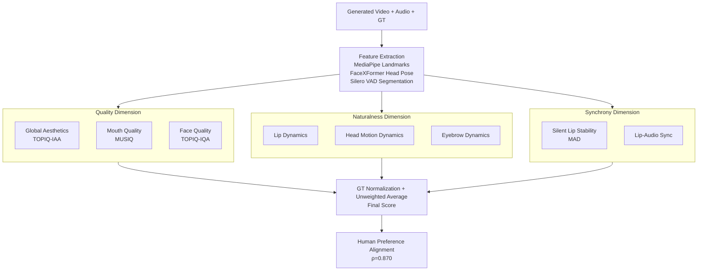

# THEval: Evaluation Framework for Talking Head Video Generation

**Conference**: CVPR 2026  
**arXiv**: [2511.04520](https://arxiv.org/abs/2511.04520)  
**Code**: https://newbyl.github.io/theval_project_page/ (Available, includes dataset and leaderboard)  
**Area**: Video Generation / Evaluation Benchmark  
**Keywords**: Talking Head, Video Generation Evaluation, Human Preference Alignment, Fine-grained Dynamic Metrics, Spearman Correlation

## TL;DR
Addressing the long-standing problem where talking head video generation evaluation relies on metrics like FID/FVD/SyncNet that are disconnected from human perception, this paper proposes THEval. It designs 8 fine-grained training-free metrics across three dimensions—quality, naturalness, and synchrony—and aggregates them into a Final Score using a GT-normalized unweighted average. Validated through a user study on 85,000 videos from 17 SOTA models, the Final Score achieves a Spearman correlation of $\rho=0.870$ with human preferences, whereas existing metrics are mostly near zero or negative.

## Background & Motivation
**Background**: The quality of talking head generation (driving a face image with audio or video to talk/express) has soared, yet evaluation remains stuck with two types of metrics: ① Image/video quality (FID, FVD, SSIM, PSNR) and ② Lip-sync (LMD based on landmark Euclidean distance, or LSE-C confidence/LSE-D distance from pre-trained SyncNet). The rest relies on costly and labor-intensive user studies.

**Limitations of Prior Work**: These metrics have significant flaws. FID/FVD are biased when sample sizes are small (often only hundreds to thousands of segments during inference), insensitive to subtle differences in high-quality videos, and fail to measure motion quality or temporal coherence. SyncNet has been proven unstable—simply changing audio encoding from mp4a to mpga or video from H.264 to H.265 can shift LSE-D/LSE-C by 0.4 to 1.2 without visible difference to humans. Worse, Wav2Lip, trained using SyncNet as a discriminator, achieves the highest LSE scores but is among the least preferred methods in user studies. LMD metrics impose heavy penalties on differences in head pose and expressions relative to GT, which are only weakly correlated with audio and thus unfairly penalized.

**Key Challenge**: Existing metrics focus either solely on "image quality" or "lip alignment," compressing the multi-cue perceptual problem of "is this video realistic" (expression, eyebrows, head motion, mouth clarity, etc.) into one or two isolated metrics. This leads to unexplainable over/under-performance and a lack of alignment with human preferences.

**Goal**: To create a "fine-grained, aggregatable, human-aligned, and training-free efficient" evaluation framework, allowing researchers to obtain both a single comparable Final Score and a diagnostic breakdown of quality, naturalness, and synchrony.

**Key Insight**: Psychological and perceptual research indicates that subtle asymmetric dynamics of eyebrows, mouth, and head significantly enhance "credibility/naturalness." Specific cues, such as mouth stability during silence and lip amplitude varying with volume during speech, are strong indicators of realism for humans. Based on this, "naturalness/synchrony" is decomposed into geometric statistics extractable via off-the-shelf landmarks and VAD.

**Core Idea**: Utilize 8 fine-grained training-free metrics aligned with human perception to oversee quality, naturalness, and synchrony. These are normalized by "relative proximity to ground truth" and averaged without weights to form a Final Score that is both transparent and highly aligned with human ratings.

## Method

### Overall Architecture
THEval is an evaluation pipeline rather than a generative model. It takes a generated talking head video (+ audio + ground truth reference) as input. First, off-the-shelf tools (MediaPipe Face Mesh for eye/lip/eyebrow landmarks, FaceXFormer for head pose estimation, and Silero VAD for speech/silence segmentation) extract geometric and perceptual features. Then, 8 raw metric values are calculated in parallel across three dimensions. Each value is normalized relative to the GT, and finally, an unweighted average yields the Final Score. The entire suite is training-free and can run on CPU/single GPU, serving as an efficient proxy for user studies.

Mapping of the three dimensions and 8 metrics: **Quality** (① Global Aesthetics, ② Mouth Quality, ③ Face Quality), **Naturalness** (④ Lip Dynamics, ⑤ Head Motion Dynamics, ⑥ Eyebrow Dynamics), and **Synchrony** (⑦ Silent Lip Stability, ⑧ Lip-Audio Sync).

### Key Designs
The "Key Design" of THEval lies in the metric protocols for the three dimensions and the final aggregation protocol.

**1. Quality Dimension: Replacing FID/FVD with Region-Aware IQA and Isolating the "Mouth"**

To address FID/FVD's bias and insensitivity, the quality dimension uses single-frame, training-free scorers aligned with human aesthetics/quality, averaged over all $N$ frames. Global aesthetics uses the aesthetic branch of TOPIQ: $\textit{Global Aesthetics}=\frac{1}{N}\sum_{j=1}^{N}S_{aes,j}$. Quality is split by region—overall face uses TOPIQ-IQA, and the mouth region uses MUSIQ: $\textit{Face/Mouth Quality}=\frac{1}{N}\sum_{j=1}^{N}Q_{face/mouth,j}$. Separating the mouth is crucial because synthesizing realistic mouth movement is the hardest part for generative models; measuring it separately exposes this bottleneck.

**2. Naturalness Dimension: Quantifying "Natural Motion" via Geometric Dispersion**

Naturalness uses three "dynamic quantifiers" to characterize facial movement. **Lip Dynamics**: $M$ pairwise Euclidean distances $d_{j,m}$ from $K=40$ lip landmarks describe lip shape. The metric is the average standard deviation of these distances over $N$ frames: $\textit{Lip Dynamics}=\frac{1}{M}\sum_{m=1}^{M}\sigma_m$, where $\sigma_m=\sqrt{\frac{1}{N-1}\sum_{j=1}^{N}(d_{j,m}-\bar d_m)^2}$. **Head Motion Dynamics**: Estimates pitch/yaw/roll and face center displacement, integrating mean angle std dev $\overline{\sigma_{angle}}$, mean angle first-order temporal difference variance $\overline{V_{\Delta angle}}$, and mean translation variance $\overline{V_{trans}}$: $\textit{Head Motion Dyn.}=\sqrt{(\overline{\sigma_{angle}}\cdot\overline{V_{\Delta angle}})+\overline{V_{trans}}}$. **Eyebrow Dynamics**: Uses vertical eyebrow-eye distance $d_{eb,j}$ normalized by interpupillary distance $d_{io,j}$ to handle scale. The metric is the std dev of this normalized distance $d'_{eb,j}$ across frames. These metrics compare relative proximity to GT rather than frame-by-frame alignment, avoiding unfair penalties for natural variations.

**3. Synchrony Dimension: Replacing SyncNet with Physical Intuition (Closed Mouths when Silent, Volume-Proportional Amplitude)**

To fix SyncNet's instability, synchrony uses two interpretable geometric-audio alignment measures. **Silent Lip Stability**: Detects silent segments $S_{silent} \ge 300ms$ via VAD. For each frame, it calculates normalized mouth opening $d_{lip,j}=\frac{1}{P}\sum_{p=1}^{P}\frac{|y_{upper,p,j}-y_{lower,p,j}|}{d_{io,j}}$ and measures stability using Median Absolute Deviation (MAD): $\textit{Silent Lip Stability}=\text{median}(|d_{lip,j}-\tilde d_{lip}|)$. **Lip-Audio Sync**: For speech frames $S$, mouth opening $O_t$ and audio RMS energy $V_t$ are min-max normalized to $O_t^*, V_t^* \in [0,1]$. The metric is the mean absolute error: $L_{sync}=\frac{1}{|S|}\sum_{t\in S}|O_t^*-V_t^*|$.

**4. Final Score: GT-Normalization via "Relative Deviation from Reality"**

Author normalizes each of the 8 metrics using the GT: $s=1-\frac{|\text{Model}_{Score}-\text{GT}_{Score}|}{\text{GT}_{Score}}$. A value of $s=1$ indicates perfect consistency with real video. This unifies all metrics into comparable scalars where "closer to human is better" and naturally handles non-monotonicity (e.g., more motion isn't always better; motion like a human is better). The aggregation purposefully uses an **unweighted average**.

### Loss & Training
This work does not train any models. All metrics are based on zero-shot inference and geometric statistics from pre-trained components (TOPIQ, MUSIQ, MediaPipe, FaceXFormer, Silero VAD). There are no training objectives or hyperparameter tuning, highlighting its efficiency and lack of training bias.

## Key Experimental Results

### Main Results
Evaluation of 17 SOTA models (9 video-driven + 8 audio-driven) on the THEval dataset (5,011 multi-lingual YouTube videos, 18 hours, 1080p), generating 85,000 videos.

| Model | Type | Global Aes.↑ | Mouth Qual.↑ | Head Motion↑ | Final Score↑ |
|-------|------|--------------|--------------|--------------|--------------|
| LivePortrait | Video-driven | 0.946 | 0.976 | 0.755 | **0.9345** |
| X-Portrait | Video-driven | 0.950 | 0.999 | 0.609 | 0.8999 |
| LIA-X | Video-driven | 0.947 | 0.920 | 0.623 | 0.8806 |
| Hallo2 | Audio-driven | 0.962 | 0.925 | 0.240 | 0.8477 |
| Echomimic | Audio-driven | 0.850 | 0.962 | 0.381 | 0.8207 |
| OmniAvatar | Audio-driven | 0.977 | 0.992 | 0.604 | 0.8064 |
| Wav2Lip | Audio-driven | 0.909 | 0.918 | 0.112 | 0.6502 |
| FOM | Video-driven | 0.752 | 0.757 | 0.327 | 0.6810 |

Overall, video-driven methods are more balanced in naturalness/synchrony due to motion priors. Wav2Lip, despite its high SyncNet scores, only receives a 0.65 Final Score, matching its low user preference.

### Metrics vs. Human Preference Correlation (Key Validation)
A user study on Hugging Face Space collected 3,519 pairwise preferences (Krippendorff's $\alpha=0.74$). Spearman $\rho$ values are:

| Metric | $\rho$ | p-value | Aligned with Human? |
|--------|---------|---------|---------------------|
| LSE-C (SyncNet) | -0.164 | 0.530 | No (Neg. / Not Sig.) |
| LSE-D (SyncNet) | -0.269 | 0.297 | No |
| FID | 0.210 | 0.416 | No |
| FVD | 0.289 | 0.260 | No |
| LMD-F | 0.231 | 0.389 | No |
| (2) Mouth Quality | 0.765 | <0.001 | Yes |
| (5) Head Motion Dyn.| 0.763 | <0.001 | Yes |
| (3) Face Quality | 0.699 | 0.001 | Yes |
| **Final Score** | **0.870** | **<0.0001** | **Strongly Aligned** |

### Key Findings
- **Existing metrics collective failure**: $\rho$ for FID/FVD/LMD/SyncNet are all within $\pm 0.29$ and mostly non-significant; SyncNet is even negative.
- **Mouth Quality and Head Motion are the strongest single metrics** ($\rho \approx 0.76$), confirming the design importance of isolating the mouth and quantifying head motion.
- **Aggregation outperforms single points**: Single metrics peak at 0.765, while the aggregated Final Score reaches 0.870, proving complementary benefits.
- **Diagnosis of failure modes**: OmniAvatar's Final Score was dampened by identity drift and color shifts (temporal drift) from its WanVideo base, despite high single-frame quality.

## Ablation Study
The "ablation" focuses on the aggregation protocol and dimension contributions:

| Configuration | $\rho$ (Human) | Note |
|---------------|----------------|------|
| Quality Only | 0.713 | Significant single-dimension alignment |
| Naturalness Only | 0.702 | Head motion is the primary contributor |
| Synchrony Only | 0.603 | Weakest dimension but still exceeds old metrics |
| Unweighted Full | **0.870** | Highest; equal weight aggregation |
| Weighted Fit | — | Discarded to prevent overfitting and maintain transparency |

## Highlights & Insights
- **Interpretable Dissection of Realism**: The 3 dimensions + 8 metrics allow for specific diagnosis of model weaknesses, a major paradigm shift from "black-box" FID/SyncNet.
- **Physical Intuition over Learned Proxies**: Using volume envelope alignment and MAD for stability prevents the "gaming" of metrics through discriminator-based training.
- **GT Relative Normalization**: $s=1-|\cdot|/GT$ elegantly solves the scale problem and handles U-shaped preferences (where too much motion is as bad as too little).
- **Transparency via Equality**: Choosing unweighted averages over optimized weights prioritizes robustness and interpretability for a benchmark.

## Limitations & Future Work
- **Scope**: Currently limited to single-person, near-frontal RGB video; excludes 3DGS/NeRF. Future extensions will include multi-person and profile scenarios.
- **Upstream Dependencies**: Metrics depend on MediaPipe/FaceXFormer/VAD; inaccuracies in these tools under extreme poses or low quality will propagate.
- **Implicit GT Assumption**: Relying on "similarity to GT" for naturalness may undervalue "plausible but different from GT" generations.

## Related Work & Insights
- **vs. SyncNet**: Replaces the black-box CNN with interpretable geometric-audio alignment. Higher stability and positive human correlation.
- **vs. FID/FVD**: Replaces distribution distance with regional IQA and temporal statistics, decoupling quality from motion.
- **vs. LMD**: Shifts from frame-by-frame penalty to "dynamic dispersion" proximity, avoiding unfair punishment for uncorrelated but natural variations.

## Rating
- Novelty: ⭐⭐⭐⭐ Reconstructs talking head evaluation into an interpretable, human-aligned system.
- Experimental Thoroughness: ⭐⭐⭐⭐⭐ Large scale: 17 models, 85k videos, and 3.5k human preferences.
- Writing Quality: ⭐⭐⭐⭐ Clear formulas and motivations for each metric.
- Value: ⭐⭐⭐⭐⭐ Provides the community with a free, training-free, and validated evaluation standard.

<!-- RELATED:START -->

## Related Papers

- [\[CVPR 2026\] EmoDiffTalk: Emotion-aware Diffusion for Editable 3D Gaussian Talking Head](emodifftalk_emotion-aware_diffusion_for_editable_3d_gaussian_talking_head.md)
- [\[CVPR 2026\] VGA-Bench: A Unified Benchmark and Multi-Model Framework for Video Aesthetics and Generation Quality Evaluation](vga-bench_a_unified_benchmark_and_multi-model_framework_for_video_aesthetics_and.md)
- [\[CVPR 2026\] UniTalking: A Unified Audio-Video Framework for Talking Portrait Generation](unitalking_a_unified_audio-video_framework_for_talking_portrait_generation.md)
- [\[CVPR 2026\] Thinking with Frames: Generative Video Distortion Evaluation via Frame Reward Model](thinking_with_frames_generative_video_distortion_evaluation_via_frame_reward_mod.md)
- [\[CVPR 2026\] MultiShotMaster: A Controllable Multi-Shot Video Generation Framework](multishotmaster_a_controllable_multi-shot_video_generation_framework.md)

<!-- RELATED:END -->
