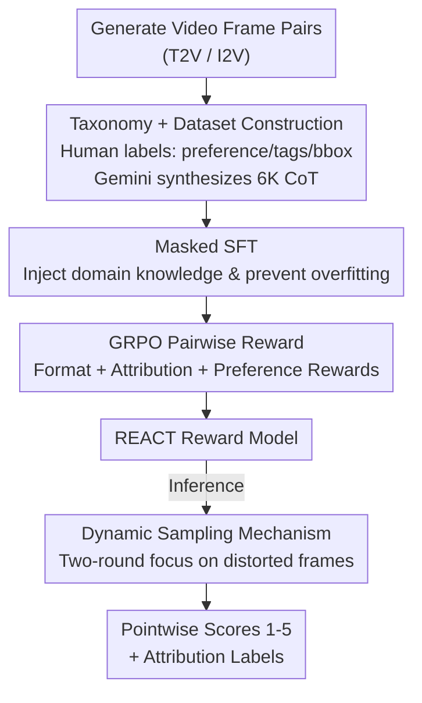

# Thinking with Frames: Generative Video Distortion Evaluation via Frame Reward Model

**Conference**: CVPR 2026  
**Paper**: [CVF Open Access](https://openaccess.thecvf.com/content/CVPR2026/html/Wang_Thinking_with_Frames_Generative_Video_Distortion_Evaluation_via_Frame_Reward_CVPR_2026_paper.html)  
**Code**: None  
**Area**: Video Generation / Generative Video Evaluation / Reward Model  
**Keywords**: Structural distortion, Frame-level reward model, GRPO, Chain-of-Thought reasoning, Human preference alignment

## TL;DR
Addressing the blind spot where existing video reward models focus only on image quality, motion, or text alignment while overlooking structural distortions like "deformed limbs or mesh penetration," this paper proposes **REACT**—a **frame-level** reward model based on Qwen2.5-VL-7B. Using a structural distortion taxonomy, efficient CoT data synthesis, and a two-stage "Masked SFT $\to$ GRPO Pairwise Reward" training strategy, it provides 1–5 distortion scores and interpretable attribution labels. It improves human preference alignment accuracy from 0.701 to 0.813 on the self-built REACT-Bench.

## Background & Motivation

**Background**: Post-training for text-to-video (T2V) increasingly relies on video reward models (VideoScore, VideoReward, UnifiedReward, etc.) to guide generative models toward human preference alignment. These models typically evaluate three dimensions: Visual Quality (VQ), Motion Quality (MQ), and Text Alignment (TA).

**Limitations of Prior Work**: Existing models almost entirely neglect **structural distortion**—abnormalities in the object structure itself, such as deformed/missing limbs, extra hands, distorted torsos, collapsed faces, and **mesh penetration** (physically impossible intersections between entities). Consequently, a video with beautiful aesthetics and smooth temporal consistency but six fingers on a character can still receive a high score. This "high-score, low-quality" issue misleads post-training.

**Key Challenge**: Why not use existing solutions to fill this gap? (1) **Frame-level vs. Video-level**: Structural distortions are spatially local and visible in single frames, whereas video-level models use low sampling rates (e.g., 2 fps), often skipping the exact moments of failure. Moreover, video-level annotation is expensive and hard to scale. (2) **Frame-level vs. Image-level**: While Image Quality Assessment (IQA) studies structural artifacts, distortions in generated video often appear **blurry or fragmented** due to temporal inconsistency and motion, creating a domain gap that causes image evaluators to perform poorly on video frames.

**Goal**: To create a reward model dedicated to evaluating structural distortion in generated videos, providing both **pointwise scores** for RL and **interpretable attribution labels**.

**Key Idea**: Shift evaluation to the **frame level** and enable the model to perform "Chain-of-Thought (CoT) reasoning on frames." This involves building large-scale preference data + low-cost CoT synthesis using a distortion taxonomy, followed by "Masked SFT to inject domain knowledge + GRPO pairwise reward for preference alignment," and using dynamic sampling during inference to focus computation on problematic frames.

## Method

### Overall Architecture

The REACT workflow consists of three components: **(a) Data Preparation** $\to$ **(b) Two-stage Reward Model Training** $\to$ **(c) Inference-time Dynamic Sampling**.

In data preparation, prompts are extracted from real videos of complex motions and fed into various T2V/I2V models (Kling, HaiLuo, Sora) to generate "failure-prone" videos. Frame pairs at the same timestamp are extracted for preference pairs. A team of 34 professionals annotates preferences, attribution labels, and bounding boxes (bbox). The lightweight grounding task (bbox) is used to prompt Gemini-2.5-Pro to synthesize CoT reasoning, resulting in 6K high-quality CoT samples. During training, Qwen2.5-VL-7B undergoes **Masked SFT** to inject domain knowledge, followed by **GRPO with pairwise rewards** to reinforce reasoning and scoring. At inference, a **dynamic sampling** mechanism adaptively concentrates the frame budget on frames most likely to contain distortions.

### Key Designs

**1. Structural Distortion Taxonomy + Efficient CoT Synthesis: Defining distortion and creating low-cost reasoning data**

A major pain point is the lack of a systematic definition for structural distortion. This paper classifies distortions into two main categories: **Abnormal Appearance** (object shape/structure) and **Abnormal Interaction** (unphysical spatial relationships). Appearance is subdivided into animal limb/torso/face across deformation/omission/repetition types. This results in **8 distortion categories** (Limb Deformation, Extra Limbs, Missing Limbs, Torso Deformation, Face Deformation, Motion Blur, and Mesh Penetration).

For data, 15K frame pairs are collected. To avoid the high cost of manual CoT writing, the task is **reformulated as a grounding task**: annotators simply draw boxes around distortions. Gemini-2.5-Pro is then given the "image + bbox + label" to **back-induce** the reasoning process (pretending not to know the label and inferring step-by-step). To support SFT, **pseudo-scores** are assigned based on the number of distortion labels: no distortion $[4.0,5.0]$, one label $[3.0,4.0]$, two $[2.0,3.0]$, three+ $[1.0,2.0]$.

**2. Masked SFT + GRPO Pairwise Reward: Injecting knowledge without rote memorization**

The SFT stage faces a dilemma: too many steps result in the model **memorizing** CoT patterns, which kills reasoning diversity for GRPO; too few steps fail to inject domain knowledge. **Masked SFT** solves this: the first epoch uses full CoT (reasoning + labels + scores) visibility. The second epoch only calculates loss on the **final attribution labels and scores**, masking the reasoning trajectory to refine accuracy while preserving path diversity.

The RL phase uses GRPO to sample $G$ responses for an input $q=\{c,f\}$. The reward $R(o_i^j)$ consists of three components:
- **Format Reward** $R_{\text{fmt}}$: 1 if reasoning is within `<think>` and results are within `<answer>`, else 0.
- **Attribution Accuracy Reward**: $R_{\text{attr}} = 0.6 \cdot a_{\text{right}} - 0.2 \cdot (a_{\text{wrong}} + a_{\text{missing}})$.
- **Preference Reward**: For a frame pair $\{f^A, f^B\}$, preference probability is calculated via predicted pointwise scores $s_i^A, s_i^B$, such as $P(o_i^A \succ o_i^B|c) = \frac{e^{s_i^A}}{\theta e^{s_i^A} + e^{s_i^B}}$, where $\theta=5$ controls tie inclination. This calibrates scores to human rankings even without pointwise ground truths.

**3. Dynamic Sampling Mechanism: Concentrating frame budget on distortions**

Fixed-interval sampling often skips instantaneous distortion moments. Since generated videos have high temporal consistency, the authors use a two-pass mechanism: **Round 1** samples uniformly at 0.5x target fps. (1) If all scores are high, it sparsely samples **between** existing frames. (2) If low scores exist, it **densely** samples around those frames at 0.25x fps. (3) Otherwise, it prioritizes random sampling around frames with scores below the mean. The final video score is the average of all sampled frames.

### Loss & Training
Base model: Qwen2.5-VL-7B. SFT uses LoRA (rank 32), LR 5e-4, 2 epochs. GRPO LR 1e-6, group size $G=8$, 300 steps. Inference at 2 fps equivalent with dynamic sampling.

## Key Experimental Results

### Main Results

**Human Preference Alignment** (REACT-Video, 500 pairs):

| Model | Acc w/ Tie (Overall) | Acc w/o Tie (Overall) |
|------|------|------|
| UnifiedReward (Strongest Baseline) | 0.416 | 0.701 |
| VisualQuality-R1 (Image Evaluator) | 0.376 | 0.610 |
| Gemini-2.5-Pro | 0.370 | 0.534 |
| **REACT (Ours)** | **0.610** | **0.813** |

**Distortion Identification** (REACT-Frame, 2.1K frames, F1 score):

| Model | Distortion Frame F1 | Normal Frame F1 |
|------|------|------|
| Gemini-2.5-Pro | 0.650 | 0.335 |
| GPT-o3 | 0.641 | 0.379 |
| **REACT (Ours)** | **0.845** | **0.671** |

REACT leads significantly in both tasks. The F1 scores of general MLLMs and image evaluators reveal they tend to misclassify distorted frames as normal, confirming the blind spot.

### Ablation Study

| Configuration | Acc w/ Tie (Video) | Distortion F1 (Frame) |
|------|------|------|
| RL w/o SFT | 0.387 | 0.467 |
| REACT w/o DS (Dynamic Sampling) | 0.519 | - |
| **REACT (Full)** | **0.610** | **0.845** |

### Key Findings
- **SFT is the Foundation for GRPO**: Without SFT, GRPO fails because the base model lacks scoring diversity. Pseudo-score SFT "warms up" the model's ability to differentiate quality.
- **Pairwise Reward > Binary Reward**: Replacing $R_{\text{pref}}$ with a binary 0/1 reward drops accuracy significantly (0.352 vs 0.610).
- **Masked Loss is Effective**: Masking the reasoning trajectory in the second SFT epoch improves distortion F1 from 0.690 to 0.764 by preventing overfitting to fixed patterns.

## Highlights & Insights
- **Grounding as CoT Synthesis**: Reformulating expensive logic annotation into a bbox task + LLM back-induction is a scalable way to build reasoning datasets.
- **Metric for the "Unseen"**: It focuses specifically on structural consistency, serving as a vital **complement** to existing quality metrics rather than a replacement.
- **Learning from Preferences without Ground Truth**: The combination of pairwise probabilities and GRPO allows the model to learn fine-grained pointwise scoring from coarse ranking data.

## Limitations & Future Work
- Pseudo-scores are mechanical mappings based on label counts and may not perfectly reflect human perception of severity.
- Taxonomy is heavily weighted toward "animal/human" distortions; non-animal object distortion coverage is relatively coarse.
- Thresholds for dynamic sampling were set empirically and may require tuning for different datasets.

## Related Work & Insights
- **vs. UnifiedReward**: UnifiedReward is video-level and misses local structural failures. REACT's frame-level approach allows for precise localization and higher alignment (0.813 vs 0.701).
- **vs. Image Evaluators**: Image evaluators struggle with the domain gap of "blurry" video distortions. REACT's video-frame-specific training bridges this gap.

## Rating
- Novelty: ⭐⭐⭐⭐ 
- Experimental Thoroughness: ⭐⭐⭐⭐ 
- Writing Quality: ⭐⭐⭐⭐ 
- Value: ⭐⭐⭐⭐ 

<!-- RELATED:START -->

1. **VideoReward**: (2024) Focuses on MQ/VQ/TA using reward modeling.
2. **UnifiedReward**: (2025) A comprehensive video evaluation framework.
3. **Qwen2.5-VL**: (2025) The multi-modal base model utilized for reasoning.

<!-- RELATED:END -->

## Related Papers

- [\[CVPR 2026\] Ref4D-VideoBench: Four-Dimensional Reference-Based Evaluation of Text-to-Video Generative Models](ref4d-videobench_four-dimensional_reference-based_evaluation_of_text-to-video_ge.md)
- [\[CVPR 2026\] A Frame is Worth One Token: Efficient Generative World Modeling with Delta Tokens](a_frame_is_worth_one_token_efficient_generative_world_modeling_with_delta_tokens.md)
- [\[CVPR 2026\] GT-SVJ: Generative-Transformer-Based Self-Supervised Video Judge For Efficient Video Reward Modeling](gt-svj_generative-transformer-based_self-supervised_video_judge.md)
- [\[CVPR 2026\] VGA-Bench: A Unified Benchmark and Multi-Model Framework for Video Aesthetics and Generation Quality Evaluation](vga-bench_a_unified_benchmark_and_multi-model_framework_for_video_aesthetics_and.md)
- [\[CVPR 2026\] Thinking with Video: Video Generation as a Promising Multimodal Reasoning Paradigm](thinking_with_video_video_generation_as_a_promising_multimodal_reasoning_paradig.md)

<!-- RELATED:END -->
