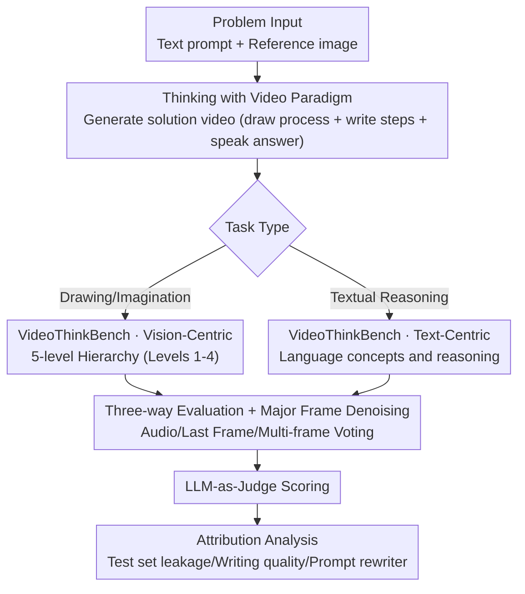

# Thinking with Video: Video Generation as a Promising Multimodal Reasoning Paradigm

**Conference**: CVPR 2026  
**Paper**: [CVF Open Access](https://openaccess.thecvf.com/content/CVPR2026/html/Tong_Thinking_with_Video_Video_Generation_as_a_Promising_Multimodal_Reasoning_CVPR_2026_paper.html)  
**Code**: https://github.com/tongjingqi/Thinking-with-Video  
**Area**: Video Generation / Multimodal Reasoning  
**Keywords**: Video Generation Reasoning, Sora-2, Multimodal Unification, VideoThinkBench, Test-Time Scaling

## TL;DR
This paper introduces "Thinking with Video," a new multimodal reasoning paradigm where video generation models like Sora-2 are utilized to depict the reasoning process within video frames. The authors construct VideoThinkBench, a five-level capability hierarchy covering "Geometric Intuition → Visual Induction → Abstract Rules → Spatial Planning → Language Reasoning." Evaluation reveals that Sora-2 outperforms GPT-5 by ~10% in "eyeballing" geometry puzzles and achieves 92% accuracy in MATH via audio output, demonstrating that video generation models can serve as unified reasoning vehicles for understanding and generation.

## Background & Motivation
**Background**: Currently, two mainstream paradigms enhance Large Language Model (LLM) reasoning: "Thinking with Text" (Chain-of-Thought, CoT) and "Thinking with Images" (e.g., OpenAI o3 inserting images into CoT, or Nano Banana embedding text in images). The former relies on step-by-step textual reasoning, while the latter utilizes VLM-assisted image generation/editing for visual reasoning.

**Limitations of Prior Work**: Both paradigms suffer from structural weaknesses. ① **Static Constraints**: Images capture only a single moment and cannot express dynamic processes, temporal evolution, or continuous transformations (e.g., the progressive reflection of light cannot be depicted in a single image). ② **Modality Fragmentation**: Text and vision are treated as independent modalities, lacking a framework that naturally fuses "textual reasoning" and "visual reasoning" within a unified temporal structure.

**Key Challenge**: Human spatial and geometric reasoning is often a dynamic process of "thinking while drawing" or "mental simulation." Existing paradigms are either limited to static visuals or separate text from vision, lacking a continuous temporal medium to unify them.

**Goal**: To identify a medium naturally capable of expressing "dynamic processes + text-visual fusion" to carry reasoning, and to systematically verify the extent of reasoning capabilities within such a medium.

**Key Insight**: The authors observe that video generation models (like Sora-2) inherently generate continuous frames, capable of both drawing dynamic processes (e.g., tracing lines, transformations) and embedding text directly into the visuals. Thus—can generating a solution video itself be considered an act of reasoning?

**Core Idea**: Replace "writing text/drawing single images" with "generating video" for reasoning. The model renders the problem-solving process frame by frame (including text on screen and spoken answers), unifying dynamic reasoning and multimodal fusion within the video medium.

## Method
Strictly speaking, this paper is not a "model training" paper but rather proposes a **reasoning paradigm + an evaluation benchmark + a methodology for evaluating video outputs**, supported by extensive analytical experiments. The "Method" consists of three parts: paradigm definition, VideoThinkBench construction, and video answer evaluation.

### Overall Architecture
The pipeline involves: Feeding a problem (text prompt + reference image) to a video generation model → The model generates a "solution video" (visualizing the reasoning process/writing steps in frames, with an audio track for the final answer) → Extracting answers from the video for evaluation. Evaluation covers **Vision-Centric tasks** (solved via drawing and imagination) and **Text-Centric tasks** (solved via written reasoning), utilizing three evaluation paths (Audio Transcription / Last Frame / Multi-Frame Voting) to extract answers for scoring by an LLM-as-Judge.

### Key Designs

**1. Thinking with Video Paradigm: Video Generation as Multimodal Reasoning**

To address the issues of "static images" and "text-visual fragmentation," this paradigm moves beyond outputting text CoT or single images. Instead, the model generates a **continuous video**: the visual displays the reasoning process in real-time (e.g., drawing light reflection trajectories or extending lines to find intersections), while textual explanations are written into the frames, and the audio repeats the final answer. As videos are inherently multi-frame sequences with a timeline, they solve both problems: dynamic processes unfold frame-by-frame, and text/vision are unified in the same temporal carrier, closely mimicking human cognitive processes. This supports the core claim: video generation models may be unified multimodal reasoning foundations.

**2. VideoThinkBench Capability Hierarchy: Systematic Deconstruction via Incremental Difficulty**

The authors constructed VideoThinkBench with five levels of difficulty: ① Geometric Intuition (eyeballing puzzles, judging simple spatial relations) → ② Visual Pattern Induction (visual puzzles, identifying patterns in shapes/colors/layouts) → ③ Abstract Rule Induction (ARC-AGI-2, inferring transformation rules from input-output pairs) → ④ Spatial Planning & Search (Mazes, multi-step action planning) → ⑤ Language Concept Understanding & Reasoning (Textual problems like GSM8K/MATH/MMMU). The first four levels are vision-centric, while the fifth is text-centric. Specifically, eyeballing puzzles (21 categories, 1050 samples) and mazes are **self-constructed and automatically verifiable**. This hierarchy provides a metric for the "capability boundaries" of video models, revealing strengths in geometric intuition versus weaknesses in abstract rule induction.

**3. Three-way Evaluation + Major Frame Denoising: Solving the "Corrupted Video End" Problem**

Video outputs are harder to evaluate than text or single images—answers are hidden in frames, and video ends are often corrupted by SMPTE color bars or black screens. The authors designed three paths: **Audio** (transcribing the spoken answer), **Last Frame** (checking which option was highlighted in the final frame), and **Major Frame** (sampling multiple frames over time and taking a majority vote). Major Frame acts as a denoising filter, bypassing corrupted endings to capture the model's most consistent "belief" throughout the video. This significantly improved performance: on Arc Connect, Last Frame accuracy rose from 56% → 68% for Major Frame, and reached 90% with majority voting over 5 retries. This highlights a new direction: **test-time scaling for video generation reasoning**.

**4. Origin Analysis of Textual Reasoning: Identifying the "True Solver" via Wan 2.5 Rewriter**

Sora-2 performs surprisingly well on text problems (98.9% audio accuracy on GSM8K), but does this capability come from video generation or a hidden text model? The authors performed three levels of attribution. ① **Excluding Leakage**: Using Qwen3-235B / Gemini 2.5 Pro to generate derived versions of GSM8K/MATH-500 problems; Sora-2 performed consistently, ruling out memorization. ② **Writing Quality Analysis**: In 115 samples where audio/text was correct, only 13.91% of visual writing was "completely correct," with 43.48% being unreadable or logically flawed. ③ **The Counter-Proof**: Using Wan 2.5 (which has a toggle for "prompt rewriter"), turning off the rewriter caused textual reasoning accuracy to drop to nearly zero (GSM8K Last Frame 78.4% → 0.0%). This suggests Sora-2’s text reasoning likely stems from its internal prompt rewriter (a text model solving the problem first) rather than the video generation component itself.

## Key Experimental Results

### Main Results: Comparison with SOTA VLMs (Accuracy %)
Summary for various tasks (Vision-centric tasks for Sora-2 use Major Frame; Text-centric tasks use Audio):

| Task | Sora-2 | Gemini 2.5 Pro | GPT-5 high | Claude Sonnet 4.5 |
|------|--------|----------------|-----------|-------------------|
| Eyeballing-Point | **44.7** | 27.8 | 33.6 | 36.2 |
| Eyeballing-Line | **38.0** | 21.0 | 24.0 | 26.3 |
| Maze | **13.3** | 0.0 | 0.0 | 0.0 |
| Visual-Symmetry | 81.9 | 94.9 | **98.5** | 80.1 |
| ARC-AGI-2 | 1.3 | 1.9 | 0.5 | **5.3** |
| Vision-Centric Avg | 40.4 | 41.4 | 42.6 | **43.8** |
| Text-Centric Avg | 68.6 | 82.3 | 83.2 | **86.2** |
| **Total Average** | 49.8 | 55.0 | 56.1 | **56.2** |

Critical observation: Sora-2 **significantly outperforms** all VLMs in **eyeballing puzzles (Point/Line) and mazes**, where other models score near zero. However, it lags in abstract rule induction (ARC-AGI-2) and general text knowledge.

### Text-Centric Task Breakdown (Selected Datasets, Accuracy %)

| Dataset | Sora-2 Last Frame | Sora-2 Audio | Gemini 2.5 Pro | GPT-5 high | Claude 4.5 |
|---------|------------------|--------------|----------------|------------|------------|
| GSM8K | 75.7 | **98.9** | 98.9 | 100.0 | 100.0 |
| MATH-500 | 67.0 | 92.0 | 99.0 | 99.0 | 98.0 |
| MathVista | 67.6 | **75.7** | 70.0 | 67.5 | 72.5 |
| MMMU | 38.3 | 69.2 | 79.0 | 77.0 | 82.0 |
| AIME24 | 38.3 | 46.7 | 93.3 | 95.0 | 75.0 |

Notes: Sora-2's **audio accuracy is generally higher than its Last Frame accuracy** (as written text in frames is error-prone, while spoken answers are more precise). It matches SOTA on GSM8K and MathVista but trails on difficult reasoning tasks like AIME and MMMU.

### Ablation Study

| Analysis Item | Configuration | Key Metric | Explanation |
|---------------|---------------|------------|-------------|
| Test-Time Scaling | Arc Connect Single | Last 56% / Major 68% | Multi-frame sampling denoises |
| Test-Time Scaling | Arc Connect 5-vote | Major Frame 90% | Self-consistency significantly gains |
| In-context Learning | ARC-AGI-2 few-shot vs 1-shot | High Acc [0.65,1] 130 vs 95 samples | More examples → Stronger ICL |
| Test Set Leakage | GSM8K Original vs Derived (Audio) | 98.9% vs 100.0% | Stable scores rule out leakage |
| Origin Analysis | Wan 2.5 Rewriter Off/On (GSM8K Last) | 0.0% vs 78.4% | Textual reasoning relies on rewriter |
| Writing Quality | 115 Correct Samples (Manual Audit) | 13.91% Complete Correct | Answers correct but process often unreadable |

### Key Findings
- **Major Frame + Multi-voting is the primary contributor**: Scaling video reasoning through "aggregation over time and multiple generations" boosts performance to 90%, suggesting a path for test-time scaling in video models.
- **Textual reasoning collapses without prompt rewriter**: Evidence suggests Sora-2’s math capabilities are largely derived from the hidden text rewriter solving the problem beforehand, rather than the video generation component itself.
- **Geometric strength vs. Abstract weakness**: Sora-2 excels in tasks requiring "drawing" (geometry/spatial), but fails at ARC-AGI-2 abstract rules, identifying the rule concept but unable to execute precise grid transformations.

## Highlights & Insights
- **Redefining "Video Generation" as "One Act of Reasoning"**: A pivotal shift in perspective—treating video models as reasoning engines rather than just rendering tools, proving they perform spatial reasoning through verifiable visual steps.
- **Major Frame Denoising as a Reusable Trick**: This methodology can be applied to any video QA or agent scenario where answers are embedded in frames but prone to terminal noise, allowing for robust answer extraction.
- **Honest Attribution Methodology**: Using a controllable model (Wan 2.5) to "unmask" the true solver provides a standard for auditing "black-box" multimodal systems suspected of hiding internal text components.

## Limitations & Future Work
- The authors concede that text-centric reasoning likely relies on internal rewriters rather than video components, leaving the actual reasoning capacity of the spatial-temporal generator in doubt.
- **Writing quality in videos is poor** (only 13.91% correct), indicating a significant gap between "getting the answer right" and "explaining the process," meaning true interpretable reasoning is still distant.
- ⚠️ Evaluation heavily relies on the closed-source Sora-2, and some tasks (visual puzzles) involve manual "best frame" selection, limiting reproducibility. This work serves more as a "capability probe" than a trainable method.
- Performance on abstract rule induction (ARC-AGI-2) remains negligible, suggesting the video paradigm currently only benefits "visualizable" tasks.

## Related Work & Insights
- **vs. Thinking with Text (CoT)**: While CoT uses text steps, this paradigm "draws" the process. Videos capture dynamic evolution and modality fusion, though textual reasoning remains dependent on rewriters.
- **vs. Thinking with Images (o3 / Nano Banana)**: These insert static images into chains; this work utilizes continuous frames for "continuous transformation," offering temporal unification at the cost of evaluation difficulty and writing errors.
- **vs. Benchmarks (PuzzleVQA / ARC-AGI-2)**: The paper adapts these static multiple-choice tasks into "draw-to-solve" video formats and introduces new geometric and maze benchmarks for video-based evaluation.

## Rating
- Novelty: ⭐⭐⭐⭐⭐ Pioneering the definition of video generation as a unified multimodal reasoning paradigm.
- Experimental Thoroughness: ⭐⭐⭐⭐⭐ Comprehensive 5-level benchmark plus leakage, writing, ICL, and attribution analyses.
- Writing Quality: ⭐⭐⭐⭐ Clear claims and findings, though some evaluation specifics are in appendices.
- Value: ⭐⭐⭐⭐ Opens the field of video reasoning and test-time scaling while honestly addressing capability origins.

<!-- RELATED:START -->

## Related Papers

- [\[CVPR 2026\] TiViBench: Benchmarking Think-in-Video Reasoning for Video Generation](tivibench_benchmarking_think-in-video_reasoning_for_video_generation.md)
- [\[CVPR 2026\] M4V: Multimodal Mamba for Efficient Text-to-Video Generation](m4v_multimodal_mamba_for_efficient_text-to-video_generation.md)
- [\[CVPR 2026\] SVBench: Evaluation of Video Generation Models on Social Reasoning](svbench_evaluation_of_video_generation_models_on_social_reasoning.md)
- [\[CVPR 2026\] EffectMaker: Unifying Reasoning and Generation for Customized Visual Effect Creation](effectmaker_unifying_reasoning_and_generation_for_customized_visual_effect_creat.md)
- [\[CVPR 2026\] Archon: A Unified Multimodal Model for Holistic Digital Human Generation](archon_a_unified_multimodal_model_for_holistic_digital_human_generation.md)

<!-- RELATED:END -->
