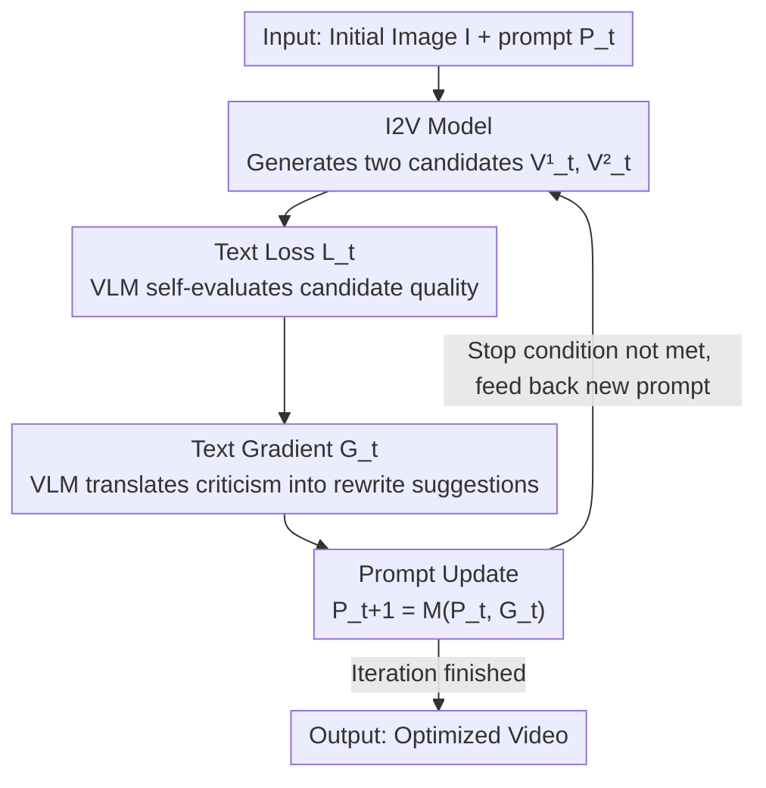

# TiViBench: Benchmarking Think-in-Video Reasoning for Video Generation

**Conference**: CVPR 2026  
**Paper**: [CVF Open Access](https://openaccess.thecvf.com/content/CVPR2026/html/Chen_TiViBench_Benchmarking_Think-in-Video_Reasoning_for_Video_Generation_CVPR_2026_paper.html)  
**Code**: None (The paper provides the project homepage TiViBench, but does not explicitly specify an open-source repository ⚠️ subject to the original text)  
**Area**: Video Generation / Benchmark / Visual Reasoning  
**Keywords**: Image-to-Video, Visual Reasoning Evaluation, Test-time Optimization, Preference Optimization, chain-of-frames

## TL;DR
TiViBench structures the question of "whether image-to-video (I2V) models can reason" into a hierarchical benchmark containing four dimensions, 24 tasks, three difficulty levels, and 595 samples. It finds that commercial models (Sora 2, Veo 3.1) significantly outperform open-source models, but all models fail on tasks requiring rule-based/symbolic reasoning. Along with the benchmark, a **training-free** test-time method, VideoTPO, is proposed. It uses a VLM to self-compare two candidate videos to iteratively rewrite the prompt, boosting the overall accuracy of Wan2.1 from 8.40% to 18.15%.

## Background & Motivation
**Background**: Over the past two years, the focus of video generation models has been shifting from "how realistic the generation is" to "whether it conforms to physics and logic." Since Veo 3 introduced the concept of "chain-of-frames reasoning", a natural question arises: Can video generation models reason step-by-step like LLMs, becoming general-purpose visual foundation models and achieving their own "GPT moment"?

**Limitations of Prior Work**: Existing I2V evaluations (VBench++, various FVD/UCF101 benchmarks) almost entirely measure visual fidelity, temporal smoothness, physical consistency, and prompt adherence. While crucial, **none of these measure high-level reasoning capabilities**. Concurrent work MME-CoF, although introducing 12 reasoning dimensions, treats simple tasks like "rotation reasoning" and hard tasks like "long-term causal reasoning" equally, **lacking a hierarchical difficulty design** and failing to reveal the fine-grained boundaries of model capabilities.

**Key Challenge**: To evaluate reasoning, looking only at a single-frame static result is insufficient. Reasoning is a process that unfolds over time (initial state $\rightarrow$ intermediate state $\rightarrow$ target state). It requires verifiable metrics that can validate both the process and the final state. However, most older benchmarks only retain the initial reasoning image and discard the process information.

**Goal**: (1) To build a benchmark specifically for evaluating I2V reasoning potential, characterized by hierarchical difficulty levels and diverse reasoning categories; (2) To systematically evaluate the strongest current commercial and open-source video models to locate the root causes of reasoning failures; (3) To identify a plug-and-play method to improve reasoning performance without additional training.

**Key Insight**: The authors observe that visual reasoning tasks are naturally more "verifiable" than general generation tasks, as they have explicit ground truths (initial, intermediate, and target states), enabling the design of automated validation metrics. Furthermore, since reasoning potential might be suppressed by prompt preferences, "test-time prompt rewriting" is promising for unleashing this potential without modifying model weights.

**Core Idea**: Quantify visual reasoning capability using the hierarchical benchmark TiViBench, and then improve performance during the inference phase without training using "test-time preference optimization" (VideoTPO).

## Method

### Overall Architecture
This work delivers two relatively independent yet complementary creations: the **evaluation side TiViBench** (how to build the benchmark and score it) and the **method side VideoTPO** (how to improve scores without training). TiViBench formalizes the ambiguous question of "whether a model can reason" into 595 automatically scorable samples through a three-step pipeline: "defining reasoning dimensions $\rightarrow$ constructing visualized prompts $\rightarrow$ designing verifiable metrics." For a given model, VideoTPO iteratively executes a cycle of "generate two candidates $\rightarrow$ VLM self-evaluation $\rightarrow$ modify prompt $\rightarrow$ regenerate" for a single test sample to extract the model's latent reasoning capabilities.

VideoTPO is a clear test-time iterative loop, with its framework diagram shown below:

### Key Designs

**1. TiViBench's Four-Dimensional Hierarchical Reasoning System: Breaking Down "Reasoning" into 24 Measurable Tasks**

A fundamental issue with previous benchmarks is treating "reasoning" as a monolithic concept without separating difficulty levels, which conceals exactly where models fail. Building upon Veo 3's tasks (e.g., graph traversal, maze navigation), TiViBench expands and explicitly categorizes reasoning into four dimensions: **❶ Structural Reasoning & Search** (graph traversal, mazes, number sorting, temporal ordering, rule extrapolation, chess moves), **❷ Spatial & Visual Pattern Reasoning** (shape assembly, color connection, pattern recognition, find-the-difference, counting, visual analogy), **❸ Symbolic & Logical Reasoning** (simple Sudoku, arithmetic, symbolic reasoning, visual deduction, transitive reasoning, game rule reasoning), and **❹ Action Planning & Task Execution** (tool use, robotic navigation, goal-oriented planning, multi-step operations, visual instruction following, game strategies). Each dimension contains approximately 150 samples and six tasks, divided into three difficulty levels (easy, medium, hard), resulting in 24 task scenarios and 595 image-prompt samples. This "dimension $\times$ task $\times$ difficulty" hierarchical structure is the key improvement over MME-CoF, revealing whether a model performs reasonably on weakly rule-dependent tasks like "visual deduction" but fails entirely on strongly rule-bound tasks like "maze/Sudoku."

**2. Narrative Visual Prompting Suite: Forcing the Model to Infer Intermediate Steps via "Blanks & Constraints"**

Visual reasoning prompts cannot be as direct as LLM instructions (e.g., "Find the optimal path from A to B"); otherwise, the task degenerates into a translation problem. The authors advocate for **subjective, narrative** prompts (e.g., "A blue ball slides smoothly along the white path and stops at the red dot"). This provides sufficient visual details to guide reasoning while leaving blanks for the model to infer intermediate steps, backed by implicit constraints (e.g., "The blue ball must never cross the black region"). Specifically, Gemini-2.5-Pro is used as an assistant to generate visually grounded prompts based on the initial and target state images. Rules are customized for the four dimensions (e.g., structural reasoning emphasizes "clear goals without solution paths + implicit rules + temporal coherence," while symbolic reasoning emphasizes "implicit rule discovery + symbolic-visual fusion"). Each prompt is manually verified by three annotators; a prompt is rewritten if even one annotator finds it unclear, and is only adopted when all three approve, ensuring the benchmark itself does not misjudge models due to ambiguous prompts.

**3. Two Categories of Verifiable Metrics: Enabling Automatic Correctness Evaluation Like a Quiz**

Visual reasoning tasks naturally possess clear ground truths, enabling the design of automated validation rather than relying solely on human inspection. The authors divide the metrics into two categories, both focusing on correctness: **Process-and-Goal Consistency** validates both the reasoning process and the final result (e.g., for maze navigation, a tracking tool is used to trace the entity's frame-by-frame trajectory to verify if it reaches the destination legally); **Final-State Validation** only checks whether the correct target state is reached regardless of the intermediate process (e.g., for Sudoku, OpenCV is used to compare the generated grid with the ground truth; for sequence completion, DINO features are compared). The execution logic varies depending on the task format (checking the answer after the equal sign for math fill-in-the-blank, or checking the options for multiple-choice). This set of metrics aligns highly with human judgment (Figure 7, left), offering a reliable, training-free evaluation alternative.

**4. VideoTPO: Bringing Test-Time Preference Optimization to Video Generation, Free of Training and Reward Models**

After diagnosing the root causes of failures (insufficient rule modeling + loss of fine-grained visual features), the authors seek to improve performance without training. Existing prompt rewriting methods are split into two categories: **Pre-inference rewriting** (relying on an LLM to hallucinate details to enrich the prompt, which might deviate from the user's intent) and **Post-inference rewriting** (rewriting the prompt based on generated results). However, both execute one-step optimizations on a single candidate, which is too coarse. VideoTPO draws inspiration from LLM Test-Time Preference Optimization (TPO) but introduces a critical simplification: while original TPO generates multiple samples (e.g., 4) and relies on an external reward model for ranking, VideoTPO **only generates two candidates $V^1_t, V^2_t$ per round** and lets a VLM (GPT-4o) perform self-analysis to directly output "text loss/text gradient," **completely discarding the external reward model**. It iterates in three steps:

- **Text Loss**: $L_t = M(V^1_t, V^2_t, P_t)$. The VLM compares the two candidates and outputs the advantages of the preferred video and the disadvantages of the non-preferred video. This is qualitative criticism rather than a numerical score, making it highly interpretable.
- **Text Gradient**: $G_t = M(P_t, L_t)$. The VLM converts the criticism into executable rewriting suggestions, specifying how to update the prompt so that the generation aligns better with the targeted reasoning.
- **Prompt Update**: $P_{t+1} = M(P_t, G_t)$. The iteratively updated prompt is fed back into the I2V model.

This loop maps the "loss $\rightarrow$ gradient $\rightarrow$ update" optimization paradigm of LLMs into the prompt space. Since the "gradient" is textual rather than numerical, the process requires neither model weight updates nor new dataset compilation. Notably, directly feeding prompts optimized for HunyuanVideo to Wan2.1 ("w/ HYV Prompt") yielded almost no improvement or even degraded performance, proving that prompt preferences are model-dependent and that model-specific on-the-fly optimization in VideoTPO is necessary.

## Key Experimental Results

### Main Results
Seven state-of-the-art I2V models are evaluated (Open-source: Wan2.2/Wan2.1/HunyuanVideo/CogVideoX1.5; Commercial: Veo 3.1-fast/Sora 2/Kling 2.1). Open-source models report Pass@1 and Pass@5 over multiple random seeds, while commercial models report Pass@1 only.

| Model | Type | Structural Search | Spatial Pattern | Symbolic Logic | Planning Execution | Overall Pass@1 |
|------|------|---------|---------|---------|---------|------------|
| CogVideoX1.5 | Open-source | 1.42 | 1.34 | 0.67 | 4.46 | 2.02 |
| HunyuanVideo | Open-source | 1.42 | 1.34 | 2.00 | 10.83 | 4.03 |
| Wan2.1 | Open-source | 5.76 | 2.68 | 4.00 | 20.38 | 8.40 |
| Wan2.2 | Open-source | 7.19 | 2.68 | 6.00 | 21.02 | 9.41 |
| Kling 2.1 | Commercial | 5.04 | 5.37 | 8.00 | 26.75 | 11.60 |
| Veo 3.1 | Commercial | 10.07 | 22.15 | 18.00 | 51.59 | 26.05 |
| **Sora 2** | Commercial | 18.71 | 31.76 | 22.00 | 38.22 | **27.90** |

Observations: (1) Commercial models comprehensively outperform open-source ones, with Sora 2 achieving the highest overall score of 27.9% while remaining relatively stable as difficulty scales; (2) Even for the strongest models, the absolute accuracy remains low (< 30%), indicating that video reasoning is far from solved; (3) All models generally score higher in the "Planning Execution" dimension and lower in "Structural Search / Symbolic Logic." On Pass@5, open-source models (Wan2.2 from 9.41% $\rightarrow$ 16.47%, Wan2.1 from 8.40% $\rightarrow$ 15.29%) improve significantly, suggesting that they **possess latent reasoning capabilities but are highly unstable**, with bottlenecks in training scale and data diversity.

### VideoTPO Improvements (Table 3)
Applying VideoTPO to two open-source models without built-in rewriters, compared against pre-inference and post-inference rewriter baselines:

| Model Configuration | Structural Search | Spatial Pattern | Symbolic Logic | Planning Execution | Overall |
|----------|---------|---------|---------|---------|------|
| HunyuanVideo | 1.42 | 1.34 | 2.00 | 10.83 | 4.03 |
| + Pre-Rewriter | 2.16 | 2.01 | 3.33 | 10.83 | 4.71 |
| + Post-Rewriter | 4.32 | 4.03 | 4.67 | 12.74 | 6.55 |
| **+ VideoTPO** | **7.91** | **5.37** | **6.67** | **22.93** | **10.25** |
| Wan2.1 | 5.76 | 2.68 | 4.00 | 20.38 | 8.40 |
| + Pre-Rewriter | 7.19 | 5.37 | 4.00 | 25.48 | 10.76 |
| + Post-Rewriter | 9.35 | 7.38 | 4.67 | 26.11 | 12.10 |
| **+ VideoTPO** | **19.42** | **10.07** | **8.67** | **33.76** | **18.15** |

VideoTPO consistently outperforms the base models and both rewriter baselines across all dimensions and difficulty levels: HunyuanVideo improves from 4.03% to 10.25%, and Wan2.1 from 8.40% to 18.15% (more than doubled). The gains are significantly greater than those of pre/post-rewriting, validating that test-time scaling can effectively unleash reasoning capabilities in video generation.

### Key Findings
- **Reasoning potential emerges with scale rather than being an inherent defect of generative models**: The advantage of commercial models mainly stems from larger and more diverse data + higher parameter counts + superior architectures (Takeaway ❶). Open-source models' Pass@5 being significantly higher than Pass@1 proves that they can generate correct solutions but are highly unstable (Takeaway ❷).
- **Two root causes of failure** (Takeaway ❸): (i) Models struggle to understand high-level rules—in the maze task, even though the prompt explicitly forbids crossing walls, models violate this rule frequently. (ii) Symbolic reasoning requires precise visual features, but encoders like VAEs compress features excessively, discarding crucial details necessary for reasoning. The worst-performing tasks are maze solving, temporal ordering, finding the difference, and Sudoku completion.
- **Prompt preference is model-dependent**: Cross-model transfer of optimized prompts is almost ineffective or even detrimental; model-specific on-the-fly optimization is indispensable (Figure 7, right).

## Highlights & Insights
- **Transforming "video reasoning" from a conceptual slogan into a verifiable exam bank**: Leveraging the insight that "visual reasoning naturally possesses ground truths (initial/intermediate/final states)," the authors design automated metrics allowing tasks like Sudoku and labyrinths to be scored automatically, avoiding the bottleneck of subjective human evaluation. This is key to scaling the benchmark.
- **Hierarchical difficulty levels represent the most practical improvement over concurrent work**: The division into easy/medium/hard categories lets researchers clearly see where the boundaries of model capabilities lie and at what point performance drops off a cliff, which is far more informative than a flat evaluation.
- **VideoTPO elegantly maps the LLM loss $\rightarrow$ gradient $\rightarrow$ update paradigm to prompt space**: By utilizing "two candidates + VLM self-evaluation" instead of "multiple candidates + external reward model," it requires no training, no rewards, and no new data. This is a highly practical trick that is directly transferrable to any black-box I2V model.
- **Failure attribution points to concrete architectural bottlenecks**: The observation that "features needed for reasoning are discarded due to excessive VAE compression" provides a clear direction for designing "reasoning-friendly video representations/encoders."

## Limitations & Future Work
- **Extremely low absolute performance**: Even the strongest model scores only ~28%, and open-source models only reach ~18% even after VideoTPO optimization. This indicates that "video generation with reasoning" remains an unsolved challenge, making the benchmark serve more as a diagnostic tool than a leaderboard.
- **VideoTPO relies on powerful VLMs**: Using GPT-4o for self-evaluation and rewriting means that the optimization quality heavily depends on the evaluator's capability. The VLM's own video reasoning limitations may become a bottleneck, and the multi-round generation per sample incurs high inference costs.
- **Only two candidates per round**: The authors chose a pairwise self-evaluation for simplicity, which may limit the richness of preference signals. The trade-offs between candidate count, iteration steps, and optimization gains are not fully explored.
- **Evaluation remains partially dependent on task-specific verifiers** (trajectory trackers, OpenCV, DINO, etc.). Validation methods are not standardized across different tasks, requiring customized verification logic for newly introduced tasks, which increases migration costs.
- **Future directions**: The authors suggest explicit task rule encoding, process-level reinforcement learning optimization, and finer-grained, more structured visual feature representations.

## Related Work & Insights
- **vs VBench++ / Traditional I2V Benchmarks**: Traditional benchmarks evaluate "general generation qualities" like visual fidelity, temporal smoothness, and physical plausibility. TiViBench specifically targets high-level visual reasoning, introducing hierarchical difficulties and process/final-state dual verifiable metrics as complementary dimensions.
- **vs MME-CoF (Concurrent)**: While both evaluate video reasoning across fine-grained dimensions (12 in MME-CoF), MME-CoF does not categorize difficulty, treating simple and complex tasks equally. TiViBench uses a "dimension $\times$ task $\times$ difficulty" hierarchy to reveal finer differences in model behavior.
- **vs Pre-Rewriter / Post-Rewriter**: Both baselines operate as single-candidate, single-pass prompt rewriters. VideoTPO employs multi-turn generation + preference alignment for finer-grained optimization, yielding significantly greater experimental gains.
- **vs LLM TPO (Test-time Preference Optimization)**: VideoTPO adapts TPO's "optimization via textual gradients at test-time" to the video domain, simplifying multi-candidate generation and external reward models into a lightweight, two-candidate VLM-based self-evaluation.

## Rating
- Novelty: ⭐⭐⭐⭐ The first hierarchical and verifiable I2V visual reasoning benchmark. VideoTPO's reward-free test-time preference optimization is also a novel and practical contribution.
- Experimental Thoroughness: ⭐⭐⭐⭐ Comprehensive evaluation covering seven state-of-the-art commercial/open-source models, reporting Pass@1/Pass@5, failure case analysis, metric-human consistency, and prompt transferability.
- Writing Quality: ⭐⭐⭐⭐ Well-structured, RQ-driven, with clear takeaways, though some details of the metrics are placed in the appendix.
- Value: ⭐⭐⭐⭐ Establishes a quantifiable yardstick for investigating the reasoning limits of video models, paired with a plug-and-play optimization baseline, serving as an anchor for future research.

<!-- RELATED:START -->

## Related Papers

- [\[CVPR 2026\] SVBench: Evaluation of Video Generation Models on Social Reasoning](svbench_evaluation_of_video_generation_models_on_social_reasoning.md)
- [\[CVPR 2026\] Thinking with Video: Video Generation as a Promising Multimodal Reasoning Paradigm](thinking_with_video_video_generation_as_a_promising_multimodal_reasoning_paradig.md)
- [\[CVPR 2026\] EffectMaker: Unifying Reasoning and Generation for Customized Visual Effect Creation](effectmaker_unifying_reasoning_and_generation_for_customized_visual_effect_creat.md)
- [\[CVPR 2026\] Reasoning Diffusion for Unpaired Test Time Out-of-distribution Text-Image to Video Generation](reasoning_diffusion_for_unpaired_test_time_out-of-distribution_text-image_to_vid.md)
- [\[ACL 2026\] OSCBench: Benchmarking Object State Change in Text-to-Video Generation](../../ACL2026/video_generation/oscbench_benchmarking_object_state_change_in_text-to-video_generation.md)

<!-- RELATED:END -->
