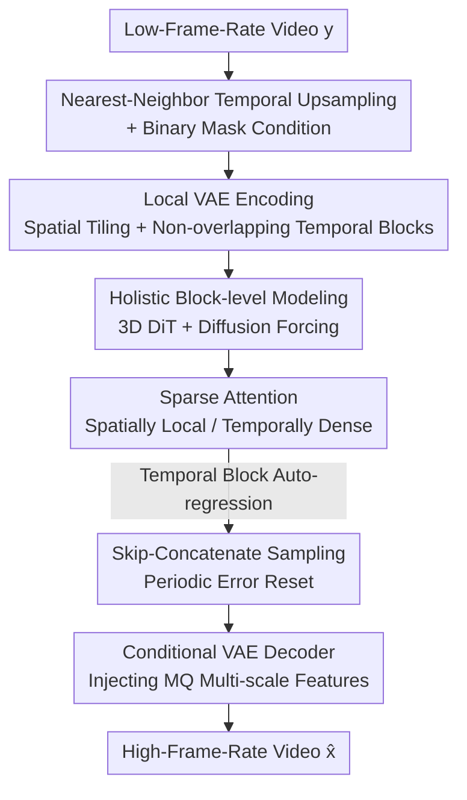

# Towards Holistic Modeling for Video Frame Interpolation with Auto-regressive Diffusion Transformers

**Conference**: CVPR 2026  
**Paper**: [CVF Open Access](https://openaccess.thecvf.com/content/CVPR2026/html/Peng_Towards_Holistic_Modeling_for_Video_Frame_Interpolation_with_Auto_regressive_Diffusion_CVPR_2026_paper.html)  
**Code**: https://github.com/xypeng9903/LDF-VFI  
**Area**: Video Generation / Video Frame Interpolation / Diffusion Models  
**Keywords**: Video Frame Interpolation, Auto-regressive Diffusion, Diffusion Forcing, Sparse Attention, 4K Scalability  

## TL;DR
LDF-VFI transforms Video Frame Interpolation (VFI) from "independent triplet processing" to "unified holistic modeling." By using an auto-regressive Diffusion Transformer, it synthesizes all frames within a temporal block simultaneously. Coupled with skip-concatenate sampling to suppress auto-regressive error accumulation, and sparse attention with tiled VAE for training-free 4K generalization, it achieves SOTA in long-video temporal consistency.

## Background & Motivation

**Background**: Video Frame Interpolation (synthesizing intermediate frames between existing ones for slow motion, view synthesis, etc.) has long been dominated by two categories: optical flow/kernel-based methods (RIFE, AMT, EMA-VFI, BiM-VFI) which estimate intermediate motion to warp input frames, and recent diffusion-based methods (LDMVFI, EDEN, MA-DIFF) which are more robust to complex non-linear motions.

**Limitations of Prior Work**: Regardless of using flow or diffusion, most methods are **frame-centric**—decomposing VFI into independent triplets: synthesizing $\hat{x}_1$ from $y_0, y_1$, then independently synthesizing $\hat{x}_2, \hat{x}_3, \dots$. This introduces two major issues: first, the lack of temporal correlation between independently generated triplets leads to jitter and motion artifacts in long sequences; second, the quadratic complexity of full attention in vanilla DiT cannot handle high-resolution video like 4K.

**Key Challenge**: The ideal approach is to synthesize the entire high-frame-rate video in one inference pass to ensure temporal consistency, but the memory and compute costs for full video sequences are prohibitive. Conversely, degrading to triplet-wise processing to save resources sacrifices temporal context. Consistency and scalability have become opposites in the current paradigm.

**Goal**: Decompose into three sub-problems: ① Intra-block consistency: partition video into fixed-length temporal blocks and synthesize all frames within a block in one pass; ② Inter-block consistency: link block outputs auto-regressively to maintain long-range coherence; ③ Resolution scalability: efficiently scale to 4K.

**Key Insight**: The authors advocate for a **video-centric** holistic modeling perspective—modeling the joint conditional distribution $q(x \mid y)$ of the "entire high-frame-rate video conditioned on sparse inputs." A key observation is that VFI is a **strongly conditioned task**; the low-frame-rate inputs already define the global structure. Thus, even if a temporal block is generated independently of its immediate context, no significant discontinuity is introduced—this premise enables the later "error reset" mechanism.

**Core Idea**: Use an auto-regressive Diffusion Transformer for block-level modeling (holistic intra-block synthesis + inter-block auto-regression), employ skip-concatenate sampling to "periodically zero out" inherent auto-regressive error accumulation, and stack sparse attention with tiled VAE to push the scheme to 4K.

## Method

### Overall Architecture

LDF-VFI (Local Diffusion Forcing for VFI) takes a low-frame-rate video $y \in \mathbb{R}^{T\times H\times W\times 3}$ as input and outputs a high-frame-rate video $x \in \mathbb{R}^{(sT)\times H\times W\times 3}$ (where $s$ is the temporal upsampling factor). The process runs in latent space: LQ videos are aligned to the target frame count via nearest-neighbor temporal upsampling, paired with a binary mask marking observed frames, and encoded into latents via a 3D VAE with spatial tiling and non-overlapping temporal blocks. A modified 3D DiT (from Wan2.1) in latent space is trained with flow matching/diffusion forcing and sparse attention. During inference, frames are generated auto-regressively by temporal blocks using skip-concatenate sampling. Finally, a conditional VAE decoder (injecting multi-scale LQ features) reconstructs clear high-frame-rate video.

Formally, the authors extend the target distribution to a joint latent distribution:

$$q(x, z \mid y) := \underbrace{q(x \mid y)}_{\text{target}}\;\underbrace{q(z \mid x)}_{\text{VAE Encoder}}, \qquad p_\theta(x, z \mid y) := \underbrace{p_\theta(z \mid y)}_{\text{Latent Diffusion}}\;\underbrace{p_\theta(x \mid z, y)}_{\text{VAE Decoder}}$$

The model consists of a latent diffusion (flow-matching) model $p_\theta(z \mid y)$ fitting $q(z \mid y)$, and a conditional VAE decoder $p_\theta(x \mid z, y)$ reconstructing video from latents $z$ conditioned on $y$.

### Key Designs

**1. Holistic Block-level Modeling: Unifying Intra-block Synthesis and Inter-block Auto-regression with Diffusion Forcing**

To address the loss of temporal context in frame-centric paradigms, the authors model the joint conditional distribution of the entire video. Since one-pass inference for a full sequence is memory-prohibitive, the video is sliced into fixed-length temporal blocks (e.g., 20 frames). Each block is synthesized in one pass, ensuring intra-block consistency via "simultaneous denoising." Inter-block coherence is maintained via **auto-regression**, allowing the processing of arbitrary lengths with constant memory.

The key to merging "intra-block holistic" and "inter-block auto-regression" is **diffusion forcing** training: unlike standard diffusion which applies a uniform noise level to a sequence, this method samples **independent noise levels** $\sigma_1, \sigma_2, \sigma_3, \dots$ for each GT block's VAE latents. The model learns to "predict the velocity field of the current block conditioned on other blocks at arbitrary noise levels." During inference, previously generated clean blocks can serve as conditions for denoising the current block. The underlying objective uses flow matching: learning velocity fields along linear interpolation paths $x_t = (1-t)x_0 + t x_1$, with loss $\mathcal{L}_{FM} = \mathbb{E}\big[\lVert v_\theta(x_t, t) - (x_1 - x_0)\rVert^2\big]$. Inference uses Euler ODE integration from $t=1$ to $t=0$.

Video conditioning uses **channel concatenation** instead of cross-attention to explicitly preserve spatio-temporal correspondence between LQ inputs and target sequences. Since pre-trained VAEs are sensitive to zero-filled irregular inputs, the authors use **nearest-neighbor temporal upsampling** to align LQ to target frames, paired with a binary mask (encoded via nearest-neighbor spatial downsampling + pixel shuffle). This naturally supports VFI with **arbitrary or non-integer downsampling ratios**. Ablations (Table 6) show nearest-neighbor upsampling improves keyframe reconstruction PSNR from 28.40 (zero-fill) to 30.87, and LPIPS from 0.011 to 0.006.

**2. Skip-concatenate Sampling: Periodic "Zeroing" of Inherent Auto-regressive Error Accumulation**

Auto-regressive generation suffers from **exposure bias**: training on GT context while inferring on its own imperfect outputs leads to error propagation and quality degradation. In traditional causal auto-regression, each new block depends on the immediate (potentially erroneous) predecessor, causing monotonic error growth.

The authors use the insight that VFI is a strongly conditioned task where global structure is fixed by inputs. Thus, generating a block independent of its immediate context does not cause significant incoherence. They design a **skip-concatenate** sequence: first, generate a **skip chunk**—this block **does not depend on the immediate context** and is generated independently, thereby "breaking the dependency chain and resetting accumulated error." Second, generate a **concatenate chunk** conditioned on both the previous skip chunk and the new skip chunk to bridge the temporal gap. By periodically resetting the state with independent skip chunks, error accumulation is capped at a **constant level** regardless of video duration. Ablations (Table 3) show switching from causal to skip-concatenate reduces average FVD from 22.67 to 17.05 (↓24.8%).

**3. Sparse Attention + Tiled VAE: Spatially Local, Temporally Dense for 4K Scalability**

To achieve 4K resolution without being bottlenecked by full attention's quadratic complexity, the DiT employs **hybrid sparse attention**: **block-based window attention** in the spatial dimension (restricting attention to local blocks where the receptive field grows efficiently across layers) and **full attention** in the temporal dimension (where sequences are short and fixed). This captures complex non-local temporal correlations while remaining efficient spatially.

The foundation of this sparsity is **tiled VAE encoding**: each frame is sliced into overlapping spatial tiles (e.g., $256\times256$ tile, stride 192), encoded independently, and blended in latent space using a linear ramp. Temporal dimensions use **non-overlapping blocks**. This provides constant memory usage, seamless boundaries, and a regular spatio-temporal latent grid exploitable by sparse attention. The model can **generalize to unseen resolutions** such as 4K during inference (using Ulysses Sequence Parallelism, 2x 80GB GPUs suffice). Ablations (Table 5) demonstrate full attention fails at 4K (X4K-16× FVD at 772.32, RT 22.6s), while sparse attention achieves 120.40 FVD and 4.0s RT.

**4. Conditional VAE Decoder: Injecting LQ Multi-scale Features to Restore Details**

Standard VAE reconstruction often loses fine-grained details. Inspired by ControlNet, the authors design a **conditional VAE decoder**: a specialized condition encoder mirrors the main decoder structure to extract multi-scale spatio-temporal features from LQ input videos, injected via **zero-initialized convolutions + residual connections**. Zero-initialization ensures training stability without disrupting the original decoder's parameters, while multi-scale injection provides fine-grained guidance throughout reconstruction, improving per-frame sharpness and temporal coherence. Ablations (Table 3) show adding the conditional VAE to skip-concatenate reduces average LPIPS from 0.060 to 0.051 (↓17.8%).

### Loss & Training
The DiT is initialized from Wan2.1 T2V pre-training and trained on the LAVIB dataset for 16,000 steps (batch size 256) using flow matching loss (timestep shift = 5). Spatio-temporal resolution is fixed at $60\times512\times512$ during training, with LQ temporal downsampling factors sampled uniformly between 2–16. The VAE decoder is fine-tuned on LAVIB with a frozen encoder using a composite loss = L1 + LPIPS + Adversarial + KL regularization (weights 1.0 / 1.0 / 0.5 / 1e-6, discriminator active after 5000 steps). Inference uses 16-step Euler ODE (timestep shift = 8).

## Key Experimental Results

### Main Results

The authors note that standard frame-centric benchmarks only provide adjacent frame pairs, failing to evaluate holistic video modeling. They propose two **video-centric benchmarks**: SNU-FILM-entire and X4K-entire (downsampling full videos at 4×/8×/16×). Performance is measured via LPIPS / FVD / VFIPS / FloLPIPS (jointly measuring per-frame fidelity and temporal consistency), deliberately avoiding PSNR/SSIM.

Comparison on SNU-FILM-entire (Selected results, lower is better):

| Method | 4× FVD↓ | 8× FVD↓ | 16× FVD↓ | 16× LPIPS↓ | 16× FloLPIPS↓ |
|------|---------|---------|----------|-----------|---------------|
| RIFE [ECCV'22] | 9.02 | 25.30 | 69.76 | 0.110 | 0.182 |
| EMA-VFI [CVPR'23] | 15.28 | 38.16 | 101.67 | 0.115 | 0.209 |
| BiM-VFI [CVPR'25] | 10.78 | 21.52 | 38.26 | 0.074 | 0.118 |
| EDEN [CVPR'25] | 10.64 | 26.03 | 58.83 | 0.078 | 0.128 |
| **LDF-VFI (Ours)** | **8.21** | **15.01** | **26.26** | 0.078 | **0.117** |

LDF-VFI achieves the **best FVD across all settings**, with a significant lead in the 16× large-motion scenario (FVD 26.26 vs. 38.26 for the runner-up BiM-VFI), while maintaining competitive per-frame LPIPS. Results on X4K-entire (16×) also show FVD leadership:

| Method | X4K-16× FVD↓ | LPIPS↓ | FloLPIPS↓ |
|------|--------------|--------|-----------|
| BiM-VFI | 69.83 | **0.055** | **0.065** |
| EDEN | 1586.99 | 0.454 | 0.491 |
| **LDF-VFI (Ours)** | **51.41** | 0.071 | 0.082 |

Note: EDEN (frame-centric diffusion baseline) collapses during recursive inference on X4K (FVD 1586.99), highlighting the fragility of triplet-based paradigms in 4K large-motion scenarios.

### Ablation Study

| Config (AR Order / VAE) | Avg LPIPS↓ | Avg FVD↓ | Description |
|----------------------|-------------|-----------|------|
| Causal + Uncond. | 0.062 | 22.67 | Traditional AR + Original Wan2.1 Decoder |
| Skip-concat + Uncond. | 0.060 (↓3.2%) | 17.05 (↓24.8%) | Swap to skip-concatenate, temporal gain |
| Skip-concat + Cond. | 0.051 (↓17.8%) | 16.49 (↓27.2%) | Add conditional VAE, per-frame quality gain |

| Attention (X4K-16×) | FVD↓ | RT(s)↓ | Description |
|------------------|------|--------|------|
| Full | 772.32 | 22.6 ×4 | Generalization failure at 4K, slow |
| Sparse | **120.40** | **4.0 ×4** | Compared at 6k steps / 4 sampling steps |

### Key Findings
- **Complementary Components**: Skip-concatenate primarily improves temporal consistency (FVD ↓24.8%), while the conditional VAE primarily improves per-frame perceptual quality (LPIPS ↓17.8%). Together, they achieve both coherence and high fidelity.
- **Sparsity is Necessary for 4K**: Full attention fails at 4K (FVD 772 vs 120) and is >5x slower. Sparse attention generalizes to unseen resolutions.
- **Sampling Step Trade-off**: Reducing from 16 to 2 steps only increases SNU-FILM-8× FVD from 15.01 to 21.25 while reducing RT from 3.36s to 0.42s, allowing flexible deployment.
- **Nearest-Neighbor Benefit**: Avoids distribution shift caused by irregular zero-padding for the VAE, improving keyframe reconstruction PSNR by +2.47dB.

## Highlights & Insights
- **Error Reset via Global Structure**: Leveraging the "strong condition" of VFI to break the error chain with independent skip chunks is a clever adaptation of auto-regression to VFI's unique constraints.
- **Locality Alignment**: Reusing the same locality principles for both tiled VAE encoding and sparse attention provides a unified solution for both memory and computational scalability.
- **Diffusion Forcing as a Bridge**: Independent noise levels allow a single model to handle both holistic intra-block synthesis and auto-regressive inter-block linking.
- **Training-free 4K Generalization**: Local encoding combined with sparse attention allows the model to handle arbitrary resolutions at inference time without retraining.

## Limitations & Future Work
- **Benchmark Comparability**: SNU-FILM-entire and X4K-entire are author-defined video-centric benchmarks where LDF-VFI's "whole-video access" provides a paradigm advantage over frame-centric baselines.
- **Per-frame LPIPS**: On X4K, LDF-VFI's LPIPS/FloLPIPS still lags behind BiM-VFI; its strengths are concentrated in temporal/distributional metrics like FVD.
- **Inference Cost**: 4K requires multi-GPU (2–4x 80GB) and seconds per frame (~3s/frame). The high dependency on Wan2.1 and LAVIB data increases the barrier to reproduction.
- **Skip-chunk Boundary Conditions**: The "independent generation" insight relies on strong conditions. In extremely sparse input scenarios, independent skip chunks might introduce jumps.

## Related Work & Insights
- **vs. Flow-based Methods (RIFE, BiM-VFI)**: These methods are fast and accurate for linear motion but fail under non-linear motion and occlusion. LDF-VFI trades compute for robustness via generative modeling.
- **vs. Frame-centric Diffusion (EDEN, MA-DIFF)**: These overlook dependencies between generated frames, leading to temporal inconsistency. LDF-VFI's block-level auto-regression directly addresses this weakness.
- **vs. AR Video Diffusion**: Common AR models use scheduled sampling or kl-divergence to mitigate exposure bias. LDF-VFI's skip-concatenate is a lighter, task-specific solution for VFI.

## Rating
- Novelty: ⭐⭐⭐⭐ Holistic video-centric modeling + skip-concatenate error reset is a distinct paradigm shift in VFI.
- Experimental Thoroughness: ⭐⭐⭐⭐ Extensive evaluation on new benchmarks with four metrics and comprehensive ablations, though cross-paradigm comparisons have caveats.
- Writing Quality: ⭐⭐⭐⭐ Clear derivation of the solution from the motivation; intuitive diagrams.
- Value: ⭐⭐⭐⭐ Provides a practical 4K-scalable paradigm for long-video large-motion VFI with open-source code.

<!-- RELATED:START -->

## Related Papers

- [\[ICLR 2026\] Realtime Video Frame Interpolation Using One-Step Diffusion Sampling](../../ICLR2026/video_generation/realtime_video_frame_interpolation_using_one-step_diffusion_sampling.md)
- [\[CVPR 2026\] A Frame is Worth One Token: Efficient Generative World Modeling with Delta Tokens](a_frame_is_worth_one_token_efficient_generative_world_modeling_with_delta_tokens.md)
- [\[ICLR 2026\] FastCar: Cache Attentive Replay for Fast Auto-Regressive Video Generation on the Edge](../../ICLR2026/video_generation/fastcar_cache_attentive_replay_for_fast_auto-regressive_video_generation_on_the_.md)
- [\[ICML 2026\] Quant VideoGen: Auto-Regressive Long Video Generation via 2-Bit KV-Cache Quantization](../../ICML2026/video_generation/quant_videogen_auto-regressive_long_video_generation_via_2-bit_kv-cache_quantiza.md)
- [\[CVPR 2026\] ReHyAt: Recurrent Hybrid Attention for Video Diffusion Transformers](rehyat_recurrent_hybrid_attention_for_video_diffusion_transformers.md)

<!-- RELATED:END -->
