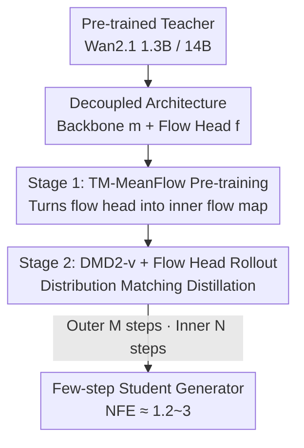

# Transition Matching Distillation for Fast Video Generation

**Conference**: CVPR 2026  
**Paper**: [CVF Open Access](https://openaccess.thecvf.com/content/CVPR2026/html/Nie_Transition_Matching_Distillation_for_Fast_Video_Generation_CVPR_2026_paper.html)  
**Code**: None  
**Area**: Video Generation / Diffusion Model Distillation  
**Keywords**: Video Diffusion Distillation, Few-Step Generation, Transition Matching, MeanFlow, Distribution Matching Distillation

## TL;DR
TMD decouples a video diffusion teacher model into a student consisting of a "backbone (for semantic extraction) + lightweight flow head (for iterative detail refinement)". It then employs a two-stage training strategy: "TM-MeanFlow pre-training of the flow head + DMD2-v distribution matching distillation with flow head rollout." This approach distills Wan2.1 1.3B/14B into 1-to-4-step generators, outperforming existing distillation methods in both visual fidelity and text alignment at a comparable inference cost.

## Background & Motivation
**Background**: Large-scale video diffusion/flow models (such as HunyuanVideo, Wan, Cosmos, Sora, Veo, and Kling) are capable of generating coherent and realistic videos from text. However, they rely on multi-step denoising sampling—often requiring dozens or hundreds of iterative steps—to gradually transform noise into clear videos.

**Limitations of Prior Work**: This iterative sampling leads to high inference latency and high computational consumption, making large video diffusion models virtually unusable in real-time interactive scenarios (such as real-time video generation, content editing, and world models for agent training). To accelerate this process, numerous "diffusion distillation" works have squeezed long denoising trajectories into a few steps. These belong to two main families: trajectory distillation (knowledge distillation, consistency models, which directly regress the teacher's trajectory) and distribution distillation (adversarial, variational score distillation, which align the student's distribution with the teacher's distribution). In the image domain, they can already compress the process to 1-2 steps.

**Key Challenge**: Applying these methods to videos is highly challenging. Videos exhibit high spatiotemporal dimensions and complex inter-frame dependencies, requiring distillation to preserve both global motion coherence and fine-grained spatial details. More crucially, **most existing methods treat the diffusion network as an indivisible monolithic mapping**, ignoring the hierarchical structure and semantic progression inside large video diffusion backbones—specifically, "extracting semantics first, then filling in details."

**Goal**: To distill video diffusion models into extremely few-step (e.g., <4 steps) generators without sacrificing visual quality, while providing a knob to **flexibly trade off between speed and quality**.

**Key Insight**: The authors start from Transition Matching (TM)—which approximates multi-step denoising as a compact "few-step transition process" where each transition step leaps across widely separated noise levels, enabling the student to take large steps while matching the teacher's distribution. This is combined with the observation that the diffusion backbone possesses a hierarchical structure that can be decoupled into "the early majority of layers responsible for semantics" and "the last few layers responsible for detail refinement."

**Core Idea**: The teacher is decoupled into a "backbone + flow head", allowing the flow head to perform several lightweight "inner flow" refinements within each major transition step. Thus, using a two-level structure of "outer few-step transitions + inner lightweight refinements", the model balances semantic evolution and detail fidelity under a tight few-step budget.

## Method

### Overall Architecture
TMD aims to solve the problem of "distilling a multi-step video diffusion teacher into a 1-to-4-step student while preserving quality." Its core mechanism is split into two levels: the **outer loop** uses a small number of large transition steps (M steps) to jump from noise to data, where each step predicts an auxiliary variable $y=x_1-x$ (noise minus data, in DTM form) which deterministically computes the next state $x_{t_{i-1}}=x_{t_i}-(t_i-t_{i-1})y$; the **inner loop** then approximates the task of "predicting $y$" itself via an N-step lightweight flow.

To this end, the student is designed with a **decoupled architecture**: from the pre-trained teacher, it carves out (1) a backbone $m_\theta$—consisting of the majority of early layers, which takes the noisy sample $x_t$, timestep $t$, and textual condition $c$, to output semantic features $m_t$; and (2) a flow head $f_\theta$—the last few layers, which sequentially conducts N times of inner flow updates conditioned on $m_t$, refining a noisier $y_{s_j}$ into a cleaner $y_{s_{j-1}}$. Training proceeds in two stages: Stage 1 uses TM-MeanFlow to transform the flow head into a "flow map" capable of few-step refinement; Stage 2 applies an improved distribution matching distillation, DMD2-v, and **rolls out the flow head** at each transition step to align the student's transition distribution with the teacher's denoising distribution.

### Key Designs

**1. Decoupled Architecture: Decoupling the teacher into a "semantic backbone + lightweight flow head" to allow multiple detail refinements within one transition step**

Existing distillation approaches treat the diffusion network as a single mapping, failing to flexibly balance "taking large steps to save computation" and "preserving details." TMD decouples the pre-trained teacher into a backbone $m_\theta$ (a feature extractor containing most of the layers) and a flow head $f_\theta$ (the last few layers performing iterative refinement). At each outer transition step $t_i$, the flow head iteratively predicts $y$ conditioned on the backbone features:

$$y_{s_{j-1}} \leftarrow f_\theta\big(y_{s_j}, s_j, s_{j-1}; m_\theta(x_{t_i}, t_i)\big)$$

where $0=s_0<s_1<\cdots<s_N=1$ is the discretization of the inner flow time. In this way, the backbone computes semantics only once, and the flow head reusing them to perform several lightweight refinement steps. This provides a knob to trade off speed and quality simply by adjusting $N$ (inner steps) and $H$ (number of flow head layers). Two exquisite details in the design are: the target of the flow head adopts the DTM form $y=x_1-x$ (which empirically outperforms directly predicting the sample $y=x$); the primary features $m_{t_i}$ and the noisy $y_{s_j}$ are merged using a **time-conditioned gated fusion layer**, ensuring that the student's initial forward pass is consistent with the teacher's, thereby minimizing perturbation to the pre-trained model.

**2. Transition Matching MeanFlow (TM-MF) Pre-training: Using MeanFlow to transform the flow head into a "few-step sufficient" inner flow map**

Directly training the flow head with flow matching to approximate the inner velocity theoretically still requires many inner steps to yield a high-quality $y$, which defeats the purpose of few-step generation. TMD borrows from MeanFlow—which learns the flow map of the average velocity rather than the instantaneous velocity: $f(y_s,s,r)=y_s+(s-r)u(y_s,s,r)$. By leveraging the following identity, it converts the "integral" into a trainable objective:

$$u(y_s,s,r)+(s-r)\frac{d}{ds}u(y_s,s,r)=v(y_s,s)$$

The training objective is $\mathcal{L}(\theta)=\mathbb{E}\big[\lVert u_\theta(y_s,s,r)-\hat u\rVert^2\big]$, where $\hat u$ is constructed using stop-gradients to subtract the total derivative term from the target velocity. However, the authors found that **directly predicting the average velocity $u_\theta$ with the flow head yielded very poor results**. They hypothesized that the output of the flow head should remain close to that of the pre-trained teacher, which predicts the outer flow velocity. Hence, they reparameterized the average velocity as $u_\theta(y_s,s,r;m):=y_1-\mathrm{head}_\theta(y_s,s,r;m)$. Under this formulation, the output of $\mathrm{head}_\theta$ in the limit $r\to s$ naturally approximates the teacher’s velocity prediction, allowing the flow head to be initialized from the teacher's weights and only fine-tuned. Code engineering further introduces three stabilization techniques: degradating a portion of the batch to ordinary TM (flow matching), using CFG while randomly dropping text conditions, and adaptive loss normalization. Since direct calculation of JVP is difficult to implement under flash attention, FSDP, or context parallelism, a **finite difference approximation for JVP** is utilized, making the algorithm independent of specific architectures or training hacks. Ablation studies show that TM-MF provides a superior initialization for the second stage compared to pure TM (where TM can be viewed as a special case of MeanFlow when $r=s$).

**3. DMD2-v + Flow Head Rollout Distillation: Adapting DMD2 for video and rolling out the flow head to backpropagate gradients through the entire inner flow, eliminating training-inference mismatch**

The second stage employs distribution matching distillation to align student and teacher distributions. Since the original DMD2 was designed for images, the authors identified three modifications that perform superiorly on video, collectively named **DMD2-v**: (1) **Conv3D for the GAN discriminator**—handling joint spatiotemporal features outperforms space-time factored (Conv1D-2D) convolutions or attention heads, proving that local spatiotemporal features are crucial for the GAN loss; (2) **Applying KD warm-up only to 1-step distillation**—while KD warm-up helps 1-step generation, in multi-step generation it introduces coarse artifacts that DMD2 struggles to rectify; (3) **Timestep shifting**—when sampling outer transition steps or adding noise in the VSD loss, shifting the uniformly sampled $t'$ via $t=\frac{\sigma t'}{(\sigma-1)t'+1}$ ($\sigma\ge1$) boosts performance and prevents mode collapse (without shifting, severe collapse occurs, though it might not be fully reflected by VBench).

On top of this, **flow head rollout** is introduced: during distillation, the inner flow is unrolled and treated as a unified sample generator at each transition step $g_\theta(x_{t_i},t_i;y_1):=x_1-\mathrm{INNERFLOW}(m_\theta(x_{t_i},t_i))$. The VSD loss of DMD2-v is applied directly to this unrolled output, and **the gradient is backpropagated naturally through all N inner flow steps without detachment**. Because the flow head is very lightweight (e.g., taking the last 5 blocks from a 30-block DiT and unrolling 2 steps only incurs <17% additional student parameter update FLOPs), this remains highly efficient. This directly eliminates the mismatch of "no rollout during training but rollout during inference." The ablation (Figure 7) reveals that adding rollout leads to faster convergence and better performance.

### Loss & Training
- **Stage 1 (TM-MF Pre-training)**: MeanFlow objective $\mathcal{L}(\theta)=\mathbb{E}_{s,r,y_s}\lVert u_\theta-\hat u\rVert^2$, where the average velocity is reparameterized as $u_\theta=y_1-\mathrm{head}_\theta$, and the flow head is initialized from the teacher. The instantaneous velocity is approximated by the conditional velocity $v(y_s,s)=y_1-y$, and the total derivative is approximated by finite differences.
- **Stage 2 (DMD2-v Distillation)**: Variational Score Distillation (VSD/reverse KL) to align distributions + Conv3D GAN loss. The fake score is initialized with the teacher's weights and continuously trained on student data, while the discriminator is a lightweight head acting on fake score/teacher intermediate features. VSD gradients flow through the unrolled inner flow.
- **Data/Teacher**: The teacher is Wan2.1 1.3B / 14B T2V-480p. The training dataset consists of 500k text-video pairs (prompts sourced from VidProM and expanded by Qwen-2.5; videos generated by Wan2.1 14B). The latent resolution is $[T,H,W]=[21,60,104]$, decoded into 81 frames at 480×832.

## Key Experimental Results

**Custom Metric—Effective NFE**: For a fair computational comparison, the authors define NFE as the total number of DiT blocks used during generation divided by the number of teacher layers $L$. For baselines, this is simply the step count $M$, while for TMD it is computed as:

$$\text{Effective NFE}:=M\Big(1+\frac{(N-1)H}{L}\Big)$$

where $N$ is the number of inner steps and $H$ is the number of flow head blocks (with $L=30$ for Wan2.1 1.3B and $L=40$ for 14B). This allows TMD to achieve **fractional NFEs**, enabling a more fine-grained control of the quality-efficiency trade-off than integer-step baselines. The configuration name N2H5 indicates 2 inner steps and 5 flow head blocks.

### Main Results

Distilling Wan2.1 1.3B (VBench Overall score):

| Method | NFE | Overall | Quality | Semantic |
|------|-----|---------|---------|----------|
| rCM (Strongest baseline) | 4 | 84.43 | 85.38 | 80.63 |
| DMD2-v | 4 | 84.60 | 86.03 | 79.87 |
| rCM | 2 | 84.09 | 84.90 | 80.86 |
| DMD2-v | 2 | 84.39 | 85.65 | 79.32 |
| **TMD-N2H5** | **2.33** | **84.68** | **85.71** | **80.55** |
| rCM | 1 | 82.65 | 83.60 | 78.82 |
| DMD2-v | 1 | 83.24 | 84.28 | 79.10 |
| **TMD-N2H5** | **1.17** | **83.80** | **85.07** | **78.69** |

TMD with NFE=2.33 exceeds the strongest baseline rCM at NFE=4; at nearly one step (NFE=1.17), it also beats all single-step distillation methods.

Distilling Wan2.1 14B:

| Method | NFE | Overall | Quality | Semantic |
|------|-----|---------|---------|----------|
| Wan2.1 14B (Teacher) | 50×2 | 86.22 | 86.67 | 84.44 |
| rCM | 1 | 83.02 | 83.57 | 80.81 |
| DMD2-v | 1 | 83.69 | 84.46 | 80.61 |
| **TMD-N4H5** | **1.38** | **84.24** | **84.89** | **81.65** |

In the single-step setting, TMD-N4H5 (NFE=1.38) outperforms 1-step rCM by +1.22 without requiring the expensive KD warm-up of DMD2-v. **User Preference Study** (vs DMD2-v, 14B): in the 2-step setup, visual quality win rate is 63.3%, text alignment is 71.9%; in the 1-step setup, visual quality is 51.8% and text alignment is 63.2%—the advantage in text alignment is particularly pronounced, validating the role of inner flow head refinement in prompt following. (Note: Under the 2-step setting for 14B, TMD-N4H5 does not outperform the 2-step baseline, though it beats 4-step DMD2-v, which the authors honestly acknowledge.)

### Ablation Study

| Configuration | Overall | Notes |
|------|---------|------|
| Conv3D Discriminator | 83.24 | Default, optimal |
| Conv1D-2D Discriminator | 82.32 | Spatiotemporal factored convolution, drops by 0.92 |
| Attention Discriminator | 82.36 | Flattened into token self-attention |
| w/o GAN | 81.63 | Removing GAN loss drops by 1.61 |
| Two-step w/ KD warm-up | 83.79 | Multi-step performs worse instead |
| Two-step w/o KD warm-up | 84.39 | Hence, KD is not used for multi-step |
| Two-step w/ timestep shift | 84.39 | Default |
| Two-step w/o timestep shift | 83.44 | Drops by 0.95, and causes mode collapse |
| N4H5 pre-training TM-MF | 84.67 | Outperforms pure TM |
| N4H5 pre-training TM | 84.29 | Drops by 0.38 |

### Key Findings
- **GAN loss and Conv3D discriminator contribute significantly**: Removing the GAN loss drops performance by 1.61, and replacing the Conv3D head drops it by around 0.9, illustrating that local spatiotemporal features are essential for video adversarial losses.
- **KD warm-up is "friendly for 1-step but harmful for multi-step"**: It is beneficial for 1-step generation but introduces coarse artifacts in multi-step generation that are difficult to correct, meaning it should only be used in 1-step settings—a common pitfall when migrating DMD2 from images to videos.
- **Timestep shifting is indispensable**: Disabling timestep shifting triggers severe mode collapse that might not be easily reflected in VBench scores.
- **Flow head rollout enables faster convergence and higher performance**: Directly eliminating the mismatch between training and inference yields immediate rewards.
- **Quality scales monotonically with effective NFE**: Increasing effective NFE by raising $N$ and $H$ yields a consistent rise in VBench overall scores, verifying the fine-grained speed/quality control knob provided by TMD.

## Highlights & Insights
- **Directly utilizing network structural hierarchy as a design freedom**: The backbone extracts semantics while the flow head fills in details. This decoupling allows for the "outer large step + inner lightweight refinement" dual-level sampling process, presenting a fundamental departure from treating the network as a black-box to compress step counts.
- **Fractional NFE is an ingenious engineering abstraction**: Since the flow head occupies only a fraction of the layers, unrolling a few steps introduces negligible compute overhead. Consequently, the effective NFE can take fractional values like 1.17, 1.38, or 2.33, filling out the quality-efficiency frontier more densely and giving finer control than integer-step baselines.
- **Flow head rollout without gradient detachment**: Simulating the inference-time inner flow during training and backpropagating gradients throughout the entire path beautifully resolves the training-inference mismatch. This approach can easily be extended to other frameworks utilizing dual-level iterative sampling/distillation.
- **Reparameterization trick for MeanFlow**: Forcing the head to predict a teacher-like velocity ($u_\theta=y_1-\mathrm{head}_\theta$) rather than directly predicting the average velocity aligns the teacher-initialized head naturally with the teacher in the limit. This concept of "ensuring a new module gracefully degrades to a known well-performing module" is highly instructive.

## Limitations & Future Work
- **14B two-step setup did not outperform the baseline**: TMD-N4H5 (NFE=2.75) under the 14B two-step setup did not surpass the two-step rCM/DMD2-v, only taking a significant lead in the single-step setting. This indicates its advantage is centered around ultra-few-step regimes.
- **Reliance on a massive volume of synthetic data and strong teacher models**: The distillation quality upper bound is constrained by the teacher trained on 500k text-video pairs generated by Wan2.1 14B, and whether the flaws of the teacher itself are inherited remains unexplored.
- **Teacher velocities not directly used to represent inner velocities**: The authors approximate the inner velocity using the conditional velocity $y_1-y$ and suggest that for a specific $y$, the inner velocity can be derived analytically from the teacher's velocity, leaving this execution to future work (which could further boost pre-training quality).
- **Hyperparameters (N, H, shift $\sigma$) require tuning per model size**: 1.3B utilizes N2H5 whereas 14B leverages N4H5; transferring this structure to a new teacher requires re-searching the optimal configuration of this knob.

## Related Work & Insights
- **vs Trajectory Distillation (Consistency Models / MeanFlow / rCM)**: These directly learn point-to-point mappings along the ODE trajectory, which is hard to scale and prone to training instability in high-dimensional, high-curvature video settings. TMD circumvents this by applying MeanFlow solely for lightweight refinement inside the flow head's inner loop, leaving the outer layer to distribution matching.
- **vs DMD2 (Distribution Distillation for Images)**: The second stage of TMD functions as a systematically enhanced video version of DMD2 (DMD2-v: Conv3D discriminator + 1-step exclusive KD + timestep shifting) augmented with flow head rollout, tailored to combat video spatiotemporal properties and mode collapse.
- **vs Transition Matching (TM)**: TMD inherits the core concept of TM—using few-step probability transitions to approximate multi-step denoising. However, it shifts the objective from training a generative model from scratch to distilling a pre-trained teacher, squeezing TM's typical ~30-step transition down to <4 steps via the decoupled architecture and MeanFlow.

## Rating
- Novelty: ⭐⭐⭐⭐ Seamlessly integrates structural decoupling, TM, MeanFlow, and DMD2 into a self-consistent dual-level few-step video distillation framework. Robust combination of innovations.
- Experimental Thoroughness: ⭐⭐⭐⭐ Evaluated across two model scales (1.3B/14B) with VBench, user studies, three sets of DMD2-v ablations, and rollout/pre-training ablations. Accurately acknowledges that 14B two-step did not meet the standard.
- Writing Quality: ⭐⭐⭐⭐ Clear presentation of the dual-level architecture and two-stage training strategy, along with formalized math and unified naming conventions (N×H×, effective NFE).
- Value: ⭐⭐⭐⭐ Successfully compresses large video diffusion models down to 1-2 steps with comparable quality, which is highly practical for real-time video generation and world models. The fractional NFE knob offers strong engineering utility.

<!-- RELATED:START -->

## Related Papers

- [\[CVPR 2026\] Reward Forcing: Efficient Streaming Video Generation with Rewarded Distribution Matching Distillation](reward_forcing_efficient_streaming_video_generation_with_rewarded_distribution_m.md)
- [\[ICML 2026\] SGMD: Score Gradient Matching Distillation for Few-Step Video Diffusion](../../ICML2026/video_generation/sgmd_score_gradient_matching_distillation_for_few-step_video_diffusion_distillat.md)
- [\[CVPR 2026\] Flowception: Temporally Expansive Flow Matching for Video Generation](flowception_temporally_expansive_flow_matching_for_video_generation.md)
- [\[CVPR 2026\] SURF: Signature-Retained Fast Video Generation](surf_signature-retained_fast_video_generation.md)
- [\[ICCV 2025\] Adversarial Distribution Matching for Diffusion Distillation Towards Efficient Image and Video Synthesis](../../ICCV2025/video_generation/adversarial_distribution_matching_for_diffusion_distillation_towards_efficient_i.md)

<!-- RELATED:END -->
