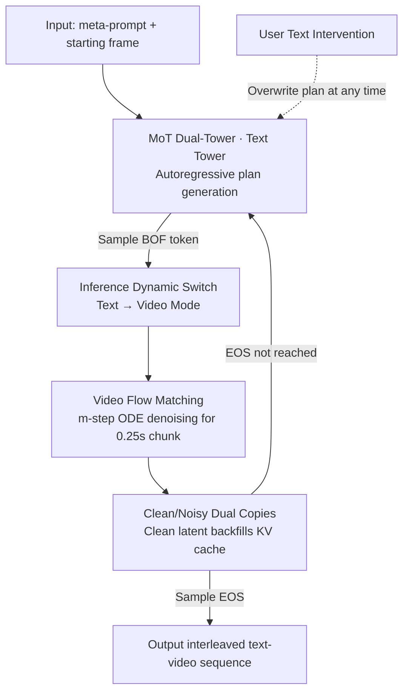

# TV2TV: A Unified Framework for Interleaved Language and Video Generation

**Conference**: CVPR 2026  
**Paper**: [CVF Open Access](https://openaccess.thecvf.com/content/CVPR2026/html/Han_TV2TV_A_Unified_Framework_for_Interleaved_Language_and_Video_Generation_CVPR_2026_paper.html)  
**Area**: Video Generation / Multimodal  
**Keywords**: Interleaved Generation, Video Flow Matching, Mixture-of-Transformers, Controllable Video Generation, Visual Planning

## TL;DR
TV2TV utilizes a unified Transfusion-style model to decompose video generation into an interleaved process: first "thinking" about what will happen next in text, then "acting" it out in pixels. This allows the language tower to handle semantic decisions while the video tower manages rendering. It simultaneously surpasses baselines such as "direct T2V" and "think-then-act" in both visual quality (91% win rate in human evaluation) and fine-grained controllability (+19 points in instruction following accuracy).

## Background & Motivation
**Background**: Video generation models (diffusion, flow matching, autoregressive) have made rapid progress in image quality. However, generation is typically a mapping from "a single text prompt → an entire video segment." Text acts only as an initial condition, leaving the temporal evolution entirely to the video model's internal imagination.

**Limitations of Prior Work**: When the target video requires significant semantic branching (e.g., whether a surfer continues or makes a sharp turn) or repetitive high-level reasoning (e.g., a player dribbling, then shooting, then celebrating), pure video models struggle to plan "what happens next." The model must act as both "scriptwriter" and "painter" in pixel space, often leading to semantic drift or physical inconsistencies (e.g., wall-clipping, teleportation, unnatural motion). Furthermore, this "one-shot" generation allows for almost no mid-stream intervention: users have no handle to change the plot's direction.

**Key Challenge**: Deciding "what happens next" is a low-dimensional, semantically dense discrete decision problem better suited for language models. Rendering it into pixels is a high-dimensional continuous problem suited for video models. Existing T2V models compress both tasks into the video tower, wasting LLM reasoning capabilities and increasing the entropy of video generation.

**Goal**: (1) Enable the model to automatically decompose video generation into an interleaved process of "textual planning + video rendering"; (2) Ensure this planning is readable, editable, and controllable at any moment.

**Key Insight**: In video games, controller actions and subsequent frames are naturally aligned—action sequences serve as a ready-made "textual script." The authors hypothesize that if the model "thinks in words" before generating each short visual segment, offloading the semantic burden to the language tower allows the video tower to render based on a specific plan, improving both quality and controllability.

**Core Idea**: A Mixture-of-Transformers (MoT) dual-tower model is used to jointly learn "next-token prediction (text)" and "next-frame prediction (video flow matching)." During inference, a special BOF token dynamically switches the model between "thinking in words" and "acting in pixels."

## Method

### Overall Architecture
TV2TV organizes training samples into **chronologically interleaved** sequences of "text segments + video frame chunks." Text is placed before the visual segment it describes, allowing video generation to be conditioned on the newly generated plan. Globally, the model is autoregressive and strictly follows temporal causality (each token/chunk only attends to earlier content). Within a single frame chunk (4 frames packed into a 0.25s latent chunk), it is non-autoregressive, using flow matching to denoise the entire chunk at once. The architecture uses a Mixture-of-Transformers (MoT) dual-tower design: the text and video towers have specialized attention and FFN parameters but share a self-attention mechanism across the whole sequence. The text tower is initialized from a pre-trained Llama. During inference, the model defaults to text-mode autoregressive generation. Upon sampling a BOF (beginning-of-frame) token, it switches to video mode to run $m$-step ODE denoising, then switches back to text—repeating until an EOS is reached.

### Key Designs

**1. Interleaved Text-Video Sequences and BOF/EOF Switching: Embedding "Thinking" and "Painting" into one sequence**

A pain point of pure T2V is the mixing of semantic decision-making and rendering. TV2TV represents data as an interleaved sequence sorted by timestamps: text segments followed by their corresponding frame chunks. This makes video generation explicitly conditioned on the "just-planned" thought. Formally, each video frame position is expanded into a $[x^{txt}_i, x^{noisy\text{-}vid}_i, x^{clean\text{-}vid}_i]$ triplet, making the sequence:

$$[x^{txt}_1, x^{noisy\text{-}vid}_1, x^{clean\text{-}vid}_1, \dots, x^{txt}_N, x^{noisy\text{-}vid}_N, x^{clean\text{-}vid}_N]$$

To let the model learn when to stop writing and start painting, two special tokens are introduced: BOF (beginning-of-frame) and EOF (end-of-frame). Mode switching is not governed by external scripts but occurs naturally when the model samples a BOF token—a key difference from "interactive world models" where switching is often fixed.

**2. Clean/Noisy Dual-Copy Latents: Resolving the Conflict between Teacher-Forcing and Flow Matching**

Flow matching requires **noisy interpolated representations** as input for denoising targets, while autoregressive teacher-forcing requires **clean representations** from historical positions to serve as context for subsequent generation. A single frame latent cannot be both noisy and clean. Unlike MAGI-1, which enforces monotonic noise, TV2TV keeps two copies of each video frame in the input sequence: a noisy chunk $x^{noisy\text{-}vid}_i$ followed by its clean version $x^{clean\text{-}vid}_i$. This allows the model to perform denoising learning on the current frame while maintaining a clean historical context, removing the conflict between these objectives.

**3. MoT Dual-Tower and Transfusion-Style Joint Training: Specialized Tasks with Shared Context**

To model both discrete text and continuous video, TV2TV adopts MoT: text and video each have modality-specific $Q/K/V$, $O$ projections, and FFNs, but self-attention is computed **across the entire interleaved sequence**. This preserves modality-specific processing while maintaining global multimodal context. The text tower is initialized from Llama-3.2-3B or Llama-3.1-8B, inheriting LLM reasoning capabilities. The video side uses a Cosmos VAE tokenizer (4x temporal compression) to obtain continuous latents, projected via a U-Net downsampler (injecting timestep and 2D position embeddings). Training optimizes a weighted sum of text cross-entropy and video flow loss:

$$\mathcal{L} = \lambda_{txt}\,\mathcal{L}_{txt} + \lambda_{vid}\,\mathcal{L}_{vid}$$

Noisy latents are obtained via rectified flow: $x^{noisy\text{-}vid} = t\,x^{clean\text{-}vid} + (1-t)\,\epsilon$, where $t$ is sampled from a logit-normal distribution ($\mu=0, \sigma=1.4$) and $\epsilon\sim\mathcal{N}(0,I)$.

**4. Dynamic Text-to-Video Alternation: The BOF-Triggered Think-Act Loop**

During inference, TV2TV defaults to autoregressive generation in text mode. If a sampled token $x^{txt}_i$ is a standard vocabulary token, generation continues. If it is a BOF token: (1) a noisy chunk is initialized with $\mathcal{N}(0,I)$, (2) an $m$-step ODE solver (e.g., Euler) uses the preceding KV cache to denoise the chunk, and (3) the resulting $x^{clean\text{-}vid}_i$ is put through a forward pass to update the KV cache before returning to text mode. This cycle ensures every visual segment is guided by the preceding plan.

**5. VLM Interleaved Captioning Augmentation: Extending the Paradigm to Real Videos**

While game data provides naturally aligned "action text," real-world videos lack dense, timestamped captions. The authors built a VLM-based pipeline: ① Filtering sports data from YT-Temporal-1B; ② Segmenting videos into 6–16s clips via scene detection; ③ Filtering for high quality/motion; ④ Generating **multi-level interleaved captions** (meta-caption + fine-grained delta-captions describing changes). This resulted in an 8K-hour sports corpus, enabling TV2TV to generalize to complex real-world actions.

## Key Experimental Results

### Main Results: Visual Quality and Controllability on CS:GO
A 3B-MoT model was trained on 95 hours of CS:GO gameplay (controller actions to text) and compared against two baselines within the same AR framework: **T2V** (meta-prompt only, no interleaved text) and **Think2V** (one-shot reasoning of all actions before generation).

| Comparison Dimension | Opponent | TV2TV Win vs. Opponent Win | Note |
|----------|------|--------------------|------|
| Visual Quality (Human) | T2V | 91% vs 1% | Interleaved planning significantly improves quality |
| Visual Quality (Human) | Think2V | 48% vs 38% | Outperforms "think-then-act" |
| Fine-grained Controllability | Think2V | +19 points (Instruction Following Acc) | Mid-stream intervention is more reliable |

The advantage is more pronounced in long videos (64s) than short clips (6s), indicating that interleaved planning is critical for long-term consistency. Mid-stream intervention tests (backward, left-click, reload, jump) showed TV2TV was significantly more responsive to "left-click" and "jump" than Think2V.

### Key Findings
- **"Think as you go" is superior to "think first, then act"**: Think2V lags by 19 points in controllability, showing that interleaving plans directly before visual segments is more effective for instruction following.
- **Interleaved planning scales with video length**: Offloading semantic decisions to the language tower reduces generation entropy, which provides cumulative benefits for long-term sequences.
- **Clean/Noisy dual-copy is essential**: The dual-copy approach allows effective interaction with textual components, which was weaker in single-copy monotonic noise schemes like MAGI-1.
- **Variable difficulty in interventions**: Actions like "jump" with high visual saliency are easier to control than subtle actions like "backward."

## Highlights & Insights
- **De-coupling "Scriptwriter" and "Painter"**: Offloading "what happens next" (semantic decision) to an inherited LLM tower rather than forcing the video tower to guess in pixel space drastically reduces rendering entropy.
- **Clean/Noisy Dual-Copy**: An elegant solution to the fundamental conflict between flow matching inputs and autoregressive context requirements.
- **Textual Plan as a Controllable Interface**: Users can inspect, edit, or steer the generated text plans to change the narrative trajectory—providing a level of interpretability missing in pure pixel models.
- **BOF token for self-learning mode-switching**: The model learns *when* to think and *when* to act.

## Limitations & Future Work
- **Alignment Dependency**: The model relies on the quality of VLM-generated interleaved captions for real-world data. Errors or biases in VLM timestamps propagate to the generation.
- **Visual Fidelity vs. Specialized Models**: While sports-domain quality is high, it still lags slightly behind state-of-the-art models like WAN-2.2 in pure pixel fidelity.
- **Sequence Length**: Keeping two copies of every frame increases sequence length and computational overhead.
- **Subjective Evaluation**: Results rely heavily on human preference (A/B testing) rather than standardized automated metrics.

## Related Work & Insights
- **vs. Transfusion/BAGEL**: Extends the multimodal autoregressive-diffusion mixture from images to temporally interleaved video sequences.
- **vs. Genie**: Unlike Genie, which uses latent actions, TV2TV uses open-ended, interpretable text.
- **vs. Think2V**: Proves that the "interleaved" nature of thinking is more valuable than just "thinking" in isolation for controllability (+19 points).

## Rating
- Novelty: ⭐⭐⭐⭐⭐ Bringing the interleaved "think-act" paradigm to video generation with clean/noisy copies is a significant innovation.
- Experimental Thoroughness: ⭐⭐⭐⭐ Clean game experiments and large-scale sports data testing, though human-evaluation heavy.
- Writing Quality: ⭐⭐⭐⭐⭐ Clear logic in isolating the "interleaved" variable vs. baselines.
- Value: ⭐⭐⭐⭐⭐ Provides a scalable recipe for unifying LLM reasoning with controllable video generation.

<!-- RELATED:START -->

## Related Papers

- [\[CVPR 2026\] DreamStyle: A Unified Framework for Video Stylization](dreamstyle_a_unified_framework_for_video_stylization.md)
- [\[CVPR 2026\] UniTalking: A Unified Audio-Video Framework for Talking Portrait Generation](unitalking_a_unified_audio-video_framework_for_talking_portrait_generation.md)
- [\[CVPR 2026\] U-Mind: A Unified Framework for Real-Time Multimodal Interaction with Audiovisual Generation](u-mind_a_unified_framework_for_real-time_multimodal_interaction_with_audiovisual.md)
- [\[CVPR 2026\] VGA-Bench: A Unified Benchmark and Multi-Model Framework for Video Aesthetics and Generation Quality Evaluation](vga-bench_a_unified_benchmark_and_multi-model_framework_for_video_aesthetics_and.md)
- [\[CVPR 2026\] Unified Camera Positional Encoding for Controlled Video Generation](unified_camera_positional_encoding_for_controlled_video_generation.md)

<!-- RELATED:END -->
