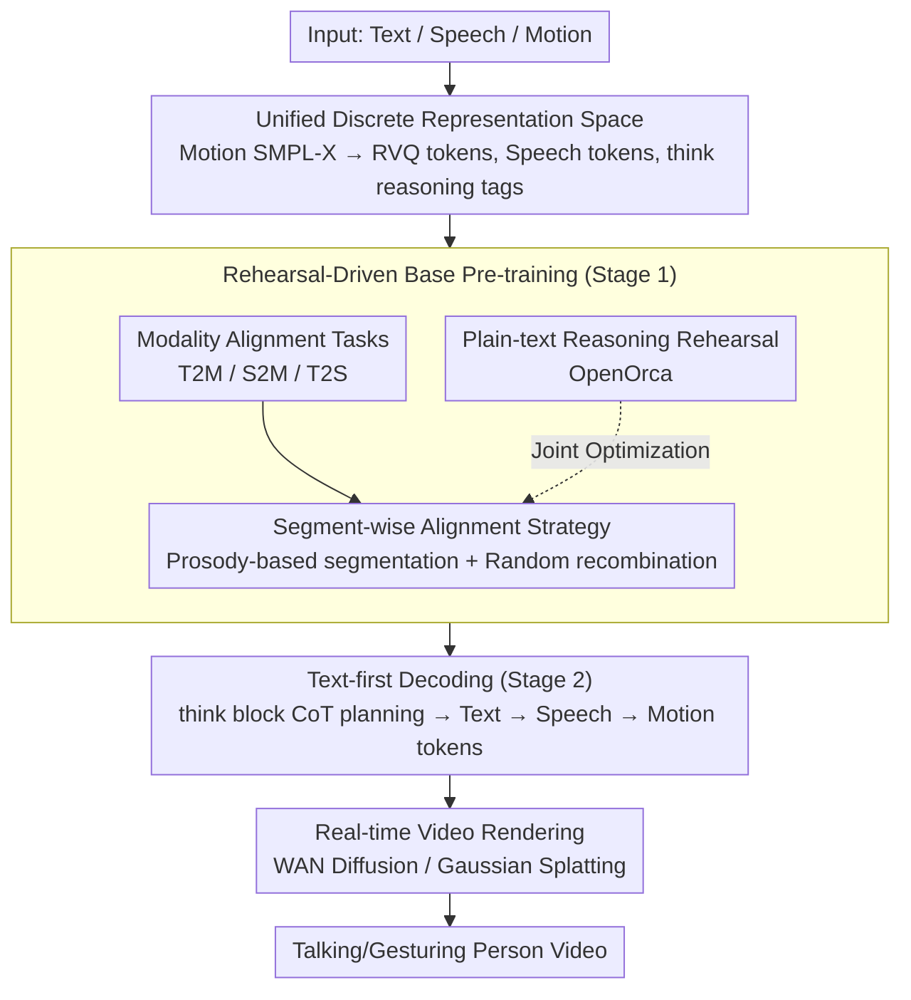

# U-Mind: A Unified Framework for Real-Time Multimodal Interaction with Audiovisual Generation

**Conference**: CVPR 2026  
**arXiv**: [2602.23739](https://arxiv.org/abs/2602.23739)  
**Code**: None  
**Area**: Video Generation  
**Keywords**: Multimodal Interaction, Real-time Generation, Digital Human, Speech-Gesture Synchronization, Chain-of-Thought Reasoning

## TL;DR
Ours proposes U-Mind, the first unified real-time full-stack multimodal interaction system supporting high-level reasoning dialogue and instruction following. It jointly generates text, speech, and motion within a single interaction loop and renders them into realistic videos, balancing reasoning retention and cross-modal alignment through rehearsal-driven learning and text-first decoding strategies.

## Background & Motivation
Building digital humans capable of real-time, multimodal, closed-loop interaction is a core goal of embodied AI. Existing systems exhibit the following deficiencies:

**Problem Decomposition**:

**Single Modality Constraints**: Most dialogue systems only support text/speech output, lacking visual interaction capabilities (motion, video).

**Reasoning Capacity Degradation**: Direct multimodal fine-tuning on LLMs causes catastrophic forgetting, leading to the loss of reasoning and planning abilities.

**Insufficient Cross-modal Synchronization**: Temporal alignment between speech and motion is challenging; existing systems lack unified token-level alignment.

**Limitations of Prior Work**:
- SOLAMI: Supports text+motion multimodal dialogue, but its text-centric alignment strategy ignores reasoning retention, resulting in poor speech-motion synchronization.
- LOM: Prev. SOTA T2M and S2M models, but lacks reasoning and dialogue capabilities.
- Diffusion model methods: High motion quality but lack support for real-time interaction and high-level reasoning.

**Key Insight**: Design a Unified Alignment and Reasoning Framework to resolve the aforementioned contradictions through three core mechanisms:
- Rehearsal-Driven Learning → Prevents reasoning degradation.
- Segment-wise Alignment → Enhances cross-modal synchronization.
- Text-first Decoding → Ensures reasoning-guided generation.

## Method

### Overall Architecture
The goal of U-Mind is to enable a digital human to complete the entire sequence of "reasoning → speaking → voicing → gesturing → rendering" within a single dialogue turn in real-time while preserving the original reasoning capabilities of the LLM. Using LLaMA2-7B as the base, it compresses speech and motion into discrete tokens and integrates them into the LLM vocabulary. The entire pipeline is reduced to a unified next-token autoregressive process: the model first reasons in plain text within `<think>...</think>` tags, then sequentially outputs text responses, speech tokens, and motion tokens. Finally, a renderer transforms the motion and speech into a talking-head video.

Training is conducted in two stages: Stage 1 is rehearsal-driven base pre-training, mixing multimodal alignment tasks with plain-text reasoning data to learn new modalities without forgetting reasoning. Stage 2 is CoT-style instruction fine-tuning, explicitly teaching the model to "think before acting." Five designs sequentially address: modality unification into token space, learning new modalities without forgetting, temporal alignment of speech and motion, reasoning-guided generation, and token-to-video rendering.

### Key Designs

**1. Unified Discrete Representation Space: Compressing three heterogeneous modalities into the same token set for unified autoregressive modeling**

Text, speech, and motion are inherently different data types. To handle them with an LLM, U-Mind discretizes the latter two into tokens and expands the LLM's vocabulary and embedding matrix. For motion, the SMPL-X body model parameterizes human poses into continuous 6D joint rotations, which are then quantized into motion tokens via an RVQ-VAE. For speech, the SpeechTokenizer encoder extracts discrete acoustic tokens while preserving semantic and paralinguistic (intonation, pauses) information. For reasoning, a pair of special tags `<think>` / `</think>` is introduced to demarcate CoT blocks from ordinary text. Generation of text, speech, and motion thus becomes the same task: predicting the next token.

**2. Rehearsal-Driven Base Pre-training: Learning new modalities while "reviewing" reasoning to avoid catastrophic forgetting**

Directly applying SFT with multimodal data to an LLM often causes low-level modality adaptation (learning to speak and pose) to compete with high-level reasoning, leading to catastrophic forgetting. U-Mind jointly optimizes two task types during Stage 1 pre-training: modality alignment tasks (T2M, S2M, T2S) to teach the model how to voice and move, and high-quality plain-text reasoning data (OpenOrca) as "rehearsals" to ensure core reasoning capabilities are continuously reactivated. Ablation studies show that removing rehearsals causes relevance to drop by approximately 2.1 points.

**3. Segment-wise Alignment Strategy: Segmenting by prosody and randomly recombining to learn fine-grained speech-motion temporal mapping**

Even within a unified token space, frame-by-frame temporal alignment remains difficult. Learning on full sentences often leads the model to memorize "this sentence matches this motion" rather than learning generalized mapping. U-Mind segments inputs into small units based on speech prosody and pause boundaries and randomly recombines these segments during Stage 1 training. This forces the model to learn segment-level speech-motion correspondences, ensuring that motions occur precisely when specific words are spoken. Removing this strategy worsens the motion quality FGD from 11.12 to 16.89.

**4. Text-first Decoding: Running symbolic reasoning before continuous modality generation to preserve logic and provide a blueprint**

If the model directly outputs speech and motion tokens, linguistic understanding and planning are bypassed, causing relevance to plummet to near zero (1.24 in ablation). Text-first decoding mandates that every response begins with a plain-text `<think>...</think>` internal reasoning block to plan what to express and how to organize it. This CoT serves not just for accuracy, but as a planning blueprint—motion and speech are generated based on this textual plan, ensuring natural cross-modal semantic alignment.

**5. Real-time Video Rendering: Grounding tokenized motion and speech into realistic talking videos**

U-Mind provides two rendering paths for the final step: a WAN-based diffusion renderer that converts SMPL-X to DWPose 2D keypoints to generate photo-realistic 2D video (higher quality, higher cost), and a Gaussian Splatting renderer that renders 3D bodies directly from SMPL-X (better geometric consistency, lightweight). This covers both "quality-driven" and "real-time/3D-driven" requirements.

### Mechanism Example
Consider a user asking, "Could you point to the signature dish on the menu?" The model first reasons in text within the `<think>` block: identifying it as a spatial reference command and planning a "verbal response + pointing gesture" structure. After closing `</think>`, it follows the text-first sequence: generating "Sure, the signature dish is in this column." It then converts this into speech tokens with natural prosody and simultaneously generates aligned motion tokens (raising the arm, extending the index finger). Because segment-wise alignment linked the phrase "this column" with the pointing gesture during pre-training, the finger points precisely as the words are spoken. Finally, the tokens are decoded to SMPL-X and rendered via the WAN diffusion renderer.

### Loss & Training
- Stage 1: 8 × H100, AdamW, peak LR $1 \times 10^{-4}$, cosine decay.
- Stage 2: Same settings, LR reduced to $2 \times 10^{-5}$ for stable alignment.
- Video Rendering: 16 × H100, LR $1 \times 10^{-5}$.
- Data: BEAT v2 (S2M) + HumanML3D (T2M) + QA augmentation + OpenOrca (rehearsal) + Common Voice (TTS).

## Key Experimental Results

### Multimodal Dialogue

| Method | FGD↓ | Diversity↑ | Relevance↑ | Naturalness↑ |
|------|------|-----------|-----------|-------------|
| Dataset GT | 0 | 11.37 | 8.32 | 8.57 |
| LLM+TTS+LOM | 17.87 | 11.02 | **8.72** | 3.95 |
| SOLAMI | 18.43 | 9.29 | 1.23 | 5.62 |
| **Ours (U-Mind)** | **7.67** | **11.18** | 8.23 | **8.11** |

### Instruction Following

| Method | FGD↓ | Diversity↑ | Relevance↑ | Naturalness↑ |
|------|------|-----------|-----------|-------------|
| LLM+TTS+LOM | 10.73 | 7.96 | **9.00** | 6.26 |
| SOLAMI | 18.51 | 10.01 | 7.56 | 7.92 |
| **Ours (U-Mind)** | **5.12** | **10.19** | 8.50 | **8.26** |

### Basic Generation Tasks — S2M and T2M

| Method | S2M FGD↓ | S2M Angle Error↓ | T2M FGD↓ | T2M Angle Error↓ |
|------|----------|------------------|----------|------------------|
| LOM | 16.47 | 0.251 | 14.22 | 0.331 |
| SOLAMI | — | — | 8.64 | 0.336 |
| EMAGE | 17.85 | 0.248 | — | — |
| **Ours (U-Mind)** | **11.12** | **0.188** | 12.69 | **0.109** |

### Ablation Study

| Configuration | Relevance↑ | Naturalness↑ |
|------|-----------|-------------|
| w/o Rehearsal | 6.13 | 7.18 |
| w/o Text-first Decoding | 1.24 | 5.18 |
| w/o CoT | 5.54 | 7.23 |
| **Full U-Mind** | **8.23** | **8.11** |

| Configuration | FGD↓ | Angle Error↓ | Diversity↑ |
|------|------|-------------|-----------|
| w/o Segment Alignment | 16.89 | 0.219 | 10.46 |
| **Full** | **11.12** | **0.188** | **11.48** |

### Key Findings
- Significant FGD lead: 7.67 in dialogue tasks (vs. SOLAMI's 18.43), indicating motion quality far exceeds existing interactive systems.
- **Text-first decoding is the most critical component**: Removing it causes Relevance to drop from 8.23 to 1.24, as direct speech/motion generation loses semantic understanding.
- Data rehearsal is vital for reasoning retention: Removing it results in a 2.1-point drop in Relevance.
- Segment-wise alignment significantly improves motion quality: FGD reduced from 16.89 to 11.12.
- Ours leads significantly in T2M Angle Error (0.109) compared to LOM (0.331) and SOLAMI (0.336), showing extreme motion precision.

## Highlights & Insights
- **System-level Contribution**: First real-time system with a complete reasoning → text → speech → motion → video closed loop.
- **Rehearsal-Driven Learning** is an elegant approach: Continuous "review" of core capabilities during training prevents regression.
- **Text-first Decoding** validates the "reasoning before generation" paradigm as essential for multimodal systems.
- Excellent ablation design: The contribution of each component is clearly quantified.

## Limitations & Future Work
- Motion expressiveness is limited by the RVQ-VAE discrete vocabulary; facial expressions and fine hand gesture precision remain insufficient.
- Pre-training data ratios are determined empirically; a theoretical framework for balancing is lacking.
- Model scale (LLaMA2-7B) limits the upper bound of reasoning complexity.
- WAN-based video rendering is computationally expensive; actual "real-time" performance needs further evaluation.
- Social Impact: Risk of deepfake misuse in digital human technology.

## Related Work & Insights
- SOLAMI: Closest prior work but lacks reasoning and fine-grained synchronization.
- AnyGPT: Provides the foundation for the unified multimodal token paradigm.
- Insight for Embodied AI: High-level reasoning and low-level motor generation must be solved within a unified framework; disjoint pipelines cannot achieve natural interaction.

## Rating
- Novelty: ⭐⭐⭐⭐⭐ First complete real-time multimodal interaction system; rehearsal-driven learning and text-first decoding are practical innovations.
- Experimental Thoroughness: ⭐⭐⭐⭐ Multidimensional evaluation (Dialogue, Instruction, S2M, T2M) + complete ablation, though lacks human evaluation.
- Writing Quality: ⭐⭐⭐⭐ Highly systematic and clearly layered.
- Value: ⭐⭐⭐⭐⭐ Significantly advances digital humans and embodied AI, pioneering the unified reasoning + multimodal generation paradigm.

<!-- RELATED:START -->

## Related Papers

- [\[CVPR 2026\] DreamStyle: A Unified Framework for Video Stylization](dreamstyle_a_unified_framework_for_video_stylization.md)
- [\[CVPR 2026\] TV2TV: A Unified Framework for Interleaved Language and Video Generation](tv2tv_a_unified_framework_for_interleaved_language_and_video_generation.md)
- [\[CVPR 2026\] Archon: A Unified Multimodal Model for Holistic Digital Human Generation](archon_a_unified_multimodal_model_for_holistic_digital_human_generation.md)
- [\[CVPR 2026\] StreamDiT: Real-Time Streaming Text-to-Video Generation](streamdit_real-time_streaming_text-to-video_generation.md)
- [\[CVPR 2026\] Real-Time Generation of Streamable Talking Portrait Video with Reference-Guided Deep Compression VAEs](real-time_generation_of_streamable_talking_portrait_video_with_reference-guided_.md)

<!-- RELATED:END -->
