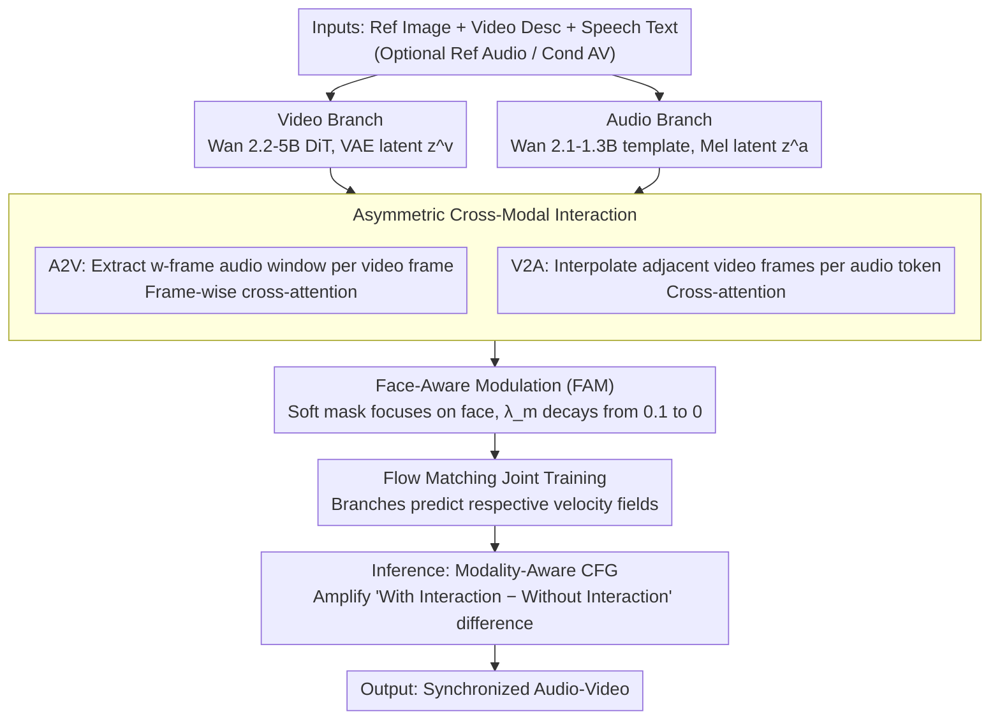

# UniAVGen: Unified Audio and Video Generation with Asymmetric Cross-Modal Interactions

**Conference**: CVPR 2026  
**arXiv**: [2511.03334](https://arxiv.org/abs/2511.03334)  
**Code**: [https://mcg-nju.github.io/UniAVGen/](https://mcg-nju.github.io/UniAVGen/) (Project Page)  
**Area**: Video Generation  
**Keywords**: Joint Audio-Video Generation, Cross-Modal Interaction, Diffusion Models, Lip-Sync, Face-Aware Modulation

## TL;DR
UniAVGen proposes a joint audio-video generation framework based on a symmetric dual-branch DiT. By leveraging an **asymmetric cross-modal interaction mechanism** and a **face-aware modulation module**, it achieves precise spatio-temporal synchronization. With only 1.3M training samples, it comprehensively outperforms competitors using 30M data in terms of lip-sync, timbre consistency, and emotional consistency.

## Background & Motivation

1.  **Background**: Joint audio-video generation is a critical direction in generative AI. While commercial systems (Veo3, Sora2, Wan2.5) have demonstrated impressive results, open-source methods still primarily rely on decoupled two-stage pipelines—either generating silent video followed by dubbing, or generating audio followed by driving video synthesis.

2.  **Limitations of Prior Work**: The fundamental issue with two-stage methods lies in **modality decoupling**—the inability of audio and video to interact during the generation process, leading to poor semantic consistency, weak emotional alignment, and imprecise lip-sync. Existing end-to-end joint generation methods (JavisDiT, UniVerse-1, Ovi) attempt to address this but either support only ambient sound rather than human speech or suffer from limited cross-modal alignment.

3.  **Key Challenge**: Audio and video possess inherent **asymmetry** in temporal granularity and semantic space—each video latent frame corresponds to multiple audio tokens, and vice versa. Existing methods ignore this asymmetry, employing either global interaction (slow convergence) or symmetric temporal alignment interaction (insufficient context utilization).

4.  **Goal**: (a) Design cross-modal interactions that are both fast-converging and high-performing; (b) Focus interactions on key regions like the face; (c) Enhance cross-modal correlation signals during inference.

5.  **Key Insight**: Lip movement in video is influenced by preceding and succeeding phonemes, while audio needs to perceive precise temporal positions within the video—the requirements of these two directions are entirely different and should adopt an asymmetric design.

6.  **Core Idea**: Utilize modality-aware asymmetric cross-modal attention + face-aware soft masking + modality-aware CFG to achieve SOTA synchronous audio-video generation using significantly less training data than competitors.

## Method

### Overall Architecture
UniAVGen adopts a **symmetric dual-branch joint synthesis architecture**: the video branch uses the Wan 2.2-5B DiT backbone, and the audio branch uses the Wan 2.1-1.3B architectural template (identical structure, differing only in channel counts). Inputs include a reference speaker image, video description text, and speech text content, with optional reference audio and conditional audio-video. Both branches are trained via the Flow Matching paradigm, each predicting a velocity field.

Video Branch: Video is processed at 16fps, encoded into latent $z^v$ via VAE. Reference image and conditional video latents are concatenated as input. Text is encoded by umT5 and injected via cross-attention.

Audio Branch: Audio is sampled at 24kHz and converted to Mel-spectrograms as latent $z^a$. Reference audio and conditional audio are similarly concatenated. Speech text features are extracted via ConvNeXt blocks before injection.

The two branches exchange information at each interaction layer through **asymmetric cross-modal interaction**, where **face-aware modulation** constrains the interaction to the facial region. Flow Matching is used for joint training of velocity fields, and **modality-aware CFG** is applied during inference to amplify cross-modal signals. The overall data flow is as follows:

### Key Designs

**1. Asymmetric Cross-Modal Interaction: Letting Audio and Video "Watch" Each Other Based on Temporal Needs**

The greatest flaw of two-stage methods is the complete lack of interaction during generation. The most direct remedy—global cross-attention—suffers from extremely slow convergence. The root cause is that video and audio have opposite requirements for "temporal context." A video frame's lip shape depends not only on the current phoneme but also on co-articulation effects of surrounding phonemes, necessitating an **audio window**. Conversely, for an audio token to be accurate, it must know its **precise continuous position** on the video timeline; a single frame is insufficient. UniAVGen separates these into two dedicated aligners. In the A2V direction, each video frame $i$ captures an audio context window $C_i^a$ spanning $w$ frames before and after, followed by frame-wise cross-attention, allowing the video to "hear" surrounding semantics. In the V2A direction, temporal neighborhood interpolation is used: for every $k$ audio tokens corresponding to one video frame, the relative position $\alpha = (j \bmod k)/k$ is calculated for the $j$-th audio token between two adjacent video frames. These frames are weighted by $\alpha$ to obtain a smooth video context $C_j^v$ for cross-attention. All cross-modal output projections are zero-initialized to ensure that this new path does not disrupt the pre-existing generation capabilities of the two branches during early training. For example, if $k=2$, the 5th audio token falls between the 2nd and 3rd video frames with $\alpha=0.5$; it perceives a 50/50 blend of both frames—avoiding rigid alignment to a single frame or being drowned out by the entire video sequence. In ablations, this asymmetric design (ATI/ATI) improved lip-sync from 3.46 (global interaction) to 4.09, which stems from "window vs. interpolation" correctly matching the actual needs of both directions.

**2. Face-Aware Modulation (FAM): Constraining Early Cross-Modal Attention to the Face**

Even with the correct direction, unconstrained cross-modal interaction across the entire frame at the start can slow down convergence—semantic coupling in human audio-video is almost entirely concentrated on the face; background elements contribute nothing to lip-sync. FAM adds a lightweight mask head at each interaction layer: video features $H^{v_l}$ undergo LayerNorm + affine transform + linear projection + Sigmoid to output a soft mask $M^l \in (0,1)^{T \times N_v}$. The A2V direction uses this for selective updates $H^{v_l} = H^{v_l} + M^l \odot \bar{H}^{v_l}$, and the V2A direction uses it to amplify information transmitted from salient regions to audio $\hat{H}^{v_l} = M^l \odot \hat{H}^{v_l}$. This mask is supervised by ground-truth face masks, but the supervision weight $\lambda^m$ linearly decays from 0.1 to 0. Early strong constraints force the model to lock attention onto the face for rapid lip-sync learning; as constraints loosen, the model learns more flexible interactions (e.g., incorporating expression-related neck and shoulder movements). Ablations confirm this "tighten then release" strategy outperforms fixed weights in both timbre (TC 0.725 vs 0.719) and emotional consistency (EC 0.504 vs 0.497), while no supervision is nearly equivalent to having no FAM.

**3. Modality-Aware CFG (MA-CFG): Expanding Classifier-Free Guidance to Cross-Modal Signals**

Traditional CFG only guides on text conditions, remaining powerless over "how audio drives video and how video influences audio," often resulting in flat emotions and weak dynamics. MA-CFG observes that by **wiping out cross-modal interaction signals** in a single forward pass, the model degrades into independent unimodal inference, yielding $u_{\theta_v}$ and $u_{\theta_a}$. Subtracting these from the full joint estimate $u_{\theta_{a,v}}$ isolates the "cross-modal term" for amplification:

$$\hat{u}_v = u_{\theta_v} + s_v\,(u_{\theta_{a,v}} - u_{\theta_v})$$

The same applies to the audio side. This effectively replaces the "conditional − unconditional" difference in CFG with a "with interaction − without interaction" difference. Higher guidance strength $s_v$ pushes stronger coupling between audio and video, significantly enhancing emotional intensity and motion dynamics without additional training.

### Loss & Training

Three-stage training: Stage 1 trains only the audio branch ($\mathcal{L}^a$, 160k steps, batch=256); Stage 2 jointly trains both branches ($\mathcal{L}^{joint} = \mathcal{L}^v + \mathcal{L}^a + \lambda_m \mathcal{L}^m$, 30k steps, batch=32, lr=5e-6); Stage 3 involves multi-task learning (5 task ratios 4:1:1:2:2, 10k steps). $\lambda_m$ decays linearly from 0.1 to 0.

## Key Experimental Results

### Main Results

| Method | Joint Training | Training Samples | PQ↑ | CU↑ | WER↓ | SC↑ | DD↑ | LS↑ | TC↑ | EC↑ |
| :--- | :--- | :--- | :--- | :--- | :--- | :--- | :--- | :--- | :--- | :--- |
| OmniAvatar (2-stage) | ✗ | 21.1B | 8.15 | 7.41 | 0.152 | 0.987 | 0.000 | 6.34 | 0.454 | 0.349 |
| Ovi (Joint) | ✓ | 30.7M | 6.03 | 6.01 | 0.216 | 0.972 | 0.360 | 6.48 | 0.828 | 0.558 |
| **UniAVGen** | ✓ | **1.3M** | **7.00** | **6.62** | **0.151** | 0.973 | **0.410** | 5.95 | **0.832** | **0.573** |

UniAVGen outperforms Ovi despite using 23x less data (1.3M vs 30.7M), leading in audio quality and audio-video consistency.

### Ablation Study

| Interaction Design (A2V / V2A) | LS↑ | TC↑ | EC↑ |
| :--- | :--- | :--- | :--- |
| SGI / SGI (Global) | 3.46 | 0.667 | 0.459 |
| STI / STI (Symm. Temporal) | 3.73 | 0.685 | 0.472 |
| **ATI / ATI (Asymmetric)** | **4.09** | **0.725** | **0.504** |

| FAM Config | LS↑ | TC↑ | EC↑ |
| :--- | :--- | :--- | :--- |
| w/o FAM | 3.89 | 0.705 | 0.489 |
| Unsupervised FAM | 3.92 | 0.701 | 0.492 |
| Fixed $\lambda_m$ | 4.11 | 0.719 | 0.497 |
| **Decaying $\lambda_m$** | **4.09** | **0.725** | **0.504** |

### Key Findings
- **Asymmetric interaction provides the largest contribution**: ATI significantly outperforms SGI and STI across all metrics, validating the necessity of modality-specific designs.
- **FAM supervision is critical**: Supervised FAM improves consistency significantly over unsupervised versions, proving that constraining masks to facial regions accelerates training convergence.
- **Decay strategy is superior to fixed weights**: Gradually relaxing constraints allows the model to learn more flexible interactions, further improving TC and EC.
- **Multi-task training enhances joint generation**: Joint training followed by multi-tasking (JFML) performs best; multi-tasking from the start (MTO) results in slower convergence.
- On OOD anime images, UniAVGen demonstrates strong generalization, whereas Ovi fails in lip movement and UniVerse-1 remains nearly static.

## Highlights & Insights
- **Clever Asymmetric Design**: A2V uses windowed context for phoneme co-articulation, and V2A uses temporal interpolation for continuous video positioning, perfectly matching the distinct requirements of both directions.
- **Progressive Relaxation Strategy in FAM**: Using decaying supervision signals to constrain early and release late is an elegant solution balancing training efficiency and model flexibility, transferable to other region-focused multi-modal tasks.
- **MA-CFG Generalizes CFG to Cross-Modality**: The concept is simple (using unimodal inference as the unconditional baseline) but highly effective, applicable to any dual-modality generation system.

## Limitations & Future Work
- Focused exclusively on **human-centric** audio-video generation, not covering general scenes (ambient sound, music, etc.).
- Audio branch only supports **English speech**; multilingual capabilities are unverified.
- Video duration is limited (training data likely consists of short clips); long-term consistency remains unexplored.
- Evaluations for TC and EC rely on Gemini-2.5-Pro scoring, lacking standardized open-source evaluation methods.

## Related Work & Insights
- **vs. Ovi**: Both use symmetric dual-tower architectures, but Ovi's symmetric global interaction lacks modality-specific design and has poor OOD generalization; UniAVGen surpasses it with 23x less data.
- **vs. UniVerse-1**: Concatenates two pre-trained models; the asymmetric architecture leading to complex concatenation limits performance. UniAVGen unifies the architecture from the design stage.
- **vs. Two-Stage Methods**: Two-stage methods have good lip-sync but nearly zero dynamics (DD≈0), indicating that video generation is completely unaware of audio.

## Rating
- Novelty: ⭐⭐⭐⭐ Asymmetric interaction and FAM decay strategies are original; MA-CFG is a natural extension of CFG.
- Experimental Thoroughness: ⭐⭐⭐⭐ Main experiments + 5 ablation groups + multi-task analysis + OOD qualitative comparisons, though some metrics rely on closed-source models.
- Writing Quality: ⭐⭐⭐⭐⭐ Clear structure, rich charts, and logically sound motivation.
- Value: ⭐⭐⭐⭐ SOTA for open-source joint audio-video generation with extreme data efficiency, though limited to human scenarios.

<!-- RELATED:START -->

## Related Papers

- [\[CVPR 2026\] Harmony: Harmonizing Audio and Video Generation through Cross-Task Synergy](harmony_harmonizing_audio_and_video_generation_through_cross-task_synergy.md)
- [\[CVPR 2026\] UniTalking: A Unified Audio-Video Framework for Talking Portrait Generation](unitalking_a_unified_audio-video_framework_for_talking_portrait_generation.md)
- [\[CVPR 2026\] UnityVideo: Unified Multi-Modal Multi-Task Learning for Enhancing World-Aware Video Generation](unityvideo_unified_multi-modal_multi-task_learning_for_enhancing_world-aware_vid.md)
- [\[ICLR 2026\] BindWeave: Subject-Consistent Video Generation via Cross-Modal Integration](../../ICLR2026/video_generation/bindweave_subject-consistent_video_generation_via_cross-modal_integration.md)
- [\[CVPR 2026\] InfinityHuman: Towards Long-Term Audio-Driven Human Animation](infinityhuman_towards_long-term_audio-driven_human_animation.md)

<!-- RELATED:END -->
