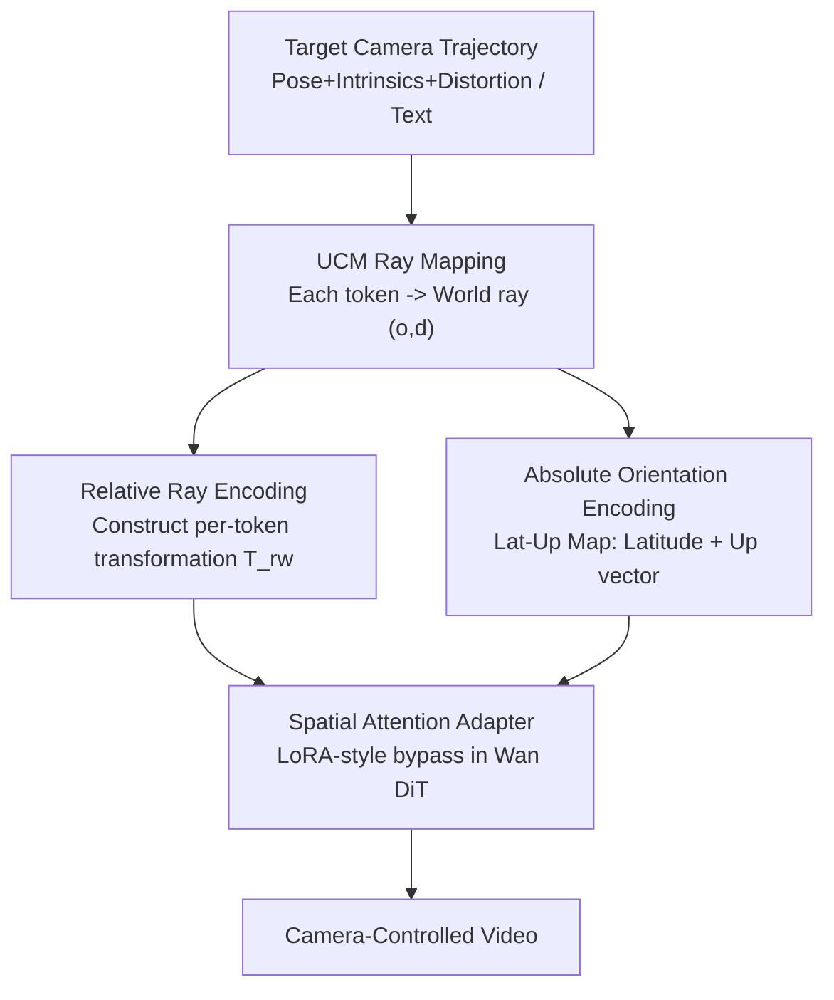

# Unified Camera Positional Encoding for Controlled Video Generation

**Conference**: CVPR 2026  
**arXiv**: [2512.07237](https://arxiv.org/abs/2512.07237)  
**Code**: [https://github.com/chengzhag/UCPE](https://github.com/chengzhag/UCPE)  
**Area**: Video Generation  
**Keywords**: Camera Positional Encoding, Ray Encoding, Lens Distortion, Absolute Orientation, Diffusion Transformer

## TL;DR

This paper proposes UCPE, which unifies the complete camera geometry (6-DoF pose + intrinsics + lens distortion) into Transformer attention. It leverages "Relative Ray Encoding" to lower the positional encoding from the camera level to the ray level to accommodate non-linear lenses like fisheye and wide-angle. Additionally, "Absolute Orientation Encoding" is introduced to provide global references for pitch and roll. Using a Spatial Attention Adapter with <1% parameters to inject these into pre-trained video DiTs, UCPE achieves state-of-the-art results in both controllability and image quality for camera-controlled text-to-video generation.

## Background & Motivation

**Background**: The core of camera-controlled video generation (especially text-to-video) lies in "how to feed camera geometry into the network." Prevailing methods fall into two categories: absolute encoding, which directly concatenates raw camera parameters or Plücker rays (6D vector of direction and moment) into the network; and relative encoding (e.g., CaPE, GTA, PRoPE), which injects relative SE(3) transformations between camera pairs into the attention mechanism, removing dependence on a global world coordinate system to improve multi-view consistency.

**Limitations of Prior Work**: Almost all methods rely on the **pinhole assumption**. Absolute encoding (Plücker) depends on a predefined world coordinate system and generalizes poorly across scenes. Relative encoding (e.g., PRoPE, which encodes intrinsics via the projection matrix $\mathbf{P}_i=\mathbf{K}_i\mathbf{T}^{\text{cw}}_i$) remains limited to linear pinhole projections and cannot express non-linear lenses such as fisheye, catadioptric, or equirectangular models common in autonomous driving, panoramas, and robotics. Furthermore, since camera poses in text-to-video are defined relative to the first frame, the pitch and roll degrees of freedom are not uniquely determined, leading to **unspecifiable and non-reproducible absolute orientations** for the initial viewpoint.

**Key Challenge**: Camera-level encoding assumes all tokens in a single frame share a linear projection function, treating the entire image as a rigid body. While valid under the pinhole model, the projection geometry of real lenses is **spatially varying per pixel** (due to distortion or ultra-wide FoV). Camera-level encoding inherently fails to represent these intra-camera variations.

**Goal**: (1) Design a geometric-consistent representation that is camera-model agnostic and unifies pose, intrinsics, and distortion; (2) complement text-to-video with absolute pitch/roll control; (3) inject these into pre-trained video diffusion models at minimal cost without damaging prior knowledge.

**Key Insight**: Any camera (regardless of projection type) is essentially a mapping from "pixel to 3D ray" $\Phi_\psi:(u,v)\mapsto(\mathbf{o}^{\text{cam}}_{u,v},\mathbf{d}^{\text{cam}}_{u,v})$. Since rays are the universal language of all lenses, geometric reasoning should be performed at the **ray level** instead of the camera level—allowing each token to correspond to its own observation ray.

**Core Idea**: Replace "Relative Camera Encoding" with "Relative Ray Encoding" to shift the attention's geometric reasoning from the camera coordinate system to a per-token local ray coordinate system, naturally supporting arbitrary lenses. Supplement this with gravity-aligned Lat-Up maps for absolute orientation.

## Method

### Overall Architecture

UCPE addresses the problem of injecting complete camera geometry into pre-trained video DiTs for fine-grained controllable generation. The pipeline is as follows: given a target camera trajectory (pose + intrinsics + distortion) and text, each latent token is first converted into a world-system ray $(\mathbf{o}_t,\mathbf{d}_t)$ via the Unified Camera Model (UCM). This ray feeds into two complementary encoding branches: **Relative Ray Encoding** constructs a per-token world-to-ray transformation $\mathbf{T}^{\text{rw}}_t$ for attention-level geometric shifts (handling relative geometry and lens distortion), and **Absolute Orientation Encoding** calculates a Lat-Up map (handling global pitch/roll orientation). Both are integrated into the self-attention of Wan DiT via a **Spatial Attention Adapter** (a LoRA-style bypass), injecting camera conditions without altering the pre-trained backbone. Zero-initialized linear layers fuse the features back. The entire adapter adds <1% trainable parameters.

### Key Designs

**1. Relative Ray Encoding: Shifting positional encoding from camera-level to ray-level for arbitrary non-linear lenses**

To address the limitation where camera-level encoding fails to express per-pixel distortion, the authors do not share a single projection transformation for the entire image. Instead, a **local ray coordinate system is constructed for each token $t$**. Specifically, the world-system ray direction $\mathbf{d}_t$ of the token is taken as the local $z$-axis, and the camera's downward direction $\mathbf{y}^{\text{cam}}_{i(t)}$ is used with a cross product to complete an orthogonal basis:

$$\bm{z}_t=\bm{d}_t,\quad \bm{x}_t=\bm{y}^{\text{cam}}_{i(t)}\times\bm{z}_t,\quad \bm{y}_t=\bm{z}_t\times\bm{x}_t.$$

The orthogonal basis $\mathbf{R}^{\text{wr}}_t=[\mathbf{x}_t,\mathbf{y}_t,\mathbf{z}_t]$ and translation $\mathbf{t}^{\text{wr}}_t=\mathbf{o}_t$ form the "ray-to-world" transformation $\mathbf{T}^{\text{wr}}_t$. The inverse $\mathbf{T}^{\text{rw}}_t=(\mathbf{T}^{\text{wr}}_t)^{-1}$ acts as the geometric operator at the attention level. Within the attention block, Q, K, and V are transformed simultaneously as in GTA: $O=\mathbf{D}\odot\text{Attn}(\mathbf{D}^\top\odot Q,\mathbf{D}^{-1}\odot K,\mathbf{D}^{-1}\odot V)$, where $\mathbf{D}^{\text{Ray}}_t=\mathbf{I}_{d/8}\otimes\mathbf{T}^{\text{rw}}_t$. Unlike camera-level approaches like PRoPE (which use $\mathbf{P}_i=\mathbf{K}_i\mathbf{T}^{\text{cw}}_i$ for the whole frustum), each token here carries its own ray geometry. Since rays are sampled via UCM from distorted lens models, spatially varying geometry like non-linear projections and ultra-wide FoV are naturally included, allowing the attention to perform **geometric reasoning in ray space rather than the camera framework**.

**2. Absolute Orientation Encoding: Using gravity-aligned Lat-Up maps for global pitch/roll reference**

To solve the problem where pitch and roll cannot be uniquely determined in relative pose generation, this module anchors the global orientation to gravity. The authors observe that most real-world videos are filmed relative to a gravity-aligned "up" direction. They introduce the Latitude-Up map (Lat-Up map). The Latitude map encodes the elevation angle of each ray relative to the horizontal plane:

$$\text{Lat}_t=\arctan 2\big(-d_{t,y},\,\sqrt{d_{t,x}^2+d_{t,z}^2}\big),$$

where positive values correspond to upward-looking rays. The Up map represents the "up" direction by rotating the world-system ray $\mathbf{d}_t$ by a small angle $\delta$ around the local axis $\bm{k}_t=\bm{d}_t\times\bm{u}^{\text{wld}}$ and projecting it back to the image plane as a normalized pixel displacement $\text{Up}_t=[\Delta u_t,\Delta v_t]/\|[\Delta u_t,\Delta v_t]\|$. Together, $[\text{Lat}_t,\text{Up}_t]$ provide a global orientation context for each token, capturing camera rotation through visual cues like sky/ground separation and vertical object alignment, enabling explicit and reproducible control over pitch and roll.

**3. Spatial Attention Adapter: LoRA-style bypass injection with <1% parameters**

To avoid disturbing pre-trained priors by directly replacing Wan's 3D RoPE, the authors attach a parallel camera-conditioned branch $\text{UCPEAttn}(\cdot)$. The encoding uses a hybrid approach: Relative Ray Encoding and RoPE are concatenated into a block-diagonal operator $\mathbf{D}^{\text{UCPE}}_t=\text{blkdiag}(\mathbf{D}^{\text{Ray}}_t,\mathbf{D}^{\text{RoPE}}_t)$, each occupying half of the feature dimensions. This ensures both ray-space and image-space reasoning. Lat-Up features are projected and added as a bias. Parameters are kept minimal by projecting input tokens to $1/C$ of their original dimension and reducing the number of attention heads. Thanks to the strong geometric prior of UCPE, the bypass requires very few parameters. Output layers are **zero-initialized** to ensure the pre-trained model is untouched at the start of training. The adapter adds only 35.5M parameters (less than 1% of the backbone), a 90% reduction compared to the 354M ReCamMaster.

### Loss & Training

The base model is the Wan video Diffusion Transformer. It is fine-tuned following standard diffusion denoising objectives on a custom dataset, training only the adapter branches while the backbone is frozen. Compared to the Wan CameraCtrl baseline (which uses full parameters and a smaller learning rate of $1\mathrm{e}{-5}$), UCPE's default $1/8$-dim compression balance's controllability and quality.

## Key Experimental Results

### Main Results

Quantitative comparison on a custom dataset (~48k clips rendered from 360-degree wild videos via UCM, with randomized FoV and distortion $\xi$, covering pinhole/wide-angle/fisheye):

| Setting | Method | Params | FoV(°)↓ | k1↓ | RotErr(°)↓ | TransErr↓ | CamMC↓ | FVD↓ |
|------|------|------|---------|------|-----------|----------|--------|------|
| w/o Absolute | ReCamMaster | 354M | 10.25 | 0.210 | 10.89 | 31.44 | 37.38 | 555.5 |
| w/o Absolute | Wan CameraCtrl | 1.5B | 10.05 | 0.222 | 17.04 | 35.09 | 46.10 | 593.1 |
| w/o Absolute | **Ours** | **35.5M** | **9.62** | **0.174** | **4.29** | **13.46** | **15.94** | 569.3 |
| w/ Absolute | ReCamMaster | 354M | 10.04 | 0.183 | 9.23 | 28.95 | 33.88 | 605.8 |
| w/ Absolute | **Ours** | **35.6M** | **8.22** | **0.129** | **4.12** | **15.21** | **17.59** | **495.1** |

Relative pose control is the primary highlight: RotErr, TransErr, and CamMC are **halved or even lower** compared to the best baseline (RotErr 4.29 vs 10.89, ~2.5× better), despite using 90% fewer parameters than ReCamMaster and ~40× fewer than Wan CameraCtrl.

Absolute orientation control (w/ Absolute setting):

| Method | Pitch(°)↓ | Roll(°)↓ |
|------|-----------|----------|
| ReCamMaster | 6.62 | 5.29 |
| Wan CameraCtrl | 6.25 | 6.01 |
| **Ours** | **4.35** | **3.74** |

Generalization on RealEstate10K (100 clips, fixed 100° pinhole, zero-shot): Ours achieves the lowest rotation, translation, and motion errors without being trained on this dataset. Q-Align human perception scores were higher than CameraCtrl and AC3D, validating the cross-domain generalization of the unified ray representation.

### Ablation Study

| Config | Params | FoV(°)↓ | Pitch(°)↓ | RotErr(°)↓ | FVD↓ | Description |
|------|------|---------|-----------|-----------|------|------|
| 1/2-dim (128×6) | 141M | 8.39 | 4.11 | 3.69 | 534.4 | Lowest compression |
| 1/4-dim (128×3) | 71.0M | 8.47 | 3.94 | 3.43 | 512.9 | Lowest RotErr |
| **1/8-dim (192×1)** | **35.6M** | **8.22** | 4.35 | 4.12 | 495.1 | Default balance |
| 1/12-dim (128×1) | 23.8M | 8.96 | 3.91 | 5.13 | 487.5 | Over-compressed |
| Pre-Attn | 35.6M | 8.47 | 4.26 | 4.03 | 502.7 | Worse than in-attn |
| Post-Attn | 35.6M | 8.91 | 3.95 | 4.68 | 515.3 | Worse than in-attn |
| PRoPE | 35.6M | 8.84 | 4.18 | 5.35 | 516.6 | Ray encoding replaced |
| GTA | 35.6M | 8.80 | 4.21 | 5.27 | 497.2 | Ray encoding replaced |

### Key Findings

- **Relative Ray Encoding is the primary source of control precision**: At 35.6M parameters, substituting Ray Encoding with camera-level PRoPE or GTA increases RotErr from 4.12 to 5.35/5.27. This confirms that ray-level geometric reasoning is superior for lens and pose control.
- **Injection position is critical**: In-attention (default) significantly outperforms Pre-Attn or Post-Attn. Applying geometric operators directly within Q/K/V transforms is more effective for passing camera conditions than adding them outside.
- **Compression sweet spot**: The 1/8-dim configuration offers the best balance. Compressing to 1/12-dim (23.8M) lowers FVD but significantly degrades RotErr (5.13), indicating the bypass capacity cannot be reduced indefinitely.
- **Absolute Orientation Encoding improves visual quality**: Under the absolute setting, Ours' FVD drops from 569.3 to 495.1, suggesting that gravity-aligned references not only enable pitch/roll control but also reduce generation artifacts caused by orientation ambiguity.

## Highlights & Insights

- **The perspective of "Rays as a universal language" is compelling**: Shifting positional encoding from the camera level to the individual ray level brings non-linear lenses (fisheye, wide-angle, catadioptric) into a single unified framework, overcoming the pinhole constraints of previous relative encoding methods (like PRoPE). This is a more fundamental way to inject 3D geometric priors into attention.
- **Strong geometric priors enable extreme parameter efficiency**: Because $\mathbf{T}^{\text{rw}}_t$ "pre-calculates" the camera geometry for the attention mechanism, the bypass adapter reaches SOTA control with only 35.5M parameters (<1%). This validates the efficiency of providing explicit geometric operators while letting the network learn only the residuals.
- **Gravity alignment for absolute orientation is practical and insightful**: Relative-to-first-frame poses often ignore pitch and roll reproducibility. Using Lat-Up maps to anchor the global "up" direction via visual cues provides explicit orientation control at almost zero cost.
- **Transferability**: The Relative Ray Encoding and attention-level geometric operator paradigm is not limited to video generation. It is presented as a universal camera representation applicable to any Transformer-based task requiring camera geometry, such as multi-view synthesis, 3D reconstruction, or world models.

## Limitations & Future Work

- **Dependence on UCM and known intrinsics/distortion**: Rays are sampled using the UCM model, meaning both training and inference require relatively accurate camera calibration parameters. Reliability on real-world scenes with unknown intrinsics or high calibration error remains to be seen.
- **Non-central cameras are treated symbolically**: While the derivation mentions per-pixel origins for non-central systems (catadioptric/panoramic), the experiments focus on central models. Generalization to strictly non-central lenses requires further verification.
- **Synthetic training data**: The 48k clips were rendered from 360° videos. Real-world fisheye/wide-angle effects like authentic noise, motion blur, and specific distortion distributions may not be fully captured.
- **Image quality is not always superior**: UCPE's FVD/FID is occasionally higher than baselines (e.g., 569.3 vs 555.5 in some settings). The primary gain is in control precision (pose/lens/orientation), while pure fidelity remains comparable to the base model.

## Related Work & Insights

- **vs. Plücker Encoding (CameraCtrl / AC3D)**: These represent rays as absolute 6D vectors. While interpretable, they depend on a global coordinate system, generalize poorly across scenes, and are typically restricted to pinhole models. UCPE adopts relative ray transforms to remove world-frame dependence and support non-linear lenses.
- **vs. PRoPE / GTA (Relative Camera Encoding)**: These inject relative SE(3) or projection transforms into attention to improve consistency but are limited to camera-level reasoning and the pinhole assumption. UCPE refines these operators to the per-token ray level, achieving lower pose and lens error.
- **vs. ReCamMaster (Direct Parameter Injection)**: This method concatenates [R,t] and FoV into the model, but essentially relies on camera-level parameter conditioning and a much larger parameter count (354M). UCPE achieves better relative pose control with 1/10 the parameters using a geometrically consistent ray representation.

## Rating

- Novelty: ⭐⭐⭐⭐⭐ Shifting positional encoding from camera level to ray level to unify pose, intrinsics, and distortion is a fundamentally new geometric perspective.
- Experimental Thoroughness: ⭐⭐⭐⭐ Strong results on custom and cross-domain datasets with detailed ablations, though real-world non-central camera validation is limited.
- Writing Quality: ⭐⭐⭐⭐ Clear geometric derivations; Figure 2 provides an excellent comparison of encoding types.
- Value: ⭐⭐⭐⭐⭐ A plug-and-play adapter with <1% parameters that serves as a universal camera representation for various Transformer tasks.

<!-- RELATED:START -->

## Related Papers

- [\[CVPR 2026\] ReDirector: Creating Any-Length Video Retakes with Rotary Camera Encoding](redirector_creating_any-length_video_retakes_with_rotary_camera_encoding.md)
- [\[CVPR 2026\] Yume1.5: A Text-Controlled Interactive World Generation Model](yume15_a_text-controlled_interactive_world_generation_model.md)
- [\[CVPR 2026\] TGT: Text-Grounded Trajectories for Locally Controlled Video Generation](tgt_text-grounded_trajectories_for_locally_controlled_video_generation.md)
- [\[CVPR 2026\] UnityVideo: Unified Multi-Modal Multi-Task Learning for Enhancing World-Aware Video Generation](unityvideo_unified_multi-modal_multi-task_learning_for_enhancing_world-aware_vid.md)
- [\[ICCV 2025\] ReCamMaster: Camera-Controlled Generative Rendering from A Single Video](../../ICCV2025/video_generation/recammaster_camera-controlled_generative_rendering_from_a_single_video.md)

<!-- RELATED:END -->
