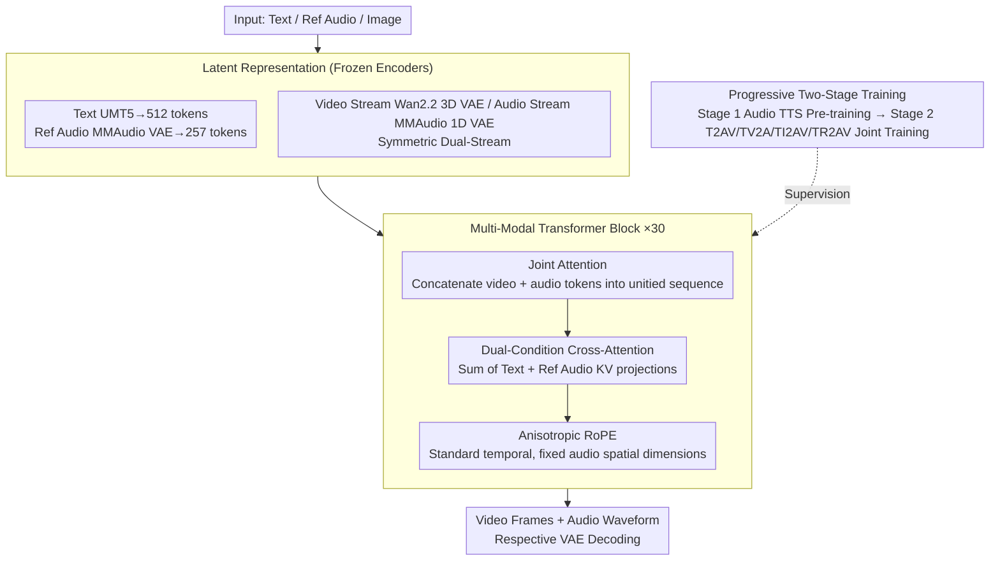

# UniTalking: A Unified Audio-Video Framework for Talking Portrait Generation

**Conference**: CVPR 2026 Findings  
**arXiv**: [2603.01418](https://arxiv.org/abs/2603.01418)  
**Code**: None  
**Area**: Video Generation  
**Keywords**: Talking portrait generation, Joint audio-video generation, Diffusion Transformer, Lip-sync, Voice cloning

## TL;DR
This paper proposes UniTalking, an end-to-end talking portrait generation framework based on MM-DiT. Through a joint attention mechanism in a symmetric dual-stream architecture, it explicitly models fine-grained temporal correspondences between audio and video tokens, achieving state-of-the-art (SOTA) lip-sync accuracy while supporting personalized voice cloning.

## Background & Motivation
Talking portrait generation requires the simultaneous production of visually realistic, precisely synchronized video and natural speech. In the real world, audio and video constitute a synchronized and inseparable perceptual whole.

**Key Challenge**:

**Closed-source vs. Open-source**: Closed-source models like Veo3 and Sora2 have demonstrated impressive audio-visual consistency, but their architectures and training methodologies remain inaccessible to the academic community.

**Cascaded vs. End-to-end**: Open-source methods are divided into two categories: cascaded methods (generating audio first to drive video) suffer from temporal misalignment and error accumulation; current end-to-end methods primarily focus on Foley effect synchronization (such as waves), which is insufficient for precise speech-level lip-sync.

**Limitations of Prior Work**:
- JavisDiT: Employs dual-branch DiT with bidirectional cross-attention, but the interaction depth between audio and video branches is insufficient.
- Universe-1: Concatenates pre-trained unimodal models, leading to insufficiently fine-grained alignment.
- OVI/OmniTalker: Uses dual-stream designs with dedicated fusion blocks but lacks optimization for talking portrait scenarios.

**Key Insight**: The authors design a symmetric dual-stream architecture where the video stream inherits Wan2.2 pre-trained weights and the audio stream acts as an "identical twin." The core innovation lies in the Multi-Modal Transformer Block, which uses joint attention to directly model the temporal correspondence of audio-video tokens. A multi-task training strategy (T2AV + TV2A + TI2AV + TR2AV) is employed to constrain audio-visual alignment from multiple perspectives.

## Method

### Overall Architecture
UniTalking aims to solve end-to-end talking portrait generation with speech-level precision. Instead of generating audio first to drive the visuals, it allows video and speech to emerge simultaneously within a single model. The framework is a 10B parameter MM-DiT trained with Continuous Flow Matching and CFG-guided inference. The central structural choice is a symmetric dual-stream design: the video stream inherits the architecture and weights of Wan2.2-5B, while the audio stream is designed as a mirror of the video stream (identical layers, dimensions, and modules, but with randomly initialized parameters). During inference, conditions such as text, reference audio, and images are encoded into latent tokens and processed alongside the video and audio streams through $N=30$ MM-DiT Blocks (dim=3072, 24 heads). Finally, respective VAEs decode the tokens back into video frames and audio waveforms.

### Key Designs

**1. Latent Space Representation: Projecting audio, video, and conditions into a unified semantic space via frozen encoders**
To jointly generate two modalities, stable and semantically rich latent representations are required. Video uses the 3D causal VAE from Wan2.2 (16×16×4 compression), while audio uses the 1D VAE from MMAudio to compress Mel-spectrograms. Text is encoded by UMT5 into 512 tokens, and reference audio is encoded into 257 tokens. Freezing these encoders minimizes training costs and ensures that the main streams interact within a stable latent space.

**2. Multi-Modal Transformer Block: Enabling direct interaction between modalities**
Addressing the shallow interaction in prior dual-stream methods, UniTalking introduces three modifications to each DiT Block. First, **Joint Attention** concatenates video and audio latent tokens into a single sequence for a unified attention operation, allowing intra-modal and inter-modal dependencies to be learned simultaneously. Second, **Dual-Condition Cross-Attention** adds a second set of KV projections for the reference audio alongside the text condition, enabling the model to respect both text semantics and vocal timbre. Third, **Anisotropic RoPE** applies standard RoPE to the temporal axis while using fixed-position RoPE for the audio spatial dimensions, forcing the model to focus on temporal dynamics and strengthening frame-by-frame alignment.

**3. Progressive Two-Stage Training: Balancing the asymmetric initialization**
While symmetric, the initialization is unbalanced: the video branch starts with strong Wan2.2 weights, while the audio branch starts from scratch. Stage 1 involves TTS pre-training for the audio branch (Batch 256, LR $1\times10^{-5}$, 100K steps), freezing video/text branches to train only audio-related parameters. Stage 2 involves full-model end-to-end joint training (Batch 64, LR $1\times10^{-5}$, 100K steps) using four tasks: T2AV (Text-to-Audio-Video) for coarse alignment; TV2A (Video-to-Audio) using attention masks to provide strict temporal supervision for viseme-to-phoneme mapping (**the crucial lip-sync signal**); TI2AV for identity-preserved generation; and TR2AV for voice style cloning.

### Loss & Training
- Flow Matching objective: $$\mathcal{L}_{CFM} = \mathbb{E}[\|v_\theta(x_t, t) - (x_1 - x_0)\|^2]$$
- Pure audio task: $L_{total} = L_{CFM}^a$
- Joint task: $L_{total} = L_{CFM}^a + L_{CFM}^v$
- CFG scale $\omega > 1$ controls condition strength ($c_{text}$, $c_{image}$, $c_{audio}$)
- AdamW, $\beta_1=0.9, \beta_2=0.999$, bf16 precision, FSDP parallelization

### Background (Data Preparation)
- Curated from OpenHumanVid and internal data through a three-stage filter (Video → Audio → Audio-Visual).
- Three-level annotation: Detailed and short descriptions generated by Qwen3-Omni.
- Reference audio: Synthesized using IndexTTS2 for each video.
- Final Dataset: 2.3 million aligned audio-video pairs.

## Key Experimental Results

### T2AV Joint Generation — Blind Preference Study

| Dimension | UniTalking vs OVI | UniTalking vs Universe-1 |
|------|-------------------|-------------------------|
| Video Quality | ~100% (Comparable) | Superior |
| Audio Quality | 116% | Superior |
| AV Sync | 107% | Superior |

### Lip-Sync Objective Evaluation

| Method | Sync-C↑ | Sync-D↓ |
|------|---------|---------|
| Universe-1 | 1.85 | 11.97 |
| OVI | 6.56 | 8.60 |
| Sora2 | 5.35 | 7.78 |
| **Ours** | **4.87** | **8.05** |

### Voice Similarity (TR2AV)

| Method | English↑ | Chinese↑ |
|------|-------|-------|
| ElevenLabs | 0.613 | 0.677 |
| MiniMax | 0.756 | 0.780 |
| Qwen3-Omni | 0.773 | 0.772 |
| **Ours** | **0.703** | **0.662** |

### TTS Evaluation

| Method | WER↓ |
|------|------|
| Fish Speech | 0.008 |
| F5-TTS | 0.018 |
| OVI-Aud | 0.035 |
| **Ours** | **0.038** |

### Key Findings
- Audio quality and synchronization outperform OVI, while video quality remains comparable (as both use Wan2.2).
- Sync-D 8.05 is close to the closed-source Sora2 (7.78) and significantly better than Universe-1.
- Stage 1 TTS pre-training is essential; skipping it lead to significant degradation in audio quality.
- Attention visualization confirms cross-modal associations: audio attention focuses on the face/body, while video-to-audio attention **focuses exclusively on the lips**.

## Highlights & Insights
- The **symmetric dual-stream design** is intuitive and elegant, leveraging architectural symmetry to facilitate latent space fusion.
- The **TV2A task** is identified as the core contributor to lip-sync by forcing the audio branch to learn precise viseme-to-phoneme mapping via unidirectional supervision.
- **Joint Attention** (concatenated single sequence) vs. Cross-Attention: The former allows more direct inter-modal information flow.
- Attention maps provide strong evidence that the model learns meaningful physical alignments (lips for speech).

## Limitations & Future Work
- A performance gap still exists relative to closed-source models due to resource and data scale limits.
- Multi-person reference generation (like Sora2 "Cameo") is not yet supported.
- Voice cloning capability is slightly weaker than dedicated large speech models (e.g., MiniMax), possibly due to capacity sharing during joint training.
- 10B parameters result in high inference costs.

## Related Work & Insights
- Hallo3, HunyuanVideo-Avatar: Focus on audio-driven video (unidirectional), whereas UniTalking performs joint generation.
- MMAudio: Uses MM-DiT for V2A; this work extends that approach to the talking portrait domain.
- OVI: A direct competitor also using dual-streams but relying on cross-attention rather than joint attention.
- Insight: The value of the TV2A (video-to-audio) task as an auxiliary objective for lip-sync has been significantly underestimated in prior research.

## Rating
- Novelty: ⭐⭐⭐⭐ Combination of joint attention, symmetric streams, and multi-task constraints.
- Experimental Thoroughness: ⭐⭐⭐⭐ Comprehensive mix of blind tests, objective metrics, and visualizations.
- Writing Quality: ⭐⭐⭐⭐ Clear technical descriptions and well-documented data pipelines.
- Value: ⭐⭐⭐⭐⭐ A significant milestone for open-source unified audio-video generation.

<!-- RELATED:START -->

## Related Papers

- [\[CVPR 2026\] UniAVGen: Unified Audio and Video Generation with Asymmetric Cross-Modal Interactions](uniavgen_unified_audio_and_video_generation_with_asymmetric_cross-modal_interact.md)
- [\[CVPR 2026\] THEval: Evaluation Framework for Talking Head Video Generation](theval_evaluation_framework_for_talking_head_video_generation.md)
- [\[CVPR 2026\] TV2TV: A Unified Framework for Interleaved Language and Video Generation](tv2tv_a_unified_framework_for_interleaved_language_and_video_generation.md)
- [\[CVPR 2026\] DreamStyle: A Unified Framework for Video Stylization](dreamstyle_a_unified_framework_for_video_stylization.md)
- [\[CVPR 2026\] Real-Time Generation of Streamable Talking Portrait Video with Reference-Guided Deep Compression VAEs](real-time_generation_of_streamable_talking_portrait_video_with_reference-guided_.md)

<!-- RELATED:END -->
